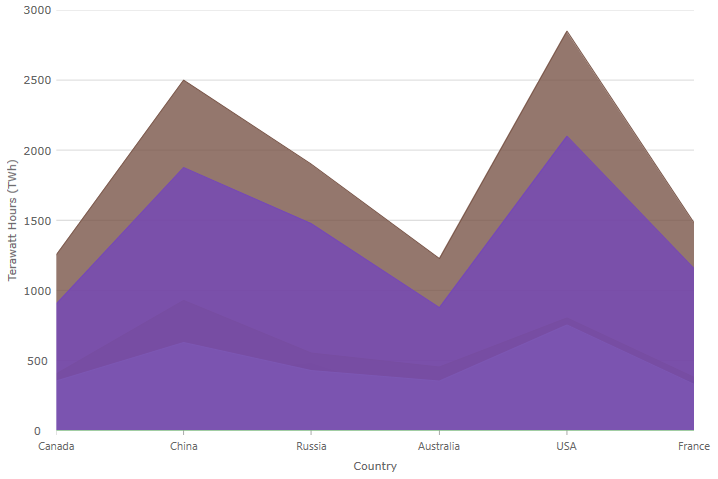

# Angular Chart

The Angular category chart component make it easy to organize and visualize category data . The Angular control simplifies the complexities of the data visualization domain into manageable API.

## Angular Chart Example

<div class="sample-container loading" style="height: 500px">
    <iframe id="category-chart-overview-iframe" src='{environment:dvDemosBaseUrl}/charts/category-chart-overview' width="100%" height="100%" seamless frameBorder="0" onload="onXPlatSampleIframeContentLoaded(this);" alt="Angular Chart Example"></iframe>
</div>

<div>
    <button data-localize="stackblitz" disabled class="stackblitz-btn"   data-iframe-id="category-chart-overview-iframe" data-demos-base-url="{environment:dvDemosBaseUrl}">View on StackBlitz
    </button>


</div>

<div class="divider--half"></div>

 A user can bind a collection of data, a group of collections, and a data property and let the charting control do the rest. The Angular component will analyze the data and automatically choose the best chart type to represent the data.

By using a smart Data Adapter, the data is analyzed and the appropriate visualization is rendered. For example, if the [`chartType`]({environment:dvapibaseurl}/products/ignite-ui-angular/api/docs/typescript/latest/classes/igxcategorychartcomponent.html#charttype) property is set to [`Auto`]({environment:dvapibaseurl}/products/ignite-ui-angular/api/docs/typescript/latest/enums/categorycharttype.html#auto), the control will use a column chart for a small data sets or a line chart for larger data sets.

However, you can also explicitly specify the chart type by setting the [`chartType`]({environment:dvapibaseurl}/products/ignite-ui-angular/api/docs/typescript/latest/classes/igxcategorychartcomponent.html#charttype) to:

-   [`Line`]({environment:dvapibaseurl}/products/ignite-ui-angular/api/docs/typescript/latest/enums/categorycharttype.html#line)
-   [`Area`]({environment:dvapibaseurl}/products/ignite-ui-angular/api/docs/typescript/latest/enums/categorycharttype.html#area)
-   [`Column`]({environment:dvapibaseurl}/products/ignite-ui-angular/api/docs/typescript/latest/enums/categorycharttype.html#column)
-   [`Point`]({environment:dvapibaseurl}/products/ignite-ui-angular/api/docs/typescript/latest/enums/categorycharttype.html#point)
-   [`Spline`]({environment:dvapibaseurl}/products/ignite-ui-angular/api/docs/typescript/latest/enums/categorycharttype.html#spline)
-   [`SplineArea`]({environment:dvapibaseurl}/products/ignite-ui-angular/api/docs/typescript/latest/enums/categorycharttype.html#splinearea)
-   [`StepArea`]({environment:dvapibaseurl}/products/ignite-ui-angular/api/docs/typescript/latest/enums/categorycharttype.html#steparea)
-   [`StepLine`]({environment:dvapibaseurl}/products/ignite-ui-angular/api/docs/typescript/latest/enums/categorycharttype.html#stepline)
-   [`Waterfall`]({environment:dvapibaseurl}/products/ignite-ui-angular/api/docs/typescript/latest/enums/categorycharttype.html#waterfall)

Another example of the intuitive behavior of the Angular category chart component is that you do not need to explicitly set the labels. The category chart will use the first appropriate string property that it finds within the data you provided and will use that for the labels.

<!-- Angular, React, WebComponents -->

## Dependencies

When installing the Angular chart package, the core package must also be installed.

<pre style="background:#141414;color:white;display:inline-block;padding:16x;margin-top:10px;font-family:'Consolas';border-radius:5px;width:100%">
npm install --save igniteui-angular-core
npm install --save igniteui-angular-charts
</pre>

<!-- end: Angular, React, WebComponents -->

## Required Modules

<!-- Angular, React, WebComponents -->

```ts
// app.module.ts
import { IgxCategoryChartModule } from 'igniteui-angular-charts';

@NgModule({
    imports: [
        // ...
        IgxCategoryChartModule,
        // ...
    ]
})
export class AppModule {}
```

<!-- end: Angular, React, WebComponents -->

It's also possible to load a more minimal configuration of category chart whereby it can only load a subset of the possible series, and exclude other optional features by instead loading the [`IgxCategoryChartCoreModule`]({environment:dvapibaseurl}/products/ignite-ui-angular/api/docs/typescript/latest/classes/igxcategorychartcoremodule.html), and the dynamic module for the series in question, e.g. [`IgxLineSeriesDynamicModule`]({environment:dvapibaseurl}/products/ignite-ui-angular/api/docs/typescript/latest/classes/igxlineseriesdynamicmodule.html). If the [`chartType`]({environment:dvapibaseurl}/products/ignite-ui-angular/api/docs/typescript/latest/classes/igxcategorychartcomponent.html#charttype) is [`Auto`]({environment:dvapibaseurl}/products/ignite-ui-angular/api/docs/typescript/latest/enums/categorycharttype.html#auto), it wil make sure to select a series type that has been loaded.

<div class="divider--half"></div>

## Usage

Now that the category chart module is imported, next step is to bind it to data.

In order to create Angular category chart component, you must first have data to bind it to. The following code snippet demonstrates how to create a simple data source.

```ts
var data = [
 { "CountryName": "China", "Pop1995": 1216, "Pop2005": 1297, "Pop2015": 1361, "Pop2025": 1394 },
 { "CountryName": "India", "Pop1995": 920, "Pop2005": 1090, "Pop2015": 1251, "Pop2025": 1396 },
 { "CountryName": "United States", "Pop1995": 266, "Pop2005": 295, "Pop2015": 322, "Pop2025": 351 },
 { "CountryName": "Indonesia", "Pop1995": 197, "Pop2005": 229, "Pop2015": 256, "Pop2025": 277 },
 { "CountryName": "Brazil", "Pop1995": 161, "Pop2005": 186, "Pop2015": 204, "Pop2025": 218 }
];
```

The following code demonstrates how to bind the category chart to the above data.

```html
 <igx-category-chart [dataSource]="data"
                     width="700px"
                     height="500px">
 </igx-category-chart>
```

<div class="divider--half"></div>

## Chart Types

You can override the default behavior of the category chart and set which type of chart should be displayed. This is done by setting the [`chartType`]({environment:dvapibaseurl}/products/ignite-ui-angular/api/docs/typescript/latest/classes/igxcategorychartcomponent.html#charttype) property.
Below are listed all of the types that the Angular category chart supports.

> [!NOTE]
> Special case is the [`Auto`]({environment:dvapibaseurl}/products/ignite-ui-angular/api/docs/typescript/latest/enums/categorycharttype.html#auto) setting of that property. If [`Auto`]({environment:dvapibaseurl}/products/ignite-ui-angular/api/docs/typescript/latest/enums/categorycharttype.html#auto) is used the chart will analyze assigned data and will assign the most suitable chart type.

## Supported Chart Types

| Type                                                                                                                                     | Description and Preview                                                                                                                   |
| ---------------------------------------------------------------------------------------------------------------------------------------- | ----------------------------------------------------------------------------------------------------------------------------------------- |
| [`Auto`]({environment:dvapibaseurl}/products/ignite-ui-angular/api/docs/typescript/latest/enums/categorycharttype.html#auto)             | Specifies automatic selection of chart type based on suggestions from built-in data adapter that analyzes data source bound to the chart. |
| [`Line`]({environment:dvapibaseurl}/products/ignite-ui-angular/api/docs/typescript/latest/enums/categorycharttype.html#line)             | Specifies category line chart with markers at each data point.                                      |
| [`Area`]({environment:dvapibaseurl}/products/ignite-ui-angular/api/docs/typescript/latest/enums/categorycharttype.html#area)             | Specifies category area chart.                                                                      |
| [`Column`]({environment:dvapibaseurl}/products/ignite-ui-angular/api/docs/typescript/latest/enums/categorycharttype.html#column)         | Specifies category column chart with vertical rectangles at each data point.                      |
| [`Point`]({environment:dvapibaseurl}/products/ignite-ui-angular/api/docs/typescript/latest/enums/categorycharttype.html#point)           | Specifies category point chart with markers at each data point.                                    |
| [`StepLine`]({environment:dvapibaseurl}/products/ignite-ui-angular/api/docs/typescript/latest/enums/categorycharttype.html#stepline)     | Specifies category step line chart.                                                             |
| [`StepArea`]({environment:dvapibaseurl}/products/ignite-ui-angular/api/docs/typescript/latest/enums/categorycharttype.html#steparea)     | Specifies category step area chart.                                                             |
| [`Spline`]({environment:dvapibaseurl}/products/ignite-ui-angular/api/docs/typescript/latest/enums/categorycharttype.html#spline)         | Specifies category spline line chart with markers at each data point.                             |
| [`SplineArea`]({environment:dvapibaseurl}/products/ignite-ui-angular/api/docs/typescript/latest/enums/categorycharttype.html#splinearea) | Specifies category spline area chart.                                                         |
| [`Waterfall`]({environment:dvapibaseurl}/products/ignite-ui-angular/api/docs/typescript/latest/enums/categorycharttype.html#waterfall)   | Specifies category waterfall chart.                                                            |
