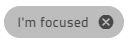

### Chip

[`igxChip`]({environment:angularApiUrl}/classes/igxchipcomponent.html) is a compact visual component that displays information in an obround. Chip can be templated, deleted, and selected. Multiple chips can be reordered and visually connected to each other. Chips reside in a container called chips area which is responsible for managing the interactions between the chips.  

#### Demo

<div class="sample-container loading" style="height:650px">
    <iframe id="chip-sample-iframe" src='{environment:demosBaseUrl}/data-display/chip-sample' width="100%" height="100%" seamless frameBorder="0" onload="onSampleIframeContentLoaded(this);"></iframe>
</div>
<br/>
<div>
<button data-localize="stackblitz" disabled class="stackblitz-btn" data-iframe-id="chip-sample-iframe" data-demos-base-url="{environment:demosBaseUrl}">view on stackblitz</button>
</div>

#### Initializing Chips

The [`IgxChipComponent`]({environment:angularApiUrl}/classes/igxchipcomponent.html) is the main class for a chip elemenent and the [`IgxChipsAreaComponent`]({environment:angularApiUrl}/classes/igxchipsareacomponent.html) is the main class for a chip area. The chip area is used when handling more complex scenarios that require interaction between chips (dragging, selection, navigation etc.). The [`IgxChipComponent`]({environment:angularApiUrl}/classes/igxchipcomponent.html) has an [`id`]({environment:angularApiUrl}/classes/igxchipcomponent.html#id) input so that the different chips can be easily distinguished. If [`id`]({environment:angularApiUrl}/classes/igxchipcomponent.html#id) is not provided it will be automatically generated.

Example of using [`igxChip`]({environment:angularApiUrl}/classes/igxchipcomponent.html) with [`igxChipArea`]({environment:angularApiUrl}/classes/igxchipsareacomponent.html):

```html
<igx-chips-area>
    <igx-chip *ngFor="let chip of chipList" [id]="chip.id">
        <span>{{chip.text}}</span>
    </igx-chip>
</igx-chips-area>
```

Chip states:

  

### Features

#### Selection


Selection can be enabled by setting an input called [`selectable`]({environment:angularApiUrl}/classes/igxchipcomponent.html#selectable). The selecting is done either by clicking on the chip itself or by using the `Tab` key to focus the chip and then pressing the `Space` key. If a chip is already selected it can be deselected by pressing the `Space` key again while the chip is focused or by clicking on it.

An event [`onSelection`]({environment:angularApiUrl}/classes/igxchipcomponent.html#onselection) is fired when the selection state of the [`igxChip`]({environment:angularApiUrl}/classes/igxchipcomponent.html) changes. It provides the new [`selected`]({environment:angularApiUrl}/interfaces/ichipselecteventargs.html#selected) value so you can get the new state and the original event in [`originalEvent`]({environment:angularApiUrl}/interfaces/ichipselecteventargs.html#originalevent) that triggered this selection change. If this is not done through user interaction but instead is done by setting the [`selected`]({environment:angularApiUrl}/interfaces/ichipselecteventargs.html#selected) property programmatically the [`originalEvent`]({environment:angularApiUrl}/interfaces/ichipselecteventargs.html#originalevent) argument has value `null`.

Also by default an icon is shown indicating that the chip is being selected. It is fully customizable and can be done through the [`selectIcon`]({environment:angularApiUrl}/classes/igxchipcomponent.html#selecticon) input. It accepts values of type `TemplateRef` and overrides the default icon while retaining the same functionality.

Example of customizing the select icon:


```html
<igx-chips-area #chipsArea>
    <igx-chip *ngFor="let chip of chipList" [selectable]="'true'" [selectIcon]="mySelectIcon">
        <igx-icon igxPrefix>{{chip.icon}}</igx-icon>
        <span>{{chip.text}}</span>
    </igx-chip>
</igx-chips-area>
<ng-template #mySelectIcon>
    <igx-icon fontSet="fa-solid" name="fa-check-circle"></igx-icon>
</ng-template>
```

#### Removing


Removing can be enabled by setting the [`removable`]({environment:angularApiUrl}/classes/igxchipcomponent.html#removable) input to `true`. When enabled a remove button is rendered at the end of the chip. When the end-users performs any interaction like clicking on the remove button or pressing the `Delete` key while the chip is focused the [`onRemove`]({environment:angularApiUrl}/classes/igxchipcomponent.html#onremove) event is emitted.

By default the chip does not remove itself from the template when the user wants to delete a chip. This needs to be handled manually using the [`onRemove`]({environment:angularApiUrl}/classes/igxchipcomponent.html#onremove) event.

If you need to customize the remove icon you can use the [`removeIcon`]({environment:angularApiUrl}/classes/igxchipcomponent.html#removeicon) input. It takes a value of type `TemplateRef` and renders it instead of the default remove icon. This means that you can customize the remove button in any way while all the handling of it is still handled by the chip itself.


Example of handling chip removing and custom remove icon:

```html
<igx-chips-area #chipsArea>
    <igx-chip *ngFor="let chip of chipList" [id]="chip.id" [removable]="true" [removeIcon]="myRemoveIcon" (onRemove)="chipRemoved($event)">
        <igx-icon igxPrefix>{{chip.icon}}</igx-icon>
        <span>{{chip.text}}</span>
    </igx-chip>
</igx-chips-area>
<ng-template #myRemoveIcon>
    <igx-icon fontSet="fa-solid" name="fa-trash-alt"></igx-icon>
</ng-template>
```

```typescript
public chipRemoved(event: IBaseChipEventArgs) {
    this.chipList = this.chipList.filter((item) => {
        return item.id !== event.owner.id;
    });
    this.changeDetectionRef.detectChanges();
}
```

#### Moving/Dragging


The chip can be dragged by the end-user in order to change it's position. The moving/dragging is disabled by default, but can be enabled with an option called [`draggable`]({environment:angularApiUrl}/classes/igxchipcomponent.html#draggable). You need to handle the actual moving of the chip in the template manually. This is where the chip area comes in handy since it provides [`onReorder`]({environment:angularApiUrl}/classes/igxchipsareacomponent.html#onreorder) event that returns the new order if a chip is dragged over another chip to take its place.

```html
<igx-chips-area (onReorder)="chipsOrderChanged($event)">
    <igx-chip *ngFor="let chip of chipList" [draggable]="'true'">
        <igx-icon igxPrefix>{{chipElem.icon}}</igx-icon>
        {{chip.text}}
    </igx-chip>
</igx-chips-area>
```

```typescript
public chipsOrderChanged(event: IChipsAreaReorderEventArgs) {
    const newChipList = [];
    for (const chip of event.chipsArray) {
        const chipItem = this.chipList.filter((item) => {
            return item.id === chip.id;
        })[0];
        newChipList.push(chipItem);
    }
    this.chipList = newChipList;
}
```

#### Chip Templates

The [`IgxChipComponent`]({environment:angularApiUrl}/classes/igxchipcomponent.html)'s main structure consists of `select icon`, [`prefix`]({environment:angularApiUrl}/classes/igxprefixdirective.html), `chip content`, [`suffix`]({environment:angularApiUrl}/classes/igxsuffixdirective.html) and `remove button`. All of those elements are templatable.

The content of the chip is taken by the content defined inside the chip template except elements that define the [`prefix`]({environment:angularApiUrl}/classes/igxprefixdirective.html) and  [`suffix`]({environment:angularApiUrl}/classes/igxsuffixdirective.html) of the chip. You can define any type of content you need.

The [`prefix`]({environment:angularApiUrl}/classes/igxprefixdirective.html) and [`suffix`]({environment:angularApiUrl}/classes/igxsuffixdirective.html) are also elements inside the actual chip area where they can be templated by your preference. The way they can be specified is by respectively using the [`IgxPrefix`]({environment:angularApiUrl}/classes/igxprefixdirective.html) and [`IxgSuffix`]({environment:angularApiUrl}/classes/igxsuffixdirective.html) directives:


Example of using an icon for both [`prefix`]({environment:angularApiUrl}/classes/igxprefixdirective.html) and [`suffix`]({environment:angularApiUrl}/classes/igxsuffixdirective.html) and a text for `content`:

```html
<igx-chip>
    <igx-icon igxPrefix>insert_emoticon</igx-icon>
    <igx-icon igxSuffix style="transform: rotate(180deg)">insert_emoticon</igx-icon>
    <span>Why not both?</span>
</igx-chip>
```

Chip rendering can be customized so its dimensions can be different using the [`displayDensity`]({environment:angularApiUrl}/classes/igxchipcomponent.html#displaydensity) input. By default it is set to `comfortable`. It can also be set to `cosy` or `compact` while everything inside the chip retains its relative positioning:


```html
<igx-chip>Hi! My name is Chip!</igx-chip>

<igx-chip displayDensity="cosy">
    I can be smaller!
</igx-chip>

<igx-chip displayDensity="compact">
    <igx-icon igxPrefix>child_care</igx-icon>
    Even tiny!
</igx-chip>
```

A few examples of how the chip can be even further customized:


#### Keyboard Navigation

The chip can be focused using the `Tab` key or by clicking on it. When in chip area chips can be reordered using keyboard navigation:

- Keyboard controls when the chip is focused:

  - <kbd>LEFT</kbd> - Moves the focus to the chip on the left.

    

  - <kbd>RIGHT</kbd> - Moves the focus to the chip on the right.

    

  - <kbd>SPACE</kbd> - Toggles chip selection if it is selectable.

    
  - <kbd>DELETE</kbd> - Triggers the [`onRemove`]({environment:angularApiUrl}/classes/igxchipcomponent.html#onremove) event for the [`igxChip`]({environment:angularApiUrl}/classes/igxchipcomponent.html) so the chip deletion can be handled manually.
  - <kbd>SHIFT</kbd> + <kbd>LEFT</kbd> - Triggers [`onReorder`]({environment:angularApiUrl}/classes/igxchipsareacomponent.html#onreorder) event for the [`igxChipArea`]({environment:angularApiUrl}/classes/igxchipsareacomponent.html) when the currently focused chip should move position to the left.
  - <kbd>SHIFT</kbd> + <kbd>RIGHT</kbd> - Triggers [`onReorder`]({environment:angularApiUrl}/classes/igxchipsareacomponent.html#onreorder) event for the [`igxChipArea`]({environment:angularApiUrl}/classes/igxchipsareacomponent.html) when the currently focused chip should move one position to the right.

- Keyboard controls when the remove button is focused:

  - <kbd>SPACE</kbd> or <kbd>ENTER</kbd> Fires the [`onRemove`]({environment:angularApiUrl}/classes/igxchipcomponent.html#onremove) output so the chip deletion can be handled manually.

### API

* [IgxChipComponent]({environment:angularApiUrl}/classes/igxchipcomponent.html)
* [IgxChipComponent Styles]({environment:sassApiUrl}/index.html#function-igx-chip-theme)
* [IgxChipsAreaComponent]({environment:angularApiUrl}/classes/igxchipsareacomponent.html)
* [IgxPrefixDirective]({environment:angularApiUrl}/classes/igxprefixdirective.html)
* [IgxSuffixDirective]({environment:angularApiUrl}/classes/igxsuffixdirective.html)

### References

<div class="divider--half"></div>
Our community is active and always welcoming to new ideas.

- [Ignite UI for Angular **Forums**](https://www.infragistics.com/community/forums/f/ignite-ui-for-angular)
- [Ignite UI for Angular **GitHub**](https://github.com/IgniteUI/igniteui-angular)
