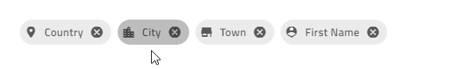

# Chip

[The chip component]({environment:angularApiUrl}/classes/igxchipcomponent.html) is a visual element that displays information in an oval container. The component has various properties - it can be templated, deleted, and selected. Multiple chips can be reordered and visually connected to each other, using the chip area as a container.

## Angular Chip Example


<code-view style="height: 100px; padding-top: 10px" 
           data-demos-base-url="{environment:demosBaseUrl}" 
           iframe-src="{environment:demosBaseUrl}/data-display/chip-simple" alt="Angular Chip Example">
</code-view>


## Usage

The first step is to import the **IgxChipsModule** in the **app.module.ts** file:
```typescript
// app.module.ts

...
import { IgxChipsModule } from 'igniteui-angular';

@NgModule({
    ...
    imports: [..., IgxChipsModule],
    ...
})
export class AppModule {}
```

The [`IgxChipComponent`]({environment:angularApiUrl}/classes/igxchipcomponent.html) has an [`id`]({environment:angularApiUrl}/classes/igxchipcomponent.html#id) input property so that the different chip instances can be easily distinguished. If an [`id`]({environment:angularApiUrl}/classes/igxchipcomponent.html#id) is not provided, it will be automatically generated.

```html
<igx-chip *ngFor="let chip of chipList" [id]="chip.id">
    {{chip.text}}
</igx-chip>
```

### Selection


Selection can be enabled by setting the [`selectable`]({environment:angularApiUrl}/classes/igxchipcomponent.html#selectable) input property to `true`. When selecting a chip, the [`selectedChanging`]({environment:angularApiUrl}/classes/igxchipcomponent.html#selectedchanging) event is fired. It provides the new [`selected`]({environment:angularApiUrl}/interfaces/ichipselecteventargs.html#selected) value so you can get the new state and the original event in [`originalEvent`]({environment:angularApiUrl}/interfaces/ichipselecteventargs.html#originalevent) that triggered the selection change. If this is not done through user interaction but instead is done by setting the [`selected`]({environment:angularApiUrl}/interfaces/ichipselecteventargs.html#selected) property programmatically, the [`originalEvent`]({environment:angularApiUrl}/interfaces/ichipselecteventargs.html#originalevent) argument has  a value of `null`.

```html
<igx-chip *ngFor="let chip of chipList" [selectable]="true">
    <igx-icon igxPrefix>{{chip.icon}}</igx-icon>
    {{chip.text}}
</igx-chip>
```

### Removing


Removing can be enabled by setting the [`removable`]({environment:angularApiUrl}/classes/igxchipcomponent.html#removable) input to `true`. When enabled, a remove button is rendered at the end of the chip. When removing a chip, the [`remove`]({environment:angularApiUrl}/classes/igxchipcomponent.html#remove) event is emitted.

By default, the chip doesn't get automatically removed from the DOM tree upon clicking on the remove icon. Removal needs to be handled manually.

```html
<igx-chip *ngFor="let chip of chipList" [id]="chip.id" [removable]="true" (remove)="chipRemoved($event)">
    <igx-icon igxPrefix>{{chip.icon}}</igx-icon>
    {{chip.text}}
</igx-chip>
```

```typescript
public chipRemoved(event: IBaseChipEventArgs) {
    this.chipList = this.chipList.filter((item) => {
        return item.id !== event.owner.id;
    });
    this.changeDetectionRef.detectChanges();
}
```

### Dragging

Dragging can be enabled by setting the [`draggable`]({environment:angularApiUrl}/classes/igxchipcomponent.html#removable) input to `true`. When enabled, you can click and drag the chip around.

```html
<igx-chip *ngFor="let chip of chipList" [id]="chip.id" [draggable]="true">
    <igx-icon igxPrefix>{{chip.icon}}</igx-icon>
    {chip.text}}
</igx-chip>
```

>[!NOTE]
>To reorder the chips you need to handle the event using the [`IgxChipsAreaComponent`]({environment:angularApiUrl}/classes/igxchipsareacomponent.html).

<div class="divider"></div>

**To create the demo sample, we will use the features above:**

```html
<igx-chip
*ngFor="let chip of chipList"
[id]="chip.id"
[selectable]="true"
[removable]="true"
(remove)="chipRemoved($event)"
>
    <igx-icon igxPrefix>{{chip.icon}}</igx-icon>
    {{chip.text}}
</igx-chip>
```

Then, we need to add the `chipList` and the function, that handles the [`remove`]({environment:angularApiUrl}/classes/igxchipcomponent.html#remove) event:

```ts
import { IBaseChipEventArgs } from "igniteui-angular";
...
public chipList = [
    {
        text: "Country",
        id: "1",
        icon: "place"
    },
    {
        text: "City",
        id: "2",
        icon: "location_city"
    },
    {
        text: "Town",
        id: "3",
        icon: "store"
    },
    {
        text: "First Name",
        id: "4",
        icon: "person_pin"
    }
];

private changeDetectionRef: any;

public chipRemoved(event: IBaseChipEventArgs) {
    this.chipList = this.chipList.filter((item) => {
        return item.id !== event.owner.id;
    });
    this.changeDetectionRef.detectChanges();
}
```

If everything went well, you should see this in your browser:


<code-view style="height: 100px; padding-top: 10px" 
           data-demos-base-url="{environment:demosBaseUrl}" 
           iframe-src="{environment:demosBaseUrl}/data-display/chip-simple" >
</code-view>


### Chip Templates

All of the [`IgxChipComponent`]({environment:angularApiUrl}/classes/igxchipcomponent.html)'s elements are templatable.

You can template the `prefix` and the `suffix` of the chip, using the `IgxPrefix` and the `IgxSuffix` directives:


```html
<igx-chip>
    <igx-icon igxPrefix>insert_emoticon</igx-icon>
    <igx-icon igxSuffix style="transform: rotate(180deg)">insert_emoticon</igx-icon>
    <span>Why not both?</span>
</igx-chip>
```

You can customize the size of the chip, using the [`displayDensity`]({environment:angularApiUrl}/classes/igxchipcomponent.html#displaydensity) input. By default it is set to `comfortable`. It can also be set to `cosy` or `compact`, while everything inside the chip retains its relative positioning:


```html
<igx-chip>Hi! My name is Chip!</igx-chip>

<igx-chip displayDensity="cosy">
    I can be smaller!
</igx-chip>

<igx-chip displayDensity="compact">
    <igx-icon igxPrefix>child_care</igx-icon>
    Even tiny!
</igx-chip>
```

You can customize the `select icon`, using the [`selectIcon`]({environment:angularApiUrl}/classes/igxchipcomponent.html#selecticon) input. It accepts values of type `TemplateRef` and overrides the default icon while retaining the same functionality.


```html
<igx-chip *ngFor="let chip of chipList" [selectable]="true" [selectIcon]="mySelectIcon">
    <igx-icon igxPrefix>{{chip.icon}}</igx-icon>
    {{chip.text}}
</igx-chip>

<ng-template #mySelectIcon>
    <igx-icon>check_circle</igx-icon>
</ng-template>
```

You can customize the `remove icon`, using the [`removeIcon`]({environment:angularApiUrl}/classes/igxchipcomponent.html#removeicon) input. It takes a value of type `TemplateRef` and renders it instead of the default remove icon.


```html
<igx-chip *ngFor="let chip of chipList" [removable]="true" [removeIcon]="myRemoveIcon">
    <igx-icon igxPrefix>{{chip.icon}}</igx-icon>
    {{chip.text}}
</igx-chip>

<ng-template #myRemoveIcon>
    <igx-icon>delete</igx-icon>
</ng-template>
```

## Chip Area

The [`IgxChipsAreaComponent`]({environment:angularApiUrl}/classes/igxchipsareacomponent.html) is used when handling more complex scenarios that require interaction between chips (dragging, selection, navigation, etc.).

### Reorder Chips


The chip can be dragged by the end-user in order to change its position. The dragging is disabled by default but can be enabled using the [`draggable`]({environment:angularApiUrl}/classes/igxchipcomponent.html#draggable) input property. You need to handle the actual chip reordering manually. This is where the chip area comes in handy since it provides the [`reorder`]({environment:angularApiUrl}/classes/igxchipsareacomponent.html#reorder) event that returns the new order when a chip is dragged over another chip.

```html
<igx-chips-area (reorder)="chipsOrderChanged($event)">
    <igx-chip *ngFor="let chip of chipList" [draggable]="'true'">
        <igx-icon igxPrefix>{{chip.icon}}</igx-icon>
        {{chip.text}}
    </igx-chip>
</igx-chips-area>
```

```typescript
public chipsOrderChanged(event: IChipsAreaReorderEventArgs) {
    const newChipList = [];
    for (const chip of event.chipsArray) {
        const chipItem = this.chipList.filter((item) => {
            return item.id === chip.id;
        })[0];
        newChipList.push(chipItem);
    }
    this.chipList = newChipList;
}
```

### Keyboard Navigation

The chip can be focused using the `Tab` key or by clicking on it. When the chips are in a chip area, they can be reordered using keyboard navigation:

- Keyboard controls when the chip is focused:

  - <kbd>LEFT</kbd> - Moves the focus to the chip on the left.

    

  - <kbd>RIGHT</kbd> - Moves the focus to the chip on the right.

    

  - <kbd>SPACE</kbd> - Toggles chip selection if it is selectable.

    
  - <kbd>DELETE</kbd> - Triggers the [`remove`]({environment:angularApiUrl}/classes/igxchipcomponent.html#remove) event for the [`igxChip`]({environment:angularApiUrl}/classes/igxchipcomponent.html) so the chip deletion can be handled manually.
  - <kbd>SHIFT</kbd> + <kbd>LEFT</kbd> - Triggers [`reorder`]({environment:angularApiUrl}/classes/igxchipsareacomponent.html#reorder) event for the [`igxChipArea`]({environment:angularApiUrl}/classes/igxchipsareacomponent.html) when the currently focused chip should move position to the left.
  - <kbd>SHIFT</kbd> + <kbd>RIGHT</kbd> - Triggers [`reorder`]({environment:angularApiUrl}/classes/igxchipsareacomponent.html#reorder) event for the [`igxChipArea`]({environment:angularApiUrl}/classes/igxchipsareacomponent.html) when the currently focused chip should move one position to the right.

- Keyboard controls when the remove button is focused:

  - <kbd>SPACE</kbd> or <kbd>ENTER</kbd> Fires the [`remove`]({environment:angularApiUrl}/classes/igxchipcomponent.html#remove) output so the chip deletion can be handled manually.

<div class="divider--half"></div>

Here's an example of the chip area using IgxAvatar as prefix and custom icons for all chips:

```html
<igx-chips-area (reorder)="chipsOrderChanged($event)">
    <igx-chip
    *ngFor="let chip of chipList"
    [id]="chip.id"
    [selectable]="true"
    [selectIcon]="mySelectIcon"
    [removable]="true"
    [removeIcon]="myRemoveIcon"
    (remove)="chipRemoved($event)"
    [draggable]="'true'">
        <igx-avatar
        class="chip-avatar-resized"
        igxPrefix
        [src]="chip.photo"
        roundShape="true"
        ></igx-avatar>
        {{chip.name}}
    </igx-chip>
</igx-chips-area>

<ng-template #mySelectIcon>
    <igx-icon>check_circle</igx-icon>
</ng-template>

<ng-template #myRemoveIcon>
    <igx-icon>delete</igx-icon>
</ng-template>
```

Resize the avatar to fit the chip:

```scss
.chip-avatar-resized {
    width: 2em;
    height: 2em;
    min-width: 2em;
}
```
Add the `chipList` and the functions that handle the events:

```ts
import { IBaseChipEventArgs, IChipsAreaReorderEventArgs } from "igniteui-angular";
...
public chipList = [
    {
        id: "770-504-2217",
        name: "Terrance Orta",
        photo: "https://www.infragistics.com/angular-demos/assets/images/men/27.jpg"
    },
    {
        id: "423-676-2869",
        name: "Richard Mahoney",
        photo: "https://www.infragistics.com/angular-demos/assets/images/men/13.jpg"
    },
    {
        id: "859-496-2817",
        name: "Donna Price",
        photo: "https://www.infragistics.com/angular-demos/assets/images/women/50.jpg"
    }
];

private changeDetectionRef: any;

public chipRemoved(event: IBaseChipEventArgs) {
    this.chipList = this.chipList.filter((item) => {
        return item.id !== event.owner.id;
    });
    this.changeDetectionRef.detectChanges();
}

public chipsOrderChanged(event: IChipsAreaReorderEventArgs) {
    const newChipList = [];
    for (const chip of event.chipsArray) {
        const chipItem = this.chipList.filter((item) => {
            return item.id === chip.id;
        })[0];
        newChipList.push(chipItem);
    }
    this.chipList = newChipList;
}
```

If everything's set up correctly, you should see this in your browser:

### Demo


<code-view style="height: 100px" 
           data-demos-base-url="{environment:demosBaseUrl}" 
           iframe-src="{environment:demosBaseUrl}/data-display/chip-area-sample" >
</code-view>


## Styling
To get started with styling the chip, we need to import the `index` file, where all the theme functions and component mixins live:

```scss
@import '~igniteui-angular/lib/core/styles/themes/index';
``` 
Following the simplest approach, we create a new theme that extends the [`igx-chip-theme`]({environment:sassApiUrl}/index.html#function-igx-chip-theme) and accepts some parameters that style the chip's items:

```scss
$custom-theme: igx-chip-theme(
    $background: #011627,
    $hover-background:  #011627dc,
    $focus-background: #0116276c,
    $selected-background: #ECAA53,
    $hover-selected-background: #ECAA53,
    $focus-selected-background: #ECAA53,
    $text-color: #FEFEFE,
    $remove-icon-color: #f14545,
    $remove-icon-color-focus: #da0000,
    $border-radius: 5px
);
```

### Including Themes

<div class="divider"></div>

The last step is to **include** the component theme in our application.

If `$legacy-support` is set to `true`, include the **component theme** like that:

```scss
 @include igx-chip($custom-theme);
```
>[!NOTE]
>If the component is using an [`Emulated`](themes/sass/component-themes.md#view-encapsulation) ViewEncapsulation, it is necessary to `penetrate` this encapsulation using `::ng-deep`

```scss
:host {
     ::ng-deep {
        @include igx-chip($custom-theme);
    }
}
```

<div class="divider"></div>

If `$legacy-support` is set to `false`(default), include the component **css variables** like that:

```scss
@include igx-css-vars($custom-theme);
```

>[!NOTE]
>If the component is using an [`Emulated`](themes/sass/component-themes.md#view-encapsulation) ViewEncapsulation, you still have to use `:host` because you need a global selector in order to override the variables.

```scss
:host {
    @include igx-css-vars($custom-theme);
}
```

### Demo

<code-view style="height:100px" 
           data-demos-base-url="{environment:demosBaseUrl}" 
           iframe-src="{environment:demosBaseUrl}/data-display/chip-styling" >
</code-view>


## Known Issues and Limitations

- Using the Chips Area component on IE11 requires the explicit import of the array polyfill in polyfill.ts of the angular application.

    ```typescript
    import 'core-js/es7/array';
    ```

## API

* [IgxChipComponent]({environment:angularApiUrl}/classes/igxchipcomponent.html)
* [IgxChipComponent Styles]({environment:sassApiUrl}/index.html#function-igx-chip-theme)
* [IgxChipsAreaComponent]({environment:angularApiUrl}/classes/igxchipsareacomponent.html)

## References

<div class="divider--half"></div>
Our community is active and always welcoming to new ideas.

- [Ignite UI for Angular **Forums**](https://www.infragistics.com/community/forums/f/ignite-ui-for-angular)
- [Ignite UI for Angular **GitHub**](https://github.com/IgniteUI/igniteui-angular)
