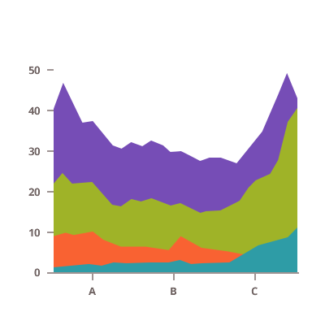
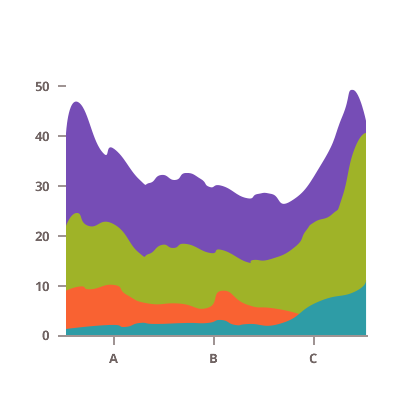
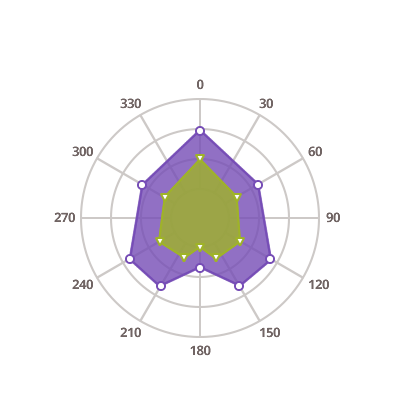
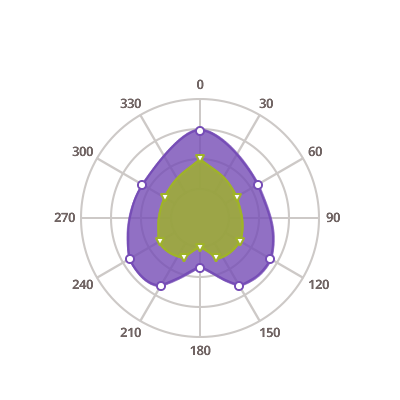

## Area Charts

<section>
    
    <body>
        <a class="link" href="data-chart-type-category-area-series.md">
            

                <h4>Area Chart</h4>
                
            

        </a>
        <a class="link" href="data-chart-type-category-spline-area-series.md">
            

                <h4>Spline Area Chart</h4>
                
            

        </a>
        <a class="link" href="data-chart-type-category-step-area-series.md">
            

                <h4>Step Area Chart</h4>
                
            

        </a>
        <a class="link" href="data-chart-type-range-area-series.md">
            

                <h4>Range Area Chart</h4>
                
            

        </a>
         
        <a class="link" href="data-chart-type-stacked-area-series.md">
            

                <h4>Stacked Area Chart</h4>
                
            

        </a>
        <a class="link" href="data-chart-type-stacked-spline-area-series.md">
            

                <h4>Stacked Spline Area Chart</h4>
                
            

        </a>
        <a class="link" href="data-chart-type-stacked-100-area-series.md">
            

                <h4>Stacked 100 Area Chart</h4>
                
            

        </a>
        <a class="link" href="data-chart-type-stacked-100-spline-area-series.md">
            

                <h4>Stacked 100 Spline Area Chart</h4>
                
            

        </a>
         
        <a class="link" href="data-chart-type-scatter-area-series.md">
            

                <h4>Scatter Area Chart</h4>
                
            

        </a>
        <a class="link" href="data-chart-type-scatter-polygon-series.md">
            

                <h4>Scatter Polygon Chart</h4>
                
            

        </a>
         
        <a class="link" href="data-chart-type-polar-area-series.md">
            

                <h4>Polar Area Chart</h4>
                
            

        </a>
        <a class="link" href="data-chart-type-polar-spline-area-series.md">
            

                <h4>Polar Spline Area Chart</h4>
                
            

        </a>
        <a class="link" href="data-chart-type-radial-area-series.md">
            

                <h4>Radial Area Chart</h4>
                
            

        </a>
    </body>
</section>
