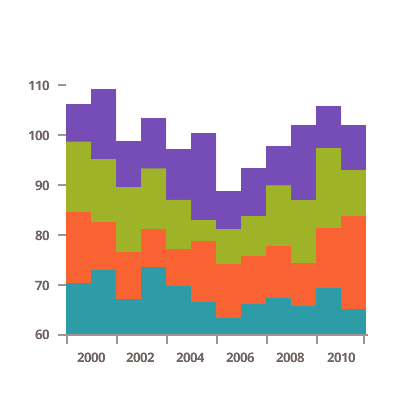

## Area Charts

The Ignite UI for Angular provides the following types of area charts:

<section>
    
    <body>
        

            

                
Area Chart

                
            

        

        

            

                
Spline Area Chart

                
            

        

        

            

                
Step Area Chart

                
            

        

        

            

                
Range Area Chart

                
            

        

         
        

            

                
Stacked Area Chart

                
            

        

        

            

                
Stacked Spline Area Chart

                
            

        

        

            

                
Stacked 100 Area Chart

                
            

        

        

            

                
Stacked 100 Spline Area Chart

                
            

        

         
        

            

                
Scatter Area Chart

                
            

        

        

            

                
Scatter Polygon Chart

                
            

        

         
        

            

                
Polar Area Chart

                
            

        

        

            

                
Polar Spline Area Chart

                
            

        

        

            

                
Radial Area Chart

                
            

        

    </body>
</section>
