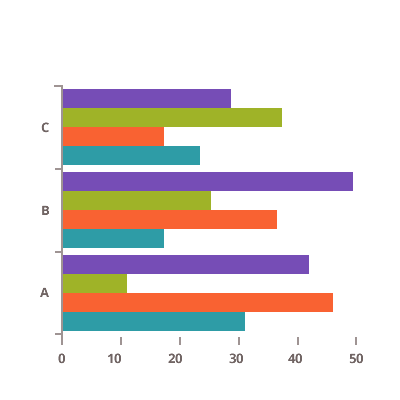
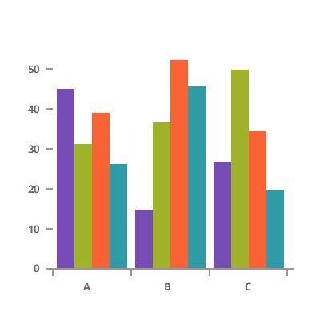
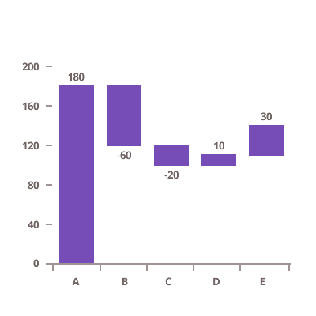
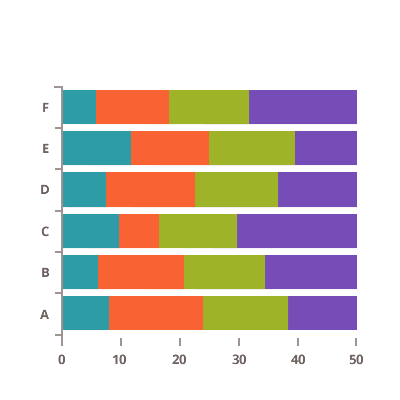
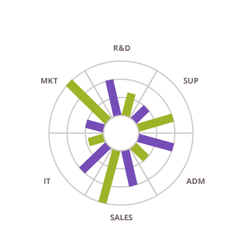

# Angular Bar and Column Charts

The Ignite UI for Angular provides the following types of column charts:

<section class="feature__container">
    
    <body>
        

            

                
Bar Chart

                
            

        

        

            

                
Column Chart

                
            

        

        

            

                
Range Column Chart

                
            

        

        

            

                
Waterfall Chart

                
            

        

         
        

            

                
Stacked Bar Chart

                
            

        

        

            

                
Stacked Column Chart

                
            

        

        

            

                
Stacked 100 Bar Chart

                
            

        

        

            

                
Stacked 100 Column Chart

                
            

        

         
        

            

                
Radial Column Chart

                
            

        

    </body>
</section>
