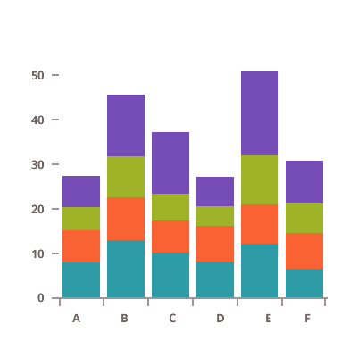

## Bar and Column Charts

<section class="feature__container">
    
    <body>
        <a class="link" href="data-chart-type-category-bar-series.md">
            

                <h4>Category Bar Chart</h4>
                
            

        </a>
        <a class="link" href="data-chart-type-category-column-series.md">
            

                <h4>Category Column Chart</h4>
                
            

        </a>
        <a class="link" href="data-chart-type-range-column-series.md">
            

                <h4>Range Column Chart</h4>
                
            

        </a>
        <a class="link" href="data-chart-type-category-waterfall-series.md">
            

                <h4>Waterfall Chart</h4>
                
            

        </a>
         
        <a class="link" href="data-chart-type-stacked-bar-series.md">
            

                <h4>Stacked Bar Chart</h4>
                
            

        </a>
        <a class="link" href="data-chart-type-stacked-column-series.md">
            

                <h4>Stacked Column Chart</h4>
                
            

        </a>
        <a class="link" href="data-chart-type-stacked-100-bar-series.md">
            

                <h4>Stacked 100 Bar Chart</h4>
                
            

        </a>
        <a class="link" href="data-chart-type-stacked-100-column-series.md">
            

                <h4>Stacked 100 Column Chart</h4>
                
            

        </a>
         
        <a class="link" href="data-chart-type-radial-column-series.md">
            

                <h4>Radial Column Chart</h4>
                
            

        </a>
    </body>
</section>
