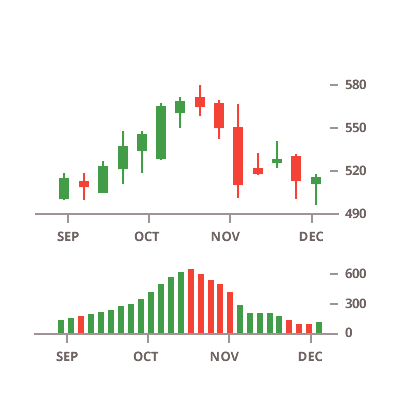
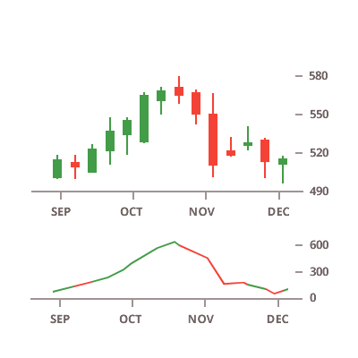

## Financial Charts

The Ignite UI for Angular provides the following types of financial charts:

<section class="feature__container">
    
    <body>
        

            

                
Financial Candlestick Chart

                
            

        

        

            

                
Financial OHLC Chart

                
            

        

        

            

                
Financial Overlays

                
            

        

        

            

                
Financial Area Indicators

                
            

        

        

            

                
Financial Column Indicators

                
            

        

        

            

                
Financial Line Indicators

                
            

        

    </body>
</section>
