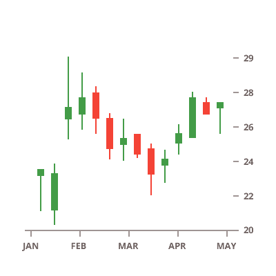

## Financial Charts

<section class="feature__container">
    
    <body>
        <a class="link" href="data-chart-type-financial-candlestick-series.md">
            

                <h4>Financial Candlestick Chart</h4>
                
            

        </a>
        <a class="link" href="data-chart-type-financial-ohlc-series.md">
            

                <h4>Financial OHLC Chart</h4>
                
            

        </a>
        <a class="link" href="data-chart-type-financial-overlays.md">
            

                <h4>Financial Overlays</h4>
                
            

        </a>
        <a class="link" href="data-chart-type-financial-area-indicators.md">
            

                <h4>Financial Area Indicators</h4>
                
            

        </a>
        <a class="link" href="data-chart-type-financial-column-indicators.md">
            

                <h4>Financial Column Indicators</h4>
                
            

        </a>
        <a class="link" href="data-chart-type-financial-line-indicators.md">
            

                <h4>Financial Line Indicators</h4>
                
            

        </a>
    </body>
</section>
