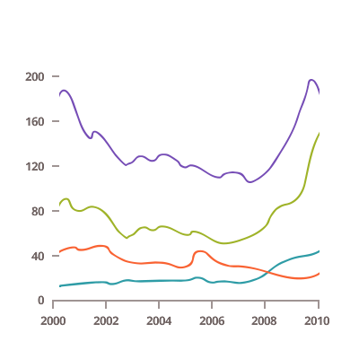
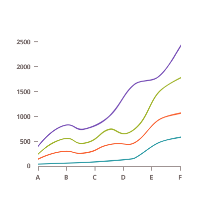
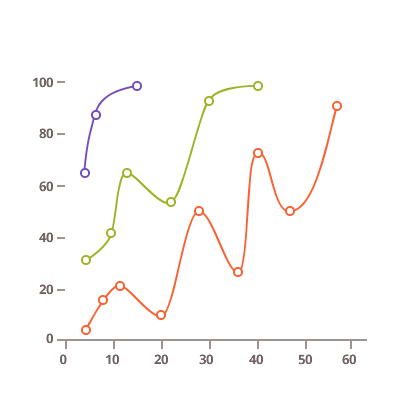
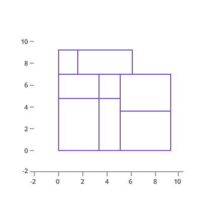
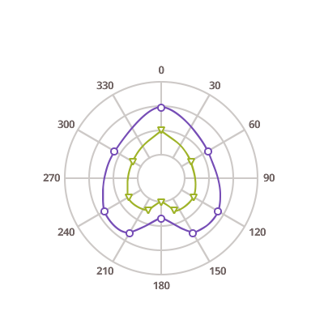
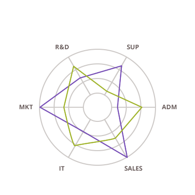

## Line Charts

<section>
    
    <body>
        <a class="link" href="data-chart-type-category-line-series.md">
            

                <h4>Category Line Chart</h4>
                
            

        </a>
        <a class="link" href="data-chart-type-category-spline-series.md">
            

                <h4>Category Spline Chart</h4>
                
            

        </a>
        <a class="link" href="data-chart-type-category-step-line-series.md">
            

                <h4>Category Step Line Chart</h4>
                
            

        </a>
         
        <a class="link" href="data-chart-type-stacked-line-series.md">
            

                <h4>Stacked Line Chart</h4>
                
            

        </a>
        <a class="link" href="data-chart-type-stacked-spline-series.md">
            

                <h4>Stacked Spline Chart</h4>
                
            

        </a>
        <a class="link" href="data-chart-type-stacked-100-line-series.md">
            

                <h4>Stacked 100 Line Chart</h4>
                
            

        </a>
        <a class="link" href="data-chart-type-stacked-100-spline-series.md">
            

                <h4>Stacked 100 Spline Chart</h4>
                
            

        </a>
         
        <a class="link" href="data-chart-type-scatter-line-series.md">
            

                <h4>Scatter Line Chart</h4>
                
            

        </a>
        <a class="link" href="data-chart-type-scatter-spline-series.md">
            

                <h4>Scatter Spline Chart</h4>
                
            

        </a>
        <a class="link" href="data-chart-type-scatter-polyline-series.md">
            

                <h4>Scatter Polyline Chart</h4>
                
            

        </a>
        <a class="link" href="data-chart-type-scatter-contour-series.md">
            

                <h4>Scatter Contour Chart</h4>
                
            

        </a>
         
        <a class="link" href="data-chart-type-polar-line-series.md">
            

                <h4>Polar Line Chart</h4>
                
            

        </a>
        <a class="link" href="data-chart-type-polar-spline-series.md">
            

                <h4>Polar Spline Chart</h4>
                
            

        </a>
        <a class="link" href="data-chart-type-radial-line-series.md">
            

                <h4>Radial Line Chart</h4>
                
            

        </a>
    </body>
</section>
