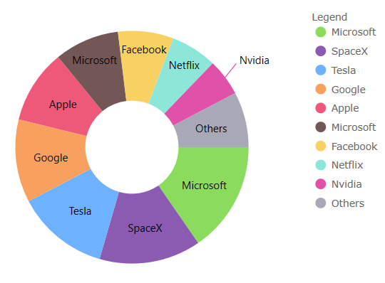

# Ignite UI for Angular Changelog (Data Visualization)

<div class="divider--half"></div>

<!-- Angular -->

> [!NOTE]
> This file is specific to igniteui-angular-\* packages only. (eg. igniteui-angular-charts)
>
> For additional changes, please see [Ignite UI Angular Changes](https://github.com/igniteui/igniteui-angular/blob/master/changelog.md)

<!-- end: Angular -->

<div class="divider--half"></div>

All notable changes for each version of this project will be documented in this file.

## **11.2.0**

### Charts

This release introduces several new and improved visual design and configuration options for all of the chart components. e.g. Data Chart, Category Chart, and Financial Chart.

Redesigned Chart Defaults:

-   New color palette for series/markers in all charts. - All types of charts/series have new colors for brush/fill and outlines

| Old series brushes outlines | New series outline brushes |
| --------------------------- | -------------------------- |
| `Color_001=#7446B9`         | `Color_001=#8bdc5c`        |
| `Color_002=#9FB328`         | `Color_002=#8b5bb1`        |
| `Color_003=#F96232`         | `Color_003=#6db1ff`        |
| `Color_004=#2E9CA6`         | `Color_004=#f8a15f`        |
| `Color_005=#DC3F76`         | `Color_005=#ee5879`        |
| `Color_006=#FF9800`         | `Color_006=#735656`        |
| `Color_007=#3F51B5`         | `Color_007=#f7d262`        |
| `Color_008=#439C47`         | `Color_008=#8ce7d9`        |
| `Color_009=#795548`         | `Color_009=#e051a9`        |
| `Color_010=#9A9A9A`         | `Color_010=#a8a8b7`        |

eg.

|  |  |
| ----------------------------------------------------------------- | ----------------------------------------------------------------- |
|  |  |

<div class="divider--half"></div>

-   Changed Bar/Column/Waterfall series to have square corners instead of rounded corners
-   Changed Scatter High Density series’ colors for min/max heat properties

    | Old heat min color | New heat min color |
    | ------------------ | ------------------ |
    | `#FF7446B9`        | `#ff8b5bb1`        |

    | Old heat max color | New heat max color |
    | ------------------ | ------------------ |
    | `#FFC62828`        | `#ffee5879`        |

-   Changed Financial/Waterfall series’ colors for negative fill of their visuals

    | Old negative brush | new negative brush |
    | ------------------ | ------------------ |
    | `#FFC62828`        | `#ffee5879`        |

-   Changed marker's thickness to 2px from 1px
-   Changed marker's fill to match the marker's outline for PointSeries, BubbleSeries, ScatterSeries, PolarScatterSeries
    -   Note, you can use set `MarkerFillMode` property to Normal to undo this change
-   Compressed labelling for the TimeXAxis and OrdinalTimeXAxis
-   New Marker Properties:
    -   `MarkerFillMode` - Can be set to 'MatchMarkerOutline' so the marker depends on the outline
    -   `MarkerFillOpacity` - Can be set to a value 0 to 1
    -   `MarkerOutlineMode` - Can be set to 'MatchMarkerBrush' so the marker's outline depends on the fill brush color
-   New Series `OutlineMode` Property:
    -   Can be set to toggle the series outline visibility. Note, for Data Chart, the property is on the series
-   New Plot Area Margin Properties:
    -   `PlotAreaMarginLeft`
    -   `PlotAreaMarginTop`
    -   `PlotAreaMarginRight`
    -   `PlotAreaMarginBottom`
    -   [`ComputedPlotAreaMarginMode`]({environment:dvApiBaseUrl}/products/ignite-ui-angular/api/docs/typescript/latest/enums/computedplotareamarginmode.html)
    -   The plot area margin properties define the bleed over area introduced into the viewport when the chart is at the default zoom level. A common use case is to provide space between the axes and first/last data points. Note, the [`ComputedPlotAreaMarginMode`]({environment:dvApiBaseUrl}/products/ignite-ui-angular/api/docs/typescript/latest/enums/computedplotareamarginmode.html), listed below, will automatically set the margin when markers are enabled. The others are designed to specify a `Double` to represent the thickness, where PlotAreaMarginLeft etc. adjusts the space to all four sides of the chart.
-   New Highlighting Properties
    -   [`HighlightingMode`]({environment:dvApiBaseUrl}/products/ignite-ui-angular/api/docs/typescript/latest/enums/highlightingmode.html) - Sets whether hovered or non-hovered series to fade, brighten
    -   `HighlightingBehavior` - Sets whether the series highlights depending on mouse position eg. directly over or nearest item
    -   Note, in previous releases the highlighting was limited to fade on hover.
-   Added Highlighting for the following series:
    -   Stacked
    -   Scatter
    -   Polar
    -   Radial
    -   Shape
-   Added Annotation layers to the following series:
    -   Stacked
    -   Scatter
    -   Polar
    -   Radial
    -   Shape
-   Added support for overriding the data source of individual stack fragments within a stacked series
-   Added custom style events to Stacked, Scatter, Range, Polar, Radial, and Shape series
-   Added support to automatically sync the vertical zoom to the series content
-   Added support to automatically expanding the horizontal margins of the chart based on the initial labels displayed

### Chart Legend

-   Added Horizontal Orientation for ItemLegend
    -   The following chart types can use ItemLegend in horizontal orientation:
        -   Bubble
        -   Donut
        -   Pie
-   [`LegendHighlightingMode`]({environment:dvApiBaseUrl}/products/ignite-ui-angular/api/docs/typescript/latest/enums/legendhighlightingmode.html) - Enables series highlighting when hovering over legend items

### Geographic Map

> [!NOTE]
> These features are CTP

-   Added support for wrap around display of the map (scroll infinitely horizontally)
-   Added support for shifting display of some map series while wrapping around the coordinate origin
-   Added support for highlighting of the shape series
-   Added support for some annotation layers for the shape series

<div class="divider--half"></div>

<div class="divider--half"></div>

<div class="divider--half"></div>

<!-- Angular, React, WebComponents -->

## **8.2.12**

-   Changed Import Statements

Import statements have been simplified to use just package names instead of full paths to API classes and enums.

> [!NOTE]
> These breaking changes were introduce in these packages and components only:

| Affected Packages                                                                                                              | Affected Components                                                                                         |
| ------------------------------------------------------------------------------------------------------------------------------ | ----------------------------------------------------------------------------------------------------------- |
| <a href="https://www.npmjs.com/package/igniteui-angular-excel/v/8.2.12" target="_blank">igniteui-angular-excel</a>             | [Excel Library](excel-library.md)                                                                           |
| <a href="https://www.npmjs.com/package/igniteui-angular-spreadsheet/v/8.2.12" target="_blank">igniteui-angular-spreadsheet</a> | [Spreadsheet](spreadsheet-overview.md)                                                                      |
| <a href="https://www.npmjs.com/package/igniteui-angular-maps/v/8.2.12" target="_blank">igniteui-angular-maps</a>               | [Geo Map](geo-map.md), [Treemap](charts/types/treemap-chart.md)                                             |
| <a href="https://www.npmjs.com/package/igniteui-angular-gauges/v/8.2.12" target="_blank">igniteui-angular-gauges</a>           | [Bullet Graph](bullet-graph.md), [Linear Gauge](linear-gauge.md), [Radial Gauge](radial-gauge.md)           |
| <a href="https://www.npmjs.com/package/igniteui-angular-charts/v/8.2.12" target="_blank">igniteui-angular-charts</a>           | Category Chart, Data Chart, Donut Chart, Financial Chart], Pie Chart, [Zoom Slider](zoomslider-overview.md) |
| <a href="https://www.npmjs.com/package/igniteui-angular-grids/v/8.2.12" target="_blank">igniteui-angular-grids</a>             | [Data Grid](data-grid.md)                                                                                   |
| <a href="https://www.npmjs.com/package/igniteui-angular-core/v/8.2.12" target="_blank">igniteui-angular-core</a>               | all classes and enums                                                                                       |

-   Code After Changes

Now, you need to use just package names instead of full paths to API classes and enums.

Please also note that the name of the Data Grid component and its corresponding modules have also changed.

```ts
// gauges:
import { IgxLinearGauge } from "igniteui-angular-gauges";
import { IgxLinearGaugeModule } from "igniteui-angular-gauges";
import { IgxLinearGraphRange } from "igniteui-angular-gauges";

import { IgxRadialGauge } from 'igniteui-angular-gauges}';
import { IgxRadialGaugeModule } from 'igniteui-angular-gauges';
import { IgxRadialGaugeRange } from 'igniteui-angular-gauges';
import { SweepDirection } from 'igniteui-angular-core';

// charts:
import { IgxFinancialChartComponent } from "igniteui-angular-charts";
import { IgxFinancialChartModule } from "igniteui-angular-charts";
import { IgxDataChartComponent } from "igniteui-angular-charts";
import { IgxDataChartCoreModule } from "igniteui-angular-charts";

// maps:
import { IgxGeographicMapComponent } from "igniteui-angular-maps";
import { IgxGeographicMapModule } from "igniteui-angular-maps";
```

-   Code Before Changes

Before, you had to import using full paths to API classes and enums:

```ts
// gauges:
import { IgxLinearGaugeComponent } from 'igniteui-webcomponents-gauges/ES5/igx-linear-gauge-component';
import { IgxLinearGaugeModule } from 'igniteui-webcomponents-gauges/ES5/igx-linear-gauge-module';
import { IgxLinearGraphRange } from 'igniteui-webcomponents-gauges/ES5/igx-linear-graph-range';

import { IgxRadialGaugeComponent } from "igniteui-webcomponents-gauges/ES5/igx-radial-gauge-component";
import { IgxRadialGaugeModule } from "igniteui-webcomponents-gauges/ES5/igx-radial-gauge-module";
import { IgxRadialGaugeRange } from "igniteui-webcomponents-gauges/ES5/igx-radial-gauge-range";
import { SweepDirection } from "igniteui-webcomponents-core/ES5/SweepDirection";

// charts:
import { IgxFinancialChartComponent } from "igniteui-webcomponents-charts/ES5/igx-financial-chart-component";
import { IgxFinancialChartModule } from "igniteui-webcomponents-charts/ES5/igx-financial-chart-module";
import { IgxDataChartComponent } from "igniteui-webcomponents-charts/ES5/igx-data-chart-component";
import { IgxDataChartCoreModule } from "igniteui-webcomponents-charts/ES5/igx-data-chart-core-module";

// maps:
import { IgxGeographicMapComponent } from "igniteui-webcomponents-maps/ES5/igx-geographic-map-component";
import { IgxGeographicMapModule } from "igniteui-webcomponents-maps/ES5/igx-geographic-map-module";
```

<!-- end: Angular, React, WebComponents -->
