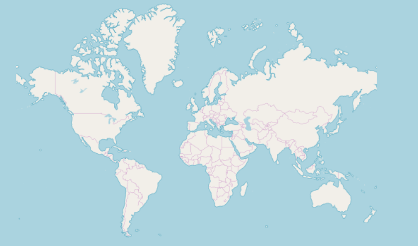

## Getting Started With Ignite UI for Angular

The Ignite UI for Angular is a complete set of Angular components designed to enable developers to build the most modern, high-performance HTML5 & TypeScript apps for modern desktop browsers.

### Setting Up Computer

Before you can run Ignite UI for Angular, there are 2 steps to get everything on your machine set up to run any Angular app, including Ignite UI for Angular, and to build Angular apps. To get started, you must install both NodeJS and Visual Studio Code on your machine. Modern web development with Angular requires NodeJS, it’s sort of like an ASP.NET app running in the browser and requires ASP.NET runtime deployed on the server. For development, there is nothing better than Visual Studio Code to build Angular apps. Getting started is easy, just download and install both Node.js and Visual Studio Code.

    

      
      <a target="_blank" href="https://nodejs.org/en/download/"
         style="color:white;background-color:#09f;text-decoration:none;font-weight:700;font-size:16px;padding: 5px 15px 5px 15px;">
        DOWNLOAD NODE JS
      </a>
    

    

      
      <a target="_blank" href="https://code.visualstudio.com/download"
         style="color:white;background-color:#09f;text-decoration:none;font-weight:700;font-size:16px;padding: 5px 15px 5px 15px;">
        DOWNLOAD VS CODE
      </a>
    

<!-- using a note because there is no other way to build flag content for specific platform. -->

<!-- commented out because this section is present in the "Updating Existing App"
You need to open Angular app in **VS Code** and install the following packages for Ignite UI for Angular using these commands:

- **npm install --save igniteui-angular-charts igniteui-angular-core**
- **npm install --save igniteui-angular-excel igniteui-angular-core**
- **npm install --save igniteui-angular-gauges igniteui-angular-core**
- **npm install --save igniteui-angular-grids igniteui-angular-core**
- **npm install --save igniteui-angular-maps igniteui-angular-core**
- **npm install --save igniteui-angular-spreadsheet igniteui-angular-core**

Or

- **yarn add igniteui-angular-charts igniteui-angular-core**
- **yarn add igniteui-angular-excel igniteui-angular-core**
- **yarn add igniteui-angular-gauges igniteui-angular-core**
- **yarn add igniteui-angular-grids igniteui-angular-core**
- **yarn add igniteui-angular-maps igniteui-angular-core**
- **yarn add igniteui-angular-spreadsheet igniteui-angular-core**

Lastly,  -->

### Updating Existing App

If you want to use Ignite UI for Angular in an existing Angular CLI project (one that you have from before). We have you covered! All you have to do is execute these commands:

<pre style="background:#141414;color:white;display:inline-block;padding:10px;margin-top:10px;font-family:'Consolas';border-radius:5px;width:100%">
npm install --save igniteui-angular-charts igniteui-angular-core
npm install --save igniteui-angular-excel igniteui-angular-core
npm install --save igniteui-angular-gauges igniteui-angular-core
npm install --save igniteui-angular-grids igniteui-angular-core
npm install --save igniteui-angular-maps igniteui-angular-core
npm install --save igniteui-angular-spreadsheet igniteui-angular-core
</pre>

Or

<pre style="background:#141414;color:white;display:inline-block;padding:10px;margin-top:10px;font-family:'Consolas';border-radius:5px;width:100%">
yarn add igniteui-angular-charts igniteui-angular-core
yarn add igniteui-angular-excel igniteui-angular-core
yarn add igniteui-angular-gauges igniteui-angular-core
yarn add igniteui-angular-grids igniteui-angular-core
yarn add igniteui-angular-maps igniteui-angular-core
yarn add igniteui-angular-spreadsheet igniteui-angular-core
</pre>

This will automatically install packages for Ignite UI for Angular, along with all of their dependencies, font imports and styles references to the existing project.

### Importing Modules

First we have to import the required modules of the components we want to use. We will go ahead and do this for the [**GeographicMap**](geo-map.md) component.

### Using Components

We are now ready to use the Ignite UI for Angular map component in our markup! Let's go ahead and define it:

### Running Application

Finally, we can run our new application by using one of the following commands:

<pre style="background:#141414;color:white;display:inline-block;padding:10px;margin-top:10px;font-family:'Consolas';border-radius:5px;width:100%">
npm run-script start
</pre>

After executing this command, your project will be built and served locally on your computer. It will automatically open in your default browser and you will be able to use Ignite UI for Angular components in your project.

The final result should look something like this screenshot:

