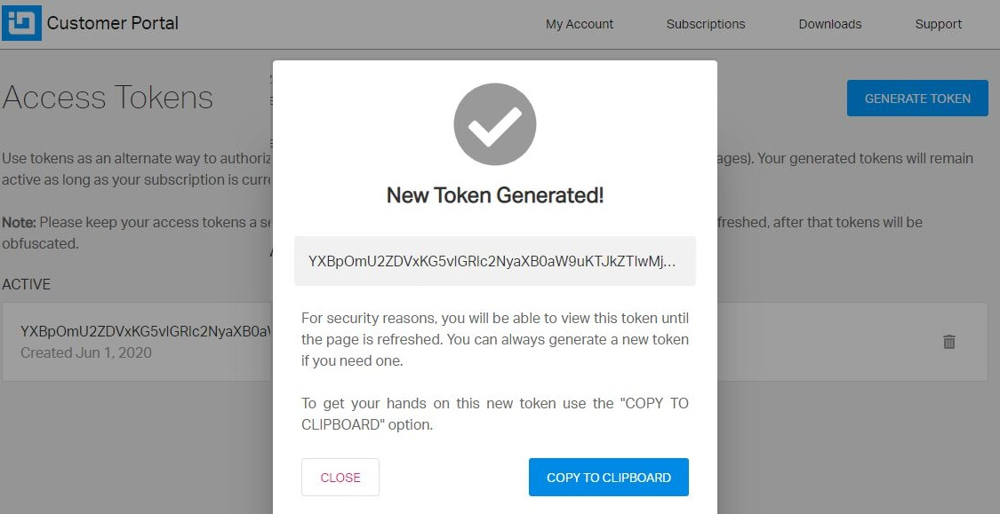

## License Agreements

It is important to know all the [legal terms and conditions](https://www.infragistics.com/legal/license/igultimate-la) regarding the Ignite UI for Angular that you purchase and use.

> [!NOTE]
> We have updated our license terms and subscription model in second quarter of 2020.

If you are building a **commercial product** or your license [has expired](http://www.infragistics.com/renewal), you will need to [acquire a commercial license](https://www.infragistics.com/how-to-buy/product-pricing). This will enable you to use our private npm feed hosted on <https://packages.infragistics.com/npm/js-licensed/> for development. There you will find the latest versions of the Ignite UI for Angular packages. If you have a valid commercial license, you can use this private feed and you will have access to the full version of Ignite UI for Angular.

> [!NOTE]
> Currently only the **igniteui-dockmanager** package is available in our private npm feed, but in the future we will add the other Ignite UI for Angular packages as well.

If you are building a **non-commercial** product, [contact us](https://www.infragistics.com/about-us/contact-us) and we will provide you with the appropriate license.

## Using the Private npm feed

Npm is the most popular package manager and is also the default one for the runtime environment Node.js. It is highly adopted and is one of the fastest and easiest ways to manage the packages that you depend on in your project. For more information on how npm works, read the official [npm documentation](https://docs.npmjs.com/).

Infragistics Ignite UI for Angular is available as npm packages and you can add them as dependencies to your project in a [few easy steps](./general-getting-started.md). Choosing this approach will not require configuring npm. By installing this package you will start using the **Ignite UI for Angular Trial version** of the product.

> [!NOTE]
> Currently only the [igniteui-dockmanager](https://www.npmjs.com/package/igniteui-dockmanager) npm package has a trial watermark, but in the future we will add it to the other Ignite UI for Angular packages as well.

### How to setup your environment to use the private npm feed

#### First you need to setup the private registry and to associate this registry with the Infragistics scope.

This will allow you to seamlessly use a mix of packages from the public npm registry and the Infragistics private registry. You will be asked to provide the username and the password that you use for logging into your Infragistics account. You should also provide the email that is registered to your Infragistics profile.

> [!NOTE]
>  **npm** is disallowing the use of the **"@"** symbol inside your username as it is considered as being "not safe for the net". Because your username is actually the email that you use for your Infragistics account it always contains the symbol **"@"**. That's why you must escape this limitation by replacing the **"@"** symbol with **"!!"** (two exclamation marks). For example, if your username is **"username@example.com"** when asked about your username you should provide the following input: **"username!!example.com"**.

#### Now, to log in to our private feed using npm, run the adduser command and specify a user account and password:

<pre style="background:#141414;color:white;display:inline-block;padding:10px;margin-top:10px;font-family:'Consolas';border-radius:5px;width:100%">
npm adduser --registry=https://packages.infragistics.com/npm/js-licensed/ --scope=@infragistics --always-auth
</pre>

#### After this is done, you will be logged in and you will be able to install the latest versions of the Ignite UI packages into your project:

<pre style="background:#141414;color:white;display:inline-block;padding:10px;margin-top:10px;font-family:'Consolas';border-radius:5px;width:100%">
npm uninstall igniteui-dockmanager
npm install @infragistics/igniteui-dockmanager
</pre>

Have in mind that we have set the Ignite UI for Angular package to be scoped, meaning that no changing the registries is needed if you want to install packages from our private feed and from npmjs.org simultaneously.

#### Some additional changes might have to be made in your project source

If you are upgrading from trial to licensed package:

-   Add a **paths** mapping in the project **tsconfig.json**.

-   Change the themes imports like this:

So, if you've already adopted npm and you have an Ignite UI for Angular license, don't hesitate setting up the Infragistics private feed and boost your productivity, using the full potential of Ignite UI for Angular.

## Access Token Usage

You can also authenticate to our private npm feed using an access token, which you can acquire through your [infragistics.com user account](https://account.infragistics.com/access-tokens). The access token authentication is the preferred alternative when you want to integrate a CI process in a publicly accessible repository, which uses the Ignite UI for Angular licensed packages.

The following information is on how to setup authentication to our private npm registry using an access token in local configuration, Azure Pipelines build procedures and Travis CI build process:

-   Generate a token from <https://account.infragistics.com/access-tokens>

> Each token is with Base64 encoding.

-   Add the following into your [.npmrc](https://docs.npmjs.com/configuring-npm/npmrc.html) file

<pre style="background:#141414;color:white;display:inline-block;padding:10px;margin-top:10px;font-family:'Consolas';border-radius:5px;width:100%">
@infragistics:registry=https://packages.infragistics.com/npm/js-licensed/
//packages.infragistics.com/npm/js-licensed/:_auth={YOUR_ACCESS_TOKEN}
//packages.infragistics.com/npm/js-licensed/:username:{YOUR_USERNAME}
//packages.infragistics.com/npm/js-licensed/:always-auth=true
</pre>

### Azure Pipelines Configuration

Update the azure-pipelines.yml with the following steps:

<pre style="background:#141414;color:white;display:inline-block;padding:10px;margin-top:10px;font-family:'Consolas';border-radius:5px;width:100%">
npm config set @infragistics:registry $(npmRegistry)
npm config set always-auth true --scope:@infragistics
npm config set _auth=$(token) --scope:@infragistics
</pre>

Add **npm registry** and **token** variables.

### Travis CI Configuration

We will follow almost the same approach here, the only difference would be that the configuration will be set on [before\_install](https://docs.travis-ci.com/user/job-lifecycle/#the-job-lifecycle)

<pre style="background:#141414;color:white;display:inline-block;padding:10px;margin-top:10px;font-family:'Consolas';border-radius:5px;width:100%">
before_install:
- echo "@infragistics:registry=https://packages.infragistics.com/npm/js-licensed/" >> ~/.npmrc
- echo "//packages.infragistics.com/npm/js-licensed/:_auth=$TOKEN" >> ~/.npmrc
- echo "//packages.infragistics.com/npm/js-licensed/:always-auth=true" >> ~/.npmrc
</pre>

The best way to define an environment variable depends on what type of information it will contain, so [you have two options](https://docs.travis-ci.com/user/environment-variables/):

-   encrypt it and add it [to your .travis.yml](https://docs.travis-ci.com/user/environment-variables/#defining-encrypted-variables-in-travisyml)
-   add it to your [Repository Settings](https://docs.travis-ci.com/user/environment-variables/#defining-variables-in-repository-settings)
