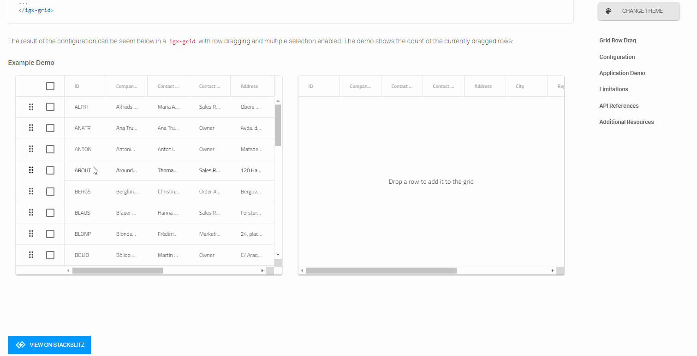

# Angular Grid and Angular App Development: A Complete Guide 

### What is an Angular Data Grid? 

An Angular data grid is a component used to display tabular data in a series of rows and columns. Data grids, also known as tables, are well known in the desktop world with popular software such as Microsoft Excel. While grids have been available on desktop platforms for a long time, they have recently become part of web app UIs, such as Angular UI.  

Modern grids can be complex and may include a range of functionalities, including data binding, editing, Excel-like filtering, custom sorting, grouping, row reordering, row and column freezing, row aggregation, and exporting to Excel, CSV, and pdf formats.  

### Why Use an Angular Data Grid? 

Angular data grids are essential in use cases where lots of data must be stored and sorted through quickly. This can include industries such as financial or insurance that use high-volume, high-velocity data frequently.  Often the success of these companies is dependent on the functionality and performance of these data grids. When stock decisions need to be made in microseconds, for example, it’s imperative that the data grid performs with no lag time or flicker. 

### Ignite UI - Our Framework for Angular App Development 

Ignite UI for Angular is an advanced toolset from Infragistics that includes feature-rich, high-performing UI components such as data grids and other components including charts, data visualization maps, editors, and more. 

The Ignite UI Angular data grid is among the fastest in the industry and is used by many of the leading financial and insurance companies. 

Built on Google’s Angular framework, Ignite UI provides over 50 UI components and Material-based components, and over 50 chart types, including financial charting. 

Among its many benefits, Ignite UI for Angular offers easy integration, rapid development and design, and responsive, cross-browser compatibility. 

### Installing and Creating a Project 

You can install Ignite UI for Angular with either the Angular CLI or with the [Ignite UI CLI](https://www.infragistics.com/products/ignite-ui-angular/angular/components/general/cli-overview.html "Ignite UI CLI Overview page"). To start quickly with the Angular CLI, run the following command: 

`ng add igniteui-angular` 

This is the preferred option when you need to add Ignite UI for Angular to an [existing Angular application](https://www.infragistics.com/products/ignite-ui-angular/angular/components/general/getting_started.html#installing-ignite-ui-for-angular "Installing Ignite UI for Angular"). 

If you’re creating a new application from scratch, we recommend the following approach: 

`npm install –g igniteui-cli` 

Once the igniteui cli is installed you can easily bootstrap an application by following cli’s [guided experience](https://www.infragistics.com/products/ignite-ui-angular/angular/components/general/cli/step-by-step-guide.html "Step by step guide"), which builds a configured app that the end user can run with a single command: 

`ig` 

Use this rich set of cli commands to perform other functions, including generating an Ignite UI project and adding a new component to building and serving the entire application. 

### Importing Dependencies 

When it comes to importing product dependencies, we strongly recommend using our Ignite UI CLI. By simply using `ng add igniteui-angular` you can install the Ignite UI for Angular package, along with all of its dependencies, font imports, styles preferences, and more  to your project. 

To start using Ignite UI for Angular components without the Ignite UI CLI, make sure you have configured all necessary dependencies and have performed the proper setup of your project. You can learn how to do this manually in the [Getting started](https://www.infragistics.com/products/ignite-ui-angular/getting-started#installation "Getting Started with Ignite UI for Angular") topic. 

### Adding Components to a Template 

Once you finish with the development environment setup, you can continue adding and configuring other Ignite UI components. Here’s how to use [our schematics](https://www.infragistics.com/products/ignite-ui-angular/angular/components/general/cli-overview.html#add-template "Ignite UI CLI Overview page") to add a grid with basic configuration and add templates to some of our columns. 

```html
<igx-grid #grid1 [data]="localData" [paging]="true" [perPage]="10" height="600px" (onSelection)="cellSelection($event)">
    <igx-column header="Rank" headerClasses="myClass" width="115px" field="Id" sortable="true" [filterable]="false"></igx-column>
    <igx-column field="Name" header="Athlete" width="280"></igx-column>
    <igx-column field="Speed" header="Speed" [width]="'190px'" [filterable]="false"></igx-column>
    <igx-column field="TrackProgress" sortable="true" header="Track Progress" [filterable]="false">
        <ng-template igxCell let-val>
            <div class="linear-bar-container">
                <igx-linear-bar [textVisibility]="false" class="cell__inner_2" [value]="val"></igx-linear-bar>
            </div>
        </ng-template>
    </igx-column>
</igx-grid>
```
The grid itself consist of different components such as the IgxColumnComponent which is used to define the grid's columns collection and to enable features per column like sorting and paging. 

Each of the columns of the grid can be templated separately. The column expects ng-template tags decorated with one of the grid module directives. 

### Configuring Your Components 

Now that you’ve defined columns to our Grid you can  set different cell, header, and footer templates as follows: 

 - IgxHeader directive targets the column header providing the column object itself as a context. 

 ```html
 <igx-column field="Name">
    <ng-template igxHeader let-column>
        {{ column.field | uppercase }}
    </ng-template>
</igx-column>
 ```
 - igxCell applies the provided template to all cells in the column. The context object provided in the template consists of the cell value provided implicitly and the cell object itself. 

 - The column also accepts one last template that will be used when a cell is in edit mode. As with the other column templates, the provided context object is again the cell value and the cell object itself 

```html
 <igx-column field="Price" [dataType]="'number'" editable="true">
    <ng-template igxCellEditor let-cell="cell">
        <label for="price">
            Enter the new price tag
        </label>
        <input name="price" type="number" [(ngModel)]="cell.editValue" />
    </ng-template>
</igx-column>
```
### Adding Data to Your Tables and Charts 

While some Angular apps will use static data, most app development today uses data stored in a database. Angular data-binding, which is the process of establishing a connection between the app UI and the data it displays, is easy to implement to allow for dynamic tables. You can set the grid to bind to a remote data service, which is the common scenario in large-scale applications. A good practice is to separate all data-fetching-related logic in a separate data service. Here is a way to create a service which will handle the fetching of data from the server: 

The service itself is pretty simple consisting of one method: fetchData that will return an `Observable<NorthwindRecord[]>`. 

```typescript

@Injectable()
export class NorthwindService {
    private url = 'http://services.odata.org/V4/Northwind/Northwind.svc/Alphabetical_list_of_products';

    constructor(private http: HttpClient) {}

    public fetchData(): Observable<NorthwindRecord[]> {
        return this.http
            .get(this.url)
            .pipe(
                map(response => response['value']),
                catchError(
                    this.errorHandler('Error loading northwind data', [])
                )
            );
    }

    private errorHandler<T>(message: string, result: T) {
        return (error: any): Observable<any> => {
            console.error(`${message}: ${error.message}`);
            return of(result as T);
        };
    }
}
```
After implementing the service, you’ll want to inject it in our component's constructor and use it to retrieve the data. The ngOnInit lifecycle hook is a good place to dispatch the initial request 

```typescript

@Component({
    ...
})
export class MyComponent implements OnInit {

    public records: NorthwindRecord[];

    constructor(private northwindService: NorthwindService) {}

    ngOnInit() {
        this.records = [];
        this.northwindService.fetchData().subscribe((records) => this.records = records);
    }
}
```

```html
<igx-grid [data]="records">
    <igx-column field="ProductId"></igx-column>
    <!-- rest of the column definitions -->
    ...
</igx-grid>
```
Check out our [Data-binding topic](https://www.infragistics.com/products/ignite-ui-angular/angular/components/grid/grid.html#data-binding "igxGrid Data Binding topic") for more detailed information. 

The same data binding technique is applicable to the other Ignite UI components, such as the igxDataChart.

```html
 <igx-data-chart [dataSource]="data"
                 width="700px"
                 height="500px">
    <igx-numeric-x-axis name="xAxis" isLogarithmic="true" ></igx-numeric-x-axis>
    <igx-numeric-y-axis name="yAxis" isLogarithmic="true" ></igx-numeric-y-axis>
    <igx-bubble-series
        name="series1"
        [xAxis]="xAxis"
        [yAxis]="yAxis"
        xMemberPath="population"
        yMemberPath="gdpTotal"
        radiusMemberPath="gdpPerCapita"
        [dataSource]="data"  ></igx-bubble-series>
 </igx-data-chart>
```
Setting a data source on the chart component will apply to all series, but you can also set different data sources on each series added in the data chart. 

### Sorting, Filtering and Pagination 

Angular data grids support easy sorting, filtering, and pagination. With rich APIs and an intuitive feature set-up, using Ignite UI for Angular components has never been easier. 

```html
<igx-grid #grid1 (onSortingDone)="removeSorting($event)"
        [data]="data"
        [paging]="true"
        [perPage]="10"
        [allowFiltering]="true">   
    <igx-column field="OrderID" header="Order ID">
    </igx-column>
    <igx-column field="CategoryName" header="Category Name" [dataType]="'string'" sortable="true">
    </igx-column>
```

The Grid provides three types of Filtering with custom filtering conditions: 

 - [Filter row](https://www.infragistics.com/products/ignite-ui-angular/angular/components/grid/filtering.html#grid-filtering-overview "Grid filtering Overview topic") per column with default filtering strategy provided out of the box, as well as all the standard filtering conditions. 

 - [Excel style filtering](https://www.infragistics.com/products/ignite-ui-angular/angular/components/grid/excel_style_filtering.html "Excel-style Filtering Overview topic"), with a configurable menu of features like sorting, moving, pinning, and hiding features. 

 - [Advanced filtering](https://www.infragistics.com/products/ignite-ui-angular/angular/components/grid/advanced_filtering.html "Advanced Filtering Overview topic") that provides a dialog which allows the creation of groups with filtering conditions across all columns. 

Our [Angular 9 release](https://www.infragistics.com/community/blogs/b/infragistics/posts/ignite-ui-for-angular-9-0-0-release "Ignite UI for Angular 9.0.0 Release") includes plenty of new key features – from data analysis to a rich visualization, grid state persistence, and theming widget. 

### Styling Your Components 

Ignite UI has the most expressive styling capabilities of the major Angular frameworks. 

With just a few lines of code, you can easily change the theme of your components. Being developed in SASS, the API is easy and allows for theming granularity on different levels from a single component, multiple components, or the entire suite. 

```scss
// Import the IgniteUI themes library first
@import '~igniteui-angular/lib/core/styles/themes/index';

$primary-color: #2ab759; // Some green shade I like
$secondary-color: #f96a88; // Watermelon pink

$my-color-palette: igx-palette(
    $primary: $primary-color,
    $secondary: $secondary-color
);

// IMPORTANT: Make sure you always include igx-core first!
@include igx-core();
// Pass the color palette we generated to the igx-theme mixin
@include igx-theme($my-color-palette);
```

Since Ignite UI for Angular bases its component designs on the [Material Design Principles](https://material.io/guidelines/material-design/introduction.html "Introduction to Material Design"), we try to get as close as possible to colors, sizes, typography, and the overall look and feel of our components to those created by Google. Example:

<div class="sample-container loading" style="height: 477px">
    <iframe id="list-sample-4-iframe" src='{environment:lobDemosBaseUrl}/grid-crm' width="100%" height="100%" seamless frameBorder="0" onload="onSampleIframeContentLoaded(this);"></iframe>
</div>

We want to also mention our samples browser Theming widget. Now, you can change themes at runtime in the [Ignite UI sample browser](http://www.infragistics.com/angularsite/components/grid/grid.html "Data Grid Overview and Configuration") with just one click. Theming widget allows you to change the styles, colors, roundness, and elevation. Customization of theming has never been easier. Once you are ready with your theme, just press "DOWNLOAD SASS" and you have your SCSS file at your disposal and you can use it in your app: 



### Data Analysis with Ignite UI 

The Ignite Angular UI toolset also includes [data analysis capabilities](https://www.infragistics.com//angularsite/components/general/framework-and-features/data-analysis.html "Data Analysis with igxGrid and igxDataChart"). We strive to give you all of the business capabilities you will need to deliver great experiences to your customers. So, we now provide directives that will give you a more Excel-like experience. For example, by selecting a portion of data you are now able to click a button and perform a quick data analysis on that subset of your data. 

<div class="sample-container loading" style="height: 750px;">
    <iframe id="grid-dynamic-chart" frameborder="0" seamless="" width="100%" height="100%" data-src="{environment:lobDemosBaseUrl}/grid-dynamic-chart-data/data-analysis" class="lazyload no-theming"></iframe>
</div>

### Tools for Code Generation and Design 

Ignite UI for Angular is part of the [Indigo.Design System](https://www.infragistics.com/products/indigo-design/help/video-tutorials.html "Indigo Design System") which lets you [generate native Angular code](https://www.infragistics.com/products/indigo-design/help/codegen/vscode-plugin.html "Visual Studio Plugin") from designs created in Sketch with the [Indigo.Design UI Kit](https://www.infragistics.com/products/indigo-design/help/creating-an-artboard.html "Indigo Design Creating an artboard"). You can generate a mobile-friendly or data-dense grid supporting various editing and filtering modes, but you can also use many of the popular grid features such as sorting, paging, summaries, and group by. Moreover, on every column you can specify various operations like moving, resizing, hiding, and pinning to achieve the most sophisticated data manipulations scenarios at design time and have a pixel-perfect user interface running in minutes. 

### Performance Benchmarks 

Grid components, in general, are intended to visualize large quantities of tabular data. When it comes to performance, our Grid excels at load-time, run-time, and soft performance.  

In order to satisfy the requirements of a web application for load time and run-time performance, it is important to virtualize the Document Object Model (DOM) elements that are rendered, and to either swap or reuse DOM elements when the user performs vertical and horizontal scrolling on the component’s container. The igxGrid has great tun-time scrolling performance without visual tears as well as soft performance (defined by the general usability of your software). Here’s an example of a Gif with scrolling performance: 


Check out our Grid and see how easy it is to find and navigate to the feature you want to use, or how appealing the look and feel of it would be in your application. 

Learn more about this in our [Medium Software Performance (Web) article](https://medium.com/ignite-ui/software-performance-web-61158c8583d "Web Software Performance"). 