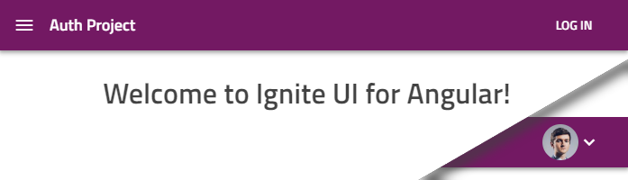
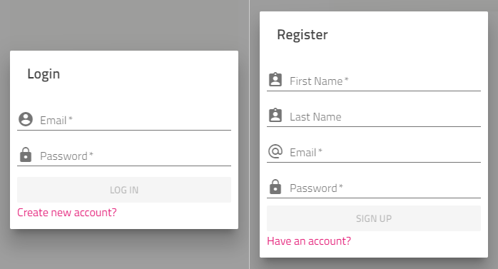

# Authentication Project Template

There are multiple versions of a project (called project templates) to choose from when using either the [`new` command](../cli-overview.md#create-new-project) or the [Step by step mode](step-by-step-guide.md).

When creating Ignite UI for Angular project with Angular Schematics or Ignite UI CLI you can select a template with an basic implementation of a client-side authentication module that require as little additional setup as possible to jump-start apps with user management.

## Create Authentication Project
You can select an authentication project either when going through the Step by step experience after selection 'Ignite UI for Angular' project type:


Or through the new command:

```bash
ig new "Auth Project" --framework=angular --type=igx-ts --template=side-nav-auth
```

If you are using the Schematics collection run:

```bash
ng new "Auth Project" --collection="@igniteui/angular-schematics" --template=side-nav-auth
```

## Description
This template builds upon the Side Navigation default and adds a profile page and a login section to the app's nav bar that will display a login button or an avatar of the logged in user:



The login bar also integrates dialogs to sign in or up:



The project also supports various [external authentication providers](#add-a-third-party-social-provider). 

## In code
Everything related to user management is under the `src/app/authentication` folder. Notable exports include:

- `AuthenticationModule` in `authentication.module.ts` exports all components and services to the main app module.
- `auth.guard.ts` exports an `AuthGuard` you can apply to routes
- `authentication-routing.module.ts` sets up login-related routes
- `UserService` in `services/user.service.ts` keeps the current user state
- `AuthenticationService` in `services/authentication.service.ts` is used to communicate with the backend API
- `ExternalAuthService` in `services/external-auth.service.ts` handles providers for third-party logins

## Required configuration

The project is setup for a single page app with REST API services, so the `AuthenticationService` is used to send requests to the following URLs:
- `/login` - login with username and password
- `/register` - register with user details
- `/extlogin` - passes along user info from external source

All endpoints are expected to return an JSON Wen Token(JWT)
 or an error state with message. 

> **Note:** For demonstration purposes the project has a `services/fake-backend.service.ts` that intercepts requests . The `BackendProvider` in `authentication.module.ts` should **not** be used in production. Both the provider and the file should be removed when development starts.

As with any authentication model, using JWT-s requires security considerations. Particularly, the tokens received from the REST API are stored on the client. For seamless app reloads during development, the user data is stored in the browser local storage, which is potentially vulnerable to XSS attacks.

> **Note:** Disable the local storage before production. Consider keeping tokens in memory only if the app requirements allow or take alternative route to protect them. Using cookies (consider CSRF protection) is an alternative, also splitting the token signature or an additional 'fingerprint' in a hardened cookie.

As usual, always evaluate security aspects and adjust accordingly, the project structure provided is merely a starting point.


## Add a third-party (social) provider

Your project's main module `src/app/app.module.ts` should be generated with the external authentication service injected and commented out initialization similar to:

```ts
// in app.module.ts
export class AppModule {
  constructor(private externalAuthService: ExternalAuthService) {
    // this.externalAuthService.addGoogle('<CLIENT_ID>');
    // this.externalAuthService.addMicrosoft('<CLIENT_ID>');
    // this.externalAuthService.addFacebook('<CLIENT_ID>');
  }
}
```

To enable user login with a specific third-party provider all that is required is to un-comment the specific line and replace the `` with your app's client ID.
If you need to obtain one, for example for Google Account sign in, follow the provider-specific guide at:
- https://developers.google.com/identity/protocols/OpenIDConnect#getcredentials

- https://support.google.com/cloud/answer/6158849?hl=en&ref_topic=6262490 (more detailed version)

Keep in mind, redirect URLs and allowed domain origins should be configured per provider to match the project. When creating the Google OAuth 2.0 client ID for development you can provide `http://localhost:4200/redirect-google` as the redirect URI. See [redirect URLs](#provider-details) for details.

Once you have your ID (for example `123456789.apps.googleusercontent.com`) you can enable the Google provider for the project like so:
```ts
// in app.module.ts
export class AppModule {
  constructor(private externalAuthService: ExternalAuthService) {
    this.externalAuthService.addGoogle('123456789.apps.googleusercontent.com');
    // this.externalAuthService.addMicrosoft('<CLIENT_ID>');
    // this.externalAuthService.addFacebook('<CLIENT_ID>');
  }
}
```
This will automatically enable the respective button in the login dialog:


You can do the same with [Microsoft](https://docs.microsoft.com/en-us/azure/active-directory/develop/v2-protocols-oidc) following this guide:

https://docs.microsoft.com/en-us/azure/active-directory/develop/quickstart-v2-register-an-app

And for Facebook:

https://developers.facebook.com/docs/apps/#register


As you enable providers, all buttons will become active:


### Provider details

Here are the default providers the project template comes with:

| Provider | Uses | Redirect URL |
|---|---|---|
| Google | OpenID Connect* | `<app root>/redirect-google` |
| Microsoft | OpenID Connect* | `<app root>/redirect-microsoft` |
| Facebook | Facebook Connect** | `<app root>/redirect-facebook` |

Where the app is hosted will determine the root URL, for example by default on the first app run that will be `http://localhost:4200`.

\* OpenID Connect functionality implemented using https://github.com/damienbod/angular-auth-oidc-client

\** Facebook Connect functionality implemented using Facebook JS SDK
