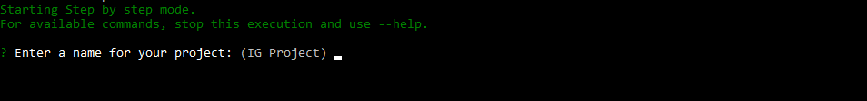
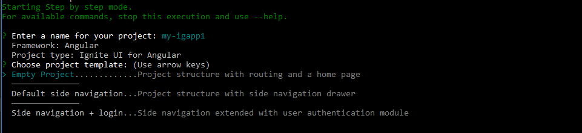
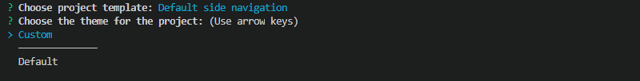
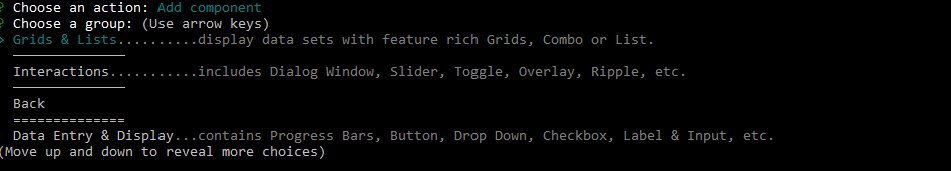
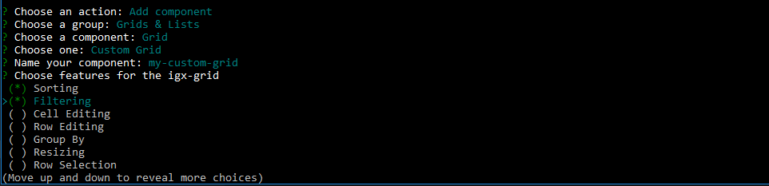
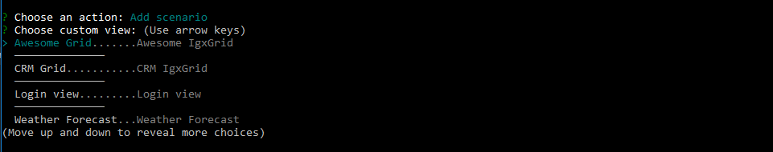

## Step-by-Step Guide
If you want to get a guided experience through the available options, you can initialize the step by step mode that will help you create and setup your new application, as well as update project previously created with the [Ignite UI Angular Schematics or the CLI tool](../cli-overview.md).

To activate the guide using the Schematics tool run:

```cmd
ng new --collection="@igniteui/angular-schematics"
```

To start the guide using the Ignite UI CLI, simply run the `ig` command:

```bash
ig
```
or
```bash
ig new
```

This will activate the step by step mode and you will be asked a series of questions to help you create your new project.

<div style="display:inline-block;">
    <a style="background: url(../../../images/general/buildCLIapp.gif); display:flex; justify-content:center; min-width:540px; min-height:315px;"
       href="https://youtu.be/QK_NsdtdA70" target="_blank">
        
    </a>
</div>

> **Note** Step by step mode relies on `Inquirer.js`, see [supported terminals](https://github.com/SBoudrias/Inquirer.js#support-os-terminals)


## Create new project

First you will be prompted to enter a name for your application:



Then you will be guided to choose one of the available project templates. You can create an empty project, project with side navigation or [authentication project](auth-template.md) with basic authentication module. Navigate through the available options using the arrow keys and press ENTER to confirm the selection:



The next step is to choose a theme for your application. If you select the default option a pre-compiled CSS file (`igniteui-angular.css`) with the default Ignite UI for Angular theme is included in your project's `angular.json`. The custom option generates code for a color palette and theme with our [Theming API](../../themes.md) in the `app/styles.scss`.



After completing the above steps the application structure will be generated, git repository will be initialized and the project will be committed. Then you will be asked if you want to complete the process or to add a new view to your application:


## Add view

Ignite UI CLI supports multiple component templates, as well as some more elaborated scenario templates, that can be added to a project.

To activate the the step by step mode using the Schematics tool run the `component`(alias:`c`) schematic:
```bash
ng g @igniteui/angular-schematics:component
```

When using the CLI, this mode can be activated either after completing project creation or by running the `add` command inside an existing project:
```bash	
ig add
```
In case you choose to add a new control, you will be provided with a [list of the available templates](component-templates.md#component-templates), grouped in categories.



Use the arrow keys to navigate through the options and ENTER to choose the selected one.

For some templates, like `Custom Grid`, for example you will be provided with a list of options that you might enable. Options can be toggled with the SPACE key:



If you choose to add a scenario to your application you will also get a list of the available [scenario templates](component-templates.md#scenario-templates):



After adding a template to your application, you will be asked weather you want to complete the process or to proceed with adding more controls. When you choose to complete the process, the required packages will be installed (on project creation) and the application will be served and opened in your default browser.

You can always add more Ignite UI for Angular views to your application at latter moment using the `add` command.