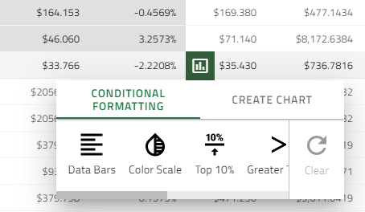
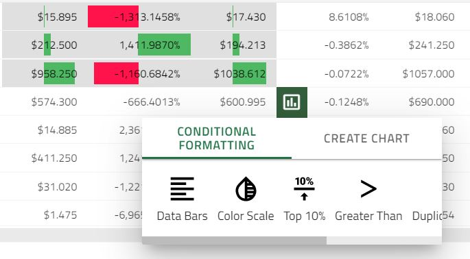
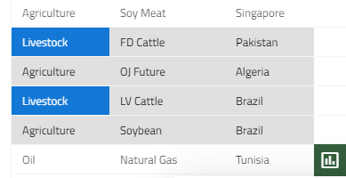

## Data Analysis

Data analysis is the process of examining, transforming, and arranging data in a specific way to generate useful information based on it. It also allows for reaching certain outcomes and conclusions through analytical and logical reasoning.

>[!NOTE]
>This functionality will be introduced in **Ignite UI for Angular** as external package in order to ease the configuration and limit the required code at minimum

### Data Analysis with DockManager
Go ahead and perform a `cell range selection` or `column selection` in order to enable the `Chart types view` based on the selected data. This view is part of [Dock Manager's](../../dock-manager.md) right pane. From there you can:
 - Choose specific chart type and visualize it in separate pane.
 - Or use the `Data Analysis` context button to show different text formatting options.

    <iframe id="data-analysis-dock-manager" frameborder="0" seamless width="100%" height="100%" src="{environment:lobDemosBaseUrl}/grid-dynamic-chart-data/data-analysis-dock-manager" onload="onSampleIframeContentLoaded(this);"></iframe>

[View sample]({environment:lobDemosBaseUrl}/grid-dynamic-chart-data/data-analysis-dock-manager) in full-size.

> [!NOTE]
> The [Dock Manager Web component](../../dock-manager.md) provides means to manage the layout of the application through panes, and allowing the end-users to customize it further by pinning, resizing, moving and hiding panes. After selecting your data, go ahead and create a couple of charts and pin them (by dragging) to the available pinnable areas.

Keep in mind (sample related):
- On new data selection chart data will be updated.
- If multi-cell range selection is applied, only the `Text formatting` functionality will be available.
- If on new selection the data is not compatible for some of the charts - a warning "Incompatible data" will be shown.

### Data Analysis Button
The data analysis button is the outlet to visualize your selected data in various ways:

This way every range selection performed in the grid can be easily analyzed in a single click.

The button is rendered on every range selection at the **bottom-right** of the selection and hides when the selection is inactive. Horizontal and vertical scrolling reposition the button so that it is always rendered at its designated position.

### Chart Integration
This section introduces Grid's integration with charting functionality, which allows the end user to visualize a chart based on Grid's selected data and choose different chart types if needed.

The chart will be shown by selecting a range of cells and by clicking on the show analysis button.

>[!NOTE]
>The chart creation option is only available when there are numeric values in the selected data.

    <iframe id="grid-dynamic-chart" frameborder="0" seamless="" width="100%" height="100%" src="{environment:lobDemosBaseUrl}/grid-dynamic-chart-data/data-analysis" class="lazyload"></iframe>

We currently support the following Chart types:
- [ColumnGrouped](../../data-chart-type-category-series.md), [AreaGrouped](../../data-chart-type-category-area-series.md), [LineGrouped](../../data-chart-type-category-line-series.md), [BarGrouped](../../data-chart-type-category-series.md)
- [ColumnStacked](../../data-chart-type-stacked-column-series.md), [AreaStacked](../../data-chart-type-category-spline-area-series.md), [LineStacked](../../data-chart-type-stacked-line-series.md), [BarStacked](../../data-chart-type-stacked-bar-series.md)
- Column100Stacked, [Area100Stacked](../../data-chart-type-stacked-100-area-series.md), [Line100Stacked](../../data-chart-type-stacked-100-line-series.md), [Bar100Stacked](../../data-chart-type-stacked-100-bar-series.md)
- ScatterPoint, ScatterBubble, ScatterLine. In order to show meaningful Scatter Bubble Chart we disable the preview when the data is not in valid format.
- [Pie Chart](../../pie-chart.md)

### Conditional Cell Formatting 
If you have a Grid with thousands of rows of data it would be very difficult to see patterns and trends just from examining the raw information. Similar to charts and sparklines, `Conditional formatting` provides another way to visualize data and make it easier to understand. 

Understanding conditional formatting - it allows for applying formatting such as colors and data bars to cells based on `their value` in the range selection. The [sample below](#demo) demonstrates how you can configure the Grid to apply `Conditional Formatting`. It depends on the `Conditional formatting selection type` what condition `rules` will be shown. Below you will find the predefined styles (presets) that you can use in order to quickly apply conditional formatting to your data. The formatting of a range gets cleared when performing formatting on different range or through the clear button. The clear button is only active when there is an applied formatting.  

#### Number range selection
- `Data Bars` - Data bars can help you spot larger and smaller numbers, such as top-selling and bottom-selling products. This preset makes it very easy to visualize values in a range of selected cells. A longer bar represents a higher value. A cell that holds  value of 0 has no data bar all other cells are filled proportionally. Positive values are with `green` color  and  negative values will be `red`

- `Color Scale` - The shade of the color represents the value in the cell. The cells that hold values below the `*Lowest threshold` will be colored in `red`. The cells that are above the `*Highest threshold` will be colored in `green`. And all the cells that are between the `Lowest` and `Highest threshold` will be colored in `yellow`.

> `Lowest threshold` - Below 33% of the maximum cell value in range selection.

> `Highest threshold` - Above 66% of the maximum cell value in range selection. 

- `Top 10%` - Use this preset to highlight the values which are equivalent to top 10% of the selected data.

- `Greater than` - This preset marks all values `Greater than the avarege`
- `Duplicate values` - Marks all duplicate values.
- `Unique values` - All cell values that are unique will be marked (`blue` background color).

- `Empty`- Marks all cells with `undefined` values

#### Text range selection
- `Text contains` - Marks all cells that contain the cell value from the `top-left most selected cell`. Example:

- `Duplicate values` - Marks all duplicate values.
- `Unique values` - All cell values that are unique will be marked (`blue` background color).
- `Empty`- Marks all cells with `undefined` values

#### Demo

    <iframe id="grid-dynamic-chart" frameborder="0" seamless="" width="100%" height="100%" data-src="{environment:lobDemosBaseUrl}/grid-dynamic-chart-data/data-analysis" class="lazyload"></iframe>

### Useful resources

* [Angular Universal guide](https://angular.io/guide/universal)
* [Ignite UI Starter Kit](https://github.com/IgniteUI/ng-universal-example)
* [Server-side rendering terminology](https://developers.google.com/web/updates/2019/02/rendering-on-the-web)
* [Getting started with Ignite UI for Angular](../getting_started.md)
* [Ignite UI CLI Guide](../cli/step-by-step-guide.md)
