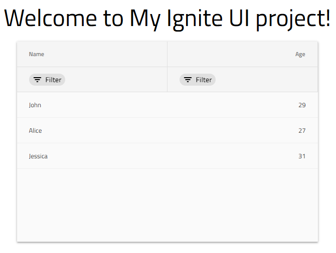

# Getting started with Ignite UI for Angular

[`Ignite UI for Angular`](https://github.com/IgniteUI/igniteui-angular) is a complete set of Material-based UI Widgets, Components & Sketch UI kits and supporting directives for Angular by Infragistics. It enables developers to build modern high-performance HTML5 & JavaScript apps for desktop browsers, mobile experiences and progressive web apps (PWA’s) targeting Google's Angular framework.

### Prerequisites

1. Install NodeJS.
2. Install Visual Studio Code.

<div>
    <div style="display:inline-block;width:45%;text-align:center;">
      
      <a target="_blank" href="https://nodejs.org/en/download/" class="no-external-icon"
         style="color:white;background-color:#09f;text-decoration:none;font-weight:700;font-size:16px;padding: 5px 15px 5px 15px;">
        DOWNLOAD NODE
      </a>
    </div>
    <div style="display:inline-block;width:45%;text-align:center;">
      
      <a target="_blank" href="https://code.visualstudio.com/download" class="no-external-icon"
         style="color:white;background-color:#09f;text-decoration:none;font-weight:700;font-size:16px;padding: 5px 15px 5px 15px;">
        DOWNLOAD VS CODE
      </a>
    </div>
</div>
<div class="divider--half"></div>

### Installing Ignite UI for Angular

The Ignite UI for Angular can be installed either wth the Angular CLI or with the Ignite UI CLI.

#### Quick Start with the Angular CLI

The Angular CLI provides support for external libraries to your project through the `ng add` command, which installs a library's `npm` packages to your workspace and configures the project in the current working directory to use that library.

To create an Angular application with the Angular CLI, open your preferred terminal and type in the following command:

```cmd
ng new <project name> --style=scss
```
You can specify the file extension or preprocessor to use for your application's style files with the `--style` option. We recommend using Scss since our components' styles are based on the [Ignite UI for Angular theming library](../themes.md). Later on, when you install the Ignite UI for Angular package, your application will be configured to use the default styling theme which can be then easily customized either for all or for specific component instances.

Thereafter you can install the Ignite UI for Angular package, along with all of its dependencies, font imports and styles references to your project, by running the following command: 

```cmd
ng add igniteui-angular
```

During the installation process you will be asked if you would like to enable polyfills for IE, Edge and Safari. This will install the `web-animations-js` package in your project, which is required if you use `AnimationBuilder` in your application and one of these browsers. You can also choose to add CSS library to reset HTML element styles across browsers and the `minireset.css` will be installed in your application.

#### Quick Start with Angular Schematics & Ignite UI  CLI
To create an application from scratch and configure it to use the Ignite UI for Angular components you can use either the Ignite UI for Angular Schematics or the Ignite UI CLI. The first step is to install the respective package globally as follows:

```cmd
npm i -g @igniteui/angular-schematics
```

or:

```cmd
npm install -g igniteui-cli 
```

Our [`guided experience`](cli/step-by-step-guide.md) is the easiest way to bootstrap a configured application.

To activate the guide using the Ignite UI for Angular Schematics run:
```cmd
ng new --collection="@igniteui/angular-schematics"
```
or run the following command in case you are using the CLI tool:
```cmd
ig
```

<div style="display:inline-block;">
    <a style="background: url(../../images/general/buildCLIapp.gif); display:flex; justify-content:center; min-width:540px; min-height:315px;"
       href="https://youtu.be/QK_NsdtdA70" target="_blank">
        
    </a>
    <p style="text-align:center;">Building Your First Ignite UI CLI App</p>
</div>

Learn more about our [Angular Schematics & Ignite UI CLI](cli-overview.md).

## Using Ignite UI for Angular

We are now ready to start using Ignite UI for Angular components!

### Add components automatically

#### Import modules and use components
Now we can add new components to our application using either the `component` schematic or the `add` command:

```cmd
ng g @igniteui/angular-schematics:component
```

```cmd
ig add
```

> [!NOTE]
> Please note that the [`ig add`](https://github.com/IgniteUI/igniteui-cli/wiki/add) command can be used if the application was created by using the Ignite UI CLI or
> if it was created by using the Angular CLI with Ignite UI for Angular added to it by using the **ng add igniteui-angular** command.

After going through the options of the menu and choosing which component we want to add to our application, we will notice that we have a brand new component in our project, which we can use anywhere on our page!

#### Run application

Now let’s run our application to see our awesome page!

```cmd
npm start
```

### Add components manually

#### Import modules

First we have to import the respective modules of the components we want to use in the **app.module.ts** file. We will go ahead and do this for the [**igxGrid**](../grid/grid.md)! Please note that some components have animations depending on BrowserAnimationsModule, so let’s import that one as well:

```typescript
// app.module.ts

import { BrowserModule } from '@angular/platform-browser';
import { BrowserAnimationsModule } from '@angular/platform-browser/animations';
import { NgModule } from '@angular/core';
import { AppComponent } from './app.component';

// Here we import the IgxGridModule, so we can use the igxGrid!
import { IgxGridModule } from 'igniteui-angular';

@NgModule({
  declarations: [
    AppComponent
  ],
  imports: [
    BrowserModule,
    BrowserAnimationsModule,
    IgxGridModule
  ],
  providers: [],
  bootstrap: [AppComponent]
})
export class AppModule { }
```

#### Use components

We are now ready to use the igxGrid in our markup! Let's go ahead and define it in our **app.component.html** file:

```html
<!-- app.component.html -->

<div style="text-align:center; margin-bottom: 20px;">
  <h1>
    Welcome to {{title}}!
  </h1>
</div>

<div style="text-align: center;">
  <igx-grid [data]="localData" width="600px" height="400px" style="margin: auto" [allowFiltering]="true">
    <igx-column field="Name" dataType="string"></igx-column>
    <igx-column field="Age" dataType="number"></igx-column>
  </igx-grid>
</div>
```

We will also define the data of the grid and the title of our application that are referenced from the **app.component.ts**:

```typescript
// app.component.ts

import { Component } from '@angular/core';

@Component({
  selector: 'app-root',
  templateUrl: './app.component.html',
  styleUrls: ['./app.component.css']
})
export class AppComponent {
  localData = [
    { Name:'John', Age: 29 },
    { Name:'Alice', Age: 27 },
    { Name:'Jessica', Age: 31 },
  ];

  title = 'My Ignite UI project';
}
```

#### Run application

Finally, we can run our new application by using one of the following commands:

- If the application was created by using the Ignite UI CLI:

```cmd
ig start
```

- If the application was created by using the Angular CLI:

```cmd
ng serve
```

The final result should look something like this:



## API References

In this article we learned how to create our own Ignite UI for Angular application from scratch by taking advantage of the fully-automated process of Ignite UI for Angular projects creation in the Ignite UI CLI. We also learned and how to add Ignite UI for Angular to an existing application by using the Angular CLI. We designed our own page by including the [`IgxGridComponent`]({environment:angularApiUrl}/classes/igxgridcomponent.html) to it, which itself offers some awesome features, which you can take a look at by referring to the navigation menu.

* [IgxGridComponent]({environment:angularApiUrl}/classes/igxgridcomponent.html)
* [IgxGridComponent Styles]({environment:sassApiUrl}/index.html#function-igx-grid-theme)

## Additional Resources
<div class="divider--half"></div>

* [Ignite UI CLI](https://github.com/IgniteUI/igniteui-cli)
* [Ignite UI CLI Commands](https://github.com/IgniteUI/igniteui-cli/wiki#available-commands)
* [Grid overview](../grid/grid.md)

<div class="divider--half"></div>
Our community is active and always welcoming to new ideas.

* [Ignite UI for Angular **Forums**](https://www.infragistics.com/community/forums/f/ignite-ui-for-angular)
* [Ignite UI for Angular **GitHub**](https://github.com/IgniteUI/igniteui-angular)
