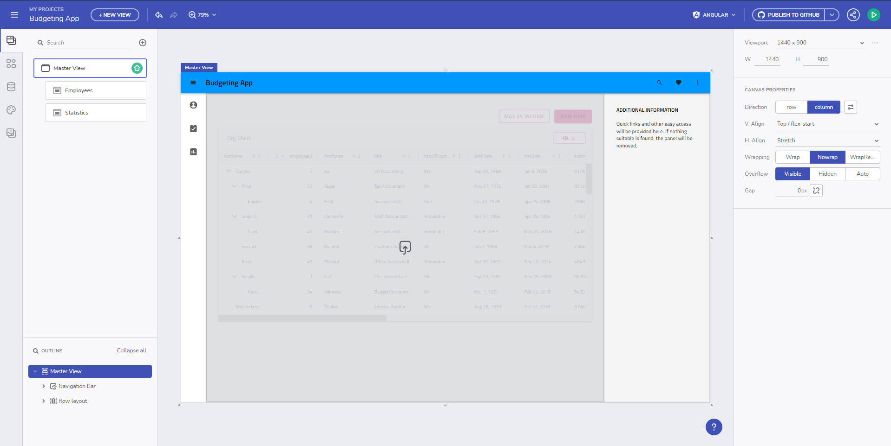
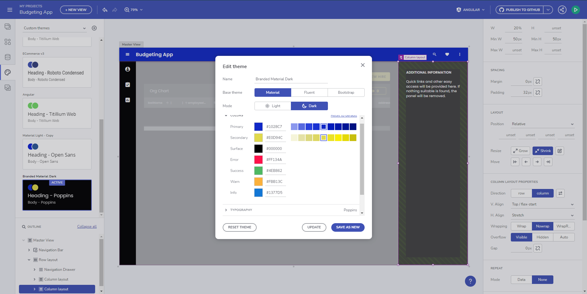
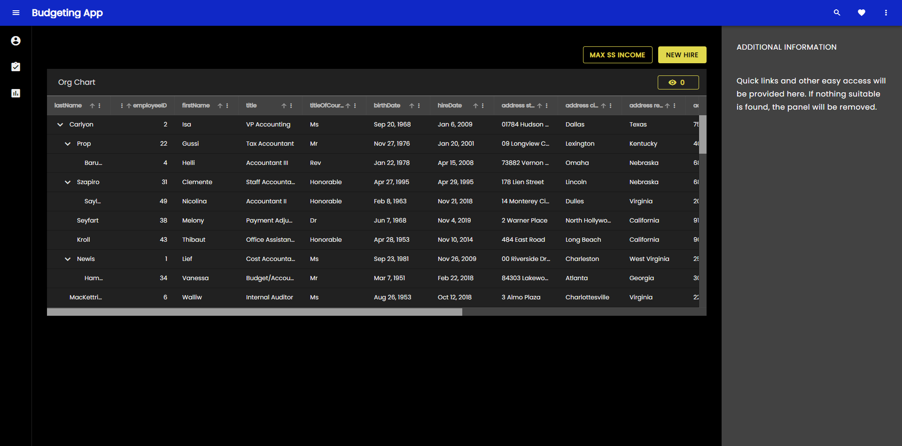
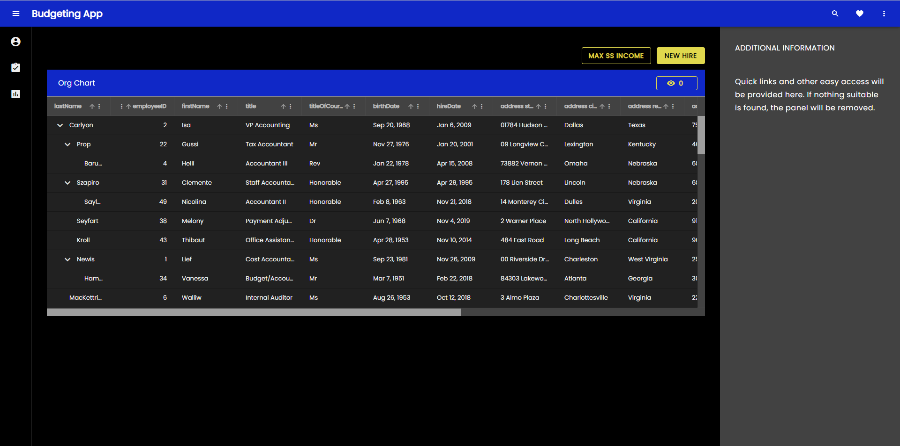
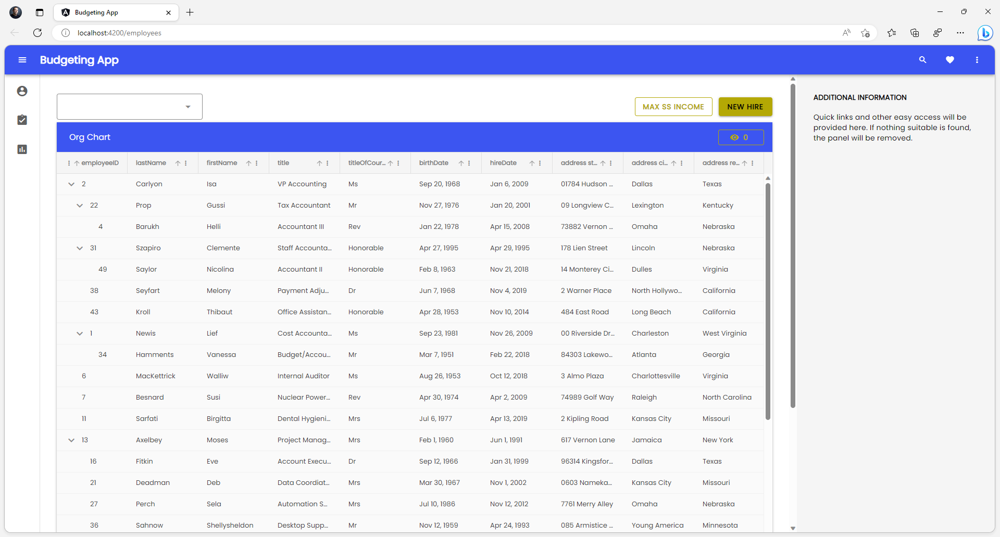
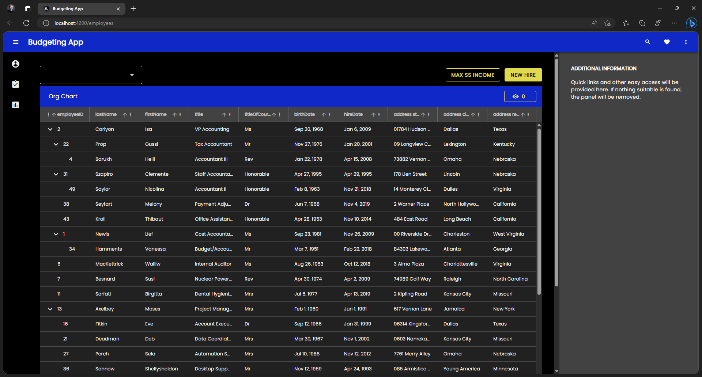
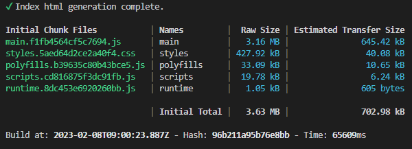
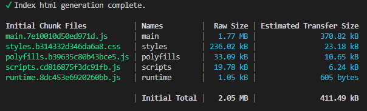
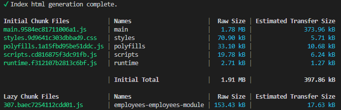

# Customizing Ignite UI for Angular Theming

This article will walk you through the details of customizing Ignite UI for Angular application theming and optimizing the size of the produced stylesheet. The article shows details of how the Ignite UI for Angular theming engine works and presents advanced usage of it. The article is very useful for both making full customization of the component styles, such that your Angular application is tailored to match your desired look and feel, and for making your application optimal for deployment by reducing the style sizes down to only what is used by the app.

>[!NOTE] 
> This document describes the theming system in Ignite UI for Angular from version 15 forward. Examples include both using the Sass APIs provided by the theming engine and exposed CSS variables.

## Getting Started

We will be using the [App Builder](https://www.infragistics.com/products/appbuilder) to produce an Angular application and then we will modify the styling of it in the generated repository. We start by creating a new app from "Header + mini nav + content + side pane" template in the App Builder and we add some components to the design surface.



Then we generate our app, using Angular as a target, to a GitHub repository, on top of which we will work both from the App Builder and modifying the generated code itself. After cloning the repository and building the project, we get the running Angular application in its initial state.


As you can see, the application has applied default theming, which is [material light variant](../../themes/sass/presets/material.md). The generated `styles.scss` file looks like this:

```scss
/* You can add global styles to this file, and also import other style files */

// Standard CSS normalize, comment out if not required or using a different module
@use "minireset.css/minireset";
@use "@infragistics/igniteui-angular/theming" as *;

@include core();
@include typography();
@include light-theme($light-material-palette);

body {
  background: hsla(var(--ig-surface-500));
  color: var(--ig-surface-500-contrast);
}

html, body {
  height: 100%;
}

.ig-typography {
  h1, h2, h3, h4, h5, h6, p, .ig-typography__body-1 {
    margin: 0;
  }
}

.outer-wrapper > *:not(router-outlet) {
  width: 100%;
}
```

## Theme Customization

We want a dark variant of the same theme, add our own [color palette](../../themes/palettes.md) to match our branding, and change the font to `Poppins` instead of the default `Titillium Web`, all of which we can change directly through the App Builder and we can push the change as a pull request from the App Builder into the repository.



The updated `styles.scss` looks like this:

```scss
@include core();
@include typography($font-family: "Poppins");

$custom-palette: palette(
  $primary: #1028c7,
  $secondary: #e0d94c,
  $surface: #000,
  $gray: #fff
);

@include theme(
    $palette: $custom-palette, 
    $schema: $dark-material-schema
);
```

As you can see, the code generation changed from the specific `@include light-theme($light-material-palette);`, which is the [default theme](../../themes/sass/presets/material.md) and [color palette](../../themes/palettes.md), to a generic [`theme()`]({environment:sassApiUrl}/index.html#mixin-theme) include, which provides as parameters our custom color palette and a [dark material schema](../../themes/sass/schemas.md) for the theming structure. The running Angular app result looks like this now:



We want to dig deeper and customize a specific [component theme](../../themes/sass/component-themes.md) in our application and we will do this by bringing in the CSS variables for an individual component theme, in this case the grid toolbar theme. 

```scss
@include core();
@include typography($font-family: "Poppins");

$primary: #1028c7;

/* All of the components will use this custom color palette */
$custom-palette: palette(
  $primary: $primary,
  $secondary: #e0d94c,
  $surface: #000,
  $gray: #fff
);

@include theme(
    $palette: $custom-palette, 
    $schema: $dark-material-schema
);

/* Grid Toolbar */
/* All grid toolbars will have custom background and elevations */
$toolbar-theme: grid-toolbar-theme(
  $background-color: $primary
);

@include css-vars($toolbar-theme);
/* END Grid Toolbar */
```

And the result in our app now looks like this:



The same process can be applied to override and customize any of the component themes individually.

### Switching custom themes at runtime

Now let's dig even deeper and create two custom versions of the theme, which can be switched between at runtime. We can do this with user control/preference and let them switch it at any time. For the example, however, we will use the OS defined user preference (light or dark) in order to apply a theme, which matches the current OS setting. In order to do this, we will need two color palettes:

```scss
@use "minireset.css/minireset";
@use "@infragistics/igniteui-angular/theming" as *;

@include core();
@include typography($font-family: "Poppins");

$primary-dark: #1028c7;
$primary-light: #3c55f1;
$secondary-dark: #e0d94c;
$secondary-light: #b4a904;

$custom-palette-dark: palette(
  $primary: $primary-dark,
  $secondary: $secondary-dark,
  $surface: #000,
  $gray: #ccc
);

$custom-palette-light: palette(
  $primary: $primary-light,
  $secondary: $secondary-light,
  $surface: #fff,
  $gray: #222
);
```

Then our theme definition will go in the general scope, which we will use for the light variation and we will create a palette override in a `@media` query when dark color schema OS preference is detected:

```scss
@include theme(
  $palette: $custom-palette-light,
  $schema: $light-material-schema
);

@media (prefers-color-scheme: light) {
  /* Grid Toolbar override for light color scheme */
  igx-grid-toolbar {
    --background-color: #{$primary-light};
    --title-text-color: #{text-contrast($primary-light)};
  }
  /* END Grid Toolbar */
}

@media (prefers-color-scheme: dark) {
  // changes native element schema (scrollbars, select, etc.)
  :root {
    color-scheme: dark;
  }

  @include palette($custom-palette-dark);

  /* Grid Toolbar override for dark color scheme */
  igx-grid-toolbar {
    --background-color: #{$primary-dark};
    --title-text-color: #{text-contrast($primary-dark)};
  }
  /* END Grid Toolbar */
}
```

>[!NOTE]
> I have switched the `igx-grid-toolbar` theme override to overriding just two of its variables, instead of reincluding all of the theme variables using [`css-vars()`]({environment:sassApiUrl}/index.html#mixin-css-vars). 
> All theme variables can be found in the [corresponding sass api doc]({environment:sassApiUrl}/index.html#function-grid-toolbar-theme) and are equivalent to the sass variables, but prefixed with `--` instead of `$`.

And the result now looks like this with light OS theme:



And this is how it looks with dark OS theme:



>[!NOTE]
> Full runtime switch, including Ignite UI theme schema preset switch is possible, only if two full themes are built. In the example above, we're switching the color palettes, but the theme schema remains $light-material-schema, so not all of the correct shades from the color palette are used when we switch to the dark color palette.

### What can be customized

Ignite UI theming abstracts multiple dimensions of theming and provides for very robust retheming capabilities. Developers and designers can take advantage of the theming engine APIs to make tailored visual design for their applications, which gives them unique look and feel when using Ignite UI for Angular. The theming engine also exposes variables from each of the dimensions, which can be used to apply theming to the rest of the application structure, which is not directly built with Ignite UI for Angular components as UI. The dimensions exposed for modifications are:

 * [Colors](../../themes/sass/palettes.md) (color palette)
 * [Shape](../../themes/sass/roundness.md) (borders and radiuses)
 * [Elevations](../../themes/sass/elevations.md) (shadows)
 * [Typography](../../themes/sass/typography.md) (fonts and font sizes)
 * [Size (Display Density)](../../display-density.md) (the size of information that is fitted on the screen)

>[!NOTE]
> If you really want a fully custom visual design, you will need to modify all of the supported theming dimensions and you will take full advantage of the Sass APIs.
> If you just need to change things like the fonts and а few colors, then you can just take a look at the section for palettes and typography. In most cases, all you will need is to change a few CSS variables and you won't need the full Sass APIs.
> We've made this as granular as possible, so modifications can be applied without unexpected side results on the visual design of your applications.

## Theme Optimization

After making some customizations, we're going to build the application we generated and modified to see what our application theme looks like in terms of size.



As you can see, the application theme is slightly over 400kb, which comes down to ~40kb when compressed and transferred over. This is not large, but can it be more optimal? The answer is yes, unless every single component from the Ignite UI for Angular suite is used. Calling `@include theme()` brings in all of the component themes, but we have a mechanism for telling the function what to exclude. There's an [`$exclude`]({environment:sassApiUrl}/index.html#mixin-theme) parameter to the theming mixin, which takes component names as an array and excludes those from the theme at build time. Since it's not so easy to find and list all of the components available in the package, it's preferable if you can just list all of the components you use. We expose the full component list as a varialble, which you have access to once you

```scss
@use "@infragistics/igniteui-angular/theming" as *;
```

The components array is found at `$components` and you can reduce [this list]({environment:sassApiUrl}/index.html#variable-light-schema) with the components you use and exclude all the rest, like in this example:

```scss
$include: (
  igx-navbar,
  igx-ripple,
  igx-icon,
  igx-button,
  igx-input-group,
  igx-combo,
  igx-nav-drawer,
  igx-grid,
  igx-grid-toolbar
);

@include theme(
  $palette: $custom-palette,
  $schema: $dark-material-schema,
  /* Removing all included components from the full list and excluding the rest  */
  $exclude: map.keys(map.remove($components, $include...))
);
```

>[!NOTE]
> Some component themes depend on other component themes.  
> Even if you exclude certain themes, they will be retained by the build if you use a component theme, which depends on an excluded theme.

What does our build look like after we've excluded certain themes?



As you can see, our styles size is reduced to almost half it's original size. This looks pretty good at the moment, but can we reduce this even further? In fact, we can. Most of the styles size is taken by the largest components in the suite, in this case the `IgxTreeGridComponent` that we have in one of our views. However, we don't use this component in any other view. We can make the view with the `igx-tree-grid` a lazy-loaded route and we can include the theme for the grids only for that route, hence making our top-level css even smaller. How is this done?

We will start by creating a new module and a new routing module in the folder with the employees component in our app.

```typescript
// employees.module.ts
import { NgModule } from '@angular/core';
import { CommonModule } from '@angular/common';

import { EmployeesRoutingModule } from './employees-routing.module';
import { EmployeesComponent } from './employees.component';
import { IgxButtonModule, IgxComboModule, IgxTreeGridModule } from '@infragistics/igniteui-angular';


@NgModule({
  declarations: [
    EmployeesComponent
  ],
  imports: [
    CommonModule,
    EmployeesRoutingModule,
    IgxComboModule,
    IgxTreeGridModule,
    IgxButtonModule
  ]
})
export class EmployeesModule { }
```

```typescript
// employees-routing.module.ts
import { NgModule } from '@angular/core';
import { RouterModule, Routes } from '@angular/router';
import { EmployeesComponent } from './employees.component';

const routes: Routes = [{ path: '', component: EmployeesComponent }];

@NgModule({
  imports: [RouterModule.forChild(routes)],
  exports: [RouterModule]
})
export class EmployeesRoutingModule { }
```

```typescript
// Updated top-level app-routing.module.ts
import { NgModule } from '@angular/core';
import { Routes, RouterModule } from '@angular/router';

import { PageNotFoundComponent } from './error-routing/not-found/not-found.component';
import { UncaughtErrorComponent } from './error-routing/error/uncaught-error.component';
import { ErrorRoutingModule } from './error-routing/error-routing.module';
import { StatisticsComponent } from './statistics/statistics.component';

export const routes: Routes = [
  { path: '', redirectTo: 'statistics', pathMatch: 'full' },
  { path: 'error', component: UncaughtErrorComponent },
  // { path: 'employees', component: EmployeesComponent, data: { text: 'Employees' } },
  // lazy-loading the employees route
  { path: 'employees', loadChildren: () => import('./employees/employees.module').then(m => m.EmployeesModule) },
  { path: 'statistics', component: StatisticsComponent, data: { text: 'Statistics' } },
  { path: '**', component: PageNotFoundComponent } // must always be last
];

@NgModule({
  imports: [RouterModule.forRoot(routes), ErrorRoutingModule],
  exports: [RouterModule, ErrorRoutingModule]
})
export class AppRoutingModule {
}
```

Now we remove the `IgxTreeGridModule` and `IgxComboModule` imports, as well as the `EmployeesComponent` from our `app.module.ts` because we don't use the imports in any other views and we can have only one component declaration in all modules.  

Then we will proceed by removing the `igx-grid`, `igx-grid-toolbar` and `igx-combo` from our theme includes, and we will include them on the `employees.component.scss` level.

```scss
/* employees.component.scss */
@use "@infragistics/igniteui-angular/theming" as *;

:host ::ng-deep {
  height: 100%;
  display: flex;
  justify-content: flex-start;
  align-items: stretch;
  align-content: flex-start;

  $primary: #1028c7;
  @include core();

  @include grid(grid-theme());

  @include combo(combo-theme());

  @include grid-toolbar(
    grid-toolbar-theme(
        $background-color: $primary, 
    );
}
```

```scss
/* Updated styles.scss */
@use "sass:map";
@use "minireset.css/minireset";
@use "@infragistics/igniteui-angular/theming" as *;

@include core();
@include typography($font-family: "Poppins");

$primary: #1028c7;

$custom-palette: palette(
  $primary: $primary,
  $secondary: #e0d94c,
  $surface: #000,
  $gray: #fff
);

$include: (
  igx-navbar,
  igx-ripple,
  igx-icon,
  igx-button,
  igx-nav-drawer
);

@include theme(
  $palette: $custom-palette,
  $schema: $dark-material-schema,
  $exclude: map.keys(map.remove($components, $include...),)
);
```

>[!NOTE]
> You probably want to put all your variables, like color palette values in a separate `_variables.scss` file, which you can include from multiple components to reuse the variables.  

The result in terms of build is the following:



As you can see, our top-level `styles.css` came down to a little over 70kb, which is a little less than 6kb when compressed. We started at ~428kb, ~40kb compressed and managed to bring this down about 7 times in terms of compressed size. The rest is being delievered only when the view containing the `igx-tree-grid` and `igx-combo` components is being loaded.

## Additional Resources

Related topics:

- [Palettes](../../themes/sass/palettes.md)
- [Elevations](../../themes/sass/elevations.md)
- [Typography](../../themes/sass/typography.md)
- [Theming with Sass](../../themes/sass/index.md)

Our community is active and always welcoming to new ideas.

* [Ignite UI for Angular **Forums**](https://www.infragistics.com/community/forums/f/ignite-ui-for-angular)
* [Ignite UI for Angular **GitHub**](https://github.com/IgniteUI/igniteui-angular)
