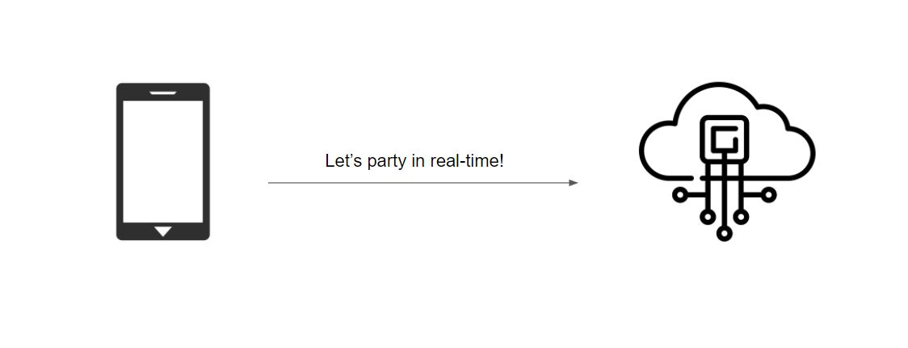

# Real-time Web Application with ASP.NET Core SignalR
In this post, we’ll see how to create applications for both *streaming* and *receiving* data with **ASP.NET Core SignalR**. On certain interval a fixed amount of data will be updated and send to the client taking leverage of the SignalR Streaming capabilities. SignalR automatically picks the most efficient transport - WebSockets, Server Send Events or Long-polling.

When we talk in terms of [WebSockets](https://docs.microsoft.com/en-us/aspnet/core/fundamentals/websockets?view=aspnetcore-5.0) (Putting SSE and Long-polling out of the equation) when the client is real-time connected to the server, whenever something happens the server will knows to send a message over that WebSocket back to the client. With old-school clients and servers the Long-polling transport would be used.

This is how SignalR handles modern clients and servers:


It's like a handshake, the Client and Server agree on what to use and they use it. This is called **process negotiation**.



## SignalR Example
The purpose of this demo is to showcase a financial screen board with Real-time data stream using [ASP.NET Core SignalR](https://dotnet.microsoft.com/apps/aspnet/signalr).

<code-view style="height:700px" 
           data-demos-base-url="{environment:lobDemosBaseUrl}" 
           iframe-src="{environment:lobDemosBaseUrl}/grid-finjs-dock-manager/grid-finjs-dock-manager" alt="Angular Live-data Update Example with a service">
</code-view>

## SignalR Server Configuration

### Create ASP.NET Core App
Let's see how to set up the ASP.NET Core SignalR application. 
In Visual Studio from **File** >> **New project** choose ASP.NET Core Web Application and follow the setup. Feel free to follow [the official Microsoft documentation tutorial](https://docs.microsoft.com/en-us/aspnet/core/tutorials/signalr?view=aspnetcore-3.1&tabs=visual-studio) if you experience any configuration difficulties.


### SignalR Config Setup

Add the following code to the [Startup.cs file](https://github.com/IgniteUI/finjs-web-api/blob/master/WebAPI/Startup.cs):
- Endpoint part of the `Configure` method.

```cs
app.UseEndpoints(endpoints =>
{
    endpoints.MapControllers();
    endpoints.MapHub<StreamHub>("/streamHub");
});
```

- Add SignalR usage to the `ConfigureServices` method.

```cs
services.AddSignalR(options =>
{
    options.EnableDetailedErrors = true;
});
```

The changes above are adding SignalR to the ASP.NET Core dependency injection and routing system.

Now, let's set up additional basic configuration. Open the [properties/launchSettings.json](https://github.com/IgniteUI/finjs-web-api/blob/master/WebAPI/Properties/launchSettings.json#L11) file and modify it accordingly:

```json
"profiles": {
    "WebAPI": {
      "commandName": "Project",
      "launchBrowser": false,
      "applicationUrl": "https://localhost:5001;http://localhost:5000",
      "environmentVariables": {
        "ASPNETCORE_ENVIRONMENT": "Development"
      }
    }
  }
```
Our server-side project will run on `localhost:5001` and the client side will run on `localhost:4200`, so in order to establish communication between those two, we need to enable CORS. Let’s open the [Startup.cs](https://github.com/IgniteUI/finjs-web-api/blob/master/WebAPI/Startup.cs#L31) class and modify it:

```cs
public void ConfigureServices(IServiceCollection services)
    {
        services.AddCors(options => 
        {
            options.AddPolicy("CorsPolicy", builder => builder
            .AllowAnyMethod()
            .AllowAnyHeader()
            .AllowCredentials()
            .WithOrigins("http://localhost:4200"));
        });
    ...

    public void Configure(IApplicationBuilder app, IWebHostEnvironment env)
        {
            ...
            app.UseCors("CorsPolicy");
            ...
```

If you experience a specific problems with enabling Cross-origin resource sharing, check out the [official Microsoft topic](https://docs.microsoft.com/en-us/aspnet/core/signalr/security?view=aspnetcore-5.0#cross-origin-resource-sharing).
### SignalR Hub Setup
Let's start by explaining what is a [SignalR hub?](https://docs.microsoft.com/en-us/aspnet/core/signalr/hubs?view=aspnetcore-5.0#what-is-a-signalr-hub)
The SignalR Hub API enables you to call methods on connected clients from the server. In the server code, you define methods that are called by client. In SignalR there is this concept call *Invocation* - you can actually be calling the hub from the client with a particular method. In the client code, you define methods that are called from the server.

The actual hub lives on the server side. Imagine you have *Clients* and *the Hub* is between all of them. You can say something to all the Clients with `Clients.All.doWork()` by invoking a method on the hub. This will goes to all connected clients. Also, you can communicate with only one client, which is the Caller, because he is the caller of that particular method.


We've created a [StreamHub class](https://github.com/IgniteUI/finjs-web-api/blob/d493f159e0a6f14b5ffea3e893f543f057fdc92a/WebAPI/Models/StreamHub.cs#L9) that inherits the base Hub class, along with *UpdateParameters* method that gets a *Context connection ID* and use it to send back data at certain interval. As you can see we communicate over a unique *ConnectionID* which prevents a streaming intervention from other Clients.

```cs
public async void UpdateParameters(int interval, int volume, bool live = false, bool updateAll = true)
{
    ...
    var connection = Context.ConnectionId;
    var clients = Clients;
    ...
    if (!clientConnections.ContainsKey(connection))
    {
        clientConnections.Add(connection, new TimerManager(async() =>
        {
            ...
            await Send(newDataArray, client, connection);
        }, interval));
    } else
    {
        clientConnections[connection].Stop();
        clientConnections[connection] = new TimerManager(async () =>
        {
            var client = clients.Client(connection);
            ..
            await Send(newDataArray, client, connection);
        }, interval);
    }
    ...
}
```

When the data is ready we transfer it by emitting a `transferdata` event with the help of `SendAsync` Method.

```cs
public async Task Send(FinancialData[] array, IClientProxy client, string connection)
{
    await client.SendAsync("transferdata", array);
}
...

// Called when a connection with the hub is terminated
public override Task OnDisconnectedAsync(Exception exception)
{
    StopTimer();
    clientConnections.Remove(Context.ConnectionId);
    return base.OnDisconnectedAsync(exception);
}
```

Our client application would be listening on the registered events: 

```ts
private registerSignalEvents() {
    this.hubConnection.onclose(() => {
        this.hasRemoteConnection = false;
    });
    this.hubConnection.on('transferdata', (data) => {
        this.data.next(data);
    })
}
```

Public GitHub repository of the [ASP.NET Core Application could be found here](https://github.com/IgniteUI/finjs-web-api).

## Create SignalR Client Library

We will create Angular project in order to consume the SignalR service. 
Github repository with the actual application can be found [here](https://github.com/IgniteUI/igniteui-angular-samples/tree/master/projects/app-lob/src/app/grid-finjs-dock-manager).

First, start by installing SignalR:

```
npm install @microsoft/signalr
```

Keep in mind that we are going to send the HTTP request towards our server, so we need HttpClientModule as well.

Below you will find the [signal-r.service.ts](https://github.com/IgniteUI/igniteui-angular-samples/blob/master/projects/app-lob/src/app/services/signal-r.service.ts#L10) file that handles the hub connection builder.

```ts
export class SignalRService implements OnDestroy {
    public data: BehaviorSubject<any[]>;
    public hasRemoteConnection: boolean;
    private hubConnection: signalR.HubConnection;
    ...

    constructor(private zone: NgZone, private http: HttpClient) {
        this.data = new BehaviorSubject([]);
    }
    ...

    // Start Hub Connection and Register events
    public startConnection = (interval = 500, volume = 1000, live = false,  updateAll = true) => {
        this.hubConnection = new signalR.HubConnectionBuilder()
            .configureLogging(signalR.LogLevel.Trace)
            .withUrl('https://www.infragistics.com/angular-apis/webapi/streamHub')
            .build();
        this.hubConnection
            .start()
            .then(() => {
                ...
                this.registerSignalEvents();
                this.broadcastParams(interval, volume, live, updateAll);
            })
            .catch(() => { ... });
    }

    // Change the broadcast parameters like frequency and data volume
    public broadcastParams = (frequency, volume, live, updateAll = true) => {
        this.hubConnection.invoke('updateparameters', frequency, volume, live, updateAll)
            .then(() => console.log('requestLiveData', volume))
            .catch(err => {
                console.error(err);
            });
    }
    
    // Register events
    private registerSignalEvents() {
        this.hubConnection.onclose(() => {
            this.hasRemoteConnection = false;
        });
        this.hubConnection.on('transferdata', (data) => {
            this.data.next(data);
        })
    }
    ...
```

In your app.component add use the newly created `startConnection` method

```ts
constructor(public dataService: SignalRService) {}
    public ngOnInit() {
        this.dataService.startConnection(this.frequency, this.dataVolume, true, false);
    }
...
```
### Grid data bind

[TODO] Explain the async binding
## Topic Takeaways

If you don’t want to refresh you application, rather just see when the data is updated you should consider ASP.NET Core SignalR. I’d recommend going for streaming content when you think your data is large or if you want some user experience without blocking the client by showing endless spinners.