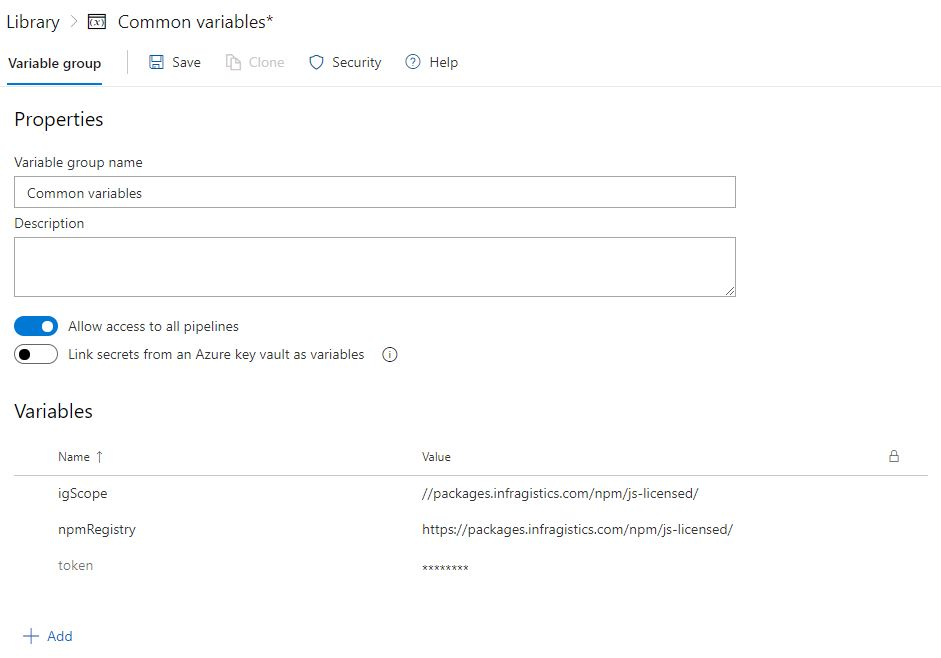
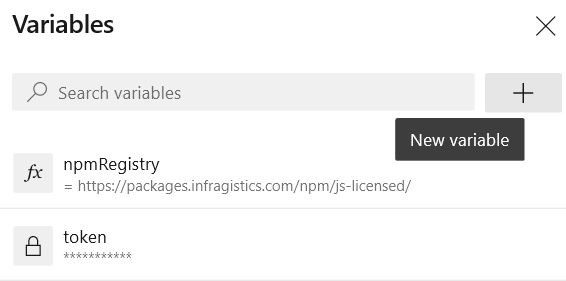

## License Agreements
It is important to know all the [legal terms and conditions](https://www.infragistics.com/legal/license/igultimate-la) regarding the products that you purchase and use.
PLEASE NOTE: We have updated our license terms and subscription model.

If you are building a **commercial product** or your license [has expired](http://www.infragistics.com/renewal), you will need to [acquire a commercial license](https://www.infragistics.com/how-to-buy/product-pricing). This will enable you to use our private npm feed hosted on https://packages.infragistics.com/npm/js-licensed/ for development. There you will find the latest versions of the Ignite UI for Angular packages. If you have a valid commercial license, you can use this private feed and you will have access to the full version of Ignite UI for Angular.

If you are building a **non-commercial product** [contact us](https://www.infragistics.com/about-us/contact-us) and we will provide you with the appropriate license.

## Ignite UI for Angular npm packages - Using the Private npm feed
Npm is the most popular package manager and is also the default one for the runtime environment Node.js. It is highly adopted and is one of the fastest and easiest ways to manage the packages that you depend on in your project. For more information on how npm works, read the official [npm documentation](https://docs.npmjs.com/).

Infragistics Ignite UI for Angular is available as a npm package and you can add it as a dependency to your project in a [`few easy steps`](cli/step-by-step-guide.md). Choosing this approach will not require configuring npm. By installing this package you will start using the [Ignite UI for Angular Trial version](https://www.infragistics.com/products/ignite-ui-angular) of the product.

Infragistics Ignite UI Dock Manager Web Component is available as a separate npm package and by installing it you will start using the [Ignite UI Dock Manager Web Component Trial version](https://www.infragistics.com/products/ignite-ui-angular) of the product.

> More information on how to start using the Ignite UI for Angular npm package can be found in [this topic](getting_started.md#installing-ignite-ui-for-angular) and more information on Ignite UI Dock Manager Web Component can be found [here](../dock-manager-overview.md).

### Upgrading packages using our Angular Schematics or Ignite UI CLI
If Ignite UI for Angular has been added to the project using [`ng add`](./getting_started.md) or the project has been created through our [schematics collection or Ignite UI CLI](./cli-overview.md), you can use our `upgrade-packages` to automatically upgrade your app to using our licensed packages. You project package dependencies will include either `@igniteui/angular-schematics` or `igniteui-cli` and both support the upgrade command.

>[!NOTE]
> As the process changes packages, we recommend that you update your project first before switching to avoid picking up a higher version of Ignite UI Angular and missing on potential update migrations. Follow our [Update Guide](./update_guide.md).

Depending on your project setup, either run the following schematic in your project:
```bash
ng g @igniteui/angular-schematics:upgrade-packages
```
or if using `igniteui-cli`:

```bash
ig upgrade-packages
```
The schematic or command will take care of switching the package dependencies of the project and update source references.
You'll be asked to login to our npm registry if not already setup.

>[!NOTE]
> If your project is using [`yarn`](https://yarnpkg.com/), make sure to run `upgrade-packages` with the `--skip-install` flag and execute `yarn install` after to properly update your `yarn.lock` as the upgrade command currently uses `npm` for the install.


### How to setup your environment to use the private npm feed

#### First you need to setup the private registry and to associate this registry with the Infragistics scope. 

This will allow you to seamlessly use a mix of packages from the public npm registry and the Infragistics private registry. You will be asked to provide the username and the password that you use for logging into your Infragistics account. You should also provide the email that is registered to your Infragistics profile. 

>[!NOTE]
> `npm` is disallowing the use of the `"@"` symbol inside your username as it is considered as being "not safe for the net". Because your username is actually the email that you use for your Infragistics account it always contains the symbol `"@"`. That's why you must escape this limitation by replacing the `"@"` symbol with `"!!"` (two exclamation marks). For example, if your username is `"username@example.com"` when asked about your username you should provide the following input: `"username!!example.com"`.

#### Now, to log in to our private feed using npm, run the adduser command and specify a user account and password:

```cmd
npm adduser --registry=https://packages.infragistics.com/npm/js-licensed/ --scope=@infragistics --always-auth
```

#### After this is done, you will be logged in and you will be able to install the latest versions of the Ignite UI packages into your project:

```cmd
npm uninstall igniteui-angular
npm install @infragistics/igniteui-angular

npm uninstall igniteui-dockmanager
npm install @infragistics/igniteui-dockmanager
```

Have in mind that we have set the Ignite UI for Angular package to be scoped, meaning that no changing the registries is needed if you want to install packages from our private feed and from npmjs.org simultaneously.

#### Some additional changes might have to be made in your project source
If you are upgrading from trial to licensed package and you are not using the automated CLI migrations:
- Add a `paths` mapping in the project `tsconfig.json`.

```typescript
{
  ...
  "compilerOptions": {
    "baseUrl": "./",
    "outDir": "./dist/out-tsc",
    ...
    "paths": {
      "igniteui-angular": ["./node_modules/@infragistics/igniteui-angular"],
      "igniteui-dockmanager": ["./node_modules/@infragistics/igniteui-dockmanager"],
      "igniteui-dockmanager/*": ["./node_modules/@infragistics/igniteui-dockmanager/*"],
    }
	...
}
```
- Add a `stylePreprocessorOptions` mapping to your project `angular.json`

```typescript
{
  "projects": {
    ..
    "prefix": "app",
      "architect": {
        "build": {
          "builder": "@angular-devkit/build-angular:browser",
          "options": {
			...
            "aot": true,
            "stylePreprocessorOptions": {
                "includePaths": [
                    "node_modules/@infragistics"
                ]
            }
            ...
},
```
- remove the `~` sign from your project `sass` imports for `igniteui-angular/lib` source:

```scss
@import "~igniteui-angular/lib/core/styles/themes/index";

// Should be changed to

@import "igniteui-angular/lib/core/styles/themes/index";
```

So, if you've already adopted npm and you have an Ignite UI for Angular license, don't hesitate setting up the Infragistics private feed and boost your productivity, using the full potential of Ignite UI for Angular.


## Access Token Usage

You can also authenticate to our private npm feed using an access token, which you can acquire through your [infragistics.com user account](https://account.infragistics.com/access-tokens). The access token authentication is the preferred alternative when you want to integrate a CI process in a publicly accessible repository, which uses the Ignite UI for Angular licensed packages.

The following information is on how to setup authentication to our private npm registry using an access token in local configuration, Azure Pipelines build procedures and Travis CI build process: 

* Generate a token from https://account.infragistics.com/access-tokens


> Each token is with Base64 encoding.

* Add the following into your [.npmrc](https://docs.npmjs.com/configuring-npm/npmrc.html) file

```cmd
@infragistics:registry=https://packages.infragistics.com/npm/js-licensed/
//packages.infragistics.com/npm/js-licensed/:_auth={YOUR_ACCESS_TOKEN}
//packages.infragistics.com/npm/js-licensed/:username={YOUR_USERNAME}
//packages.infragistics.com/npm/js-licensed/:always-auth=true
```

### Azure Pipelines Configuration
Update the azure-pipelines.yml with the following steps:

```cmd
steps:

- script: npm config set @infragistics:registry $(npmRegistry)
  displayName: 'Npm add registry'

- script: npm config set $(igScope):always-auth=true
  displayName: 'Npm config'

- script: npm config set $(igScope):_auth=$(token)
  displayName: 'Npm config auth'
```

Now we need to add variables for the *npm registry*, *scope* and *token*. There are two ways to do so:

 #### Define Variable Group from the Library page under Pipelines.
 [This article](https://docs.microsoft.com/en-us/azure/devops/pipelines/library/variable-groups?view=azure-devops&tabs=yaml) explains how to use a variable group to store values that you want to control and make available across multiple pipelines.



 #### Define the variables in the Pipeline Settings UI and reference them in your YAML file.

In the most common case, you [set the variables and use them](https://docs.microsoft.com/en-us/azure/devops/pipelines/process/variables?view=azure-devops&tabs=yaml%2Cbatch#set-variables-in-pipeline) within the YAML file.




### Travis CI Configuration
We will follow almost the same approach here, the only difference would be that the configuration will be set on [before_install](https://docs.travis-ci.com/user/job-lifecycle/#the-job-lifecycle)

```cmd
before_install:
- echo "@infragistics:registry=https://packages.infragistics.com/npm/js-licensed/" >> ~/.npmrc
- echo "//packages.infragistics.com/npm/js-licensed/:_auth=$TOKEN" >> ~/.npmrc
- echo "//packages.infragistics.com/npm/js-licensed/:always-auth=true" >> ~/.npmrc
```

The best way to define an environment variable depends on what type of information it will contain, so [you have two options](https://docs.travis-ci.com/user/environment-variables/):

* encrypt it and add it [to your .travis.yml](https://docs.travis-ci.com/user/environment-variables/#defining-encrypted-variables-in-travisyml)
* add it to your [Repository Settings](https://docs.travis-ci.com/user/environment-variables/#defining-variables-in-repository-settings)

### GitHub Actions Configuration

Add the following scripts before the `npm i(ci)` step to your [CI workflow configuration](https://help.github.com/en/actions/language-and-framework-guides/using-nodejs-with-github-actions):

```cmd
- run: echo "@infragistics:registry=$(npmRegistry)" >> ~/.npmrc
- run: echo "$(igScope):always-auth=true" >> ~/.npmrc
- run: echo "$(igScope):_auth=${{ secrets.NPM_TOKEN }}" >> ~/.npmrc
```

Define [*secrets* (encrypted environment variables)](https://help.github.com/en/actions/configuring-and-managing-workflows/creating-and-storing-encrypted-secrets) and use them in the GitHub actions workflow for sensitive information like the access token. 
