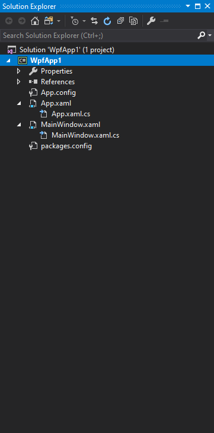
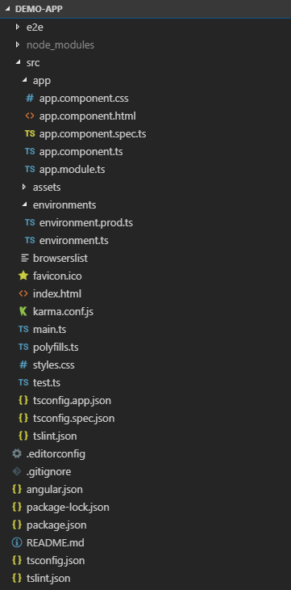

## Create an Angular application

> [!Video https://www.youtube.com/embed/dhjrAPPad54]

Learn how to start creating an Angular application when you migrate from WPF to Angular.

### Prerequisites

In order to start writing Angular applications, you need to install Node.js and the npm package manager. Node.js is a JavaScript runtime environment that executes JavaScript code outside of a browser. In order to get Node.js, go to [nodejs.org](https://nodejs.org). NPM is a package manager similar to the NuGet package manager for .NET. It is installed with Node.js by default. You will also need an IDE. One of the best environments for developing Angular applications is Visual Studio Code. It is free, open source, and runs on every platform. You can get it from [code.visualstudio.com](https://code.visualstudio.com/).

### Create new project

If you are a WPF developer, creating new projects inside of Visual Studio is pretty straight forward. You would just click File -> New Project, select the project type, give it a name and press OK. Since you are going into the Angular world, you want to create a new project inside Visual Studio Code. However, there is no new project option here and that's because Visual Studio Code is file based and not project based. In order to create a new Angular application, we are going to use the command prompt.

First you will need to install the [Angular CLI](https://cli.angular.io/).

```cmd
npm install -g @angular/cli
```

Then navigate in the command prompt to the folder where you want your application to be created and execute the following command:

```cmd
ng new demo-app
```

We are going to be prompted "Would we like to add Angular routing?". For this demo we will choose NO. Next, we are asked which stylesheet format would we like to use. We are going to stick with the basic CSS for now. It takes a few minutes, but eventually the process will complete and your new application will be created on the disk. 

Now we have to change directories to the demo-app folder that was just created and execute a command to open Visual Studio Code.

```cmd
cd demo-app
code .
```

This is going to launch a new instance of Visual Studio Code that contains your Angular application. Now this is the part that is probably the most overwhelming to desktop developers trying to learn Angular - the folder structure.

### Project structure

Let's go ahead and take a look at each of these files and see how they relate to a WPF application. The best way to do that is to compare each project side by side. On the left we have our WPF app. On the right we have our Angular app.




It is important to keep in mind that an Angular application is a single page application (SPA) which means there is only one page in the entire app, and that is your `index.html`. The `index.html` file could be compared to the `App.xaml` of the WPF application. They are both global and everything you put there will show up on every single page of your application. The `index.html` file contains a section `<app-root></app-root>` which is similar to the `StartupUri` of the `App.xaml` file and specifies the first page we want to show when the app launches.

What happens technically is when you navigate to the `index.html`, the `main.ts` JavaScript file invokes which loads the `AppModule`. An Angular application is made up of modules and components. By default, you get a root module and a root component and those are going to be located under the `app` folder. when the `main.ts` file invokes, we're going to bootstrap the `AppModule`, which is in the `app.module.ts` file in the `app` folder.

The app module then bootstraps its own `AppComponent`. The `AppComponent` is defined in the `app.component.ts` file and its selector is set to `app-root`. The `AppComponent` has its html template defined in the `app.component.html` file. Basically the `<app-root></app-root>` section in the `index.html` page will visualize the content of the `app.component.html` file.

The `main.ts` file is similar to the `App.xaml.cs` file since it is something like a code behind. The `app.component.html`, which is the default component shown when the application runs, is very similar to the `MainWindow.xaml` in WPF.

In WPF we have a `packages.config` file which defines all our dependencies to nuget packages while Angular has a `package.json` file which contains the dependencies that your application requires to run. The `package.json` file contains also a section for scripts that you can run in the console when you are testing, starting or building your application.

Let's take a look at the `References` folder. In WPF we have a `References` node in our solution that shows all the references that are added to this project. In an Angular application that is actually going to be the `nodes_module` folder. Coming from WPF, you may be surprised how many dependencies an Angular project has. These are populated by using `npm`.

Unfortunately, here the similarities end. Let us look at some of the other generated files and folders:
- `e2e` - stands for end-to-end testing and contains integration tests or tests with real-world scenarios like a login process.
- `src` - most of the application's code is located here.
- `assets` - contains your images or any other assets.
- `environment` - contains information about your build environments.
- `favicon.ico` - the icon that appears in the browser when you are at your site.
- `karma.conf.js` - contains configuration for the unit tests.
- `style.css` - stylesheet with styles that are global for your application, it is similar to a resource dictionary defined in `App.xaml` in WPF.

### Run the application

Now we are ready to run the application, but in Visual Studio Code you cannot just press F5. We are going to open the Visual Studio Code Terminal by clicking in the menu on Terminal -> New Terminal or by pressing <kbd>Ctrl</kbd> + <kbd>Shift</kbd> + <kbd>`</kbd>. In order to run the application, you should execute the following command:

```cmd
ng serve
```

After the application is started, you can open it in the browser on the following URL http://localhost:4200/. If you want your app to open automatically in the browser, you should use the following command:

```cmd
ng serve -o
```

In this case `-o` stands for open. Another way to start the application is by using the npm commands:

```cmd
npm start
```

You could find those scripts defined in the `package.json` file and modify the `start` command by adding the `-o` option:

```json
  "scripts": {
    "ng": "ng",
    "start": "ng serve -o",
```

Your first Angular application should look like this:


## Additional Resources
* [Desktop to Web: Create your first Angular App](https://www.youtube.com/watch?v=dhjrAPPad54&list=PLG8rj6Rr0BU-AqcJMuwggKy0GMIkjkt3j)
* [Angular Application Shell](https://angular.io/tutorial/toh-pt0)

<div class="divider--half"></div>
Our community is active and always welcoming to new ideas.

* [Ignite UI for Angular **Forums**](https://www.infragistics.com/community/forums/f/ignite-ui-for-angular)
* [Ignite UI for Angular **GitHub**](https://github.com/IgniteUI/igniteui-angular)