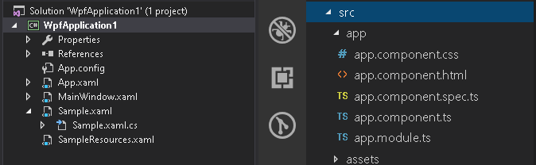
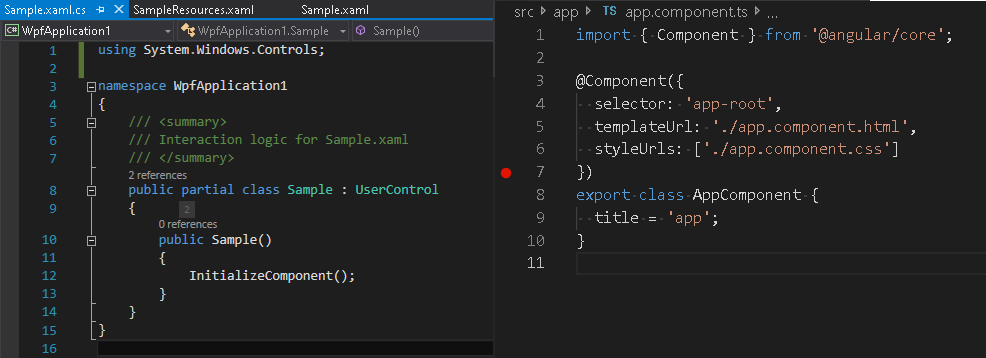
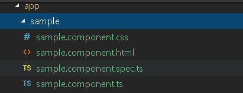

## Create User Interface with an Angular component

> [!Video https://www.youtube.com/embed/z1SZUezpRXY]

When it comes to creating user interface in an Angular application you can use an Angular component to facilitate the process.

Creating a UI in Angular is very similar to how we would create one in WPF. We normally use user controls, represented by the UserControl class. A `UserControl` groups markup and code into a reusable container, allowing the same interface and functionality to be used in several different places. This user control will have a .xaml file for the UI markup and a C# file for the logic, and then it may even have a resource dictionary, which would contain any type of styling information for this user control. While in Angular, we use what's called a `Component`. A component has an html file, which is used for any UI markup. It has a typescript file, which is used for its properties and logic, and then it uses a CSS file for all its styling information. Let's go ahead and see just how similar these two are.



On the left side, we have a WPF application, with a user control called `Sample`. It also has a resource dictionary called `SampleResources` that contains styling information.
On the right side, we have an Angular application with an `AppComponent`. Let's go ahead and compare the Angular app component to that of the sample user control in the WPF application.

Start by opening up the app component typescript file. We can think of this file as the code behind of the component, and the reason we think that way is because if we come over to the WPF and open up the Sample.xaml.cs, the code behind of the `Sample` user control, we can see a lot of similarities.



First we can see that we have a class that we're exporting called `AppComponent`. Now, this AppComponent also has a property in it called title. So within this class we're going to define all the properties, methods and events required for our component to run. This is extremely similar if not the exact same of a user control. We can see that we have a class, in this case called `Sample`, and within this class, we're going to define all the properties, methods and events required for the user control to function.

Next, let’s move up a few lines in the typescript file and look at this little weird syntax with the little `@` symbol and then Component. This is actually called a decorator. This decorator is telling Angular how we're going to treat this class that we're exporting. In this case, we're going to treat it as a component and because we're treating it as a component, we have to provide some information in the decorator. Before we get to the information, let's first pay some attention to the very top line of the typescript file - `import { Component } from '@angular/core'`. You can think of this as a using statement. Essentially, we are importing the objects that are required for this component to function. In this case, we are importing the `Component` from the `@angular/core` module, so we can actually use the decorator for this component. That is extremely similar to a using statement inside of the code behind of our user control. We use `using` statements inside of C# to locate and use objects within our class that are required for the user control to function.

Now, let's hop back inside of the component decorator.
 - The line of code on line 4, is called a selector. The selector helps us determine how we're going to define these elements in html. This selector is called `app-root`, so if we go ahead and open up the index.html, we could see within the body an element called `app-root`. That element is using the selector defined in the component decorator to define an instance of this component.
 - Next, on line 5, we have what's called a template URL. This is pointing to a file called `app.component.html` - the html file that represents the visual rendering of this component. This is extremely similar to the `Sample.xaml` file of the user control in WPF, where the xaml is the markup that represents how this control is going to render.
 - On line 6, we see the style URLs. The style URL is pointing to a CSS file. This file represents the styling information of the component. So if we open up the `app.component.css` file, we can see that there's no styling information in here, but we can think of the CSS file as a direct mapping to a resource dictionary. The resource dictionary in XAML will contain all the styling information for the user control or elements within the user control, so that it renders according to our design. That is the exact same thing that you would do in CSS.

### Generate a component

Now that we've seen just how similar an Angular component is to a WPF user control, let's create a new component and add it to our application. If you're a desktop developer, in WPF when you want to add a new user control, you simply right click in your project and say **Add > User Control**. Well, of course if you try to do the same thing in Visual Studio Code, you do not have that option. You only have new file, new folder. That means we have to hop into our terminal and use the Angular CLI to generate our component. So let's toggle a terminal by typing `Control + Backtick`. In the terminal we just type **NG G** for generate, **C** for component, and then provide a name for our component, e.g. `sample`.

```cmd
ng g c sample
```

When the command completes, you'll notice a number of things have happened. First, we have a new folder with the same name we have given to our component. We also have four new files - an html file, a SPEC file, a typescript file, and a CSS file. We also made an update to the `app.module.ts` file.



Look at the `sample` folder which contains our newly created component. We can see that all three files that are required for a component are there plus this extra SPEC file. This is actually a test file which we do not need for this article, so we're not going to bother with it now. We also made a modification to the app.module.ts, in which it added the sample component to the `declarations` section of our NgModule.
> [!NOTE]
> This is important - whenever a new component is created, it must be declared in the declarations section of the NG module. This section essentially says what components belong to this module.

Let's go back to our `sample.component.ts` file. It looks very similar to the `app.component.ts` file we covered above. In this case we have our import statement where we're importing our component. We have our component decorator where we are defining our selector as `app-sample`. We have our template URL as `sample.component.html` and we have our style URL  `sample.component.css`.

Let's go ahead and open up the html file where we can see a paragraph stating `sample works!`. We want to see this when we start the application so let's go to the app.component.html. We will delete most of the initial markup except for the title, and just add `<app-sample></app-sample>`.
```html
<div style="text-align:center">
  <h1>
    Welcome to {{ title }}!
  </h1>
  <app-sample></app-sample>
</div>
```

### Run the application

By typing `npm start` in the terminal, it will compile and build our application and launch it inside the browser. If all went well, our application should be running in the browser. We have `welcome to app` - the markup from the app component and then `sample works!`. This is the markup from our sample component that we just added.
Let's now change our sample component a little by changing the text to 'This sample works very well!'.
```html
<p>
  This sample works very well!
</p>
```
Once we save and check the browser, we will see that we are indeed editing the html that is responsible for rendering the sample component.
If we want to style our component, we need to look at our style URL. So let's open up our `sample.component.css` file and make the paragraph tag color red.
```css
p {
    color: red;
}
```
Once we save that and open up the browser, we should see that the styling in the CSS file has been applied to our sample component.

## Additional Resources
* [Desktop to Web: Create your UI with Angular components](https://www.youtube.com/watch?v=z1SZUezpRXY&t)
* [Angular Introduction to Components](https://angular.io/guide/architecture-components)

<div class="divider--half"></div>
Our community is active and always welcoming to new ideas.

* [Ignite UI for Angular **Forums**](https://www.infragistics.com/community/forums/f/ignite-ui-for-angular)
* [Ignite UI for Angular **GitHub**](https://github.com/IgniteUI/igniteui-angular)


