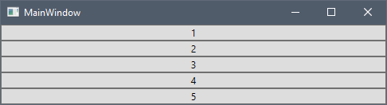
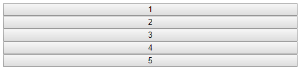
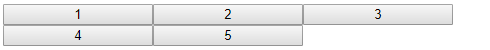
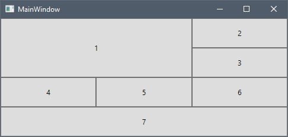
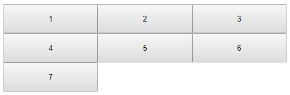
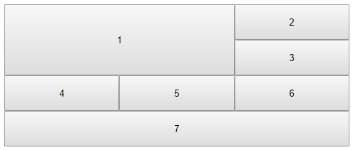

## Page Layout

In WPF, in order to layout the elements in your application, you need to put them inside a [`Panel`](https://docs.microsoft.com/en-us/dotnet/api/system.windows.controls.panel?view=netframework-4.8). The panel is a container element that controls the arrangement of its child elements. In Angular, in order to customize the page layout and its child elements, you have to use CSS. Let us go through some of the most popular panels in WPF and see how we can achieve similar layout with CSS.

### StackPanel

The [`StackPanel`](https://docs.microsoft.com/en-us/dotnet/api/system.windows.controls.stackpanel?view=netframework-4.8) arranges its child elements into a single line that can be oriented horizontally or vertically. Let us add several buttons in a StackPanel and see how they look like in WPF:

```xml
<StackPanel>
    <Button>1</Button>
    <Button>2</Button>
    <Button>3</Button>
    <Button>4</Button>
    <Button>5</Button>
</StackPanel>
```



If we want to achieve similar layout in Angular, we may use CSS Flexbox layout. The Flexible Box Layout Module is a powerful mechanism which allows designing a flexible responsive layout structure. In order to use the Flexbox layout, we have to define a container which has its [`display`](https://www.w3schools.com/cssref/pr_class_display.asp) property set to `flex`. Also in order to stack the items vertically, we have to set the [`flex-direction`](https://www.w3schools.com/cssref/css3_pr_flex-direction.asp) property to `column`.

```html
<div class="flex-container">
    <button>1</button>
    <button>2</button>
    <button>3</button>
    <button>4</button>
    <button>5</button>
</div>
```

```css
.flex-container {
    display: flex;
    flex-flow: column;
}
```

Here is the final result in the browser:



The default value of the [`flex-direction`](https://www.w3schools.com/cssref/css3_pr_flex-direction.asp) property is `row`, which is equivalent to a StackPanel with Horizontal orientation in WPF. The flexbox also supports `row-reverse` and `column-reverse` directions which stack the items right to left and bottom to top respectively.

### WrapPanel

The [`WrapPanel`](https://docs.microsoft.com/en-us/dotnet/api/system.windows.controls.wrappanel?view=netframework-4.8) positions child elements in sequential position from left to right, breaking content to the next line at the edge of the containing box. Subsequent ordering happens sequentially from top to bottom or right to left, depending on the value of the Orientation property. Let us add several buttons in a WrapPanel and see how they look like in WPF:

```xml
<WrapPanel>
    <WrapPanel.Resources>
        <Style TargetType="Button">
            <Setter Property="Width" Value="150"></Setter>
        </Style>
    </WrapPanel.Resources>
    <Button>1</Button>
    <Button>2</Button>
    <Button>3</Button>
    <Button>4</Button>
    <Button>5</Button>
</WrapPanel>
```


In order to achieve similar result in Angular, we will use the Flexbox layout again. As in the case with StackPanel, we have to set the [`display`](https://www.w3schools.com/cssref/pr_class_display.asp) property to `flex`, but we also have to set the [`flex-wrap`](https://www.w3schools.com/cssref/css3_pr_flex-wrap.asp) property to `wrap`.

```html
<div class="flex-container">
    <button>1</button>
    <button>2</button>
    <button>3</button>
    <button>4</button>
    <button>5</button>
</div>
```

```css
.flex-container {
    display: flex;
    flex-wrap: wrap;
}

button {
    width: 150px;
}
```

Here is the final result in the browser:



If you want to achieve a result similar to a WrapPanel with Orientation="Vertical", you have to set the [`flex-direction`](https://www.w3schools.com/cssref/css3_pr_flex-direction.asp) property to `column`. The [`flex-flow`](https://www.w3schools.com/cssref/css3_pr_flex-flow.asp) property is a shorthand property for setting both the `flex-direction` and `flex-wrap` properties. 

```css
.flex-container {
    display: flex;
    flex-flow: row wrap;
}
```

The flexbox supports some more CSS properties for aligning the items. You can learn more about them in this [tutorial](https://www.w3schools.com/css/css3_flexbox.asp).

### Grid

The [`Grid`](https://docs.microsoft.com/en-us/dotnet/api/system.windows.controls.grid?view=netframework-4.8) defines a flexible grid area consisting of columns and rows. Let us add several buttons in a Grid and see how they look like in WPF:

```xml
<Grid>
    <Grid.ColumnDefinitions>
        <ColumnDefinition />
        <ColumnDefinition />
        <ColumnDefinition />
    </Grid.ColumnDefinitions>
    <Grid.RowDefinitions>
        <RowDefinition Height="50" />
        <RowDefinition Height="50" />
        <RowDefinition Height="50" />
        <RowDefinition Height="50" />
    </Grid.RowDefinitions>
    <Button Grid.RowSpan="2" Grid.ColumnSpan="2">1</Button>
    <Button Grid.Column="2">2</Button>
    <Button Grid.Row="1" Grid.Column="2">3</Button>
    <Button Grid.Row="2">4</Button>
    <Button Grid.Row="2" Grid.Column="1">5</Button>
    <Button Grid.Row="2" Grid.Column="2">6</Button>
    <Button Grid.Row="3" Grid.ColumnSpan="3">7</Button>
</Grid>
```



In Angular, we could use the CSS Grid Layout Module, which offers a grid-based layout system, with rows and columns. In order to use the Grid layout, we have to define a container which has its [`display`](https://www.w3schools.com/cssref/pr_class_display.asp) property set to `grid` or `inline-grid`.

```html
<div class="grid-container">
    <button class="button1">1</button>
    <button>2</button>
    <button>3</button>
    <button>4</button>
    <button>5</button>
    <button>6</button>
    <button class="button7">7</button>
</div>
```

```css
.grid-container {
    display: grid;
}
```

> [!NOTE]
> The CSS Grid Layout is [not supported](https://caniuse.com/#feat=css-grid) in older browsers like Internet Explorer 11.

Now let us define the columns of the grid using the [`grid-template-columns`](https://www.w3schools.com/cssref/pr_grid-template-columns.asp) property.

```css
.grid-container {
    display: grid;
    grid-template-columns: auto auto auto;
}
```

We have defined three columns with width `auto`, which means they would have the same width. If you want to distribute the available space proportionally similar to the star sizing in WPF, you could use the flex sizing unit `fr` in CSS. The following code snippet defines two columns, the first one would receive one times the available space, while the second one would receive two times the available space:

```css
.grid-container {
    display: grid;
    grid-template-columns: 1fr 2fr;
}
```

Now we will add the rows with height of 50px each using the [`grid-template-rows`](https://www.w3schools.com/cssref/pr_grid-template-columns.asp) property.

```css
.grid-container {
    display: grid;
    grid-template-columns: auto auto auto;
    grid-template-rows: 50px 50px 50px 50px;
}
```

If we open the application now it looks like this:



You could see one important difference between the WPF and CSS grids. In WPF the default value of Grid.Row and Grid.Column is 0, while the CSS grid layout automatically assigns the next available row and column to its children.

Now let us apply the column and row spans to the first and seventh buttons. We will use the [`grid-row`](https://www.w3schools.com/cssref/pr_grid-row.asp) and [`grid-column`](https://www.w3schools.com/cssref/pr_grid-column.asp) properties for that purpose.

```css
.button1 {
    grid-column: 1 / 3;
    grid-row: 1 / 3;
}

.button7 {
    grid-column: 1 / span 3;
}
```

First we specify the start row/column, then after the `/` symbol, we could specify either the end row/column or how many rows/columns the item should span. Unlike WPF, the CSS grid column numbering is not zero-based and the first row/column is 1.

Here is the full CSS and the final result in the browser:

```css
.grid-container {
    display: grid;
    grid-template-columns: auto auto auto;
    grid-template-rows: 50px 50px 50px 50px;
}

.button1 {
    grid-column: 1 / 3;
    grid-row: 1 / 3;
}

.button7 {
    grid-column: 1 / span 3;
}
```



The `grid-row` and `grid-column` properties are shorthand properties for the [`grid-row-start`](https://www.w3schools.com/cssref/pr_grid-row-start.asp), [`grid-row-end`](https://www.w3schools.com/cssref/pr_grid-row-end.asp), [`grid-column-start`](https://www.w3schools.com/cssref/pr_grid-column-start.asp) and [`grid-column-end`](https://www.w3schools.com/cssref/pr_grid-column-end.asp) properties. You could learn more about the CSS Grid container and item properties in the tutorials in the **Additional Resources** section.

## Additional Resources
* [CSS Flexbox](https://www.w3schools.com/css/css3_flexbox.asp)
* [CSS Grid Intro](https://www.w3schools.com/css/css_grid.asp)
* [CSS Grid Container](https://www.w3schools.com/css/css_grid_container.asp)
* [CSS Grid Item](https://www.w3schools.com/css/css_grid_item.asp)

<div class="divider--half"></div>
Our community is active and always welcoming to new ideas.

* [Ignite UI for Angular **Forums**](https://www.infragistics.com/community/forums/f/ignite-ui-for-angular)
* [Ignite UI for Angular **GitHub**](https://github.com/IgniteUI/igniteui-angular)