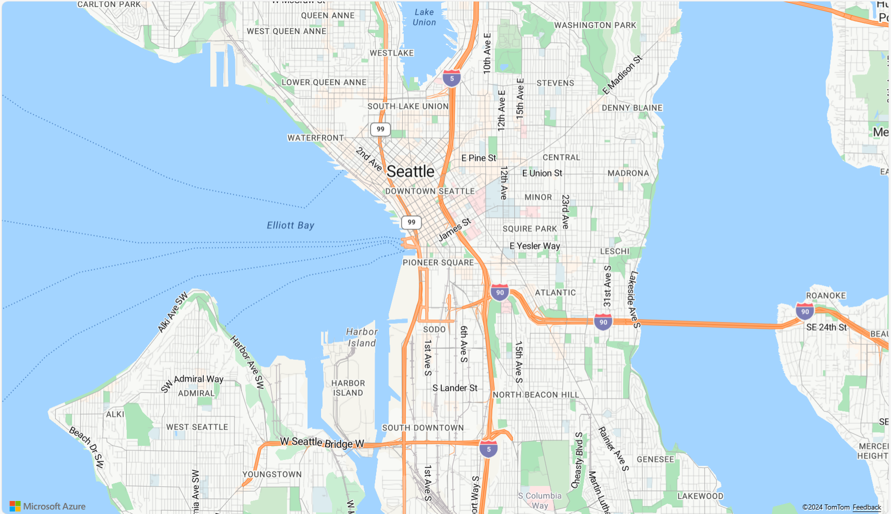

# Angular Imagery from Azure Maps <label class="badge badge--preview">PREVIEW</label>

The Angular [`IgxAzureMapsImagery`]({environment:dvApiBaseUrl}/products/ignite-ui-angular/api/docs/typescript/latest/classes/igniteui_angular_maps.igxazuremapsimagery.html) is geographic imagery mapping service provided by Microsoft®. It provides several styles of geographic imagery tiles of the world. This geographic imagery service is accessible directly on the <a href="https://azure.microsoft.com/en-us/products/azure-maps" target="_blank">www.azure.microsoft.com</a> web site. The Ignite UI for Angular map component can display geographic imagery from Azure Maps in the map’s background content using the [`IgxAzureMapsImagery`]({environment:dvApiBaseUrl}/products/ignite-ui-angular/api/docs/typescript/latest/classes/igniteui_angular_maps.igxazuremapsimagery.html) class.

## Angular Displaying Imagery from Azure Maps - Overview



<div class="divider--half"></div>

<code-view style="height: 600px" alt="Angular Displaying Imagery from Azure Maps Example"
           data-demos-base-url="{environment:dvDemosBaseUrl}"
                    iframe-src="{environment:dvDemosBaseUrl}/maps/geo-map/display-azure-imagery"
                                                 github-src="maps/geo-map/display-azure-imagery">
</code-view>


## Angular Displaying Imagery from Azure Maps - Code Example

The following code snippet shows how to display geographic imagery tiles from Azure Maps in Angular [`IgxGeographicMapComponent`]({environment:dvApiBaseUrl}/products/ignite-ui-angular/api/docs/typescript/latest/classes/igniteui_angular_maps.igxgeographicmapcomponent.html) using [`IgxAzureMapsImagery`]({environment:dvApiBaseUrl}/products/ignite-ui-angular/api/docs/typescript/latest/classes/igniteui_angular_maps.igxazuremapsimagery.html) class.

```html
<igx-geographic-map #map
    width="100%"
    height="100%"
    zoomable="true" >
</igx-geographic-map>
```

```ts
import { IgxGeographicMapComponent } from 'igniteui-angular-maps';
import { IgxAzureMapsImagery } from 'igniteui-angular-maps';
// ...
const tileSource = new IgxAzureMapsImagery();
tileSource.apiKey = "YOUR_Azure_MAPS_API_KEY";
tileSource.imageryStyle = AzureMapsImageryStyle.Satellite; // or
tileSource.imageryStyle = AzureMapsImageryStyle.TerraOverlay; // or
tileSource.imageryStyle = AzureMapsImageryStyle.Road; //or Traffic & Weather etc.

this.map.backgroundContent = tileSource;
```

## Angular Overlaying Imagery from Azure Maps - Overview

When working with the [`IgxGeographicTileSeriesComponent`]({environment:dvApiBaseUrl}/products/ignite-ui-angular/api/docs/typescript/latest/classes/igniteui_angular_maps.igxgeographictileseriescomponent.html), you can combine **overlays** (traffic, weather, labels) on top of a **base map style** such as eg. **Satellite**, **Road**, or **DarkGrey**. Using **TerraOverlay** with eg. **Satellite** to visualize terrain.

- **Base Styles**: Satellite, Road, Terra, and DarkGrey provide the core background tiles.
- **Overlay Styles**: Traffic and Weather imagery (e.g., `TrafficRelativeOverlay`, `WeatherRadarOverlay`) are designed to be layered on top of a base style by assigning them to a tile series.
- **Hybrid Styles**: Variants like `HybridRoadOverlay` and `HybridDarkGreyOverlay` already combine a base style with overlays (labels, roads, etc.), so you don’t need to manage multiple layers manually.

This design allows you to build richer maps, for example:

- Displaying **Satellite imagery** with a **TrafficOverlay** to highlight congestion on real-world images.
- Using **Terra** with **WeatherRadarOverlay** to visualize terrain with precipitation.
- Applying **DarkGrey** with **LabelsRoadOverlay** for a dashboard-friendly, contrast-heavy view.


<div class="divider--half"></div>

## Angular Overlaying Imagery from Azure Maps - Code Example

The following code snippet shows how to display geographic imagery tiles on top of a background imagery joining eg. traffic with a dark grey map for the Angular [`IgxGeographicMapComponent`]({environment:dvApiBaseUrl}/products/ignite-ui-angular/api/docs/typescript/latest/classes/igniteui_angular_maps.igxgeographicmapcomponent.html) using [`IgxAzureMapsImagery`]({environment:dvApiBaseUrl}/products/ignite-ui-angular/api/docs/typescript/latest/classes/igniteui_angular_maps.igxazuremapsimagery.html) and [`IgxGeographicTileSeriesComponent`]({environment:dvApiBaseUrl}/products/ignite-ui-angular/api/docs/typescript/latest/classes/igniteui_angular_maps.igxgeographictileseriescomponent.html) classes.

```html
<igx-geographic-map #map height="100%" width="100%" zoomable="true">
  <igx-geographic-tile-series #tileSeries></igx-geographic-tile-series>
</igx-geographic-map>
```

```ts
export class AppComponent implements AfterViewInit {
  @ViewChild('map', { static: true }) public map!: IgxGeographicMapComponent;
  @ViewChild('tileSeries', { static: true }) public tileSeries!: IgxGeographicTileSeriesComponent;

  public azureImagery!: IgxAzureMapsImagery;
  public azureKey: string = "<YOUR_KEY_HERE>";

  ngAfterViewInit(): void {
    // Update TileSeries
    const overlay = new IgxAzureMapsImagery();
    overlay.apiKey = this.azureKey;
    overlay.imageryStyle = AzureMapsImageryStyle.TrafficAbsoluteOverlay;
    this.tileSeries.tileImagery = overlay;

    // Update Map Background
    this.azureImagery = new IgxAzureMapsImagery();
    this.azureImagery.apiKey = this.azureKey;
    this.azureImagery.imageryStyle = AzureMapsImageryStyle.DarkGrey;
    this.map.backgroundContent = this.azureImagery;
  }
}
```

## Properties

The following table summarizes properties of the [`IgxAzureMapsImagery`]({environment:dvApiBaseUrl}/products/ignite-ui-angular/api/docs/typescript/latest/classes/igniteui_angular_maps.igxazuremapsimagery.html) class:

| Property Name  | Property Type   | Description   |
|----------------|-----------------|---------------|
|[`apiKey`]({environment:dvApiBaseUrl}/products/ignite-ui-angular/api/docs/typescript/latest/classes/igniteui_angular_maps.igxazuremapsimagery.html#apiKey)|string|Represents the property for setting an API key required for the Azure Maps imagery service. You must obtain this key from the <a href="https://azure.microsoft.com/en-us/products/azure-maps" target="_blank">azure.microsoft.com</a> website.|
|[`imageryStyle`]({environment:dvApiBaseUrl}/products/ignite-ui-angular/api/docs/typescript/latest/classes/igniteui_angular_maps.igxazuremapsimagery.html#imageryStyle)|[`AzureMapsImageryStyle`]({environment:dvApiBaseUrl}/products/ignite-ui-angular/api/docs/typescript/latest/enums/igniteui_angular_maps.azuremapsimagerystyle.html)|Represents the property for setting the Azure Maps imagery tiles map style. This property can be set to the following [`AzureMapsImageryStyle`]({environment:dvApiBaseUrl}/products/ignite-ui-angular/api/docs/typescript/latest/enums/igniteui_angular_maps.azuremapsimagerystyle.html) enumeration values:<ul><li>Satellite - Specifies the Satellite map style without road or labels overlay</li><li>Road - Specifies the Aerial map style with road and labels overlay</li><li>DarkGrey - Specifies a dark grey basemap style for contrast and highlighting overlays</li><li>TerraOverlay - Specifies a terrain map style with shaded relief to highlight elevation and landscape features</li><li>LabelsRoadOverlay - One of several overlays of city labels without an aerial overlay</li><li>HybridRoadOverlay - Satellite background combined with road and label overlays</li><li>HybridDarkGreyOverlay - Satellite background combined with dark grey label overlays</li><li>LabelsDarkGreyOverlay - One of several overlays of city labels over a dark grey basemap</li><li>TrafficDelayOverlay - Displays traffic delays and congestion areas in real time</li><li>TrafficAbsoluteOverlay - Displays current traffic speeds as absolute values</li><li>TrafficReducedOverlay - Displays reduced traffic flow with light-based visualization</li><li>TrafficRelativeOverlay - Displays traffic speeds relative to normal conditions</li><li>TrafficRelativeDarkOverlay - Displays traffic speeds relative to normal conditions over a dark basemap for enhanced contrast</li><li>WeatherRadarOverlay - Displays near real-time radar imagery of precipitation</li><li>WeatherInfraredOverlay - Displays infrared satellite imagery of cloud cover</li></ul>

## API References

- [`AzureMapsImageryStyle`]({environment:dvApiBaseUrl}/products/ignite-ui-angular/api/docs/typescript/latest/enums/igniteui_angular_maps.azuremapsimagerystyle.html)
- [`IgxAzureMapsImagery`]({environment:dvApiBaseUrl}/products/ignite-ui-angular/api/docs/typescript/latest/classes/igniteui_angular_maps.igxazuremapsimagery.html)
- [`IgxGeographicMapComponent`]({environment:dvApiBaseUrl}/products/ignite-ui-angular/api/docs/typescript/latest/classes/igniteui_angular_maps.igxgeographicmapcomponent.html)
