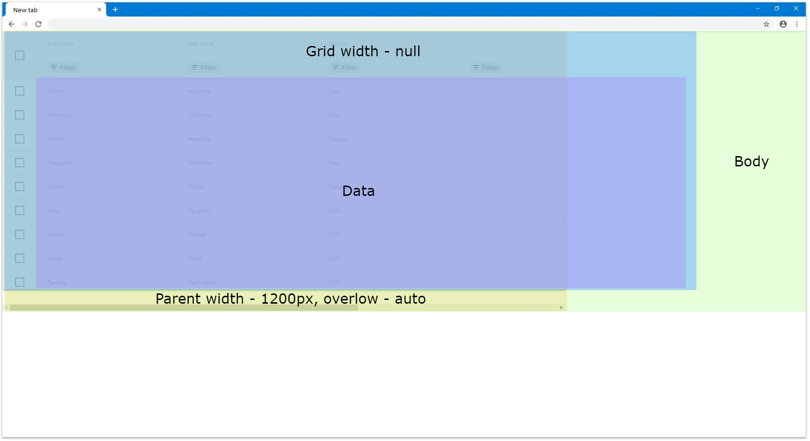
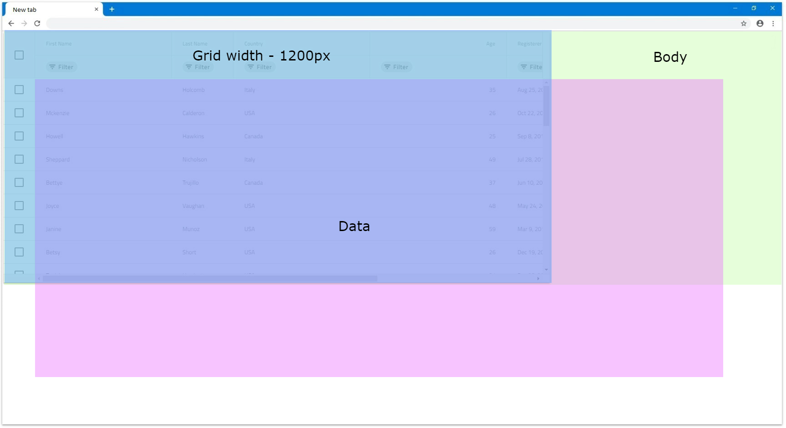
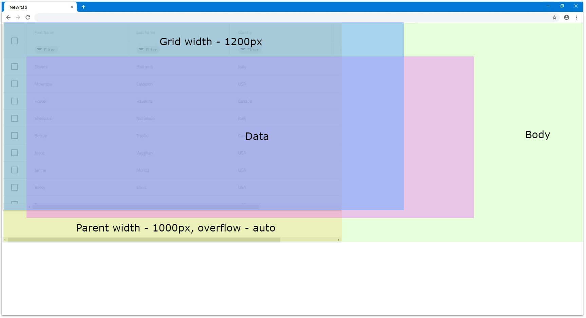
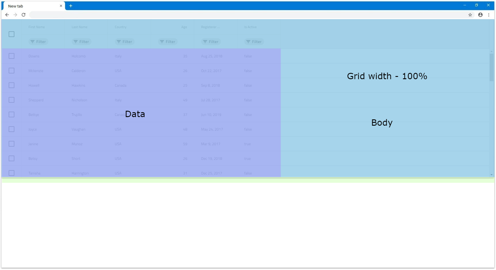
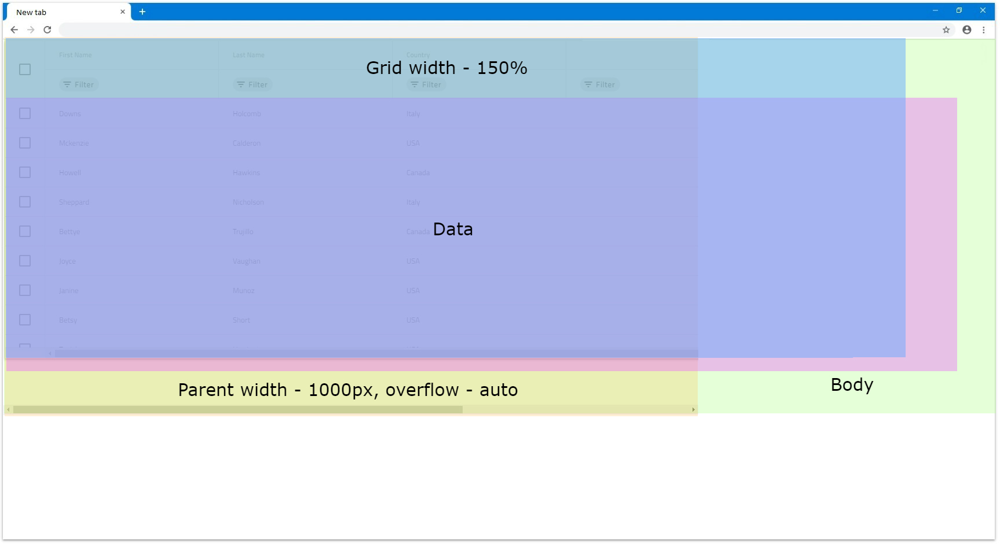
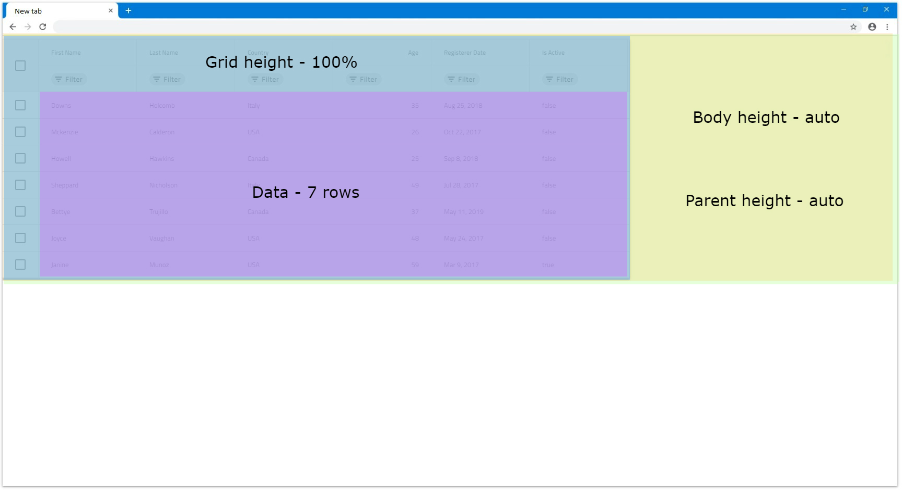
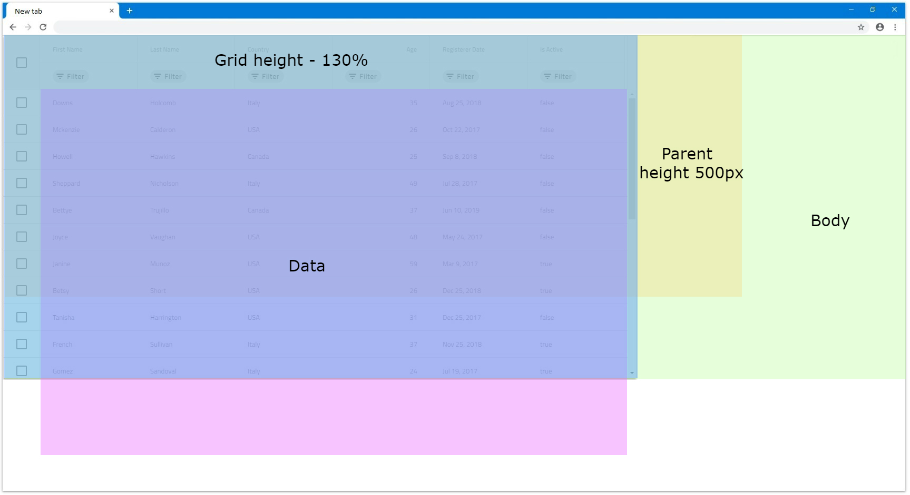
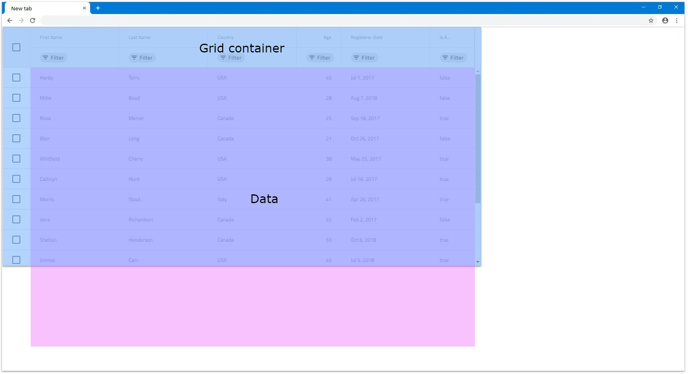
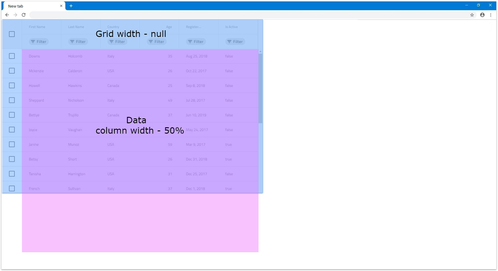

@@if (igxName === 'IgxGrid') {
---
title:  Angular Grid Sizing | Ignite UI for Angular | infragistics 
_description: Understand how the Angular grid sizing works and learn how to use the width and height in order to accommodate the different scenarios that users can have.
_keywords: angular grid sizing, igniteui for angular, infragistics
---
}
@@if (igxName === 'IgxTreeGrid') {
---
title:  Angular Tree Grid Sizing | Ignite UI for Angular | infragistics 
_description: Understand how the Angular grid sizing works and learn how to use the width and height in order to accommodate the different scenarios that users can have.
_keywords: angular grid sizing, igniteui for angular, infragistics
_canonicalLink: grid/sizing
---
}
@@if (igxName === 'IgxHierarchicalGrid') {
---
title:  Angular Hierarchical Grid Sizing | Ignite UI for Angular | infragistics 
_description: Understand how the Angular grid sizing works and learn how to use the width and height in order to accommodate the different scenarios that users can have.
_keywords:  angular grid sizing, igniteui for angular, infragistics
_canonicalLink: grid/sizing
---
}

# Grid Sizing Overview

There are many different ways to size the [**@@igxName**]({environment:angularApiUrl}/classes/@@igTypeDoc.html) in order to accommodate a lot of scenarios that the users can have. While some are straight forward, others might be more complex and that is why we will take each one and look into them in more depth. We will go through setting `width` and `height` separately since there are some differences e.g. when using percentages for each.

When it comes to border and padding size for the [**@@igxName**]({environment:angularApiUrl}/classes/@@igTypeDoc.html), they are taken into its width/height size calculations or also known as [Border box](https://developer.mozilla.org/en-US/docs/Web/CSS/box-sizing) sizing. It is applied in all scenarios.

> [!Note]
> If the Border box sizing is overridden by the user we cannot guarantee that the [**@@igxName**]({environment:angularApiUrl}/classes/@@igTypeDoc.html) will size correctly.

## Width

If the `width` input does not have value assigned, its default value is `100%` and the [**@@igxName**]({environment:angularApiUrl}/classes/@@igTypeDoc.html) tries to fill the available space. You can check how the grid reacts to it in the `Percentages` section.

> [!Note]
> Setting manually the `width` style of the [**@@igxName**]({environment:angularApiUrl}/classes/@@igTypeDoc.html) itself will result in an unexpected behavior.

### Null

The grid's `width` can accepts value of `null`, which when set, renders all columns in the DOM. The grid sizes accordingly so there is no grid horizontal scrollbar since column virtualization is not applied.

* If there are 6 columns and none of them has width defined, the grid will have `width` of `816px`, because each column by default have assigned `width` of `136px` in this scenario. Same will happen if the columns have `width` in percentages. If vertical scrollbar is rendered or there are features that render additional columns their width will be added also.

    

* If there are 6 columns with column width set to `200px` they will fit in our window and all will be visible:

    

* If there are more columns or ones with bigger width that go out of the browser's view, they will all still render. Let's have the same amount of columns but each with column width of `300px`. Since they don't all fit in the browser view area, it will create a scrollbar natively. The next example displays this exact scenario:

    

* If the grid has a parent element of any sort and it doesn't have any overflow set, it will still render all columns visible. Otherwise if the parent element has overflow `auto` or `scroll`, a scrollbar for that parent element will be rendered natively. The parent has bigger height for easier visualization in the following example.

    

> [!Note]
> Due to this behavior, if the grid data contains too many columns, it might have significant impact on the browser performance, since all columns would be rendered without virtualization.

### Pixels

When the [**@@igxName**]({environment:angularApiUrl}/classes/@@igTypeDoc.html) `width` input is set to pixels it will set the whole grid size to that value and it will be static. It will not react to any browser resizing or changes in the DOM, although this is not the case for the grid content:

* When width is set in pixels in order for the grid to render horizontal scrollbar, its content width needs to exceed the specified grid `width`. Let's, for example, have the combined width of the columns exceed `1200px`. In this case a horizontal scrollbar will be rendered.

    

* For scenarios where the grid has a parent element, it depends on the parent styling if it will render scrollbar or not. Everything else related to the grid itself is still retained. If the parent element width is smaller than the grid's width and has overflow style set to `auto` or `scroll`, it will render scrollbar natively. For example, if the parent has `width` set to `1000px` and the [**@@igxName**]({environment:angularApiUrl}/classes/@@igTypeDoc.html) `width` is still `1200px`, it will look similar to the following illustrations:

    
    

### Percentages

When the `width` of the [**@@igxName**]({environment:angularApiUrl}/classes/@@igTypeDoc.html) is set to percentages it will size the grid according to the parent element's width. If the parent element does not have width specified the [**@@igxName**]({environment:angularApiUrl}/classes/@@igTypeDoc.html) will size relative to the browser window.

* For example, if we set the grid `width` input to `100%` and there is no parent element it will fill 100% of the available width of the browser window. If it is resized the grid will resize as well accordingly.

    

* If we set grid's width to `100%` and there is a parent element that has specific width of `1200px`, this will mean that the grid will size relative to that element and his final width will be `1200px`.

    

* If we have a parent element with `width` of `1000px` and have the grid's `width` set to `150%`, the calculated grid width will be `1500px`. In this case the grid will still render fully visible but if we set `overflow: auto` of the parent, that parent will render scrollbar on its own.

    
    

## Height

By default if no height is defined for the [**@@igxName**]({environment:angularApiUrl}/classes/@@igTypeDoc.html), it will be set to `100%`. You can check how the grid reacts depending on the DOM structure in the `Percentages` section.

> [!Note]
> Setting manually the `height` style of the [**@@igxName**]({environment:angularApiUrl}/classes/@@igTypeDoc.html) itself will result in an unexpected behavior.

### Null

The [**@@igxName**]({environment:angularApiUrl}/classes/@@igTypeDoc.html) `height` input can accept `null` value, which when set, displays all rows with no scrollbar no matter how many they are. In this case, there is no vertical virtualization since the grid renders all rows anyway.

* If we have data with 14 rows in this case the grid will render all 14 of them and size the grid so all are visible without any empty space inside the grid.

    

* If we have 24 rows instead, the grid will still render all rows but since they are too many, they exceed the browser boundaries. That's why the browser itself will render vertical scrollbar by default so the user can scroll down to the rest of the rows.

    

* If there is a parent element with defined `height`, the grid will still render all rows and not be affected. Let's say the parent has `height` of `650px`. If he has `overflow` set to `auto` or `scroll`, it will render a vertical scrollbar but the grid will still be unaffected:

    
    

> [!Note]
> Due to this behavior, if the grid data contains too many rows, it might have significant impact on the browser performance, since all rows would be rendered without virtualization.

### Pixels

Setting the [**@@igxName**]({environment:angularApiUrl}/classes/@@igTypeDoc.html) `height` in pixels is more straightforward since the grid will size to that specific size in all occasions similarly to how `width` is set in pixels.

* If we set, for example, the height `500px` with 4 rows for our data the grid will sit to that size and since 4 rows are not enough to fill the visible area it is expected to have some empty area.

    

* If the number of rows exceeds the visible area of the grid when `height` is set to pixels a vertical scrollbar will be rendered. For example, a grid with `500px` height set and 14 rows will be rendered the following way:

    

* If there is a parent element with `height` defined, unless it has `overflow` set to `auto` or `scroll`, the grid will still be fully visible. Otherwise it will render a scrollbar.

    
    

### Percentages

When the `height` input is set to percentages the [**@@igxName**]({environment:angularApiUrl}/classes/@@igTypeDoc.html) will size based on the parent element height. If the parent element has its `height` set in pixels or percentages, the grid will size relative to the size of the parent.

When the parent element does not have defined height, the browser does not assign height to it initially and sizes it based on its children and their size. That is why there is no way for the grid to know what base height to use in order to apply percentage sizing based on it. For this reason, it will render a maximum of 10 rows and if they are more rows, a vertical scrollbar will be rendered. Otherwise, the grid will fit to number of rendered rows. We will look in this scenario in more detail in the next examples.

Let's have `width` set to `1200px` and the parent element not having any size applied to it:

* If there are less than 10 rows the grid will try to fit all rows in the `visible area without having an empty space between the last row and the bottom of the visible area. For example, let's have the grid data to consist of 7 rows. The grid will render all 7 rows without vertical scrollbar and without empty space inside the grid.

    

* If there are more than 10 rows a vertical scrollbar will be rendered for the rest of the rows and only 10 rows can be visible at any time. In the next example only the row number is increased to 14.

    

* If we set the parent element height to `800px` and the [**@@igxName**]({environment:angularApiUrl}/classes/@@igTypeDoc.html) to `100%` height this means that the grid will be sized to 100 percentages of `800px`.

    

* If the [**@@igxName**]({environment:angularApiUrl}/classes/@@igTypeDoc.html) `height` is set to a number bigger than `100%` and the parent element has height, for the parent to render scrollbar it again needs to have `overflow` set to `auto` or `scroll`. Otherwise the grid will be fully visibly and size relative to the parent size.

    
    

* If we want the grid to be sized to `100%` from the browser window we would need to set both `body` and parent grid element heights to `100%`. In this case, the parent element can be sized and the grid will size accordingly if the browser is resized.

    

## Column Sizing

Depending on the grid size itself, the columns inside it can also be sized differently that could result in scenarios where the grid renders horizontal scrollbar or not.  Columns can have width set in pixels, percentages or autosized when nothing is set. We will take a deeper look regarding these scenarios in this section.

### Default

By default when a column doesn't have a specified width it will try to autosize, so that it fills if any empty space is available in the grid view area. Autosized columns have minimum width of `136px`, so if the area available is less than `136px` for that column, it will default to that size.

When the grid is resized in these scenarios, the column width is also updated to reflect the changes, so it fills any new empty space available.

* If a column does not have specified `width` and the [**@@igxName**]({environment:angularApiUrl}/classes/@@igTypeDoc.html) has `width` set to `null`, it will be sized to the minimum of `136px`. This means that for a grid with `width` `null` and 6 columns that don't have width, each column will be sized to `136px`.

    

* When there are multiple autosized columns they will divide the available space between each other equally. This means that if we have 6 columns and there is empty area of `1200px`, each will size to `200px`.

    

* If there is available empty space, so that each autosized column will be less than `136px`, all autosized columns will default to `136px` and the grid will render horizontal scrollbar. In the next example let's have 12 autosized columns and the grid `width` set to `1000px`.

    

* If a column does not have `width` specified, but all other columns have either `width` in pixels or percentages, that column will try to also fill the available space. For example, if we don't have width set to the first column and all other 5 have `width` of `100px`, the first will fill the rest.

    

* Same applies if multiple columns does not have `width` specified, all will divide the available space between each other equally. In the next illustration the first column has `width` set to `100px`.

    

> [!Note]
> Feature columns like Row Selector checkbox column and etc. fill additional space that is taken into account when autosizing columns.

### Pixels

When columns have set specific `width` in pixels, they stick to that size, unless they are resized manually. Since the combined `width` of the columns is static, it can be less than the [**@@igxName**]({environment:angularApiUrl}/classes/@@igTypeDoc.html) `width` or exceed it.

* If the combined `width` of all columns is less than the [**@@igxName**]({environment:angularApiUrl}/classes/@@igTypeDoc.html) `width`, there would be an empty are inside the grid that the columns wouldn't be able to fill. This is the expected behavior of the [**@@igxName**]({environment:angularApiUrl}/classes/@@igTypeDoc.html). In the next example the columns have `150px` width.

    

* If the combined `width` of all columns is bigger than the actual [**@@igxName**]({environment:angularApiUrl}/classes/@@igTypeDoc.html) `width`, a horizontal scrollbar will be rendered. In the next example each of the 6 columns have width of `300px` and grid has width of `1200px`, which means that the columns combined have excess of `600px` that goes out of bounds.

    

### Percentages

When columns have set `width` in percentages, their size is calculated relatively to the grid size. It is similar to how width in pixels works, but provides also responsiveness to the columns which means that when the grid is resized, the columns also will resize accordingly.

* If the combined width of all columns is less than `100%`, similarly to when in pixels, there could be an empty area of the grid that the columns do not cover.

    

* If the combined width is exactly `100%`, the columns will fill all available space of the grid.

    

* If the combined width exceeds `100%` in order for the user to be able to see the columns out of view, a horizontal scrollbar is rendered.

    

* If columns are set in percentages and the grid `width` is set to `null`, it would apply`width` of `136px` to each column. That is because the columns cannot be sized relatively to the grid, since it doesn't have `width` itself and relies on its content to be sized when its `width` is `null`. In the following example all 6 columns have `width` set to `50%`:

    

@@if (igxName === 'IgxHierarchicalGrid') {
---
## Child Grid Sizing

Because the [**@@igxName**]({environment:angularApiUrl}/classes/@@igTypeDoc.html) usually contains children, they can also have their `width` and `height` specified, in order to accommodate different scenarios. Since the children are defined using `row island` template, this means that all children in the same level and island will have the same `width` and `height` property applied to them. 

### Width

The `width` for the children does not behave much different than the [**@@igxName**]({environment:angularApiUrl}/classes/@@igTypeDoc.html) itself, since each child grid is instance of [**@@igxName**]({environment:angularApiUrl}/classes/@@igTypeDoc.html) as well.

The only difference is that the user cannot change the parent element of the child grid. That's why when the `width` is set to percentages, the `100%` width allocated for the child is smaller than the parent grid `width`. This is so that it is easier to distinguish when it is expanded. The following image displays the default child grid sizes, since it defaults to `100%` width.

### Height

The `height` of each child in the [**@@igxName**]({environment:angularApiUrl}/classes/@@igTypeDoc.html) behaves also similarly to the `height` of the root level grid.

The difference is that for the child grid, when `height` is set to percentages, it behaves as if the parent element has unset height. This means that in this scenario, the grid will render maximum of 10 rows. When the number of rows in the data is less than 10, the grid will size the view area to fit all the rows. If the data has more rows, a vertical scrollbar will be rendered and the view area will be sized to 10 rows height.

---
}

## API References

* [@@igxNameComponent API]({environment:angularApiUrl}/classes/@@igTypeDoc.html)
@@if (igxName !== 'IgxTreeGrid') {* [IgxGridRowComponent API]({environment:angularApiUrl}/classes/igxgridrowcomponent.html)}@@if (igxName === 'IgxTreeGrid') {* [IgxTreeGridRowComponent API]({environment:angularApiUrl}/classes/igxtreegridrowcomponent.html)}
* [@@igxNameComponent Styles]({environment:sassApiUrl}/index.html#function-igx-grid-theme)

## Additional Resources

* [@@igComponent overview](@@igMainTopic.md)
* [Virtualization and Performance](virtualization.md)

Our community is active and always welcoming to new ideas.

* [Ignite UI for Angular **Forums**](https://www.infragistics.com/community/forums/f/ignite-ui-for-angular)
* [Ignite UI for Angular **GitHub**](https://github.com/IgniteUI/igniteui-angular)