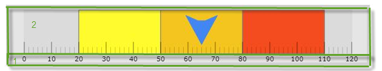
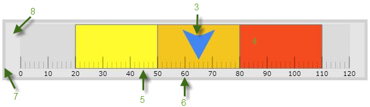

## Linear Gauge

In Ignite UI for Angular, use the Linear Gauge component to see a simple display of a value compared against a scale and one or more ranges.

### Demo

<div class="sample-container" style="height: 550px">
    <iframe id="linear-gauge-sample-iframe" src='{environment:demosBaseUrl}/linear-gauge-sample' width="100%" height="100%" seamless frameBorder="0" onload="onSampleIframeContentLoaded(this);"></iframe>
</div>
<div>
    <button data-localize="stackblitz" class="stackblitz-btn"   data-iframe-id="linear-gauge-sample-iframe" data-demos-base-url="{environment:demosBaseUrl}">View on StackBlitz
    </button>
</div>

<div class="divider--half"></div>

The features of the linear gauge component include configurable orientation and direction, configurable visual elements, and more. The component has also a built-in support for animated transitions.

### Dependencies
The linear gauge exported as an `NgModule`, you need to import the _IgxLinearGaugeModule_ inside your `AppModule`:

```typescript
// app.module.ts
import { IgxLinearGaugeModule } from 'ignite-angular-gauges/ES5/igx-linear-gauge-module';

@NgModule({
    imports: [
        ...
        IgxLinearGaugeModule,
        ...
    ]
})
export class AppModule {}
```

<div class="divider--half"></div>

### Usage

The following code demonstrates how create a linear gauge containing a needle and three comparative ranges on the scale.

```html
 <igx-linear-gauge width="70px"
                   height="300px"
                   minimumValue = "5"
                   maximumValue = "55"
                   value = "43">
    <igx-linear-graph-range startValue="0"
                            endValue="15"
                            brush="red"/>
    <igx-linear-graph-range startValue="15"
                            endValue="30"
                            brush="yellow"/>
    <igx-linear-graph-range startValue="30"
                            endValue="55"
                            brush="green"/>        
 </igx-linear-gauge>
```

<div class="divider--half"></div>

## Logical Areas

The user-visible area of the linear gauge component is logically divided into the following areas: Reserved area, and Graph area.


 
Each of the areas serves different purpose related to some of the visual elements of the component.

**Reserved area** (1)

This area spreads:

* Across the scale -
    * In horizontal orientation: the Reserved area begins at the bottom edge of the component and spreads upward as much as the height of the numbering labels is (depending on the size and the other formatting of the font used in the labels)

    * In vertical orientation: the Reserved area begins at the left edge of the component and spreads to the right as much as the width of the numbering labels is (depending on how large the numbers of the measurements of the scale are and the size and the other formatting of the font used in the labels).

The main purpose of the Reserved area is to provide enough space for the numbering labels of the scale at any orientation – horizontal or vertical. The Reserved area automatically re-sizes when the orientation changes in order to accommodate the specific space requirements for displaying the numbering labels in each of the orientations.

**Graph area** (2)  

The area for displaying the needle, the tick marks, the ranges, and, optionally, the numbering labels of the linear gauge. All extent-related properties for these visual elements (except for labels) are measured against its edges. 

Spread of the Graph area:

**Along the scale** – Both the starting and ending positions of the scale are measured against the starting edge of the Graph area (the left edge at horizontal orientation or bottom edge at vertical orientation).

**Across the scale** – the Graph area begins at the edge of the Reserved area (this is the bottom edge of the Graph area at horizontal orientation or its left edge at vertical orientation). The edge of the Graph area that borders with the Reserved area serves as reference point for the extent-related properties of some of the visual elements of the scale (for positioning these elements across the scale).

## Configurable visual elements
The linear gauge component features the following visual elements (See the picture below.)
 
 

**Needle** (3) – This is the primary measure displayed by the component and is visualized as a bar.

**Comparative range(s)** (4) – The ranges are visual elements that highlight a specified range of values on a scale. Their purpose is to visually communicate the qualitative state of the performance bar measure, illustrating at the same times the degree to which it resides within that state.

**Tick marks** (5) –The tick marks serve as a visual division of the scale into intervals in order to increase the readability of the linear gauge.

Major tick marks – The major tick marks are used as primary delimiters on the scale. The frequency they appear at, their extents and style can be controlled by setting the corresponding properties.

Minor tick marks – The minor tick marks represent helper tick marks, which might be used to additionally improve the readability of the scale and can be customized in a way similar to the major ones.

**Scale labels** (6) – The labels indicate the measures on the scale.

**Border** (7) – The line visually delimiting the dimensions of the component.

**Background** (8) – The background on which visual elements is placed is configurable in terms of pattern and color.

