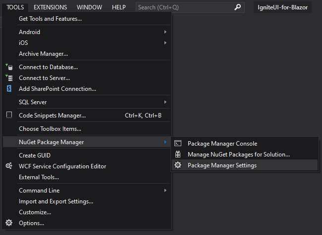

# Infragistics NuGet Feed

Infragistics provides a private NuGet feed for licensed users to consume and add licensed Ignite UI for Blazor NuGet packages to their applications via the NuGet Package Manager.

This topic contains the following sections:

-   Adding the Infragistics NuGet Feed with Visual Studio
-   Adding the Infragistics NuGet Feed with the NuGet CLI

## Adding with Visual Studio

1 - In Visual Studio, select **Tools → NuGet Package Manager → Package Manager Settings**.

2 - In the **Package Sources** section, add a new package source by clicking the **plus icon** in the top right corner of the dialog. 

-   Set the Name to **Infragistics**
-   Set the Source to **<https://packages.infragistics.com/nuget/licensed>**

    Click the **Update** button, and then click **OK** to close the dialog.

> [!Note]
> When adding a NuGet package from this source for the first time, you will be prompted for your Infragistics credentials.

## Adding with the NuGet CLI

1 - Download the [latest Nuget executable](https://dist.nuget.org/win-x86-commandline/latest/nuget.exe). Instruct your browser to save the file to a folder of your choice. The file is not an installer; you won't see anything if you run it directly from the browser.
2 - Open a command prompt in the folder path of the `nuget.exe` file you just downloaded.
3 - Execute the following command

    nuget sources add -name "Infragistics" -source "https://packages.infragistics.com/nuget/licensed" -username "your login email" -password "your password" 

> [!Note]
> The password will be stored encrypted in the NuGet config file and can only be decrypted in the same user context as it was encrypted. The default location of the config file can be found here `%AppData%\NuGet\NuGet.config`
