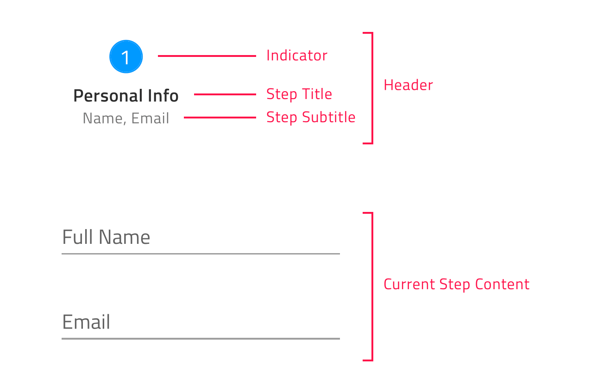

# Angular Stepper Component Overview
The Angular material stepper is a highly customizable component that visualizes content as a process and shows its progress by dividing the content into chronological steps. It usually appears as a vertical or horizontal line. Supported by the Ignite UI for Angular library, the stepper component delivers a wizard-like workflow and multiple features like step validation, styling, orientation, keyboard navigation. 

## Angular Stepper Example
In this Angular Stepper example, you can see how users are enabled to choose their business card and pass trough the process in five logical steps all together - selecting card type, adding business information, filling in personal information, providing shipping details, and confirmation.
Note that the fourth step in our Angular stepper demo gets enabled only if the user ticks the checkbox in the second step, signifying that their mailing address is different from the business physical address.

<code-view style="height: 725px" 
           data-demos-base-url="{environment:demosBaseUrl}" 
           iframe-src="{environment:demosBaseUrl}/layouts/stepper-overview-sample" alt="Angular Stepper Example">
</code-view>

<div class="divider--half"></div>

## How to install Angular Stepper?

### Getting Started with Ignite UI for Angular Stepper

To get started with the Ignite UI for Angular Stepper component, first you need to install Ignite UI for Angular. In an existing Angular application, type the following command:

```cmd
ng add igniteui-angular
```
For a complete introduction to the Ignite UI for Angular, read the [*getting started*](general/getting-started.md) topic.

The next step is to import the `IgxStepperModule` in your app.module file. 

```typescript
// app.module.ts

...
import { IgxStepperModule } from 'igniteui-angular';

@NgModule({
    ...
    imports: [..., IgxStepperModule],
    ...
})
export class AppModule {}
```
Now that you have the Angular Material Stepper module imported, you can start with a basic configuration of the `igx-stepper` and its steps.

## Usage
[IgxStepComponent]({environment:angularApiUrl}/classes/igxstepcomponent.html) is the representation of every step that belongs to the [IgxStepperComponent]({environment:angularApiUrl}/classes/igxsteppercomponent.html). Steps provide [isValid]({environment:angularApiUrl}/classes/igxstepcomponent.html#isValid), [active]({environment:angularApiUrl}/classes/igxstepcomponent.html#active), [optional]({environment:angularApiUrl}/classes/igxstepcomponent.html#optional), [disabled]({environment:angularApiUrl}/classes/igxstepcomponent.html#disabled) and [completed]({environment:angularApiUrl}/classes/igxstepcomponent.html#completed) properties, which give you the ability to configure the step states according to your business requirement.

### Declaring a Stepper
Now that we have the stepper module imported, let’s get started with its configuration.

Steps can be declared using one of the following approaches.
- Iterating through a data set

```html
<igx-stepper>
    <igx-step *ngFor="let step of stepsData" [disabled]=”step.disabled”>
       		<igx-icon igxStepIndicator>
			{{step.indicator}}
		    </igx-icon>

       		<p igxStepTitle>
			{{step.title}}
		    </p>
    </igx-step>
</igx-stepper>
```


- Creating static steps

```html
<igx-stepper>
    <igx-step> 
       <p igxStepTitle>Step 1</p>
    </igx-step>
    <igx-step> 
       <p igxStepTitle>Step 2</p>
    </igx-step>
</igx-stepper>
```
For each step the user has the ability to configure indicator, title, subtitle and content using the [igxStepIndicator]({environment:angularApiUrl}/classes/igxstepindicatordirective.html), [igxStepTitle]({environment:angularApiUrl}/classes/igxsteptitledirective.html), [igxStepSubTitle]({environment:angularApiUrl}/classes/igxstepsubtitledirective.html) and [igxStepContent]({environment:angularApiUrl}/classes/igxstepcontentdirective.html) directives as follows: 

```html
<igx-stepper>
    <igx-step>
       <igx-icon igxStepIndicator>home</igx-icon>
       <p igxStepTitle>Home</p>
       <p igxStepSubTitle>Home Sub Title</p>
       <div igxStepContent>
          ...
       </div>
    </igx-step>
</igx-stepper>
```


### Changing the Stepper Orientation
You can customize the stepper orientation through the exposed [orientation]({environment:angularApiUrl}/classes/igxsteppercomponent.html#orientation) property. It takes a member of the [IgxStepperOrientation]({environment:angularApiUrl}/enums/igxstepperorientation.html) enum - `Horizontal` *(default value)* or `Vertical`.

**Horizontal Stepper Orientation**

`horizontal` is the default value for the `igx-stepper` [orientation]({environment:angularApiUrl}/classes/igxsteppercomponent.html#orientation) property.
When the stepper is horizontally orientated you have the opportunity to determine whether the steps’ content would be displayed above or below the steps’ headers. This could be achieved by setting the [IgxStepperComponent]({environment:angularApiUrl}/classes/igxsteppercomponent.html) [contentTop]({environment:angularApiUrl}/classes/igxsteppercomponent.html#contentTop) boolean property, which default value is `false`. In case it is enabled the steps’ content would be displayed above the steps’ headers.


**Vertical Stepper Orientation**

You can easily switch from the horizontal to vertical layout. In order to change the default orientation you should set the [orientation]({environment:angularApiUrl}/classes/igxsteppercomponent.html#orientation) property to `vertical`.
```html
<igx-stepper [orientation]="'vertical'">
	<igx-step>    
  		…   
	</igx-step>

	<igx-step>    
 		 …   
	</igx-step>
</igx-stepper>
```
The sample below demonstrates how stepper [orientation]({environment:angularApiUrl}/classes/igxsteppercomponent.html#orientation) and [titles position](stepper.md#customizing-the-steps) could be changed runtime. 

<code-view style="height: 528px" 
           data-demos-base-url="{environment:demosBaseUrl}" 
           iframe-src="{environment:demosBaseUrl}/layouts/stepper-label-position-and-orientation-sample" alt="Angular Stepper Orientation Example">
</code-view>

<div class="divider--half"></div>

### Step States 
[IgxStepperComponent]({environment:angularApiUrl}/classes/igxsteppercomponent.html) supports four steps states and each of them apply different styles by default:
- [**active**]({environment:angularApiUrl}/classes/igxstepcomponent.html#active) - Determines whether the step is the currently displayed. By design, if the user does not explicitly set some step’s active attribute to `true`, the initial active step would be the first non-disabled step.
- [**disabled**]({environment:angularApiUrl}/classes/igxstepcomponent.html#disabled) - Determines whether the step is interactable. By default, the disabled attribute of a step is set to `false`.
- [**optional**]({environment:angularApiUrl}/classes/igxstepcomponent.html#optional) - By default, the optional attribute of a step is set to `false`. If validity of a step in linear stepper is not required, then the optional attribute can be enabled in order to be able to move forward independently from the step validity.
- [**completed**]({environment:angularApiUrl}/classes/igxstepcomponent.html#complete) - By default, the completed attribute of a step returns `false`. The user, however, can override this default completed behavior by setting the completed attribute as needed. When step is marked as completed not only that the style of the step header is changed by default, but also the style of the progress line between the completed step and the next one. Both styles could be modified using the exposed [CSS variables]({environment:sassApiUrl}/index.html#function-igx-stepper-theme).

The [IgxStepperComponent]({environment:angularApiUrl}/classes/igxsteppercomponent.html) gives you the opportunity to set validation logic for each step through the two-way bindable [**isValid**]({environment:angularApiUrl}/classes/igxstepcomponent.html#isValid) property. Based on its value it is decided whether the user will have the ability to move forward in linear stepper mode.
By default, the [isValid]({environment:angularApiUrl}/classes/igxstepcomponent.html#isValid) property of a step is set to `true`.

### Linear Stepper

The `igx-stepper` gives you the opportunity to set its steps flow using the [linear]({environment:angularApiUrl}/classes/igxsteppercomponent.html#linear) property. By default, linear is set to `false` and the user is enabled to select any non-disabled step in the [IgxStepperComponent]({environment:angularApiUrl}/classes/igxsteppercomponent.html).

When the [linear]({environment:angularApiUrl}/classes/igxsteppercomponent.html#linear) property is set to `true`, the stepper will require the current non-optional step to be valid before proceeding to the next one. 

If the current non-optional step is not valid you cannot go forward to the next step until you validate the current one. 

> Note: Optional steps validity is not taken into account in order to move forward.

The following example demonstrates how to configure a linear stepper:

<code-view style="height: 430px" 
           data-demos-base-url="{environment:demosBaseUrl}" 
           iframe-src="{environment:demosBaseUrl}/layouts/stepper-linear-sample" alt="Angular Linear Stepper Example">
</code-view>

<div class="divider--half"></div>

### Step Interactions

[IgxStepperComponent]({environment:angularApiUrl}/classes/igxsteppercomponent.html) provides the following API methods for step interactions:
- [**navigateTo**]({environment:angularApiUrl}/classes/igxsteppercomponent.html#navigateTo) – activates the step by given index.
- [**next**]({environment:angularApiUrl}/classes/igxsteppercomponent.html#next) - activates the next non-disabled step.
- [**prev**]({environment:angularApiUrl}/classes/igxsteppercomponent.html#prev) – activates the previous non-disabled step.
- [**reset**]({environment:angularApiUrl}/classes/igxsteppercomponent.html#reset) – resets the stepper to its initial state.

> Note: The reset method would not clear the step`s content. This should be done manually.

### Customizing the Steps

The Ignite UI for Angular Stepper gives you the ability to configure different options for titles, indicators and more.

This could be achieved through the [stepType]({environment:angularApiUrl}/classes/igxsteppercomponent.html#stepType) property of the [IgxStepperComponent]({environment:angularApiUrl}/classes/igxsteppercomponent.html). It takes a member of the [IgxStepType]({environment:angularApiUrl}/enums/igxsteptype.html) enum:
- Full *(default value)*
- Indicator
- Title

**Full**

If titles and subtitles are defined, with this setup both indicators and titles would be rendered.

The user would also have the ability to define the position of the title for the steps, so it could be placed before, after, above or below the step indicator.
The user can configure the title position using the [titlePosition]({environment:angularApiUrl}/classes/igxsteppercomponent.html#titlePosition) property. Both properties take member of [IgxStepperTitlePosition]({environment:angularApiUrl}/enums/igxsteptitleposition.html) enum:
- end
- start
- bottom
- top

When the `igx-stepper` is horizontally orientated, the title position default value is `bottom`.

When the orientation is set to vertical layout the title position by default is `end`.

> Note: [titlePosition]({environment:angularApiUrl}/classes/igxsteppercomponent.html#titlePosition) property is applicable **only** when the stepper [stepType]({environment:angularApiUrl}/classes/igxsteppercomponent.html#stepType) property is set to `full`.

**Indicator**

If you want to display only indicators for the steps, set the [stepType]({environment:angularApiUrl}/classes/igxsteppercomponent.html#stepType) option to `indicator`.

The step indicator supports any content, however, with the restriction that its size would be always **24 pixels**. Having this in mind, we recommend using [IgxIconComponent](icon.md) or [IgxAvatarComponent](avatar.md) as step indicators.

**Title**

If you want to display only titles for the steps, set the [stepType]({environment:angularApiUrl}/classes/igxsteppercomponent.html#stepType) option to `title`.

This way if subtitles are defined, they will also be rendered below the step title.

> Note: This container could be re-templated as per your requirement without any size restrictions. For example, you could an indicator inside with size greater than 24 pixels.

The sample below demonstrates all exposed step types and how they could be changed:

<code-view style="height: 300px" 
           data-demos-base-url="{environment:demosBaseUrl}" 
           iframe-src="{environment:demosBaseUrl}/layouts/stepper-stepstypes-sample" alt="Angular Step Types Example">
</code-view>

<div class="divider--half"></div>

The [IgxStepperComponent]({environment:angularApiUrl}/classes/igxsteppercomponent.html) also allows you to customize the rendered indicators for active, invalid and completed steps. This could be achieved through the [igxStepActiveIndicator]({environment:angularApiUrl}/classes/igxstepactiveindicatordirective.html), [igxStepInvalidIndicator]({environment:angularApiUrl}/classes/igxstepinvalidindicatordirective.html) and [igxStepCompletedIndicator]({environment:angularApiUrl}/classes/igxstepcompletedindicatordirective.html) directives:
```html
<igx-stepper>
    <ng-template igxStepActiveIndicator>
       <igx-icon>edit</igx-icon>
    </ng-template>

    <ng-template igxStepInvalidIndicator>
       <igx-icon>error</igx-icon>
    </ng-template>

    <ng-template igxStepCompletedIndicator>
       <igx-icon>check</igx-icon>
    </ng-template>
    ...
</igx-stepper>
```

> Note: This templates would be applied for all steps with the relevant state.

### Angular Stepper Animations

Angular Stepper Animations provide the end-users a nice experience when interacting with the defined steps. The available animation options differ depending on the orientation of the stepper.

When the stepper is **horizontally orientated**, it is configured to use the `slide` animation by default. It also supports `fade` as an alternative. The animations are configured through the [horizontalAnimationType]({environment:angularApiUrl}/classes/igxsteppercomponent.html#horizontalAnimationType) input.

In **vertically orientated** layout, the animation type could be defined using the [verticalAnimationType]({environment:angularApiUrl}/classes/igxsteppercomponent.html#verticalAnimationType) property. By default, its value is `grow` and the user has the ability to set it to `fade` as well.

Setting `none` to both animation type inputs disables stepper’s animations.

[IgxStepperComponent]({environment:angularApiUrl}/classes/igxsteppercomponent.html) gives you the ability to configure the duration of the transition between the steps. This could be achieved through the [animationDuration]({environment:angularApiUrl}/classes/igxsteppercomponent.html#animationDuration) property, which takes a number as an argument and it is common to both orientations.

## Keyboard Navigation

Keyboard navigation in the Angular Material Stepper provides a rich variety of keyboard interactions to the end-user. This functionality is enabled by default and allows end-users to easily navigate through the steps. 
The [IgxStepperComponent]({environment:angularApiUrl}/classes/igxsteppercomponent.html) navigation is compliant with [W3 accessability standards](https://www.w3.org/TR/wai-aria-practices-1.1/#tabpanel) and convenient to use.

**Key Combinations**

 - <kbd>Tab</kbd> - moves the focus to the next tabbable element
 - <kbd>Shift + Tab</kbd> - moves the focus to the previous tabbable element
 - <kbd>Arrow Down</kbd> - moves the focus to the header of the next accessible step when the `igx-stepper` is **vertically orientated**
 - <kbd>Arrow Up</kbd> - moves the focus to the header of the previous accessible step when the `igx-stepper` is **vertically orientated**
 - <kbd>Arrow Left</kbd> - moves the focus to the header of the previous accessible step in both orientations
 - <kbd>Arrow Right</kbd> - moves the focus to the header of the next accessible step in both orientations
 - <kbd>Home</kbd> - moves the focus to the header of the FIRST enabled step in the `igx-stepper`
 - <kbd>End</kbd> - moves the focus to the header of the LAST enabled step in the `igx-stepper`
 - <kbd>Enter / Space</kbd> - activates the currently focused step
 
 > Note: By design when the user presses the <kbd>Tab</kbd> key over the step header the focus will move to the step content container. In case the container should be skipped the developer should set the content container `[tabIndex]="-1"`.

## Angular Stepper Styling
Using the [Ignite UI for Angular Theming](themes/index.md), we can greatly alter the `igx-stepper` appearance. 

First, in order for us to use the functions exposed by the theme engine, we need to import the `index` file in our style file: 

```scss
@import '~igniteui-angular/lib/core/styles/themes/index';
```

Following the simplest approach, we create a new theme that extends the [igx-stepper-theme]({environment:sassApiUrl}/index.html#function-igx-stepper-theme) and pass the parameters, which we would like to change: 
```scss
$custom-stepper-theme: igx-stepper-theme(
    $current-title-color: #351e65,
    $current-subtitle-color: #5f4691,
    $step-separator-style: "solid"
);

```

### Using CSS Variables

The last step is to include the component's theme.
```scss
:host {
    @include igx-css-vars($custom-stepper-theme);
}
```

### Using Theme Overrides

In order to style components for older browsers, like IE11, we have to use a different approach, since CSS variables are not supported there.

If the component is using the [Emulated](themes/sass/component-themes.md#view-encapsulation) ViewEncapsulation, it is necessary to `penetrate` this encapsulation using `::ng-deep`. To prevent the custom theme to leak into other components, be sure to include the `:host` selector before `::ng-deep`: 
```scss
:host {
    ::ng-deep {
        @include igx-stepper($custom-stepper-theme);    
    }
}
```

### Demo
The sample below demonstrates a simple styling applied through the [Ignite UI for Angular Theming](themes/index.md).

<code-view style="height: 264px" 
           data-demos-base-url="{environment:demosBaseUrl}" 
           iframe-src="{environment:demosBaseUrl}/layouts/stepper-styling-sample" alt="Angular Stepper Styling Example">
</code-view>

<div class="divider--half"></div>

## API Reference
* [IgxStepperComponent]({environment:angularApiUrl}/classes/igxsteppercomponent.html)
* [IgxStepComponent]({environment:angularApiUrl}/classes/igxstepcomponent.html)

## Additional Resources
Our community is active and always welcoming new ideas.

* [Ignite UI for Angular **Forums**](https://www.infragistics.com/community/forums/f/ignite-ui-for-angular)
* [Ignite UI for Angular **GitHub**](https://github.com/IgniteUI/igniteui-angular)

