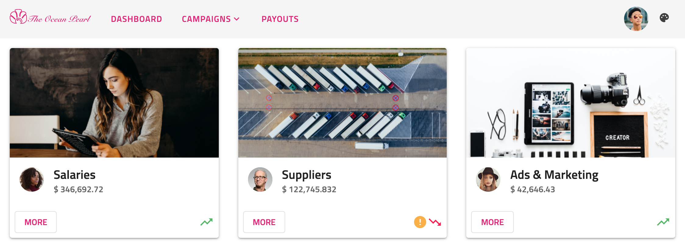
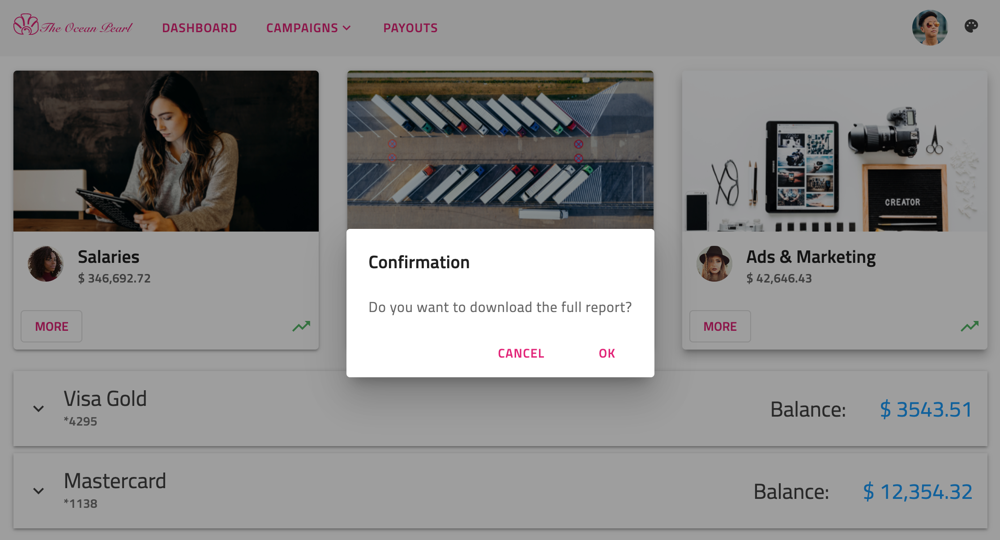
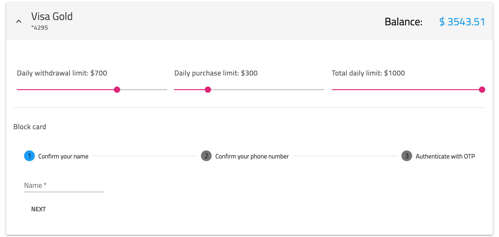
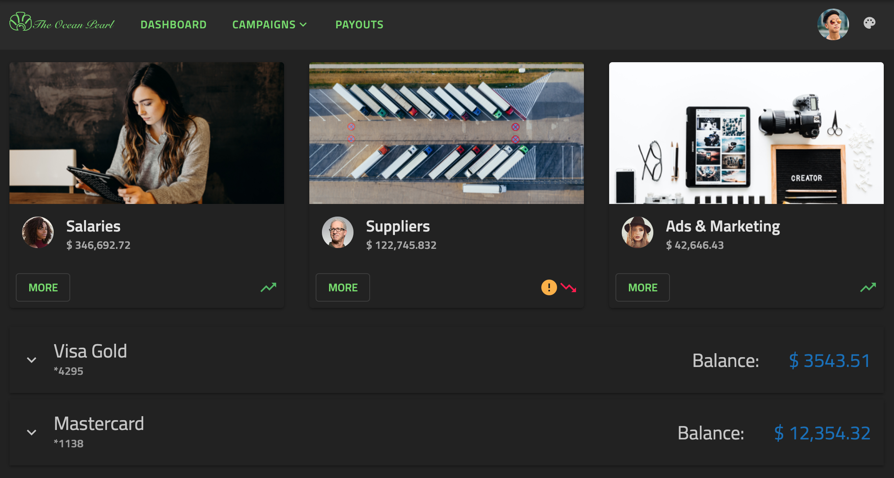

# Angular Material Theming
<p class="highlight">The Ignite UI for Angular theming engine makes it easy to be used together with external components imported from other theming libraries like the [`Angular Material`](https://material.angular.io/) library.</p>
<div class="divider--half"></div>

## Ignite UI and Angular Material Overview

Angular Material is a UI component library for mobile and desktop Angular web applications. It includes several prebuilt themes and a great number of components that are based on the [`Material Design specification`](https://material.io/components). 

The Ignite UI for Angular is a complete set of Material-based UI Widgets, Components & Sketch UI kits and supporting directives for Angular that enables developers to build modern high-performance apps. Our theming engine is easy to use and allows theming granularity on different levels from a single component, multiple components, or the entire suite. Furthermore, it can be used to style components from other theming libraries with very little effort.

The following article demonstrates how to use both Ignite UI and Angular Material components in one application and how to style them to look similar.

## Angular Material Theming Example

<code-view style="height: 1050px" 
           data-demos-base-url="{environment:demosBaseUrl}" 
           iframe-src="{environment:demosBaseUrl}/theming/angular-sample" >
</code-view>

<div class="divider--half"></div>

## Getting Started with Ignite UI and Angular Material

### How to install Angular Material

If you are using Angular CLI and have an existing Angular project, you can add Angular Material with the command below: 

```cmd 
ng add @angular/material
```

Then, you will have to choose one of the prebuilt themes and whether to set up global typography styles and browser animations for Angular Material. Once you're done with this configuration, your application is ready to use the Angular Material components.

You can find more information about using the Angular Material library at their [`official documentation`](https://material.angular.io/guide/getting-started).

### How to install Ignite UI for Angular 

To install the Ignite UI for Angular package along with all of its dependencies, font imports, and styles references, run the following command in your project:

```cmd
ng add igniteui-angular
```

Then, you can use the Ignite UI components by importing their respective modules in your *app.module.ts* file:

```ts
// manually addition of the Igx Avatar component 
import { IgxAvatarModule } from 'igniteui-angular';

@NgModule({
    imports: [
        ...,
        IgxAvatarModule,
        ...
    ]
)}
```

Follow our [`Getting Started`](../../general/getting-started.md) topic for a complete introduction about using Ignite UI for Angular in existing projects. Further information on how to import and use each of our components along with guided examples can be found in the component's documentation.

## Ignite UI and Angular Material components

Let's see how our demo sample is done. It is a mixture of Ignite UI and Angular Material components, styled to fit nicely in one application. The navigation in our example is created using the material [`mat-toolbar`](https://material.angular.io/components/toolbar/overview) together with [`igx-buttons`]({environment:angularApiUrl}/classes/igxbuttondirective.html) and [`igx-avatar`]({environment:angularApiUrl}/classes/igxavatarcomponent.html). The [`menu`](https://material.angular.io/components/menu/overview) under the Campaigns button is also taken from the Angular Material library. Below the nav, we are using the [`igx-card`]({environment:angularApiUrl}/classes/igxcardcomponent.html) component to display some statistics. Within the cards, we have placed multiple items - [`igx-avatars`]({environment:angularApiUrl}/classes/igxavatarcomponent.html) and [`igx-icons`]({environment:angularApiUrl}/classes/igxiconcomponent.html) as well as material [`buttons`](https://material.angular.io/components/button/overview).



Clicking on the `More` buttons, you will see the [`igx-dialog`]({environment:angularApiUrl}/classes/igxdialogcomponent.html):



Next, we have added an [`igx-expansion-panel`]({environment:angularApiUrl}/classes/igxexpansionpanelcomponent.html) showing information about some credit cards. Inside its content, there are [`mat-sliders`](https://material.angular.io/components/slider/overview), an [`igx-divider`]({environment:angularApiUrl}/classes/igxdividerdirective.html) and a [`mat-stepper`](https://material.angular.io/components/stepper/overview) with [`mat-form-fields`](https://material.angular.io/components/form-field/overview).



Finally, we inserted an Ignite UI for Angular [`icon button`]({environment:angularApiUrl}/classes/igxbuttondirective.html) in the top right corner, that changes the theme of the whole app:  



## Styling Angular Components 

To get started with styling components using the Ignite UI theming engine, create an scss file named of your choice that would be the base file for your global theme. We will call this file `_variables.scss`. Next, we need to import the Ignite UI `index` file as well the Angular Material `theming` file:

```scss
// _variables.scss

@import '~igniteui-angular/lib/core/styles/themes/index';
@import "~@angular/material/theming";
``` 

### Color Palettes

Ignite UI for Angular's [`igx-palette`]({environment:sassApiUrl}/index.html#function-igx-palette) function produces a color palette map including three sub-palettes for the `primary`, `secondary` and `grays` shades as well as five additional colors for `info`, `success`, `warn`, `error` and `surface`. For each color variant, our theming engine automatically generates text contrast colors at build-time, that are also included in the palette. Below, you can see the predefined light material palette:

```scss
$igx-light-palette: igx-palette(
    $primary: #09f,
    $secondary: #e41c77
    $info: #1377d5,
    $success: #4eb862,
    $warn: #fbb13c,
    $error: #ff134a,
    $grays: #000,
    $surface: #fff
);
```

Unlike Ignite UI palettes, Angular Material color palette maps include shades for only one color and their corresponding contrast colors. For example, we can see the `$mat-purple` palette: 

```scss
$light-primary-text: white;
$dark-primary-text: rgba(black, 0.87);

$mat-purple: (
  50: #f3e5f5,
  100: #e1bee7,
  ...,
  A700: #aa00ff,
  contrast: (
    50: $dark-primary-text,
    100: $dark-primary-text,
    ...,
    A700: $light-primary-text,
  )
);
```

### Generating Theme Palettes

To define a theme palete, we will have to use material `mat-palette` function which generates a map of hues to colors. In our sample, we want to style Angular Material components with Ignite UI theme therefore we need to transform our `$light-material-palette` according to their structure. 

To achieve this, we are going to create a Sass function with parameters for `$color`, `$saturations` and `$palette` that returns a map of all color variants followed by the contrast colors. The saturations we are using follow the [`Material Design color system`](https://material.io/design/color/the-color-system.html).

```scss
$saturations: (50, 100, 200, 300, 400, 500, 600, 700, 800, 900, A100, A200, A400, A700);

@function material-like-palette(
    $color,
    $saturations,
    $palette,
) {
    $shade: ();
    $contrast: ();
    $result: ();
    @each $saturation in $saturations {
        $shade: map-merge($shade, (
            $saturation: igx-color($palette, $color, $saturation)
        ));
        $contrast: map-merge($contrast, (
            $saturation: igx-color($palette, $color, #{$saturation}-contrast)
        ));
        $result: map-merge($shade, (contrast: $contrast));
    }

    @return $result;
}
```

#### Light Mode

We will define a light primary material theme palette using the `primary` color of the Ignite UI `$igx-light-palette` and our newly created `material-like-palette` function. The result has to be passed as a parameter to the `mat-palette` function which will generate color values for the `default`, `lighter`, `darker` and `text` shades and add them to the palette map:

```scss
$light-palette-primary: mat-palette(
    material-like-palette('primary', $saturations, $igx-light-palette)
);
```

Let's do the same for the light accent palette:

```scss
$light-palette-accent: mat-palette(
    material-like-palette('secondary', $saturations, $igx-light-palette)
);
```

Finally, we are ready to pass the two color palettes to the `mat-light-theme` function which will create an Angular Material theme with colors taken from the Ignite UI material color palette:

```scss
$custom-mat-light-theme: mat-light-theme(
    $light-palette-primary,
    $light-palette-accent
);
```

>[!NOTE]
>Visit our [`palettes with Sass`](../sass/palettes.md) section to discover more about the palettes provided by Ignite UI for Angular and learn how to create a new one.

#### Dark Mode

Following the previous approach, we are going to create material palettes for the dark mode. This time, we are also going to define a custom `igx-palette`: 

```scss
// Custom igx-palette
$custom-dark-palette: igx-palette(
    $primary: #011627,
    $secondary: #72da67,
    $grays: #fff,
    $surface: #222,
);

// Material dark primary palette
$dark-palette-primary: mat-palette(
    material-like-palette('primary', $saturations, $custom-dark-palette)
);
// Material dark accent palette
$dark-palette-accent: mat-palette(
    material-like-palette('secondary', $saturations, $custom-dark-palette)
);
// Material dark theme
$custom-mat-dark-theme: mat-dark-theme(
    $dark-palette-primary,
    $dark-palette-accent
);
```

### Themes

In order to switch between `light` and `dark` mode, we are adding a custom `dark` class which will be changed on button click. In our stylesheet file, we are going to include different color palettes scoped to each class.

Ignite UI for Angular comes with predefined themes inspired by the [Material Design](https://material.io/design). To use them, first, you have to include our `igx-core` mixin and then our built-in theme mixin - [igx-theme]({environment:sassApiUrl}/index.html#mixin-igx-theme). We will also make use of our predefined material palettes - [$light-material-palette]({environment:sassApiUrl}/index.html#variable-light-material-palette) and [$dark-material-palette]({environment:sassApiUrl}/index.html#variable-dark-material-palette).

For the Angular Material components, we need to include their `mat-core` mixin and then the `angular-material-theme` mixin with the aforementioned custom material themes. 

```scss
// Make sure you always include the igx-core mixin first
@include igx-core();

::ng-deep {
    @include mat-core();
    @include igx-theme($igx-light-palette, $legacy-support: true);
    @include angular-material-theme($custom-mat-light-theme);

    .dark {
        @include igx-dark-theme($custom-dark-palette, $legacy-support: true);
        @include angular-material-theme($custom-mat-dark-theme);
    }
}
```

>[!WARNING]
>Be sure to place the above code inside the `::ng-deep` selector to `penetrate` the [`Emulated`](../sass/component-themes.md#view-encapsulation) ViewEncapsulation.


### Generate class

The Angular Material `toolbar` uses CSS classes for its background color. In our sample, we want that color to change according to the selected theme, hence we are going to use the `igx-color-classes` mixin. It will generate CSS class names for all colors for a given property and color palette, with optional prefix and suffix attached to the class name. For the demo, we will include the mixin twice - once for the light mode with the respective `$igx-light-palette` as a first value and second time for the dark mode with the `$custom-dark-palette`:

```scss
:host {
    &.light {
        @include igx-color-classes(
            $palette: $igx-light-palette,
            $prop: 'background',
            $prefix: 'bg'
        );
    }

    &.dark {
        @include igx-color-classes(
            $palette: $custom-dark-palette,
            $prop: "background",
            $prefix: "bg"
        );
    }
}
```

Then, add a CSS class to your navbar component following the pattern "bg - color from the palette - color variant". In our sample app, we are using `bg-grays-100`.

### Angular Components Typography

Ignite UI for Angular exposes four default type scales for each of its themes, which can be used inside the [`igx-typography`]({environment:sassApiUrl}/index.html#mixin-igx-typography) mixin to define the global typography styles of an application. In our example, we are going to apply the material predifined `typeface` and `type-scale` but you can create custom ones if you wish. 

```scss
:host {
    @include igx-typography($font-family: $material-typeface, $type-scale: $material-type-scale);
}
```

To customize the Angular Material typography, we need to use their `mat-typography-config` function. We will override their `$font-family` with the Ignite UI `$material-typeface` and their `$button` styles as follows: 

```scss
$custom-typography: mat-typography-config(
    $font-family: $material-typeface,
    $button: mat-typography-level(14px, $font-weight: 600)
);
```

Then, the typography config has to be passed either to the `mat-core` mixin:

```scss
::ng-deep {
    @include mat-core($custom-typography);
}
```

or to the `angular-material-typography` mixin:

```scss
::ng-deep {
    @include angular-material-typography($custom-typography);
}
```

Check Angular Material [`Typography documentation`](https://material.angular.io/guide/typography) for more detailed information.  

## API References
<div class="divider--half"></div>

* [Light Material Palette]({environment:sassApiUrl}/index.html#variable-light-material-palette)
* [Dark Material Palette]({environment:sassApiUrl}/index.html#variable-dark-material-palette)
* [Light Material Theme]({environment:sassApiUrl}/index.html#mixin-igx-light-theme)
* [Dark Material Theme]({environment:sassApiUrl}/index.html#mixin-igx-dark-theme)
* [Palette Function]({environment:sassApiUrl}/index.html#function-igx-palette)
* [Typography Mixin]({environment:sassApiUrl}/index.html#mixin-igx-typography)

Related topics: 

* [Palettes](../sass/palettes.md)
* [Component Themes](../sass/component-themes.md)
* [Typography](../sass/typography.md)
* [Avatar Component](../../avatar.md)
* [Button Component](../../button.md)
* [Dialog Component](../../dialog.md)
* [Icon Component](../../icon.md)
* [Expansion Panel Component](../../expansion-panel.md)

## Additional Resources
<div class="divider--half"></div>

Our community is active and always welcoming to new ideas.
* [Ignite UI for Angular **Forums**](https://www.infragistics.com/community/forums/f/ignite-ui-for-angular)
* [Ignite UI for Angular **GitHub**](https://github.com/IgniteUI/igniteui-angular)
