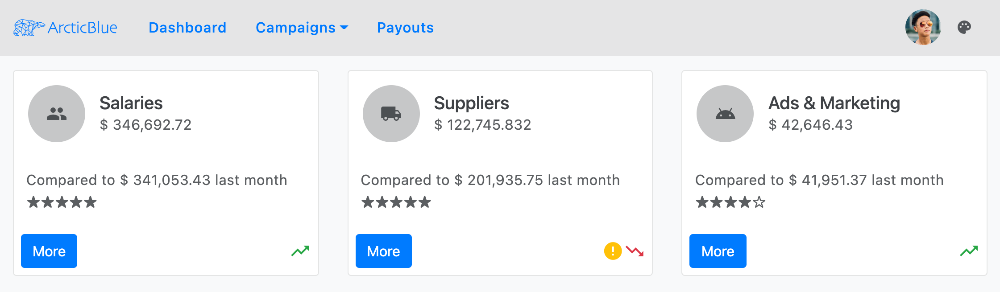
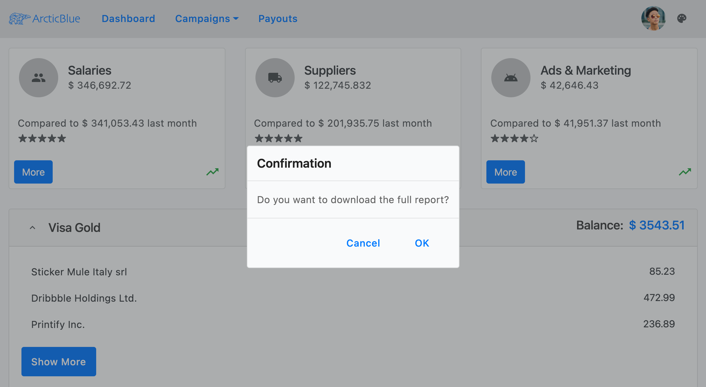
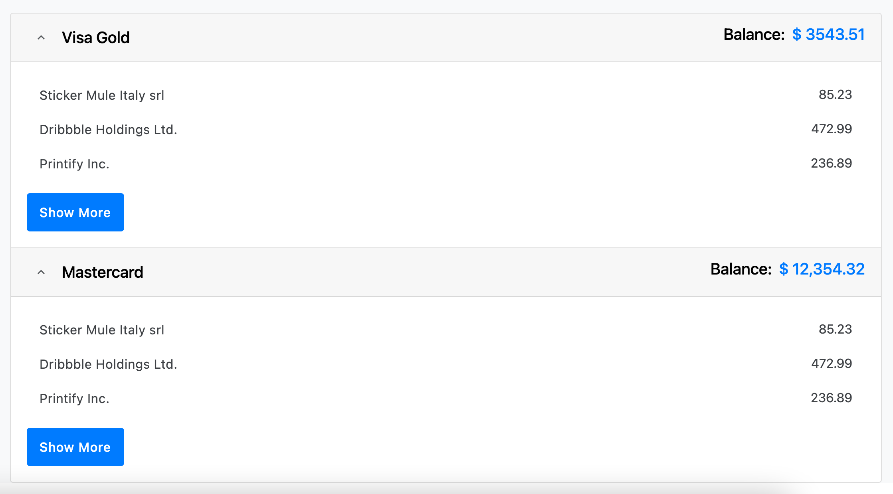
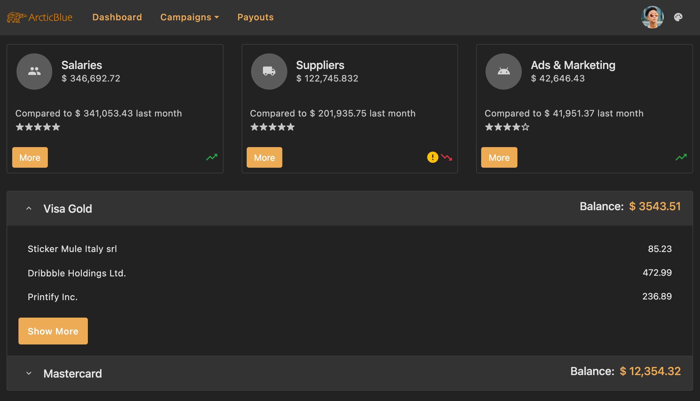

# Bootstrap Theming
<p class="highlight">The Ignite UI for Angular theming engine provides an opportunity to be used in conjunction with other component libraries such as the popular [`NG Bootstrap`](https://ng-bootstrap.github.io/) based on Bootstrap’s markup and CSS.</p>
<div class="divider--half"></div>

## Overview

The Ignite UI for Angular is a complete set of Material-based UI Widgets, Components & Sketch UI kits and supporting directives for Angular that enables developers to build modern high-performance apps. Our theming engine is easy to use and allows theming granularity on different levels from a single component, multiple components, or the entire suite. Therefore, some users want to take advantage of it not only with Ignite UI components but also with other libraries. In this article, we will look through the usage of Ignite UI together with Ng Bootstrap components.

## Demo

<code-view style="height: 1000px" 
           data-demos-base-url="{environment:demosBaseUrl}" 
           iframe-src="{environment:demosBaseUrl}/theming/bootstrap-sample" >
</code-view>

<div class="divider--half"></div>

## Basic Usage

### Add NG Bootstrap

If you are using Angular CLI and have an existing Angular project, you can install NG Bootstrap with the command below: 

```cmd 
ng add @ng-bootstrap/ng-bootstrap
```

Once installed, you have to import the NG Bootstrap main module into your *app.module.ts* file: 

```ts
import {NgbModule} from '@ng-bootstrap/ng-bootstrap';

@NgModule({
    imports: [
        ...,
        NgbModule,
        ...
    ]
)}
```

At this point your applications is ready to use the NG Bootstrap components. You can find more information about using the Bootstrap library at their [`official documentation`](https://ng-bootstrap.github.io/#/getting-started).

### Add Ignite UI for Angular 

To install the Ignite UI for Angular package along with all of its dependencies, font imports, and styles references, run the following command in your project:

```cmd
ng add igniteui-angular
```

Then, you can use the Ignite UI components by importing their respective modules in your *app.module.ts* file:

```ts
// manually addition of the Igx Avatar component 
import { IgxAvatarModule } from 'igniteui-angular';

@NgModule({
    imports: [
        ...,
        IgxAvatarModule,
        ...
    ]
)}
```

Follow our [`Getting Started`](../../general/getting-started.md) topic for a complete introduction about using Ignite UI for Angular in existing projects. Further information on how to import and use each of our components along with guided examples can be found in the component's documentation.

## Components

Let's see how our demo sample is done. It is a mixture of Ignite UI and NG Bootstrap components, styled to fit nicely in one application. The navigation in our example is created using the bootstrap [`navbar`](https://getbootstrap.com/docs/4.0/components/navbar/) together with [`igx-buttons`]({environment:angularApiUrl}/classes/igxbuttondirective.html) and [`igx-avatar`]({environment:angularApiUrl}/classes/igxavatarcomponent.html). The [`dropdown`](https://ng-bootstrap.github.io/#/components/dropdown/examples) under the Campaigns button is also taken from the bootstrap library. Below the nav, we are using the [`igx-card`]({environment:angularApiUrl}/classes/igxcardcomponent.html) component to display some statistics. Within the cards, we have placed multiple items - [`igx-avatars`]({environment:angularApiUrl}/classes/igxavatarcomponent.html) and [`igx-icons`]({environment:angularApiUrl}/classes/igxiconcomponent.html) as well as bootstrap [`buttons`](https://getbootstrap.com/docs/4.0/components/buttons/) and [`ngb-ratings`](https://ng-bootstrap.github.io/#/components/rating/examples). 



Clicking on the `More` buttons, you will see the [`igx-dialog`]({environment:angularApiUrl}/classes/igxdialogcomponent.html):



Next, we have added an [`ngb-accordion`](https://ng-bootstrap.github.io/#/components/accordion/examples) showing information about credit cards. Inside its content, there is an [`igx-list`]({environment:angularApiUrl}/classes/igxlistcomponent.html) and `igx-button`.



Finally, we inserted an Ignite UI for Angular `icon button` in the top right corner, that changes the theme of the whole app:  



## Styling

To get started with styling components using the Ignite UI theming engine, create an scss file named of your choice that would be the base file for your global theme. We will call this file `_variables.scss`. Next, we need to import the `index` file, where all the theme functions and component mixins live: 

```scss
// _variables.scss

@import '~igniteui-angular/lib/core/styles/themes/index';
``` 

### Palettes

The Bootstrap library makes use of a Sass map called [`$theme-colors`](https://getbootstrap.com/docs/4.0/getting-started/theming/#theme-colors) to provide a palette composed of eight colors:

```scss
$theme-colors: (
    "primary":    $primary,
    "secondary":  $secondary,
    "success":    $success,
    "info":       $info,
    "warning":    $warning,
    "danger":     $danger,
    "light":      $light,
    "dark":       $dark
);
```

Ignite UI for Angular's [`igx-palette`]({environment:sassApiUrl}/index.html#function-igx-palette) function generates a color palette map including `primary`, `secondary`, `grays`, `info`, `success`, `warn`, and `error` colors and their color variants. Our predefined bootstrap palette in turn consists of seven colors:

```scss
$bootstrap-palette: igx-palette(
    $primary: #007bff,
    $secondary: #6c757d,
    $info: #17a2b8,
    $success: #28a745,
    $warn: #ffc107,
    $error: #dc3545,
    $surface: #f8f9fa
);
```

As you can see most of the colors in the Bootstrap palette overlap with the colors defined in the Bootstrap palette of Ignite UI for Angular. Hence, we can simply map the Bootstrap theme colors to our light or dark bootstrap palette colors.

First, we are going to define Sass variables that extract values from the [`$light-bootstrap-palette`]({environment:sassApiUrl}/index.html#variable-light-bootstrap-palette):

```scss
// Colors from the Ignite UI light bootstrap color palette
$light-primary: igx-color($light-bootstrap-palette, "primary");
$light-secondary: igx-color($light-bootstrap-palette, "secondary");
$light-success: igx-color($light-bootstrap-palette, "success");
$light-info: igx-color($light-bootstrap-palette, "info");
$light-warning: igx-color($light-bootstrap-palette, "warn");
$light-danger: igx-color($light-bootstrap-palette, "error");
```

After that, we will create a new color palette which will be used for the dark mode of the sample:

```scss
// Defining custom color palette
$custom-dark-palette: igx-palette(
    $primary: #ecaa53,
    $secondary: #011627,
    $grays: #fff,
    $surface: #222
);

// Creating Sass variables for primary and secondary colors
$dark-primary: igx-color($custom-dark-palette, "primary");
$dark-secondary: igx-color($custom-dark-palette, "secondary");
```

>[!NOTE]
>Visit our [`palettes with Sass`](../sass/palettes.md) section to discover more about the palettes provided by Ignite UI for Angular and learn how to create a new one.

### Themes

In order to switch between `light` and `dark` mode, we are adding a custom class to the `host` element which will be changed on button click. In our stylesheet file, we are going to include different color palettes scoped to each class.

#### Light mode

Ignite UI for Angular comes with predefined themes inspired by the [Bootstrap 4](https://getbootstrap.com/) library. To use them, first, you have to include our `igx-core` mixin and then our built-in theme mixin - [igx-bootstrap-light-theme]({environment:sassApiUrl}/index.html#mixin-igx-bootstrap-light-theme). We will also make use of our predefined bootstrap palette - [$light-bootstrap-palette]({environment:sassApiUrl}/index.html#variable-light-bootstrap-palette).

The background color for our application needs to be set explicitly on the host element. In our sample, we want to use the `surface` color of the passed palette.

At this point we have to modify the Bootstrap `$theme-colors` map with the Sass variables we created earlier.

Lastly, we need to import the Bootstrap library - *always import it at the end!*

```scss
// Make sure you always include the igx-core mixin first
@include igx-core();

:host {
    &.light {
        // The background color of the application in light mode
        background: igx-color($light-bootstrap-palette, 'surface');

        ::ng-deep {
            // Applying the igx predefined light bootstrap palette and theme
            @include igx-bootstrap-light-theme($light-bootstrap-palette);

            $theme-colors: (
                "primary": $light-primary,
                "secondary": $light-secondary,
                "success": $light-success,
                "info": $light-info,
                "warning": $light-warning,
                "danger": $light-danger
            );

            // Importing Bootstrap .scss file
            // Make sure you always import it last
            @import "~bootstrap/scss/bootstrap";
        }
    }
}
```

The `light` and `dark` colors from the `$theme-colors` map, which don't have corresponding values in the Ignite UI palettes, can also be replaced with values at our discretion. For instance: 

```scss
$custom-light: igx-color($light-bootstrap-palette, "grays", 100);
$custom-dark: igx-color($light-bootstrap-palette, "grays", 800);

:host {
    &.light {
        ::ng-deep {
            $theme-colors: (
                "light": $custom-light,
                "dark": $custom-dark,
            );
        }
    }
}
```

#### Dark mode

For our dark variant, we are going to use our newly created `$custom-dark-palette`. We have to include it in the `dark` class styles and also modify the `$theme-colors` map with the new values. 

All components in Ignite UI for Angular use colors from the passed palette, therefore they fit nicely in the dark mode without any additional adjustments. However, we have to do some more styling changes for the ng-bootstrap components:

```scss
:host {
    &.dark {
        // The background color of the application in dark mode
        background: igx-color($custom-dark-palette, 'surface');

        ::ng-deep {
            // Applying our custom dark palette 
            @include igx-bootstrap-dark-theme($custom-dark-palette);

            // Overriding ngb-accordion colors with colors from the custom dark palette
            .accordion {
                .card-header {
                    background-color: igx-color($custom-dark-palette, 'grays', 200);
                    color: igx-color($custom-dark-palette, 'grays', 900);
                }

                .card {
                    background-color: igx-color($custom-dark-palette, 'surface');
                    border-color: igx-color($custom-dark-palette, 'grays', 300);
                }
            }

            // Overriding bootstrap dropdown colors with colors from the custom dark palette
            .dropdown .dropdown-menu {
                background-color: igx-color($custom-dark-palette, 'surface');
                border-color: igx-color($custom-dark-palette, 'grays', 300);

                .dropdown-item {
                    color: igx-color($custom-dark-palette, 'grays', 800);

                    &:hover {
                        background-color: igx-color($custom-dark-palette, 'grays', 200);
                    }
                }
            }
            
            // Modifying the bootstrap color map
            $theme-colors: (
                "primary": $dark-primary,
                "secondary": $dark-secondary
            );

            // Importing Bootstrap .scss file
            @import "~bootstrap/scss/bootstrap";
        }
    }
}
```

Once we are done with modifying the `$theme-colors` map, the bootstrap components will already use the colors from the igx `$light-bootstrap-palette` for the light mode, and `$custom-dark-palette` for the dark one.

>[!WARNING]
>Be sure to place the above code inside the `::ng-deep` selector to `penetrate` the [`Emulated`](../sass/component-themes.md#view-encapsulation) ViewEncapsulation.


### Generate class

The bootstrap `navbar` uses CSS classes for its background color. In our sample, we want that color to change according to the selected theme, hence we are going to use the `igx-color-classes` mixin. It will generate CSS class names for all colors for a given property and color palette, with optional prefix and suffix attached to the class name. For the demo, we will include the mixin twice - once for the light mode with the respective `$light-bootstrap-palette` as a first value and second time for the dark mode with the `$custom-dark-palette`:

```scss
:host {
    &.light {
        @include igx-color-classes(
            $palette: $light-bootstrap-palette,
            $prop: 'background',
            $prefix: 'bg'
        );
    }

    &.dark {
        @include igx-color-classes(
            $palette: $custom-dark-palette,
            $prop: 'background',
            $prefix: 'bg'
        );
    }
}
```

Then, add a CSS class to your navbar component following the pattern "bg - color from the palette - color variant". In our sample app, we are using `bg-grays-200`.

### Typography

Ignite UI for Angular exposes four default type scales for each of its themes, which can be used inside the [`igx-typography`]({environment:sassApiUrl}/index.html#mixin-igx-typography) mixin to define the global typography styles of an application. In our example, we are going to apply the bootstrap predifined `typeface` and `type-scale` but you can create custom ones if you wish. 

```scss
:host {
    @include igx-typography($font-family: $bootstrap-typeface, $type-scale: $bootstrap-type-scale);
}
```

## API References
<div class="divider--half"></div>

* [Light Bootstrap Palette]({environment:sassApiUrl}/index.html#variable-light-bootstrap-palette)
* [Dark Bootstrap Palette]({environment:sassApiUrl}/index.html#variable-dark-bootstrap-palette)
* [Light Bootstrap Theme]({environment:sassApiUrl}/index.html#mixin-igx-bootstrap-light-theme)
* [Dark Bootstrap Theme]({environment:sassApiUrl}/index.html#mixin-igx-bootstrap-dark-theme)
* [Palette Function]({environment:sassApiUrl}/index.html#function-igx-palette)
* [Typography Mixin]({environment:sassApiUrl}/index.html#mixin-igx-typography)

Related topics: 

* [Palettes](../sass/palettes.md)
* [Component Themes](../sass/component-themes.md)
* [Typography](../sass/typography.md)
* [Avatar Component](../../avatar.md)
* [Button Component](../../button.md)
* [Dialog Component](../../dialog.md)
* [Icon Component](../../icon.md)
* [List Component](../../list.md)

## Additional Resources
<div class="divider--half"></div>

Our community is active and always welcoming to new ideas.
* [Ignite UI for Angular **Forums**](https://www.infragistics.com/community/forums/f/ignite-ui-for-angular)
* [Ignite UI for Angular **GitHub**](https://github.com/IgniteUI/igniteui-angular)
