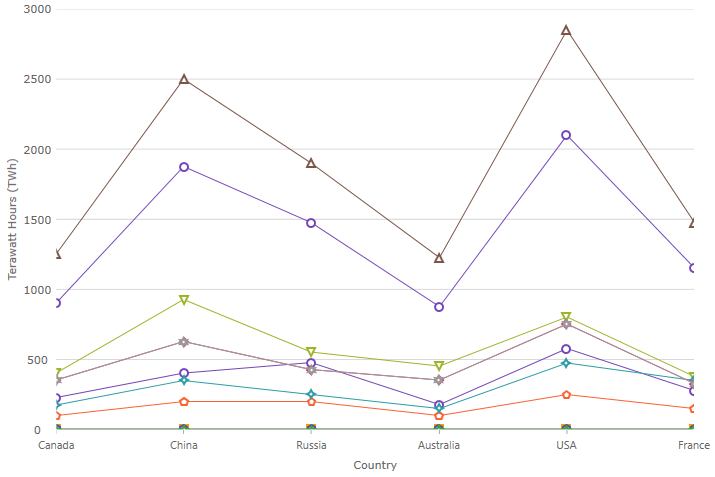
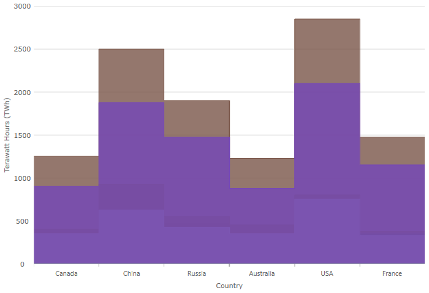
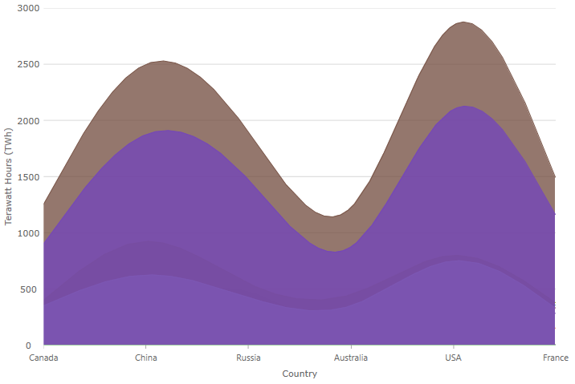
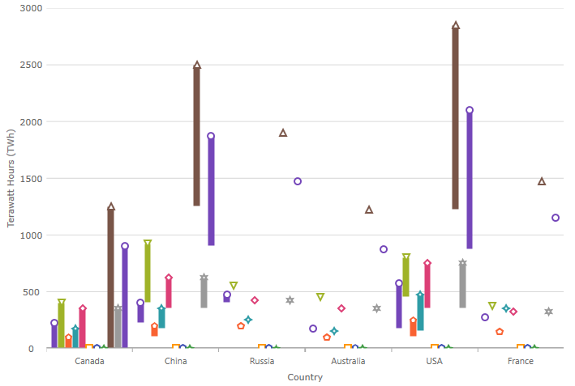

# Angular チャートの概要

Angular カテゴリ チャート コンポーネント は、カテゴリ データの可視化を容易にする Ignite UI for Angular チャート コンポーネントです。データ可視化ドメインの複雑さを管理しやすい API に簡素化できます。

## Angular チャートの例

<div class="sample-container loading" style="height: 500px">
    <iframe id="category-chart-overview-iframe" src='{environment:dvDemosBaseUrl}/charts/category-chart-overview' width="100%" height="100%" seamless frameBorder="0" onload="onXPlatSampleIframeContentLoaded(this);" alt="Angular チャートの例"></iframe>
</div>

<div>
    <button data-localize="stackblitz" disabled class="stackblitz-btn"   data-iframe-id="category-chart-overview-iframe" data-demos-base-url="{environment:dvDemosBaseUrl}">StackBlitz で表示
    </button>


</div>

<div class="divider--half"></div>

 ユーザーがデータのコレクョンまたはコレクション グループにバインドしてデータを指定するプロパティを設定後、あとの作業はチャート コントロールによって処理されます。Angular コンポーネントはデータを解析し、データを表すための最適なチャート タイプを自動的に選択します。

スマート データ アダプターは、データを分析して適切なビジュアライゼーションを描画します。たとえば、[`chartType`]({environment:dvApiBaseUrl}/products/ignite-ui-angular/api/docs/typescript/latest/classes/igxcategorychartcomponent.html#charttype) プロパティが [`Auto`]({environment:dvApiBaseUrl}/products/ignite-ui-angular/api/docs/typescript/latest/enums/categorycharttype.html#auto) に設定される場合、コントロールは小さいデータ セットのために縦棒チャートを使用し、より大きいデータ セットのために折れ線チャートを使用します。

ただし、[`chartType`]({environment:dvApiBaseUrl}/products/ignite-ui-angular/api/docs/typescript/latest/classes/igxcategorychartcomponent.html#charttype) を明示的に以下に設定してチャート タイプを指定することもできます。

-   [`Line`]({environment:dvApiBaseUrl}/products/ignite-ui-angular/api/docs/typescript/latest/enums/categorycharttype.html#line)
-   [`Area`]({environment:dvApiBaseUrl}/products/ignite-ui-angular/api/docs/typescript/latest/enums/categorycharttype.html#area)
-   [`Column`]({environment:dvApiBaseUrl}/products/ignite-ui-angular/api/docs/typescript/latest/enums/categorycharttype.html#column)
-   [`Point`]({environment:dvApiBaseUrl}/products/ignite-ui-angular/api/docs/typescript/latest/enums/categorycharttype.html#point)
-   [`Spline`]({environment:dvApiBaseUrl}/products/ignite-ui-angular/api/docs/typescript/latest/enums/categorycharttype.html#spline)
-   [`SplineArea`]({environment:dvApiBaseUrl}/products/ignite-ui-angular/api/docs/typescript/latest/enums/categorycharttype.html#splinearea)
-   [`StepArea`]({environment:dvApiBaseUrl}/products/ignite-ui-angular/api/docs/typescript/latest/enums/categorycharttype.html#steparea)
-   [`StepLine`]({environment:dvApiBaseUrl}/products/ignite-ui-angular/api/docs/typescript/latest/enums/categorycharttype.html#stepline)
-   [`Waterfall`]({environment:dvApiBaseUrl}/products/ignite-ui-angular/api/docs/typescript/latest/enums/categorycharttype.html#waterfall)

その他の Angular カテゴリ チャート コンポーネントの直感的な動作の例として、明示的にラベルを設定する必要がないことがあります。カテゴリ チャートは、提供したデータ内で最初の適切な文字列プロパティを使用し、ラベルに使用します。

<!-- Angular, React, WebComponents -->

## 依存関係

チャート パッケージをインストールするときに core パッケージもインストールする必要があります。

<pre style="background:#141414;color:white;display:inline-block;padding:16x;margin-top:10px;font-family:'Consolas';border-radius:5px;width:100%">
npm install --save igniteui-angular-core
npm install --save igniteui-angular-charts
</pre>

<!-- end: Angular, React, WebComponents -->

## モジュールの要件

<!-- Angular, React, WebComponents -->

```ts
// app.module.ts
import { IgxCategoryChartModule } from 'igniteui-angular-charts';

@NgModule({
    imports: [
        // ...
        IgxCategoryChartModule,
        // ...
    ]
})
export class AppModule {}
```

<!-- end: Angular, React, WebComponents -->

カテゴリ チャートのより最小限の設定をロードすることも可能で、それによって可能なシリーズのサブセットだけをロードし、代わりに [`IgxCategoryChartCoreModule`]({environment:dvApiBaseUrl}/products/ignite-ui-angular/api/docs/typescript/latest/classes/igxcategorychartcoremodule.html) や [`IgxLineSeriesDynamicModule`]({environment:dvApiBaseUrl}/products/ignite-ui-angular/api/docs/typescript/latest/classes/igxlineseriesdynamicmodule.html) など問題のシリーズの動的モジュールをロードして除外します。[`chartType`]({environment:dvApiBaseUrl}/products/ignite-ui-angular/api/docs/typescript/latest/classes/igxcategorychartcomponent.html#charttype) が [`Auto`]({environment:dvApiBaseUrl}/products/ignite-ui-angular/api/docs/typescript/latest/enums/categorycharttype.html#auto) の場合、読み込んだシリーズ型が選択されます。

<div class="divider--half"></div>

## 使用方法

カテゴリ チャート モジュールをインポートした後、チャートをデータにバインドします。

Angular カテゴリ チャート コンポーネントを作成するには、はじめにデータをバインドする必要があります。以下のコード スニペットは、シンプルなデータソースを作成する方法を示します。

```ts
var data = [
 { "CountryName": "China", "Pop1995": 1216, "Pop2005": 1297, "Pop2015": 1361, "Pop2025": 1394 },
 { "CountryName": "India", "Pop1995": 920, "Pop2005": 1090, "Pop2015": 1251, "Pop2025": 1396 },
 { "CountryName": "United States", "Pop1995": 266, "Pop2005": 295, "Pop2015": 322, "Pop2025": 351 },
 { "CountryName": "Indonesia", "Pop1995": 197, "Pop2005": 229, "Pop2015": 256, "Pop2025": 277 },
 { "CountryName": "Brazil", "Pop1995": 161, "Pop2005": 186, "Pop2015": 204, "Pop2025": 218 }
];
```

以下のコードはカテゴリ チャートを上記のデータにバインドします。

```html
 <igx-category-chart [dataSource]="data"
                     width="700px"
                     height="500px">
 </igx-category-chart>
```

<div class="divider--half"></div>

## チャート タイプ

表示するチャート型を設定するために、カテゴリ チャートのデフォルト動作をオーバーライドできます。これを実行するには、[`chartType`]({environment:dvApiBaseUrl}/products/ignite-ui-angular/api/docs/typescript/latest/classes/igxcategorychartcomponent.html#charttype) プロパティを設定します。
以下は、カテゴリ チャートでサポートされるすべてのタイプです。

> [!NOTE]
> 特別なケースにプロパティの [`Auto`]({environment:dvApiBaseUrl}/products/ignite-ui-angular/api/docs/typescript/latest/enums/categorycharttype.html#auto) 設定があります。[`Auto`]({environment:dvApiBaseUrl}/products/ignite-ui-angular/api/docs/typescript/latest/enums/categorycharttype.html#auto) を使用した場合、チャートがデータを分析し、最適なチャート タイプを割り当てます。

## サポートされるチャート タイプ

| タイプ                                                                                                                                      | 説明とプレビュー                                                                               |
| ---------------------------------------------------------------------------------------------------------------------------------------- | -------------------------------------------------------------------------------------- |
| [`Auto`]({environment:dvApiBaseUrl}/products/ignite-ui-angular/api/docs/typescript/latest/enums/categorycharttype.html#auto)             | チャートにバインドされたデータソースを分析する定義済みのデータ アダプターからの提案に基づいてチャート タイプの自動選択を指定します。                    |
| [`Line`]({environment:dvApiBaseUrl}/products/ignite-ui-angular/api/docs/typescript/latest/enums/categorycharttype.html#line)             | 各データ ポイントにマーカーがあるカテゴリ折れ線シリーズを指定します。              |
| [`Area`]({environment:dvApiBaseUrl}/products/ignite-ui-angular/api/docs/typescript/latest/enums/categorycharttype.html#area)             | カテゴリ エリア シリーズを指定します。                             |
| [`Column`]({environment:dvApiBaseUrl}/products/ignite-ui-angular/api/docs/typescript/latest/enums/categorycharttype.html#column)         | 各データ ポイントに垂直長方形があるカテゴリ縦棒チャートを指定します。            |
| [`Point`]({environment:dvApiBaseUrl}/products/ignite-ui-angular/api/docs/typescript/latest/enums/categorycharttype.html#point)           | 各データ ポイントにマーカーがあるカテゴリ ポイント チャートを指定します。          |
| [`StepLine`]({environment:dvApiBaseUrl}/products/ignite-ui-angular/api/docs/typescript/latest/enums/categorycharttype.html#stepline)     | カテゴリ ステップ折れ線チャートを指定します。                      |
| [`StepArea`]({environment:dvApiBaseUrl}/products/ignite-ui-angular/api/docs/typescript/latest/enums/categorycharttype.html#steparea)     | カテゴリ ステップ エリア チャートを指定します。                    |
| [`Spline`]({environment:dvApiBaseUrl}/products/ignite-ui-angular/api/docs/typescript/latest/enums/categorycharttype.html#spline)         | 各データ ポイントにマーカーがあるカテゴリ スプライン折れ線チャート シリーズを指定します。 |
| [`SplineArea`]({environment:dvApiBaseUrl}/products/ignite-ui-angular/api/docs/typescript/latest/enums/categorycharttype.html#splinearea) | カテゴリ スプライン エリア シリーズを指定します。                 |
| [`Waterfall`]({environment:dvApiBaseUrl}/products/ignite-ui-angular/api/docs/typescript/latest/enums/categorycharttype.html#waterfall)   | カテゴリ ウォーターフォール チャートを指定します。                  |
