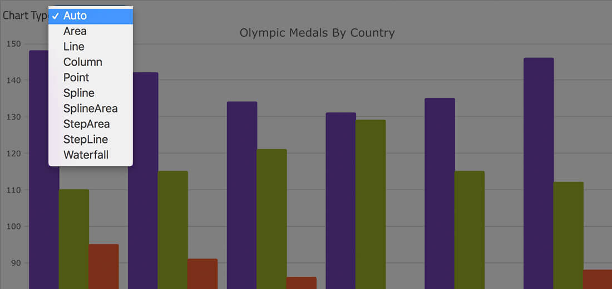
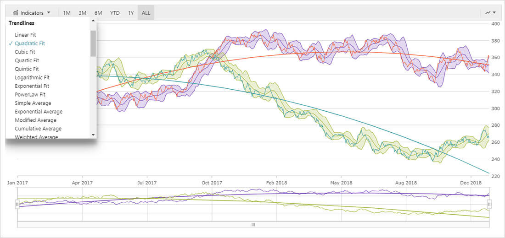
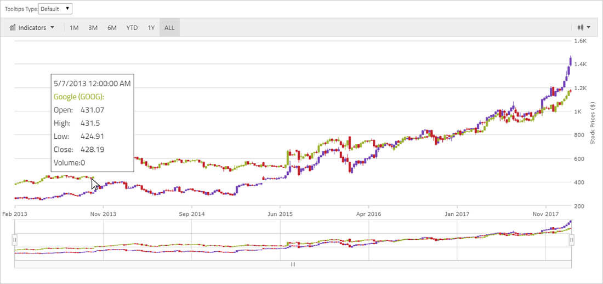

# Angular チャートとグラフの概要

Ignite UI for Angular チャートおよびグラフは、データ視覚化の広範なライブラリであり、Web アプリやモバイル アプリの魅力的でインタラクティブなチャートやダッシュボードを実現します。速度と美しさを重視して構築され、最新のすべてのブラウザで動作するように設計されており、完全なタッチとインタラクティブ機能により、レスポンシブ ビジュアルをあらゆるデバイスの次のアプリにすばやく簡単に組み込むことができます。

Ignite UI for Angular チャートは、カテゴリ シリーズ、ファイナンシャル シリーズ、極座標シリーズ、ラジアル シリーズ、範囲シリーズ、散布シリーズ、シェイプ シリーズ、地理空間シリーズなど、あらゆるタイプのデータを視覚化できる 65 種類以上のシリーズと組み合わせをサポートします。実行している比較のタイプ、または伝えようとしているデータ ストーリーのタイプに関係なく、次のいずれかの方法でデータを表すことができます:

-   時間毎の変化
-   比較
-   相関
-   配布
-   地理空間
-   概要 + 詳細
-   部分から全体
-   ランキング

インフラジスティックスの Angular チャートを使用して、最もニーズの高い視覚化を強化してください。

## Angular チャートとグラフのタイプ

Angular 製品には、単一のチャート表示からインタラクティブなダッシュボードまで、あらゆるシナリオに対応する 65 を超えるさまざまなチャートおよびグラフ タイプがあります。モバイル アプリやウェブ アプリ用に、円、棒、エリア、折れ線、ポイント、積層型、ドーナツ、散布、ゲージ、極座標、ツリーマップ、株価、ファイナンシャル、地理空間マップなどの Angular チャートを作成できます。Angular チャートと他のチャートの利点は、次のような機能が完全にサポートされていることです:

-   組み込まれたレスポンシブ Web デザイン
-   マウス、キーボード、タッチを使用したインタラクティブなパンとズーム
-   チャート アニメーションのフル コントロール
-   チャート ドリルダウン イベント
-   リアルタイム ストリーミングのサポート
-   大量 (数百万のデータ ポイント) のサポート
-   トレンドラインおよびその他のデータ分析機能

Angular チャートは、軸、マーカー、シリーズ、凡例、および注釈レイヤーのモジュラー デザインで構築されており、あらゆるタイプのデータ ストーリーの描画を簡単にデザインできます。単一のデータ シリーズを使用して単純なチャートを作成するか、複合ビューに複数の軸があるデータの複数シリーズを使用してより複雑なデータ ストーリーを作成します。

### Angular 棒チャート

Angular 棒チャート (棒グラフ) は、さまざまなカテゴリのデータの頻度、カウント、合計、または平均を、同じ幅と異なる長さの水平棒でエンコードされたデータとすばやく比較するために使用される最も一般的なカテゴリ チャート タイプの 1 つです。これらは、時間の経過に伴う項目の価値の変動、データ分布、並べ替えられたデータのランキング (高から低、最悪から最高) を表示するのに理想的です。データは、チャートの左から右にデータ ポイントの値に向かって伸びる長方形のコレクションを使用して表されます。[棒チャート](types/bar-chart.md)の詳細をご覧ください。

<code-view style="height: 600px"
           data-demos-base-url="{environment:dvDemosBaseUrl}"
           iframe-src="{environment:dvDemosBaseUrl}/charts/data-chart-bar-chart-multiple-sources"
           alt="Angular 複数ソースの棒チャート" >
</code-view>

### Angular 円チャート

Angular 円チャート、または円グラフは、一般的な部分から全体へのチャート タイプです。部分から全体へのチャートは、データセットのカテゴリ (部分) が合計 (全体) 値になる方法を示します。カテゴリは、分析されている合計値に対する値のパーセンテージに基づいて、他のカテゴリに比例して表示されます。円チャートは、データ値を円形または円チャートのセクションとして描画します。各セクションまたは円スライスには、基本データ値に比例する円弧の長さがあります。円スライスで表される合計値は、100 または 100% などの全体の値を表します。円チャートは小さなデータセットに最適で、一目で簡単に読むことができます。[円チャート](types/pie-chart.md)の詳細をご覧ください。

<code-view style="height: 600px"
           data-demos-base-url="{environment:dvDemosBaseUrl}"
           iframe-src="{environment:dvDemosBaseUrl}/charts/pie-chart-overview"
           alt="凡例付きの Angular 円チャート" >
</code-view>

### Angular 折れ線チャート

Angular 折れ線チャート、または折れ線グラフは、傾向を示し、比較分析を実行するために、一定期間にわたる 1 つ以上の数量の直線セグメントで接続されたポイントによって表される連続データ値を示す一種のカテゴリ折れ線チャートです。Y 軸 (左側のラベル) は数値を示し、X 軸 (下側のラベル) は時系列または比較カテゴリを示します。比較する 1 つ以上のデータセットを含めることができます。これはチャートで複数の線として描画されます。[折れ線チャート](types/line-chart.md)の詳細をご覧ください。

<code-view style="height: 600px"
           data-demos-base-url="{environment:dvDemosBaseUrl}"
           iframe-src="{environment:dvDemosBaseUrl}/charts/category-chart-line-chart-multiple-sources"
           alt="Angular 複数ソースの折れ線チャート" >
</code-view>

### Angular ドーナツ チャート

Angular ドーナツ チャート、またはドーナツ グラフは、円チャートの変形であり、全体の一部を表す円内の変数の発生を比例的に示します。ドーナツ チャートには、円チャートの中央に円形の開口部があり、タイトルまたはカテゴリの説明を表示できます。ドーナツ チャートは、階層データを視覚化するための組み込みサポートを使用して、複数の同心円をサポートできます。[ドーナツ チャート](types/donut-chart.md)の詳細をご覧ください。

<code-view style="height: 600px"
           data-demos-base-url="{environment:dvDemosBaseUrl}"
           iframe-src="{environment:dvDemosBaseUrl}/charts/doughnut-chart-legend"
           alt="凡例付きの Angular ドーナツ チャート" >
</code-view>

### Angular エリア チャート

Angular エリア チャートは、直線セグメントで接続されたポイントのコレクションを使用して描画され、線の下の領域が塗りつぶされます。値は y 軸 (左側のラベル) に表示され、カテゴリは x 軸 (下部のラベル) に表示されます。エリア チャートは、プロットされた値の合計を表示することにより、一定期間の変化量を強調したり、複数の項目や全体の一部の関係を比較したりします。 [エリア チャート](types/area-chart.md)の詳細をご覧ください。

<code-view style="height: 600px"
           data-demos-base-url="{environment:dvDemosBaseUrl}"
           iframe-src="{environment:dvDemosBaseUrl}/charts/category-chart-area-chart-multiple-sources"
           alt="Angular 複数ソースのエリア チャート" >
</code-view>

### Angular スパークライン チャート

Angular スパークライン チャート、またはスパークライン グラフは、グリッド セル内や、データ ストーリーを伝えるために単語サイズの視覚化が必要な場所など、小規模なレイアウト内で描画することを目的としたカテゴリ チャートの一種です。他の Angular チャート タイプと同様に、スパークライン チャートには、チャート タイプ、マーカー、範囲、トレンドライン、不明な値のプロット、ツールチップなど、構成およびカスタマイズできるいくつかの視覚要素と対応する機能があります。スパークライン チャートは、折れ線チャート、エリア チャート、縦棒チャート、または Win/Loss チャートとして描画できます。スパーク チャートに相当するフルサイズのチャートの違いは、Y 軸 (左側のラベル) と X 軸 (下部のラベル) が表示されないことです。[スパークライン チャート](types/sparkline-chart.md)の詳細をご覧ください。

<code-view style="height: 450px"
           data-demos-base-url="{environment:dvDemosBaseUrl}"
           iframe-src="{environment:dvDemosBaseUrl}/charts/sparkline-display-types"
           alt="Angular スパークライン チャートの例"
           github-src="charts/sparkline/display-types">
</code-view>

### Angular バブル チャート

Angular バブル チャート (バブル グラフ) は、3 つの数値で構成されるデータを表示するために使用されます。値の 2 つは、デカルト (X、Y) 座標系を使用して交点としてプロットされ、3 番目の値は点の直径サイズとして描画されます。これにより、バブル チャートにその名前が付けられます。これは、プロットの X 座標と Y 座標に沿ったさまざまなサイズのバブルの視覚化です。Angular バブル チャートは、データ相関とサイズによって描画されたデータ値の違いとの関係を示すために使用されます。4 番目のデータ ディメンション (通常は色) を使用して、バブル チャートの値をさらに区別することもできます。[バブル チャート](types/bubble-chart.md)の詳細をご覧ください。

<code-view style="height: 600px"
           data-demos-base-url="{environment:dvDemosBaseUrl}"
           iframe-src="{environment:dvDemosBaseUrl}/charts/data-chart-scatter-bubble-chart-multiple-sources"
           alt="Angular バブル チャート" >
</code-view>

### Angular ファイナンシャル チャート/株価チャート

Angular ファイナンシャル/株価チャートは、時系列チャートで株価デーとファイナンシャル データを描画する複合視覚化です。 日/週/月フィルター、チャート タイプの選択、ボリューム タイプの選択、インジケーターの選択、トレンドラインの選択などのインタラクティブな視覚要素がツールバーに含まれています。カスタマイズ用に設計された Angular 株価チャートは、データの視覚化と解釈を容易にするために、任意の方法でカスタマイズできます。ファイナンシャル チャートは、X 軸 (下のラベル) に沿って日時データを描画し、Open、High、Low、Close ボリュームなどのフィールドを表示します。時系列データを描画するチャートのタイプは、棒、ローソク、縦棒、または折れ線です。[株価チャート](types/stock-chart.md)の詳細をご覧ください。

<code-view style="height: 600px"
           data-demos-base-url="{environment:dvDemosBaseUrl}"
           iframe-src="{environment:dvDemosBaseUrl}/charts/financial-chart-multiple-data"
           alt="Angular 株価チャートの例" >
</code-view>

### Angular 縦棒チャート

Angular 縦棒チャート (縦棒グラフ) は、さまざまなカテゴリのデータの頻度、カウント、合計、または平均を、同じ幅と異なる長さの垂直棒でエンコードされたデータとすばやく比較するために使用される最も一般的なカテゴリ チャート タイプの 1 つです。これらは、時間の経過に伴う項目の価値の変動、データ分布、並べ替えられたデータのランキング (高から低、最悪から最高) を表示するのに理想的です。データは、チャートの上から下にデータ ポイントの値に向かって伸びる長方形のコレクションを使用して表されます。[縦棒チャート](types/column-chart.md)の詳細をご覧ください。

<code-view style="height: 600px"
           data-demos-base-url="{environment:dvDemosBaseUrl}"
           iframe-src="{environment:dvDemosBaseUrl}/charts/category-chart-column-chart-multiple-sources"
           alt="Angular 複数ソースの縦棒チャート" >
</code-view>

### Angular 複合チャート

Angular 複合チャートまたはコンボ チャートは、同じプロット領域でさまざまなチャート タイプを組み合わせた視覚化です。スケールが大きく異なり、異なる単位で表される可能性のある 2 つのデータ シリーズを表示する場合に非常に役立ちます。最も一般的な例は、一方の軸にドル、もう一方の軸にパーセンテージです。[複合チャート](types/composite-chart.md)の詳細をご覧ください。

<code-view style="height: 600px"
           data-demos-base-url="{environment:dvDemosBaseUrl}"
           iframe-src="{environment:dvDemosBaseUrl}/charts/data-chart-composite-chart"
           alt="Angular 複合チャートの例" >
</code-view>

<!-- ### Angular ガント チャート

Angular ガント チャートは棒チャートの一種で、さまざまなカテゴリを時系列に視覚化します。ガント チャートは、期間ブロックで開始時間と終了時間を示します。これは、プロジェクト管理で、時間に対して表示されるアクティビティ (タスクまたはイベント) を表示するための最も一般的で便利な方法の 1 つとしてよく使用されます。チャートの左側にはアクティビティのリストがあり、上部には適切な時間スケールがあります。各アクティビティは棒で表されます。 棒の位置と長さは、アクティビティの開始日、期間、および終了日を反映しています。[ガント チャート](types/gantt-chart.md)の詳細をご覧ください。 -->

<!-- ### Angular ネットワーク チャート

Angular ネットワーク チャートは、ネットワーク グラフまたはポリライン チャートとも呼ばれ、大量の要素間の複雑な関係を視覚化します。この視覚化は、無向および指向グラフ構造を表示します。また、丸いノードとして表示されるエンティティ間の関係を示し、線はそれらの関係を示します。[ネットワーク チャート](types/network-chart.md)の詳細をご覧ください。 -->

### Angular 極座標チャート

Angular 極座標エリア チャートまたは極座標グラフは、極座標チャートのグループに属し、頂点または隅がデータ ポイントの極 (角度/半径) 座標に配置された塗りつぶされたポリゴンの形状を持っています。極座標エリア チャートは、散布図と同じデータ プロットの概念を使用しますが、データ ポイントを水平方向に伸ばすのではなく、円の周りにラップします。他のシリーズ タイプと同じように、複数の極座標エリア チャートは同じデータ チャートにプロットでき、データセットの相違点を示すために互いにオーバーレイできます。[極座標チャート](types/polar-chart.md)の詳細をご覧ください。

<code-view style="height: 600px"
           data-demos-base-url="{environment:dvDemosBaseUrl}"
           iframe-src="{environment:dvDemosBaseUrl}/charts/data-chart-polar-line-chart"
           alt="Angular 極座標型折れ線チャート" >
</code-view>

<!-- ### Angular ピラミッド チャート

Angular ピラミッド チャートは、年齢ピラミッドまたは人口ピラミッドとも呼ばれ、人口が増加しているときにピラミッドの形を形成する、人口内のさまざまな年齢層の分布を示すグラフィカルな図です。また、生態学では、繁殖能力と種の存続の可能性の指標として、人口の全体的な年齢分布を決定するために使用されます。[ピラミッド チャート](types/pyramid-chart.md)の詳細をご覧ください。 -->

### Angular 散布図

Angular 散布図は、デカルト (X、Y) 座標系を使用してデータをプロットすることにより、2 つの値間の関係を示すために使用されます。各データ ポイントは、X 軸と Y 軸上のデータ値の交点として描画されます。散布図は、不均一な間隔またはデータのクラスターに注意を向けます。予測結果の収集データの標準偏差を強調表示し、科学データや統計データをプロットするためによく使用されます。Angular 散布図は、データがバインド前に時系列になっていない場合でも、X 軸と Y 軸でデータを時系列に整理してプロットします。[散布図](types/scatter-chart.md)の詳細をご覧ください。

<code-view style="height: 600px"
           data-demos-base-url="{environment:dvDemosBaseUrl}"
           iframe-src="{environment:dvDemosBaseUrl}/charts/data-chart-scatter-point-chart"
           alt="Angular 散布マーカー チャート" >
</code-view>

### Angular シェープ チャート

Angular シェープ チャートは、形状の配列 (X/Y ポイントの配列) を取り、デカルト (x、y) 座標系のポリゴンまたはポリラインのコレクションとして描画するチャートのグループです。これらは、科学データの強調領域でよく使用されますが、ダイアグラム、青写真、さらには建物の間取り図のプロットにも使用できます。[シェープ チャート](types/shape-chart.md)の詳細をご覧ください。

<code-view style="height: 600px"
           data-demos-base-url="{environment:dvDemosBaseUrl}"
           iframe-src="{environment:dvDemosBaseUrl}/charts/data-chart-type-scatter-polygon-series"
           alt="Angular 散布ポリゴン チャート" >
</code-view>

### Angular スプライン チャート

Angular スプライン チャート、またはスプライン グラフは、傾向を示し、比較分析を実行するために、一定期間にわたる 1 つ以上の数量の滑らかな線セグメントで接続されたポイントによって表される連続データ値を示す一種のカテゴリ折れ線チャートです。Y 軸 (左側のラベル) は数値を示し、X 軸 (下側のラベル) は時系列または比較カテゴリを示します。比較する 1 つ以上のデータセットを含めることができます。これはチャートで複数の線として描画されます。Angular スプライン チャートは Angular 折れ線チャートと同じですが、唯一の違いは、折れ線チャートが直線で接続された点であるのに対し、スプライン チャートの点は滑らかな曲線で接続されていることです。[スプライン チャート](types/spline-chart.md)の詳細をご覧ください。

<code-view style="height: 600px"
           data-demos-base-url="{environment:dvDemosBaseUrl}"
           iframe-src="{environment:dvDemosBaseUrl}/charts/category-chart-spline-multiple-sources"
           alt="Angular 複数ソースのスプライン チャート" >
</code-view>

### Angular ステップ チャート

Angular ステップ折れ線チャート、またはステップ折れ線グラフは、ステップ状の進捗を形成する連続した垂直線と水平線で接続されたデータ ポイントのコレクションを描画するカテゴリ チャートです。値は Y 軸 (左側のラベル) に表示され、カテゴリは X 軸 (下部のラベル) に表示されます。Angular ステップ折れ線チャートは、一定期間の変化量を強調するか、複数の項目を比較します。Angular ステップ折れ線チャートは、ステップ線の下の領域が塗りつぶされていないことを除いて、すべての点で Angular ステップエリア チャートと同じです。[ステップ折れ線チャート](types/step-chart.md)の詳細をご覧ください。

<code-view style="height: 600px"
           data-demos-base-url="{environment:dvDemosBaseUrl}"
           iframe-src="{environment:dvDemosBaseUrl}/charts/category-chart-step-line-multiple-sources"
           alt="Angular 複数ソースのステップ折れ線チャート" >
</code-view>

<!-- ### Angular タイムライン チャート/時系列チャート

時系列チャート (タイムライン グラフ) は、データをカテゴリ データ項目の連続として扱い、日付順に並べ替えてから描画する視覚化です。この軸のラベルは、日時の値に従って、X 軸 (下の軸) に沿って配置されます。Angular 時系列は、ファイナンシャル シリーズ、範囲シリーズ、およびカテゴリ シリーズ (折れ線、エリア、縦棒、ポイント、スプライン、散布図、ウォーターフォール、およびこれらのチャート タイプに相当する積層型チャート) を表示するために使用されます。時系列は、ブレークのあるデータの間隔を除外する機能もサポートしています。その結果として、ラベルは除外された間隔で表示されません。たとえば、勤務日/休業日、休日、週末などです。 -->

### Angular ツリーマップ

Ignite UI for Angular ツリーマップは、ネストされた一連のノードとして階層 (ツリー構造) データを表示します。ツリーの各ブランチにはツリーマップ ノードが提供されて、サブマップを表す小さなノードでタイル化されます。各ノードの長方形には、データ上の指定されたディメンションに比例した領域があります。多くの場合、ノードは色分けされて、データの個別のディメンションを示します。[ツリーマップ](../treemap-overview.md)の詳細をご覧ください。

<code-view style="height: 600px"
           data-demos-base-url="{environment:dvDemosBaseUrl}"
           iframe-src="{environment:dvDemosBaseUrl}/charts/tree-map-overview"
           alt="Angular ツリーマップの例"
           github-src="charts/tree-map/overview">
</code-view>

## Angular チャート主な機能

組み込みの時間軸を使用して、データが時間の経過とともにどのように変化するかを示します。チャートを操作すると、時間スケールとラベル書式が動的に変更されます。YahooFinance や GoogleFinance など、ファイナンシャル チャートに期待されるすべての機能を備えた完全なファイナンシャル チャートが含まれています。

### 動的なチャート

新しい[複合チャート](types/composite-chart.md)を作成し、単一のチャートで複数のシリーズを重ね合わせて、データを視覚化します。チャートでは、複数のチャート列を表示および重ねて、積層型縦棒を作成できます。

### カスタム ツールチップ

新しい複合ビューを作成し、単一のチャートで複数のシリーズを重ね合わせて、データを視覚化します。チャートでは、画像やデータ バインディングを使用して[カスタム ツールチップ](features/chart-tooltips.md#angular-チャート-ツールチップ-テンプレート)を作成したり、複数のシリーズのツールチップを 1 つのツールチップに組み合わせたりすることもできます。

### リアルタイムの高パフォーマンスなチャート

ライブのストリーミング データを使用して、ミリ秒レベルの更新で数千のデータ ポイントをリアルタイムで表示します。タッチ デバイスでチャートを操作しているときでも、ラグ、画面のちらつき、表示の遅れは発生しません。デモについては、[高頻度のチャート](features/chart-performance.md#高頻度-angular-チャート)トピックを参照してください。

### 大量のデータ処理

[チャート パフォーマンス](features/chart-performance.md)を最適化して、エンドユーザーがチャートのコンテンツをズームイン/ズームアウトまたはナビゲートしようとしたときにスムーズなパフォーマンスを提供し続けながら、数百万のデータ ポイントを描画します。デモについては、[大量データのチャート](features/chart-performance.md#大量データの-angular-チャート)トピックを参照してください。

### モジュラー デザイン

Angularチャート は、モジュール性のために設計されています。必要な機能のみが展開一部であるため、描画されたページで可能な限り最小のフットプリントを取得します。

#### スマート データ バインディング

チャート タイプの選択はお任せください。当社のスマート データ アダプタは、データに最適なチャート タイプを自動的に選択します。データ ソースを設定するだけです。

### トレンドライン

Angular チャートは、線形 (x)、二次 (x2)、三次 (x3)、四次 (x4)、五次 (x5)、対数 (logn x)、指数 (ex)、べき乗 (axk + o(xk)) など、必要になるすべての[トレンドライン](features/chart-trendlines.md)をサポートします。

### インタラクティブなパニングとズーム

シングル タッチまたはマルチタッチ、キーボード、ズーム バー、マウス ホイールを使用し、マウスで任意の長方形領域をドラッグ選択してズームインし、データ ポイントのクローズアップ、データ履歴のスクロール、またはデータ領域のパンを行います。

### マーカー、ツールチップ、およびテンプレート

10 個の[マーカー タイプ](features/chart-markers.md)のいずれかを使用するか、独自の[マーカー-テンプレート](features/chart-markers.md#angular-チャート-マーカーのテンプレート)を作成して、データを強調表示するか、シンプルな[ツールチップ](features/chart-tooltips.md)または[カスタム ツールチップ](features/chart-tooltips.md#angular-チャート-ツールチップ-テンプレート)を使用した多軸および複数系列のチャートで、データにコンテキストと意味を追加します。

## その他の詳細

他の Angular チャートを検討している場合は、次のことを考慮しましょう:

-   65 を超える Angular チャート タイプと複合チャートが含まれており、スマート データ アダプタを使用した類を見ない最も簡単な構成が可能です。
-   チャートは、Angular、Blazor、jQuery / JavaScript、React、UNO、UWP、WPF、Windows Forms、WebComponents、WinUI、Xamarin などのすべてのプラットフォームで最適化されています。すべてのプラットフォームで同じ API と機能をサポートします。
-   当社の株価チャートとファイナンシャル チャートは、YahooFinance または Google Finance のようなエクスペリエンスに必要なすべてを 1 行のコードで提供します。
-   Ignite UI for Angular は、Angular 開発者向けの Angular 上に構築されており、サードパーティの依存関係はありません。Angular 用に 100% 最適化されています。
-   他社のパフォーマンスに対してテストします。当社は高速で大量のデータを処理できることを証明できます。大量のデータとリアルタイムのデータ ストリーミングをどのように処理するかをご自身で確認してください。
-   24/5 対応しております。インフラジスティックスは、常にオンラインでグローバル サポートを提供しています。北米、アジア太平洋、中東、およびヨーロッパでは、いつでもご利用いただけます。
-   チャートの他に、Angular には多くの UI コントロールもあります。アプリケーション構築のための完全な Angular ソリューションを提供します!
    <!-- Angular -->
-   Ignite UI for Angular は、Angular 開発者向けの Angular 上に構築されており、サードパーティの依存関係はありません。Angular 用に 100% 最適化されています。
-   Sketch デザインからピクセル パーフェクトな Angular コントロールを生成する、UX デザイナー、ビジュアル デザイナー、開発者向けのコード プラットフォームに、世界初で唯一のエンドツーエンドの包括的なデザインを提供します。Indigo.Design を使用すると、Indigo Design System から Sketch で作成するすべてのものが Ignite UI for Angular コントロールと一致します。
    <!-- end: Angular -->
