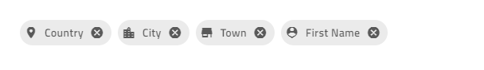
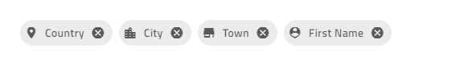

### Chip

[Chip コンポーネント]({environment:angularApiUrl}/classes/igxchipcomponent.html) は、楕円形のコンテナーに情報を表示する視覚的要素です。コンポーネントにはテンプレート化、削除、選択などのさまざまなプロパティがあります。複数のチップの順序を変更し、チップ領域をコンテナーとして視覚的に接続できます。

### デモ

<div class="sample-container loading" style="height: 100px; padding-top: 10px">
    <iframe id="chip-simple-iframe" src='{environment:demosBaseUrl}/data-display/chip-simple' width="100%" height="100%" seamless="" frameborder="0" onload="onSampleIframeContentLoaded(this);"></iframe>
</div>
<p style="margin: 0;padding-top: 0.5rem">このサンプルが気に入りましたか? 完全な Angular ツールキットにアクセスして、すばやく独自のアプリの作成を開始します。<a class="no-external-icon mchNoDecorate trackCTA" target="_blank" href="https://www.infragistics.com/products/ignite-ui-angular/download" data-xd-ga-action="Download" data-xd-ga-label="Ignite UI for Angular">無料でダウンロードできます。</a></p>
<br/>
<div>
<button data-localize="codesandbox" disabled class="codesandbox-btn" data-iframe-id="chip-simple-iframe" data-demos-base-url="{environment:demosBaseUrl}">codesandbox で表示</button>
<button data-localize="stackblitz" disabled class="stackblitz-btn" data-iframe-id="chip-simple-iframe" data-demos-base-url="{environment:demosBaseUrl}">Stackblitz で表示</button>
</div>

### 使用方法

はじめに、**app.module.ts** ファイルに **IgxChipsModule** をインポートします。
```typescript
// app.module.ts

...
import { IgxChipsModule } from 'igniteui-angular';

@NgModule({
    ...
    imports: [..., IgxChipsModule],
    ...
})
export class AppModule {}
```

[`IgxChipComponent`]({environment:angularApiUrl}/classes/igxchipcomponent.html) には、[`id`]({environment:angularApiUrl}/classes/igxchipcomponent.html#id) 入力があるため、他のチップと簡単に識別できます。[`id`]({environment:angularApiUrl}/classes/igxchipcomponent.html#id) がない場合は自動的に生成します。

```html
<igx-chip *ngFor="let chip of chipList" [id]="chip.id">
    {{chip.text}}
</igx-chip>
```

#### 選択


選択は、[`selectable`]({environment:angularApiUrl}/classes/igxchipcomponent.html#selectable) 入力を `true` に設定して有効にできます。チップを選択すると、[`onSelection`]({environment:angularApiUrl}/classes/igxchipcomponent.html#onselection) イベントが発生します。新しい [`selected`]({environment:angularApiUrl}/interfaces/ichipselecteventargs.html#selected) 値を提供することにより、新しいステートとこの選択の変更をトリガーした [`originalEvent`]({environment:angularApiUrl}/interfaces/ichipselecteventargs.html#originalevent) の元のイベントを取得できます。[`selected`]({environment:angularApiUrl}/interfaces/ichipselecteventargs.html#selected) プロパティをプログラムで設定して行う場合、[`originalEvent`]({environment:angularApiUrl}/interfaces/ichipselecteventargs.html#originalevent) 引数に値 `null` になります。

```html
<igx-chip *ngFor="let chip of chipList" [selectable]="true">
    <igx-icon igxPrefix>{{chip.icon}}</igx-icon>
    {{chip.text}}
</igx-chip>
```

#### 削除


削除は、[`removable`]({environment:angularApiUrl}/classes/igxchipcomponent.html#removable) 入力を `true` に設定して有効にできます。有効な場合は、チップの最後に削除ボタンが描画されます。チップを削除すると、[`onRemove`]({environment:angularApiUrl}/classes/igxchipcomponent.html#onremove) イベントが発生します。

デフォルトで、チップは削除アイコンをクリックしても DOM ツリーから自動的に削除されません。削除は手動で処理する必要があります。

```html
<igx-chip *ngFor="let chip of chipList" [id]="chip.id" [removable]="true" (onRemove)="chipRemoved($event)">
    <igx-icon igxPrefix>{{chip.icon}}</igx-icon>
    {{chip.text}}
</igx-chip>
```

```typescript
public chipRemoved(event: IBaseChipEventArgs) {
    this.chipList = this.chipList.filter((item) => {
        return item.id !== event.owner.id;
    });
    this.changeDetectionRef.detectChanges();
}
```

#### ドラッグ

ドラッグは、[`draggable`]({environment:angularApiUrl}/classes/igxchipcomponent.html#removable) 入力を `true` に設定して有効にできます。有効にすると、チップをクリックしてドラッグできます。

```html
<igx-chip *ngFor="let chip of chipList" [id]="chip.id" [draggable]="true">
    <igx-icon igxPrefix>{{chip.icon}}</igx-icon>
    {chip.text}}
</igx-chip>
```

>[!NOTE]
>チップの順序をソートするには、[`IgxChipsAreaComponent`]({environment:angularApiUrl}/classes/igxchipsareacomponent.html) を使用してイベントを処理する必要があります。

<div class="divider"></div>

**デモ サンプルを作成するには、上記の機能を使用します。**

```html
<igx-chip
*ngFor="let chip of chipList"
[id]="chip.id"
[selectable]="true"
[removable]="true"
(onRemove)="chipRemoved($event)"
>
    <igx-icon igxPrefix>{{chip.icon}}</igx-icon>
    {{chip.text}}
</igx-chip>
```

次に、`chipList` と [`onRemove`]({environment:angularApiUrl}/classes/igxchipcomponent.html#onremove) イベントを処理する関数を追加します。

```ts
import { IBaseChipEventArgs } from "igniteui-angular";
...
public chipList = [
    {
        text: "Country",
        id: "1",
        icon: "place"
    },
    {
        text: "City",
        id: "2",
        icon: "location_city"
    },
    {
        text: "Town",
        id: "3",
        icon: "store"
    },
    {
        text: "First Name",
        id: "4",
        icon: "person_pin"
    }
];

private changeDetectionRef: any;

public chipRemoved(event: IBaseChipEventArgs) {
    this.chipList = this.chipList.filter((item) => {
        return item.id !== event.owner.id;
    });
    this.changeDetectionRef.detectChanges();
}
```

すべて適切に設定できると、ブラウザーで以下が表示されます。

<div class="sample-container loading" style="height: 100px; padding-top: 10px">
    <iframe id="chip-simple-iframe" src='{environment:demosBaseUrl}/data-display/chip-simple' width="100%" height="100%" seamless frameBorder="0" onload="onSampleIframeContentLoaded(this);"></iframe>
</div>
<br/>
<div>
<button data-localize="codesandbox" disabled class="codesandbox-btn" data-iframe-id="chip-simple-iframe" data-demos-base-url="{environment:demosBaseUrl}">codesandbox で表示</button>
<button data-localize="stackblitz" disabled class="stackblitz-btn" data-iframe-id="chip-simple-iframe" data-demos-base-url="{environment:demosBaseUrl}">Stackblitz で表示</button>
</div>

#### Chip テンプレート

[`IgxChipComponent`]({environment:angularApiUrl}/classes/igxchipcomponent.html) のすべての要素がテンプレート化できます。

`IgxPrefix` と `IgxSuffix` ディレクティブを使用して、チップの `prefix` と `suffix` をテンプレート化できます。


```html
<igx-chip>
    <igx-icon igxPrefix>insert_emoticon</igx-icon>
    <igx-icon igxSuffix style="transform: rotate(180deg)">insert_emoticon</igx-icon>
    <span>Why not both?</span>
</igx-chip>
```

チップのサイズは、[`displayDensity`]({environment:angularApiUrl}/classes/igxchipcomponent.html#displaydensity) 入力を使用してカスタマイズできます。デフォルトの設定は `comfortable` です。チップ内のすべてが相対位置を保持する際に `cosy` または `compact` にも設定できます。


```html
<igx-chip>Hi! My name is Chip!</igx-chip>

<igx-chip displayDensity="cosy">
    I can be smaller!
</igx-chip>

<igx-chip displayDensity="compact">
    <igx-icon igxPrefix>child_care</igx-icon>
    Even tiny!
</igx-chip>
```

`select icon` をカスタマイズするには、[`selectIcon`]({environment:angularApiUrl}/classes/igxchipcomponent.html#selecticon) 入力を使用します。`TemplateRef` 型の値を受け取り、同じ機能を保持する際にデフォルト アイコンをオーバーライドします。



```html
<igx-chip *ngFor="let chip of chipList" [selectable]="true" [selectIcon]="mySelectIcon">
    <igx-icon igxPrefix>{{chip.icon}}</igx-icon>
    {{chip.text}}
</igx-chip>

<ng-template #mySelectIcon>
    <igx-icon>check_circle</igx-icon>
</ng-template>
```

`remove icon` をカスタマイズするには、[`removeIcon`]({environment:angularApiUrl}/classes/igxchipcomponent.html#removeicon) 入力を使用します。`TemplateRef` 型の値を取得してデフォルトの削除アイコンの代わりに描画します。


```html
<igx-chip *ngFor="let chip of chipList"  [removable]="true" [removeIcon]="myRemoveIcon">
    <igx-icon igxPrefix>{{chip.icon}}</igx-icon>
    {{chip.text}}
</igx-chip>

<ng-template #myRemoveIcon>
    <igx-icon>delete</igx-icon>
</ng-template>
```

### Chip Area

[`IgxChipsAreaComponent`]({environment:angularApiUrl}/classes/igxchipsareacomponent.html) はチップの間の操作 (ドラッグ、選択、ナビゲーションなど) が必要となる複雑なシナリオの処理で使用されます。

#### Chip のソート



チップの位置を変更するため、ユーザーによってドラッグができます。ドラッグはデフォルトで無効になっていますが、[`draggable`]({environment:angularApiUrl}/classes/igxchipcomponent.html#draggable) 入力プロパティを使用して有効にできます。実際のチップのソートは手動で処理する必要があります。チップが別のチップの上にドラッグされる場合に、新しい順序を返す [`onReorder`]({environment:angularApiUrl}/classes/igxchipsareacomponent.html#onreorder) イベントを提供するため、チップ領域が役に立ちます。

```html
<igx-chips-area (onReorder)="chipsOrderChanged($event)">
    <igx-chip *ngFor="let chip of chipList" [draggable]="'true'">
        <igx-icon igxPrefix>{{chip.icon}}</igx-icon>
        {{chip.text}}
    </igx-chip>
</igx-chips-area>
```

```typescript
public chipsOrderChanged(event: IChipsAreaReorderEventArgs) {
    const newChipList = [];
    for (const chip of event.chipsArray) {
        const chipItem = this.chipList.filter((item) => {
            return item.id === chip.id;
        })[0];
        newChipList.push(chipItem);
    }
    this.chipList = newChipList;
}
```

#### キーボード ナビゲーション

チップをフォーカスするには `Tab` キーを押すか、それをクリックします。チップがチップ領域にある場合、キーボード ナビゲーションを使用して順序を変更することができます。

- チップがフォーカスされた場合のキーボード コントロール:

  - <kbd>LEFT</kbd> - チップのフォーカスを左へ移動します。

    

  - <kbd>RIGHT</kbd> - チップのフォーカスを右へ移動します。 

    

  - <kbd>SPACE</kbd> - チップが選択可能な場合、選択を切り替えます。

    
  - <kbd>DELETE</kbd> - [`igxChip`]({environment:angularApiUrl}/classes/igxchipcomponent.html) の [`onRemove`]({environment:angularApiUrl}/classes/igxchipcomponent.html#onremove) イベントをトリガーし、チップ削除が手動で処理されます。
  - <kbd>SHIFT</kbd> + <kbd>LEFT</kbd> - 現在フォーカスされたチップは左に位置を移動した際に [`igxChipArea`]({environment:angularApiUrl}/classes/igxchipsareacomponent.html) の [`onReorder`]({environment:angularApiUrl}/classes/igxchipsareacomponent.html#onreorder) イベントをトリガーします。
  - <kbd>SHIFT</kbd> + <kbd>RIGHT</kbd> - 現在フォーカスされたチップは右に位置を移動した際に [`igxChipArea`]({environment:angularApiUrl}/classes/igxchipsareacomponent.html) の [`onReorder`]({environment:angularApiUrl}/classes/igxchipsareacomponent.html#onreorder) イベントをトリガーします。

- 削除ボタンがフォーカスされた場合のキーボード コントロール:

  - <kbd>SPACE</kbd> または <kbd>ENTER</kbd> チップの削除を手動的に処理するために [`onRemove`]({environment:angularApiUrl}/classes/igxchipcomponent.html#onremove) 出力を発生します。

<div class="divider--half"></div>

以下は、IgxAvatar をプレフィックスとして使用し、すべてのチップにカスタム アイコンを使用するチップ領域の例です。

```html
<igx-chips-area (onReorder)="chipsOrderChanged($event)">
    <igx-chip
    *ngFor="let chip of chipList"
    [id]="chip.id"
    [selectable]="true"
    [selectIcon]="mySelectIcon"
    [removable]="true"
    [removeIcon]="myRemoveIcon"
    (onRemove)="chipRemoved($event)"
    [draggable]="'true'">
        <igx-avatar
        class="chip-avatar-resized"
        igxPrefix
        [src]="chip.photo"
        roundShape="true"
        ></igx-avatar>
        {{chip.name}}
    </igx-chip>
</igx-chips-area>

<ng-template #mySelectIcon>
    <igx-icon>check_circle</igx-icon>
</ng-template>

<ng-template #myRemoveIcon>
    <igx-icon>delete</igx-icon>
</ng-template>
```

チップに合わせてアバターのサイズを変更します。

```scss
.chip-avatar-resized {
    width: 2em;
    height: 2em;
    min-width: 2em;
}
```
`chipList` とイベントを処理する関数を追加します。

```ts
import { IBaseChipEventArgs, IChipsAreaReorderEventArgs } from "igniteui-angular";
...
public chipList = [
    {
        id: "770-504-2217",
        name: "Terrance Orta",
        photo: "https://www.infragistics.com/angular-demos/assets/images/men/27.jpg"
    },
    {
        id: "423-676-2869",
        name: "Richard Mahoney",
        photo: "https://www.infragistics.com/angular-demos/assets/images/men/13.jpg"
    },
    {
        id: "859-496-2817",
        name: "Donna Price",
        photo: "https://www.infragistics.com/angular-demos/assets/images/women/50.jpg"
    }
];

private changeDetectionRef: any;

public chipRemoved(event: IBaseChipEventArgs) {
    this.chipList = this.chipList.filter((item) => {
        return item.id !== event.owner.id;
    });
    this.changeDetectionRef.detectChanges();
}

public chipsOrderChanged(event: IChipsAreaReorderEventArgs) {
    const newChipList = [];
    for (const chip of event.chipsArray) {
        const chipItem = this.chipList.filter((item) => {
            return item.id === chip.id;
        })[0];
        newChipList.push(chipItem);
    }
    this.chipList = newChipList;
}
```

すべてが適切に設定されていれば、ブラウザーで以下が表示されます。

#### デモ

<div class="sample-container loading" style="height: 100px">
    <iframe id="chip-area-sample-iframe" src='{environment:demosBaseUrl}/data-display/chip-area-sample' width="100%" height="100%" seamless frameBorder="0" onload="onSampleIframeContentLoaded(this);"></iframe>
</div>
<br/>
<div>
<button data-localize="codesandbox" disabled class="codesandbox-btn" data-iframe-id="chip-area-sample-iframe" data-demos-base-url="{environment:demosBaseUrl}">codesandbox で表示</button>
<button data-localize="stackblitz" disabled class="stackblitz-btn" data-iframe-id="chip-area-sample-iframe" data-demos-base-url="{environment:demosBaseUrl}">Stackblitz で表示</button>
</div>

### スタイル設定
チップのスタイル設定を始めるには、すべてのテーマ関数とコンポーネントのミックスインが存在する `index` ファイルをインポートする必要があります。

```scss
@import '~igniteui-angular/lib/core/styles/themes/index';
``` 
最も簡単な方法は、[`igx-chip-theme`]({environment:sassApiUrl}/index.html#function-igx-chip-theme)を拡張する新しいテーマを作成し、チップの項目をスタイル設定するいくつかのパラメーターを受け取る方法です。

```scss
$custom-theme: igx-chip-theme(
    $background: #011627,
    $hover-background:  #011627dc,
    $focus-background: #0116276c,
    $selected-background: #ECAA53,
    $hover-selected-background: #ECAA53,
    $focus-selected-background: #ECAA53,
    $text-color: #FEFEFE,
    $remove-icon-color: #f14545,
    $remove-icon-color-focus: #da0000,
    $border-radius: 5px
);
```

#### テーマを含む

<div class="divider"></div>

最後にコンポーネントのテーマをアプリケーションに含めます。

`$legacy-support` が `true` に設定されている場合、**コンポーネントのテーマ**を以下のように含めます。

```scss
 @include igx-chip($custom-theme);
```
>[!NOTE]
>コンポーネントが [`Emulated`](themes/component-themes.md#表示のカプセル化) ViewEncapsulation を使用している場合、`::ng-deep` を使用してこのカプセル化を解除する必要があります。

```scss
:host {
     ::ng-deep {
        @include igx-chip($custom-theme);
    }
}
```

<div class="divider"></div>

`$legacy-support` が `false` (デフォルト) に設定されている場合、**css 変数** を以下のように含めます。

```scss
@include igx-css-vars($custom-theme);
```

>[!NOTE]
>コンポーネントが [`Emulated`](themes/component-themes.md#表示のカプセル化) ViewEncapsulation を使用している場合においても、変数をオーバーライドするにはグローバル セレクターが必要なため、`:host` を使用する必要があります。

```scss
:host {
    @include igx-css-vars($custom-theme);
}
```

#### デモ
<div class="sample-container loading" style="height:100px">
    <iframe id="chip-styling-sample-iframe" data-src='{environment:demosBaseUrl}/data-display/chip-styling' width="100%" height="100%" seamless frameBorder="0" class="lazyload no-theming"></iframe>
</div>
<br/>
<div>
<button data-localize="codesandbox" disabled class="codesandbox-btn" data-iframe-id="chip-styling-sample-iframe" data-demos-base-url="{environment:demosBaseUrl}">codesandbox で表示</button>
<button data-localize="stackblitz" disabled class="stackblitz-btn" data-iframe-id="chip-styling-sample-iframe" data-demos-base-url="{environment:demosBaseUrl}">Stackblitz で表示</button>
</div>

### API

* [IgxChipComponent]({environment:angularApiUrl}/classes/igxchipcomponent.html)
* [IgxChipComponent スタイル]({environment:sassApiUrl}/index.html#function-igx-chip-theme)
* [IgxChipsAreaComponent]({environment:angularApiUrl}/classes/igxchipsareacomponent.html)

### 参照

<div class="divider--half"></div>
コミュニティに参加して新しいアイデアをご提案ください。

- [Ignite UI for Angular **フォーラム** (英語)](https://www.infragistics.com/community/forums/f/ignite-ui-for-angular)
- [Ignite UI for Angular **GitHub** (英語)](https://github.com/IgniteUI/igniteui-angular)
