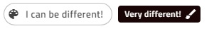

### Chip

[`IgxChip`]({environment:angularApiUrl}/classes/igxchipcomponent.html) は情報を小さな楕円内に表示する視覚的なコンポーネントです。Chip は、テンプレート化、削除、選択が可能で複数の Chip の順序を変更して視覚的に接続することもできます。Chip は「チップ領域」と呼ばれるコンテナーに配置され、このコンテナーは Chip の間の操作を管理します。

#### デモ

<div class="sample-container loading" style="height:650px">
    <iframe id="chip-sample-iframe  " src='{environment:demosBaseUrl}/chip-sample' width="100%" height="100%" seamless frameBorder="0" onload="onSampleIframeContentLoaded(this);"></iframe>
</div>
<br/>
<div>
<button data-localize="stackblitz" disabled class="stackblitz-btn" data-iframe-id="chip-sample-iframe" data-demos-base-url="{environment:demosBaseUrl}">StackBlitz で開く</button>
</div>

#### Chip の初期化

[`IgxChipComponent`]({environment:angularApiUrl}/classes/igxchipcomponent.html) はチップ要素のメイン クラスで [`IgxChipsAreaComponent`]({environment:angularApiUrl}/classes/igxchipsareacomponent.html) はチップ領域のメイン クラスです。チップ領域はチップの間の操作 (ドラッグ、選択、ナビゲーションなど) が必要の複雑なシナリオの処理で使用されます。[`IgxChipComponent`]({environment:angularApiUrl}/classes/igxchipcomponent.html) には、`id`]({environment:angularApiUrl}/classes/igxchipcomponent.html#id) 入力があるため、他のチップと簡単に識別できます。[`id`]({environment:angularApiUrl}/classes/igxchipcomponent.html#id) がない場合は自動的に生成します。

[`igxChip`]({environment:angularApiUrl}/classes/igxchipcomponent.html) を [`igxChipArea`]({environment:angularApiUrl}/classes/igxchipsareacomponent.html) と使用した例:

```html
<igx-chips-area>
    <igx-chip *ngFor="let chip of chipList" [id]="chip.id">
        <span>{{chip.text}}</span>
    </igx-chip>
</igx-chips-area>
```

Chip states:

  

### 機能

#### 選択


セクションは入力 [`selectable`]({environment:angularApiUrl}/classes/igxchipcomponent.html#selectable) を設定して有効にできます。チップをクリックするか、チップを `Tab` キーによってフォーカスして `Space` キーを押すと選択できます。選択されたチップをクリックするか、チップがフォーカスされる場合に `Space` キーを押すと選択解除できます。

イベント [`onSelection`]({environment:angularApiUrl}/classes/igxchipcomponent.html#onselection) は、[`igxChip`]({environment:angularApiUrl}/classes/igxchipcomponent.html) 変更の選択ステートが変更されたときに発生されます。新しい [`selected`]({environment:angularApiUrl}/interfaces/ichipselecteventargs.html#selected) 値を提供することにより、新しいステートとこの選択の変更をトリガーした [`originalEvent`]({environment:angularApiUrl}/interfaces/ichipselecteventargs.html#originalevent) の元のイベントを取得できます。インタラクションによって行わない場合は [`selected`]({environment:angularApiUrl}/interfaces/ichipselecteventargs.html#selected) をコードで設定します。[`originalEvent`]({environment:angularApiUrl}/interfaces/ichipselecteventargs.html#originalevent) 引数に値 `null` があります。

デフォルトでアイコンがチップが選択されていることを示します。詳細なカスタマイズが可能で [`selectIcon`]({environment:angularApiUrl}/classes/igxchipcomponent.html#selecticon) 入力によって行うことができます。型 `TemplateRef` の値を受け取り、同じ機能を保持する際にデフォルト アイコンをオーバーライドします。

選択アイコンのカスタマイズ例:


```html
<igx-chips-area #chipsArea>
    <igx-chip *ngFor="let chip of chipList" [selectable]="'true'" [selectIcon]="mySelectIcon">
        <igx-icon igxPrefix>{{chip.icon}}</igx-icon>
        <span>{{chip.text}}</span>
    </igx-chip>
</igx-chips-area>
<ng-template #mySelectIcon>
    <igx-icon fontSet="fa-solid" name="fa-check-circle"></igx-icon>
</ng-template>
```

#### 削除


削除は、[`removable`]({environment:angularApiUrl}/classes/igxchipcomponent.html#removable) 入力を `true` に設定して有効にできます。有効な場合は、チップの最後に削除ボタンが描画されます。チップのフォーカス時に削除ボタンのクリックまたは `Delete` キーの押下などエンドユーザーがインタラクションを実行した場合、 [`onRemove`]({environment:angularApiUrl}/classes/igxchipcomponent.html#onremove) イベントが発生されます。 

チップはユーザーがチップを削除したい場合に自体をデフォルトでテンプレートから削除しません。[`onRemove`]({environment:angularApiUrl}/classes/igxchipcomponent.html#onremove) イベントを使用して手動で対応する必要があります。

削除アイコンをカスタマイズする必要がある場合、[`removeIcon`]({environment:angularApiUrl}/classes/igxchipcomponent.html#removeicon) 入力を使用できます。型 `TemplateRef` の値を取得してデフォルトの削除アイコンの代わりに描画します。つまり、チップ自体ですべて処理されている際も削除ボタンを自由にカスタマイズできます。


チップ削除の処理と削除アイコンのカスタマイズ例:

```html
<igx-chips-area #chipsArea>
    <igx-chip *ngFor="let chip of chipList" [id]="chip.id" [removable]="true" [removeIcon]="myRemoveIcon" (onRemove)="chipRemoved($event)">
        <igx-icon igxPrefix>{{chip.icon}}</igx-icon>
        <span>{{chip.text}}</span>
    </igx-chip>
</igx-chips-area>
<ng-template #myRemoveIcon>
    <igx-icon fontSet="fa-solid" name="fa-trash-alt"></igx-icon>
</ng-template>
```

```typescript
public chipRemoved(event) {
    this.chipList = this.chipList.filter((item) => {
        return item.id !== event.owner.id;
    });
    this.changeDetectionRef.detectChanges();
}
```

#### 移動/ドラッグ


チップの位置を変更するためにユーザーによってドラッグできます。移動/ドラグ機能はデフォルトで無効ですが、[`draggable`]({environment:angularApiUrl}/classes/igxchipcomponent.html#draggable) オプションを使用して有効にできます。データソースでチップの移動を手動的に処理する必要があります。

```html
<igx-chips-area (onReorder)="chipsOrderChanged($event)">
    <igx-chip *ngFor="let chip of chipList" [draggable]="'true'">
        <igx-icon igxPrefix>{{chipElem.icon}}</igx-icon>
        {{chip.text}}
    </igx-chip>
</igx-chips-area>
```

```typescript
public chipsOrderChanged(event) {
    const newChipList = [];
    for (const chip of event.chipsArray) {
        const chipItem = this.chipList.filter((item) => {
            return item.id === chip.id;
        })[0];
        newChipList.push(chipItem);
    }
    this.chipList = newChipList;
}
```

#### Chip テンプレート

[`IgxChipComponent`]({environment:angularApiUrl}/classes/igxchipcomponent.html) の主要な構造は、`select icon`, [`prefix`]({environment:angularApiUrl}/classes/igxprefixdirective.html)、`chip content`、[`suffix`]({environment:angularApiUrl}/classes/igxsuffixdirective.html) と `remove button` で構成されています。すべての要素のテンプレート化できます。

チップのコンテンツは、チップの [`prefix`]({environment:angularApiUrl}/classes/igxprefixdirective.html) および [`suffix`]({environment:angularApiUrl}/classes/igxsuffixdirective.html) を定義する要素以外のテンプレートに定義されるコンテンツです。コンテンツ タイプを定義できます。

[`prefix`]({environment:angularApiUrl}/classes/igxprefixdirective.html) と [`suffix`]({environment:angularApiUrl}/classes/igxsuffixdirective.html) は、テンプレート化可能な実際のチップ領域内の要素です。[`IgxPrefix`]({environment:angularApiUrl}/classes/igxprefixdirective.html) と [`IxgSuffix`]({environment:angularApiUrl}/classes/igxsuffixdirective.html) それぞれのディレクティブを使用して指定できます。


[`prefix`]({environment:angularApiUrl}/classes/igxprefixdirective.html) と [`suffix`]({environment:angularApiUrl}/classes/igxsuffixdirective.html) 両方のアイコンを使用した例と `content` のテキスト:

```html
<igx-chip>
    <igx-icon igxPrefix>insert_emoticon</igx-icon>
    <igx-icon igxSuffix style="transform: rotate(180deg)">insert_emoticon</igx-icon>
    <span>Why not both?</span>
</igx-chip>
```

チップの描画を [`displayDensity`]({environment:angularApiUrl}/classes/igxchipcomponent.html#displaydensity) してカスタマイズしディメンションを変更できます。デフォルトで `comfortable` に設定されます。チップ内すべてが相対位置を保持する際に `cosy` または `compact` に設定できます。 


```html
<igx-chip>Hi! My name is Chip!</igx-chip>

<igx-chip displayDensity="cosy">
    I can be smaller!
</igx-chip>

<igx-chip displayDensity="compact">
    <igx-icon igxPrefix>child_care</igx-icon>
    Even tiny!
</igx-chip>
```

以下はチップを更にカスタマイズした例です。



#### キーボード ナビゲーション

チップをフォーカスするには `Tab` キーを押すか、それをクリックします。チップを順序変更するにはキーボード ナビゲーションを使用します。

- チップがフォーカスされた場合のキーボード コントロール:

  - <kbd>LEFT</kbd> - チップのフォーカスを左へ移動します。

    

  - <kbd>RIGHT</kbd> - チップのフォーカスを右へ移動します。 

    

  - <kbd>SPACE</kbd> - チップが選択可能な場合、選択を切り替えます。

    
  - <kbd>DELETE</kbd> - [`igxChip`]({environment:angularApiUrl}/classes/igxchipcomponent.html) の [`onRemove`]({environment:angularApiUrl}/classes/igxchipcomponent.html#onremove) イベントをトリガーし、チップ削除が手動で処理されます。
  - <kbd>SHIFT</kbd> + <kbd>LEFT</kbd> - 現在フォーカスされたチップは左に位置を移動した際に [`igxChipArea`]({environment:angularApiUrl}/classes/igxchipsareacomponent.html) の [`onReorder`]({environment:angularApiUrl}/classes/igxchipsareacomponent.html#onreorder) イベントをトリガーします。
  - <kbd>SHIFT</kbd> + <kbd>RIGHT</kbd> - 現在フォーカスされたチップは右に位置を移動した際に [`igxChipArea`]({environment:angularApiUrl}/classes/igxchipsareacomponent.html) の [`onReorder`]({environment:angularApiUrl}/classes/igxchipsareacomponent.html#onreorder) イベントをトリガーします。

- 削除ボタンがフォーカスされた場合のキーボード コントロール:

  - <kbd>SPACE</kbd> または <kbd>ENTER</kbd> チップの削除を手動的に処理するために [`onRemove`]({environment:angularApiUrl}/classes/igxchipcomponent.html#onremove) 出力を発生します。

### API

* [IgxChipComponent]({environment:angularApiUrl}/classes/igxchipcomponent.html)
* [IgxChipComponent スタイル]({environment:sassApiUrl}/index.html#function-igx-chip-theme)
* [IgxChipsAreaComponent]({environment:angularApiUrl}/classes/igxchipsareacomponent.html)
* [IgxPrefixDirective]({environment:angularApiUrl}/classes/igxprefixdirective.html)
* [IgxSuffixDirective]({environment:angularApiUrl}/classes/igxsuffixdirective.html)

### 参照

<div class="divider--half"></div>
コミュニティに参加して新しいアイデアをご提案ください。

- [Ignite UI for Angular **フォーラム** (英語)](https://www.infragistics.com/community/forums/f/ignite-ui-for-angular)
- [Ignite UI for Angular **GitHub** (英語)](https://github.com/IgniteUI/igniteui-angular)
