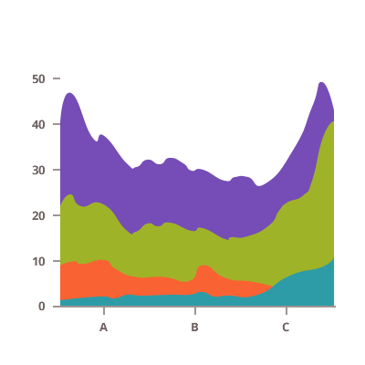
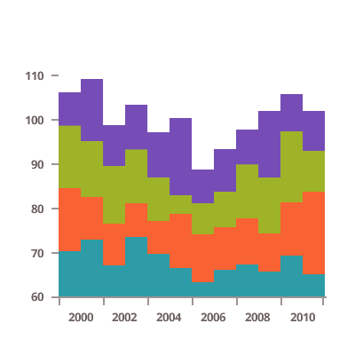
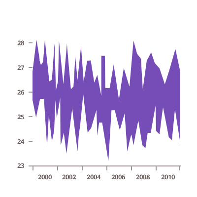
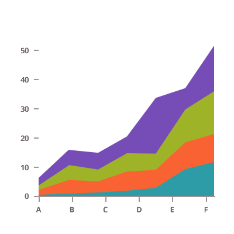
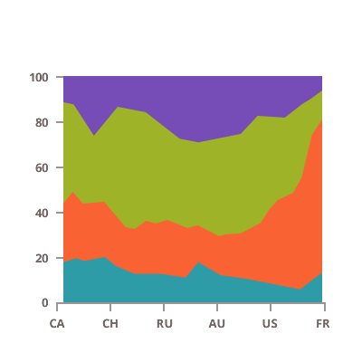
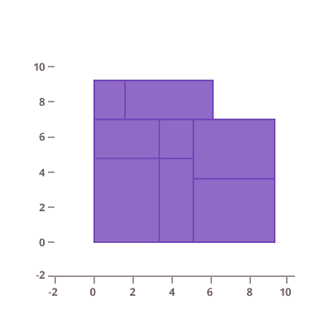
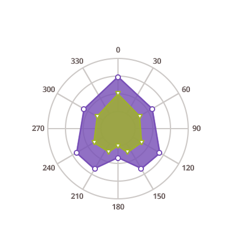

# Angular エリア チャート

Ignite UI for Angular は以下のタイプのエリア チャートを提供します。

<section>
    
    <body>
        

            

                
エリア チャート

                
            

        

        

            

                
スプライン エリア チャート

                
            

        

        

            

                
ステップ エリア チャート

                
            

        

        

            

                
範囲エリア チャート

                
            

        

         
        

            

                
積層型エリア チャート

                
            

        

        

            

                
積層型スプライン エリア チャート

                
            

        

        

            

                
積層型 100 エリア チャート

                
            

        

        

            

                
積層型 100 スプライン エリア チャート

                
            

        

         
        

            

                
散布エリア チャート

                
            

        

        

            

                
散布ポリゴン チャート

                
            

        

         
        

            

                
ポーラ エリア チャート

                
            

        

        

            

                
極座標スプライン エリア チャート

                
            

        

        

            

                
ラジアル エリア チャート

                
            

        

    </body>
</section>
