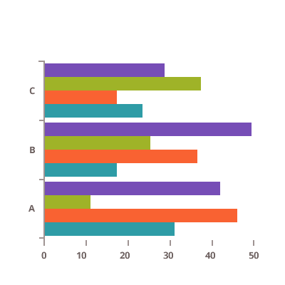
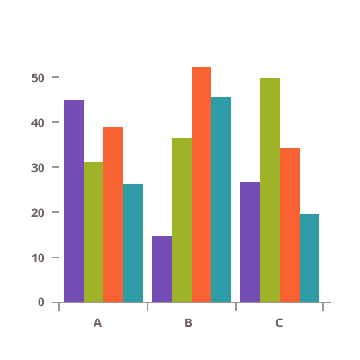
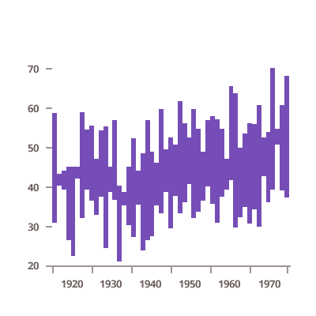
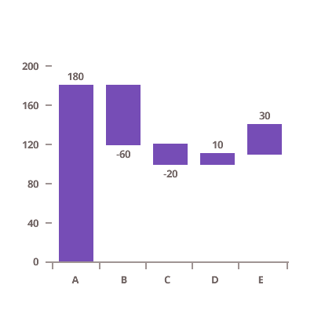
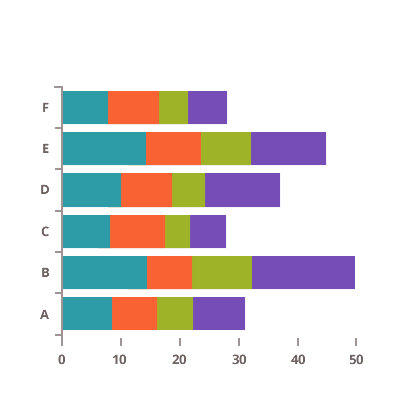
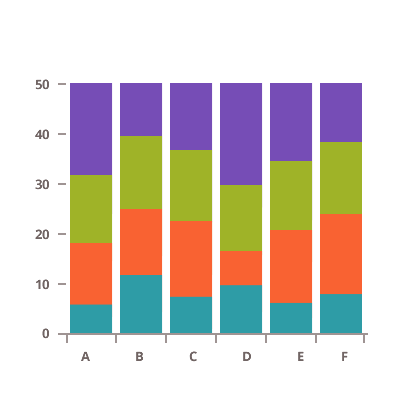
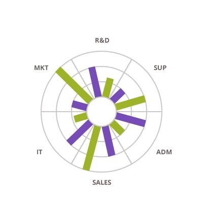

## 棒・縦棒チャート

<section class="feature__container">
    
    <body>
        <a class="link" href="data-chart-type-category-bar-series.md">
            

                <h4>棒チャート</h4>
                
            

        </a>
        <a class="link" href="data-chart-type-category-column-series.md">
            

                <h4>縦棒チャート</h4>
                
            

        </a>
        <a class="link" href="data-chart-type-range-column-series.md">
            

                <h4>範囲縦棒チャート</h4>
                
            

        </a>
        <a class="link" href="data-chart-type-category-waterfall-series.md">
            

                <h4>ウォーターフォール チャート</h4>
                
            

        </a>
         
        <a class="link" href="data-chart-type-stacked-bar-series.md">
            

                <h4>積層型棒チャート</h4>
                
            

        </a>
        <a class="link" href="data-chart-type-stacked-column-series.md">
            

                <h4>積層型縦棒チャート</h4>
                
            

        </a>
        <a class="link" href="data-chart-type-stacked-100-bar-series.md">
            

                <h4>積層型 100 棒チャート</h4>
                
            

        </a>
        <a class="link" href="data-chart-type-stacked-100-column-series.md">
            

                <h4>積層型 100 縦棒チャート</h4>
                
            

        </a>
         
        <a class="link" href="data-chart-type-radial-column-series.md">
            

                <h4>ラジアル状縦棒チャート</h4>
                
            

        </a>
    </body>
</section>
