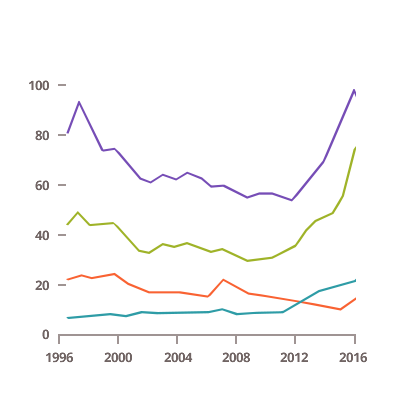

# Angular 折れ線チャート

Ignite UI for Angular は以下のタイプの折れ線チャートを提供します。

<section>
    
    <body>
        

            

                
折れ線チャート

                
            

        

        

            

                
スプライン チャート

                
            

        

        

            

                
ステップ折れ線チャート

                
            

        

         
        

            

                
積層型折れ線チャート

                
            

        

        

            

                
積層型スプライン チャート

                
            

        

        

            

                
積層型 100 折れ線チャート

                
            

        

        

            

                
積層型 100 スプライン チャート

                
            

        

         
        

            

                
散布折れ線チャート

                
            

        

        

            

                
散布スプライン チャート

                
            

        

        

            

                
散布ポリライン チャート

                
            

        

        

            

                
散布等高線チャート

                
            

        

         
        

            

                
ポーラ折れ線チャート

                
            

        

        

            

                
極座標スプライン チャート

                
            

        

        

            

                
ラジアル折れ線チャート

                
            

        

    </body>
</section>
