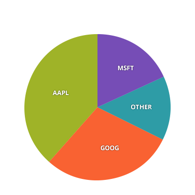

# Angular 円・ドーナツ型チャート

Ignite UI for Angular は以下のタイプの円チャートを提供します。

<section class="feature__container">
    
    <body>
        

            

                
ドーナッツ チャート

                
            

        

        

            

                
円チャート

                
            

        

        

            

                
ラジアル状円チャート

                
            

        

    </body>
</section>
