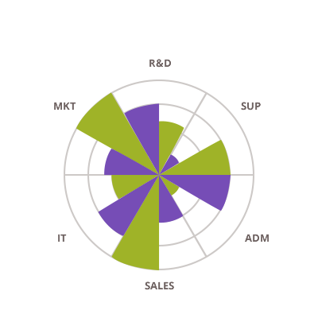

## 円・ドーナツ型チャート

<section class="feature__container">
    
    <body>
        <a class="link" href="doughnut-chart.md">
            

                <h4>Doughnut Chart</h4>
                
            

        </a>
        <a class="link" href="pie-chart.md">
            

                <h4>円チャート</h4>
                
            

        </a>
        <a class="link" href="data-chart-type-radial-pie-series.md">
            

                <h4>ラジアル状円チャート</h4>
                
            

        </a>
    </body>
</section>
