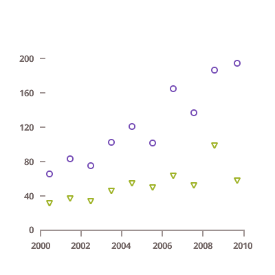

## Point Charts

<section class="feature__container">
    
    <body>
        <a class="link" href="data-chart-type-category-point-series.md">
            

                <h4>ポイント チャート</h4>
                
            

        </a>
        <a class="link" href="data-chart-type-scatter-point-series.md">
            

                <h4>Scatter Marker Chart</h4>
                
            

        </a>
        <a class="link" href="data-chart-type-scatter-bubble-series.md">
            

                <h4>Scatter Bubble Chart</h4>
                
            

        </a>
        <a class="link" href="data-chart-type-polar-scatter-series.md">
            

                <h4>Polar Scatter Chart</h4>
                
            

        </a>
        <!-- <a class="link" href="data-chart-type-scatter-hd-series.md">
            

                <h4>Scatter High Density Chart</h4>
                
            

        </a> -->
    </body>
</section>
