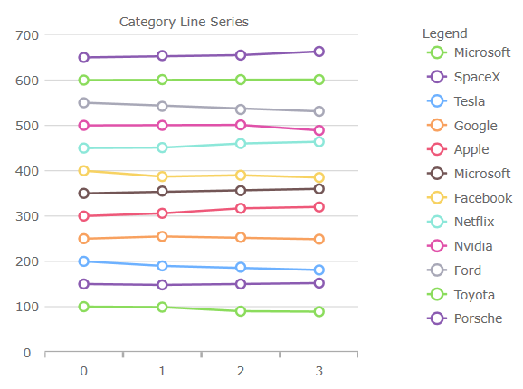
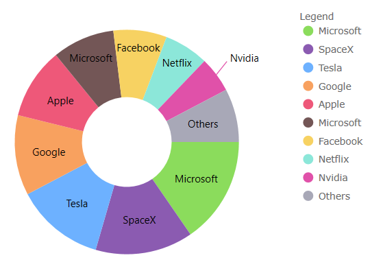

# Ignite UI for Angular 変更ログ (データ可視化)

<div class="divider--half"></div>

<!-- Angular -->

> [!NOTE]
> このファイルは、igniteui-angular-\* パッケージ (例: igniteui-angular-charts) のみに固有です。
>
> 追加の変更については、[Ignite UI Angular 変更](https://github.com/igniteui/igniteui-angular/blob/master/changelog.md)を参照してください。
>
> <!-- end: Angular -->

<div class="divider--half"></div>

このプロジェクトの各バージョンのすべての注目すべき変更は、このファイルに文書化されます。

## **11.2.0**

### チャート

このリリースでは、すべてのチャート コンポーネント、例えば、データ チャート、カテゴリ チャート、およびファイナンシャル チャートに、いくつかの新しく改善されたビジュアル デザインと構成オプションが導入されています。

チャート デフォルト値のデザイン更新:

-   すべてのチャートのシリーズ/マーカーの新しい色パレット。すべてのタイプのチャート/シリーズには、ブラシ/塗りつぶしとアウトラインの新しい色があります。 

| 古いシリーズのブラシのアウトライン   | 新シリーズのブラシのアウトライン    |
| ------------------- | ------------------- |
| `Color_001=#7446B9` | `Color_001=#8bdc5c` |
| `Color_002=#9FB328` | `Color_002=#8b5bb1` |
| `Color_003=#F96232` | `Color_003=#6db1ff` |
| `Color_004=#2E9CA6` | `Color_004=#f8a15f` |
| `Color_005=#DC3F76` | `Color_005=#ee5879` |
| `Color_006=#FF9800` | `Color_006=#735656` |
| `Color_007=#3F51B5` | `Color_007=#f7d262` |
| `Color_008=#439C47` | `Color_008=#8ce7d9` |
| `Color_009=#795548` | `Color_009=#e051a9` |
| `Color_010=#9A9A9A` | `Color_010=#a8a8b7` |

例

|  |  |
| ----------------------------------------------------------------- | ----------------------------------------------------------------- |
|  |  |

<div class="divider--half"></div>

-   棒/縦棒/ウォーターフォール シリーズを、角丸ではなく角が四角になるように変更しました。 
-   散布高密度シリーズの最小/最大ヒート プロパティの色を変更しました。

    | 古いヒート最小色    | 新しいヒート最小色   |
    | ----------- | ----------- |
    | `#FF7446B9` | `#ff8b5bb1` |

    | 古いヒート最大色    | 新しいヒート最大色   |
    | ----------- | ----------- |
    | `#FFC62828` | `#ffee5879` |

-   ファイナンシャル/ウォーターフォール シリーズのビジュアルの負の塗りつぶしの色を変更しました。 

    | 古いマイナス値のブラシ | 新しいマイナス値のブラシ |
    | ----------- | ------------ |
    | `#FFC62828` | `#ffee5879`  |

-   マーカーの厚さを 1px から 2px に変更しました。
-   PointSeries、BubbleSeries、ScatterSeries、PolarScatterSeries のマーカーのアウトラインに一致するようにマーカーの塗りつぶしを変更しました。
    -   `MarkerFillMode` プロパティを Normal に設定すると、この変更を元に戻すことができます。
-   TimeXAxis および OrdinalTimeXAxis のラベリングを圧縮しました。
-   新しいマーカー プロパティ:
    -   `MarkerFillMode` - マーカーがアウトラインに依存するように、'MatchMarkerOutline' に設定できます。
    -   `MarkerFillOpacity` - 0〜1 の値に設定できます。
    -   `MarkerOutlineMode` - マーカーのアウトラインが塗りブラシの色に依存するように、'MatchMarkerBrush' に設定できます。
-   新シリーズ `OutlineMode` プロパティ:
    -   シリーズ アウトラインの表示を切り替えるように設定できます。データ チャートの場合、プロパティはシリーズ上にあることに注意してください。
-   新しいプロット エリア マージン プロパティ:
    -   `PlotAreaMarginLeft` 
    -   `PlotAreaMarginTop`
    -   `PlotAreaMarginRight`
    -   `PlotAreaMarginBottom`
    -   [`ComputedPlotAreaMarginMode`]({environment:dvApiBaseUrl}/products/ignite-ui-angular/api/docs/typescript/latest/enums/computedplotareamarginmode.html)
    -   プロット領域のマージン プロパティは、チャートがデフォルト ズーム レベルにある場合、ビューポートのブリード オーバー領域を定義します。一般的な使用例では、軸と最初/最後のデータ ポイントの間にスペースを提供します。以下にリストされている [`ComputedPlotAreaMarginMode`]({environment:dvApiBaseUrl}/products/ignite-ui-angular/api/docs/typescript/latest/enums/computedplotareamarginmode.html) は、マーカーが有効になっているときに自動的にマージンを設定することに注意してください。その他は、厚さを表す `Double` を指定するように設計されており、PlotAreaMarginLeft などがチャートの 4 辺すべてにスペースを調整します。  
-   新しい強調表示プロパティ:
    -   [`HighlightingMode`]({environment:dvApiBaseUrl}/products/ignite-ui-angular/api/docs/typescript/latest/enums/highlightingmode.html) - ホバーされたシリーズとホバーされていないシリーズをフェードまたは明るくするかを設定します。
    -   `HighlightingBehavior` - 真上または最も近い項目など、マウスの位置に応じてシリーズを強調表示するかどうかを設定します。
    -   以前のリリースでは、強調表示はホバー時にフェードするように制限されていたことに注意してください。 
-   次のシリーズの強調表示を追加しました:
    -   積層型
    -   散布図
    -   極座標
    -   ラジアル 
    -   図形
-   次のシリーズに注釈レイヤーを追加しました:
    -   積層型
    -   散布図
    -   極座標
    -   ラジアル
    -   図形
-   積層型シリーズ内の個々の積層フラグメントのデータ ソースをオーバーライドするためのサポートが追加されました。 
-   積層型、散布、範囲、極座標、ラジアル、シェイプ シリーズにカスタム スタイルのイベントを追加しました。
-   垂直ズームをシリーズ コンテンツに自動的に同期するサポートが追加されました。
-   表示された最初のラベルに基づいてチャートの水平マージンを自動的に拡張するサポートが追加されました。

### チャート凡例

-   ItemLegend に水平方向を追加しました。
    -   次のチャート タイプでは、ItemLegend を水平方向で使用できます:
        -   バブル
        -   ドーナツ
        -   円 
-   [`LegendHighlightingMode`]({environment:dvApiBaseUrl}/products/ignite-ui-angular/api/docs/typescript/latest/enums/legendhighlightingmode.html) - 凡例項目にカーソルを合わせると、シリーズの強調表示が有効になります。

### 地理マップ

> [!NOTE]
> これらの機能は CTP です。

-   マップの表示を折り返すためのサポートが追加されました (水平方向に無限にスクロールできます)。  
-   座標原点を折り返しながら、一部のマップ シリーズの表示をシフトするためのサポートが追加されました。  
-   シェイプ シリーズの強調表示のサポートが追加されました。
-   シェイプ シリーズの一部の注釈レイヤーのサポートが追加されました。

<div class="divider--half"></div>

<div class="divider--half"></div>

<div class="divider--half"></div>

<!-- Angular, React, WebComponents -->

## **8.2.12**

-   import ステートメントの変更

Import ステートメントは、API クラスと列挙型へのフル パスではなくパッケージ名のみを使用するように簡素化されました。

> [!NOTE]
> これらの重大な変更は、これらのパッケージとコンポーネントでのみ導入されました:

| 影響されるパッケージ                                                                                                                     | 影響されるコンポーネント                                                                         |
| ------------------------------------------------------------------------------------------------------------------------------ | ------------------------------------------------------------------------------------ |
| <a href="https://www.npmjs.com/package/igniteui-angular-excel/v/8.2.12" target="_blank">igniteui-angular-excel</a>             | [Excel ライブラリ](excel-library.md)                                                      |
| <a href="https://www.npmjs.com/package/igniteui-angular-spreadsheet/v/8.2.12" target="_blank">igniteui-angular-spreadsheet</a> | [スプレッドシート](spreadsheet-overview.md)                                                  |
| <a href="https://www.npmjs.com/package/igniteui-angular-maps/v/8.2.12" target="_blank">igniteui-angular-maps</a>               | [マップ](geo-map.md)、[ツリーマップ](treemap-overview.md)                                      |
| <a href="https://www.npmjs.com/package/igniteui-angular-gauges/v/8.2.12" target="_blank">igniteui-angular-gauges</a>           | [ブレット グラフ](bullet-graph.md)、[リニア ゲージ](linear-gauge.md)、[ラジアル ゲージ](radial-gauge.md)   |
| <a href="https://www.npmjs.com/package/igniteui-angular-charts/v/8.2.12" target="_blank">igniteui-angular-charts</a>           | カテゴリ チャート、データ チャート、ドーナツ チャート、ファイナンシャル チャート、円チャート、[ズーム スライダー](zoomslider-overview.md) |
| <a href="https://www.npmjs.com/package/igniteui-angular-grids/v/8.2.12" target="_blank">igniteui-angular-grids</a>             | [データ グリッド](data-grid.md)                                                             |
| <a href="https://www.npmjs.com/package/igniteui-angular-core/v/8.2.12" target="_blank">igniteui-angular-core</a>               | すべてのクラスと列挙型                                                                          |

-   変更後のコード

API クラスと列挙型へのフル パスの代わりにパッケージ名のみを使用できます。

注: Data Grid コンポーネントとそれに対応するモジュールの名前も変更されました

```ts
// gauges:
import { IgxLinearGauge } from "igniteui-angular-gauges";
import { IgxLinearGaugeModule } from "igniteui-angular-gauges";
import { IgxLinearGraphRange } from "igniteui-angular-gauges";

import { IgxRadialGauge } from 'igniteui-angular-gauges}';
import { IgxRadialGaugeModule } from 'igniteui-angular-gauges';
import { IgxRadialGaugeRange } from 'igniteui-angular-gauges';
import { SweepDirection } from 'igniteui-angular-core';

// charts:
import { IgxFinancialChartComponent } from "igniteui-angular-charts";
import { IgxFinancialChartModule } from "igniteui-angular-charts";
import { IgxDataChartComponent } from "igniteui-angular-charts";
import { IgxDataChartCoreModule } from "igniteui-angular-charts";

// maps:
import { IgxGeographicMapComponent } from "igniteui-angular-maps";
import { IgxGeographicMapModule } from "igniteui-angular-maps";
```

-   変更前のコード

以前は、API クラスと列挙型への完全なパスを使用してインポートする必要がありました。

```ts
// gauges:
import { IgxLinearGaugeComponent } from 'igniteui-webcomponents-gauges/ES5/igx-linear-gauge-component';
import { IgxLinearGaugeModule } from 'igniteui-webcomponents-gauges/ES5/igx-linear-gauge-module';
import { IgxLinearGraphRange } from 'igniteui-webcomponents-gauges/ES5/igx-linear-graph-range';

import { IgxRadialGaugeComponent } from "igniteui-webcomponents-gauges/ES5/igx-radial-gauge-component";
import { IgxRadialGaugeModule } from "igniteui-webcomponents-gauges/ES5/igx-radial-gauge-module";
import { IgxRadialGaugeRange } from "igniteui-webcomponents-gauges/ES5/igx-radial-gauge-range";
import { SweepDirection } from "igniteui-webcomponents-core/ES5/SweepDirection";

// charts:
import { IgxFinancialChartComponent } from "igniteui-webcomponents-charts/ES5/igx-financial-chart-component";
import { IgxFinancialChartModule } from "igniteui-webcomponents-charts/ES5/igx-financial-chart-module";
import { IgxDataChartComponent } from "igniteui-webcomponents-charts/ES5/igx-data-chart-component";
import { IgxDataChartCoreModule } from "igniteui-webcomponents-charts/ES5/igx-data-chart-core-module";

// maps:
import { IgxGeographicMapComponent } from "igniteui-webcomponents-maps/ES5/igx-geographic-map-component";
import { IgxGeographicMapModule } from "igniteui-webcomponents-maps/ES5/igx-geographic-map-module";
```

<!-- end: Angular, React, WebComponents -->
