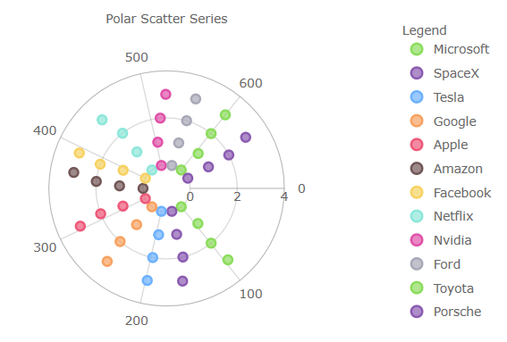

# Ignite UI for Angular 変更ログ

Ignite UI for Angular の各バージョンのすべての重要な変更は、このページに記載されています。

> \[!Note]
> このトピックでは、igniteui-angular パッケージに含まれていないコンポーネントの変更についてのみ説明します。
> igniteui-angular コンポーネントに固有の変更については、[Ignite UI Angular 変更](https://github.com/igniteui/igniteui-angular/blob/master/changelog.md) の CHANGELOG.MD を参照してください。

## **17.2.0 (January 2024)**

### igniteui-angular-charts チャート

*   [チャート強調表示フィルター](charts/features/chart-highlight-filter.md) - [`IgxCategoryChartComponent`]({environment:dvApiBaseUrl}/products/ignite-ui-angular/api/docs/typescript/latest/classes/igniteui_angular_charts.igxcategorychartcomponent.html) と `DataChart` は、データのサブセットの内外で強調表示およびアニメーション化する方法を公開するようになりました。この強調表示の表示はシリーズのタイプによって異なります。列およびエリア シリーズの場合、サブセットはデータの合計セットの上に表示され、サブセットはシリーズの実際のブラシによって色付けされ、合計セットは不透明度を下げます。折れ線シリーズの場合、サブセットは点線で表示されます。

## **17.0.0 (November 2023)**

### igniteui-angular-grids (Toolbar - ベータ版)

*   クリップボードを介してチャートを画像に保存するための新しいツールがデフォルトのツールとして追加されました。
*   ツールバーの [`orientation`]({environment:dvApiBaseUrl}/products/ignite-ui-angular/api/docs/typescript/latest/classes/igniteui_angular_layouts.igxtoolbarcomponent.html#orientation) プロパティを介して垂直方向が追加されました。デフォルトでは、ツールバーは水平方向ですが、ツールバーを垂直方向に表示できるようになり、ツールが左右にポップアップ表示されます。
*   ツールバーの `renderImageFromText` メソッドを介してカスタム SVG アイコンのサポートが追加され、カスタム ツールの作成がさらに強化されました。

## **16.1.0 (June 2023)**

### 新しいコンポーネント

*   [Toolbar](menus/toolbar.md) - ベータ版。このコンポーネントは、主にチャート コンポーネントで使用される UI 操作のコンパニオン コンテナーです。ツールバーは、[`IgxDataChartComponent`]({environment:dvApiBaseUrl}/products/ignite-ui-angular/api/docs/typescript/latest/classes/igniteui_angular_charts.igxdatachartcomponent.html) または [`IgxCategoryChartComponent`]({environment:dvApiBaseUrl}/products/ignite-ui-angular/api/docs/typescript/latest/classes/igniteui_angular_charts.igxcategorychartcomponent.html) コンポーネントにリンクされると、プロパティとツール項目のプリセットで動的に更新されます。プロジェクト用のカスタム ツールを作成して、エンド ユーザーが変更を提供できるようになり、無限のカスタマイズが可能になります。

### igniteui-angular-charts チャート

*   [ValueLayer](charts/features/chart-overlays.md#angular-value-layer) - [`IgxValueLayerComponent`]({environment:dvApiBaseUrl}/products/ignite-ui-angular/api/docs/typescript/latest/classes/igniteui_angular_charts.igxvaluelayercomponent.html) という名前の新しいシリーズ タイプが公開されました。これにより、Maximum、Minimum、Average など、プロットされたデータのさまざまな焦点のオーバーレイを描画できます。これは、新しい [`valueLines`]({environment:dvApiBaseUrl}/products/ignite-ui-angular/api/docs/typescript/latest/classes/igniteui_angular_charts.igxdomainchartcomponent.html#valueLines) コレクションに追加することで、[`IgxCategoryChartComponent`]({environment:dvApiBaseUrl}/products/ignite-ui-angular/api/docs/typescript/latest/classes/igniteui_angular_charts.igxcategorychartcomponent.html) と [`IgxFinancialChartComponent`]({environment:dvApiBaseUrl}/products/ignite-ui-angular/api/docs/typescript/latest/classes/igniteui_angular_charts.igxfinancialchartcomponent.html) に適用されます。

*   **ダッシュ配列**を [`IgxDataChartComponent`]({environment:dvApiBaseUrl}/products/ignite-ui-angular/api/docs/typescript/latest/classes/igniteui_angular_charts.igxdatachartcomponent.html) のシリーズのさまざまな部分に適用できるようになりました。これは、チャートにプロットされた[シリーズ](charts/types/line-chart.md#angular-折れ線チャートのスタイル設定)、チャートの[グリッド線](charts/features/chart-axis-gridlines.md#angular-軸グリッド線のプロパティ)、およびチャートにプロットされたシリーズの[トレンドライン](charts/features/chart-trendlines.md#angular-チャート-トレンドラインのダッシュ配列の例)に適用できます。

## **16.0.0 (May 2023)**

*   Angular 16 のサポート。

## **15.0.0 (December 2022)**

*   Angular 15 のサポート。

## **14.2.0 (November 2022)**

デフォルトの動作を大幅に改善し、カテゴリ チャート API を改良して使いやすくしました。

これらの新しいチャートの改善点は次のとおりです:

*   ブラウザー / 画面サイズに基づいた水平ラベル回転のレスポンシブ レイアウト。
*   すべてのプラットフォームでの丸型ラベルの描画が強化されました。
*   StackedFragmentSeries にマーカー プロパティを追加しました。
*   [`shouldPanOnMaximumZoom`]({environment:dvApiBaseUrl}/products/ignite-ui-angular/api/docs/typescript/latest/classes/igniteui_angular_charts.igxseriesviewercomponent.html#shouldPanOnMaximumZoom) プロパティを追加しました。
*   新しいカテゴリ軸プロパティ:
    *   ZoomMaximumCategoryRange
    *   ZoomMaximumItemSpan
    *   ZoomToCategoryRange
    *   ZoomToItemSpan
*   カテゴリの文字列と数値をグループ化、ソート、集計するための新しい[チャート集計](charts/features/chart-data-aggregations.md) API により、チャート データを事前に集計または計算する必要がなくなります。
    *   InitialSortDescriptions
    *   InitialSorts
    *   SortDescriptions
    *   InitialGroups
    *   InitialGroupDescriptions
    *   GroupDescriptions
    *   InitialSummaries
    *   InitialSummaryDescriptions
    *   SummaryDescriptions
    *   InitialGroupSortDescriptions
    *   GroupSorts
    *   GroupSortDescriptions

> \[!Note]
> [`includedProperties`]({environment:dvApiBaseUrl}/products/ignite-ui-angular/api/docs/typescript/latest/classes/igniteui_angular_charts.igxdomainchartcomponent.html#includedProperties) | [`excludedProperties`]({environment:dvApiBaseUrl}/products/ignite-ui-angular/api/docs/typescript/latest/classes/igniteui_angular_charts.igxdomainchartcomponent.html#excludedProperties) を使用している場合、チャートの[集計](charts/features/chart-data-aggregations.md)は機能しません。これらのプロパティは非集計データ用です。データを集計しようとすると、これらのプロパティは使用できなくなります。うまくいかない理由は、描画のためにチャートに渡されたコレクションを集計により置き換えるためです。include/exclude プロパティは、そのデータの in/out プロパティをフィルターするように設計されており、それらのプロパティは新しい集計されたコレクションには存在しません。

## **13.2.0 (June 2022)**

### igniteui-angular-charts (チャート)

*   高度に構成可能な [DataLegend](charts/features/chart-data-legend.md) コンポーネントが追加されました。これは、[`IgxLegendComponent`]({environment:dvApiBaseUrl}/products/ignite-ui-angular/api/docs/typescript/latest/classes/igniteui_angular_charts.igxlegendcomponent.html) とよく似たコンポーネントですが、シリーズの値を表示し、シリーズの行と値の列をフィルタリングし、値のスタイルとフォーマットを行うための多くの構成プロパティを提供します。
*   高度に構成可能な [DataToolTip](charts/features/chart-data-tooltip.md) が追加されました。これは、シリーズの値とタイトル、およびシリーズの凡例バッジをツールチップに表示します。これは、すべてのチャート タイプのデフォルトのツールチップになりました。
*   積層シリーズのアニメーションとトランジションインのサポートが追加されました。[`isTransitionInEnabled`]({environment:dvApiBaseUrl}/products/ignite-ui-angular/api/docs/typescript/latest/classes/igniteui_angular_charts.igxcategorychartcomponent.html#isTransitionInEnabled) プロパティを true に設定すると、アニメーションを有効にできます。そこから、[`transitionInDuration`]({environment:dvApiBaseUrl}/products/ignite-ui-angular/api/docs/typescript/latest/classes/igniteui_angular_charts.igxcategorychartcomponent.html#transitionInDuration) プロパティを設定してアニメーションが完了するまでの時間を決定し、[`transitionInMode`]({environment:dvApiBaseUrl}/products/ignite-ui-angular/api/docs/typescript/latest/classes/igniteui_angular_charts.igxcategorychartcomponent.html#transitionInMode) でアニメーションのタイプを決定できます。
*   追加された `AssigningCategoryStyle` イベントは、`DataChart` のすべてのシリーズで利用できるようになりました。このイベントは、背景色の `Fill` や強調表示など、シリーズ項目の外観を条件付きで構成する場合に処理されます。
*   CalloutLayer の新しい [`allowedPositions`]({environment:dvApiBaseUrl}/products/ignite-ui-angular/api/docs/typescript/latest/classes/igniteui_angular_charts.igxcalloutlayercomponent.html#allowedPositions) 列挙型。チャート内のどこにコールアウトを配置するかを制限するために使用されます。デフォルトでは、コールアウトは最適な場所に配置されますが、これは `TopLeft`、`TopRight`、`BottomLeft`、または `BottomRight` を強制するために使用されます。
*   注釈レイヤーに追加された新しいコーナー半径プロパティ。各コールアウトのコーナーを丸めるために使用されます。コーナー半径がデフォルトで追加されていることに注意してください。
    *   CalloutLayer の [`calloutCornerRadius`]({environment:dvApiBaseUrl}/products/ignite-ui-angular/api/docs/typescript/latest/classes/igniteui_angular_charts.igxcalloutlayercomponent.html#calloutCornerRadius)
    *   FinalValueLayer の [`axisAnnotationBackgroundCornerRadius`]({environment:dvApiBaseUrl}/products/ignite-ui-angular/api/docs/typescript/latest/classes/igniteui_angular_charts.igxfinalvaluelayercomponent.html#axisAnnotationBackgroundCornerRadius)
    *   CrosshairLayer の [`xAxisAnnotationBackgroundCornerRadius`]({environment:dvApiBaseUrl}/products/ignite-ui-angular/api/docs/typescript/latest/classes/igniteui_angular_charts.igxcrosshairlayercomponent.html#xAxisAnnotationBackgroundCornerRadius) と [`yAxisAnnotationBackgroundCornerRadius`]({environment:dvApiBaseUrl}/products/ignite-ui-angular/api/docs/typescript/latest/classes/igniteui_angular_charts.igxcrosshairlayercomponent.html#yAxisAnnotationBackgroundCornerRadius)
*   さまざまな方法でスクロールバーを有効にするための新しい [`horizontalViewScrollbarMode`]({environment:dvApiBaseUrl}/products/ignite-ui-angular/api/docs/typescript/latest/classes/igniteui_angular_charts.igxseriesviewercomponent.html#horizontalViewScrollbarMode) および [`verticalViewScrollbarMode`]({environment:dvApiBaseUrl}/products/ignite-ui-angular/api/docs/typescript/latest/classes/igniteui_angular_charts.igxseriesviewercomponent.html#verticalViewScrollbarMode) 列挙型。[`isVerticalZoomEnabled`]({environment:dvApiBaseUrl}/products/ignite-ui-angular/api/docs/typescript/latest/classes/igniteui_angular_charts.igxdomainchartcomponent.html#isVerticalZoomEnabled) または [`isHorizontalZoomEnabled`]({environment:dvApiBaseUrl}/products/ignite-ui-angular/api/docs/typescript/latest/classes/igniteui_angular_charts.igxdomainchartcomponent.html#isHorizontalZoomEnabled) と組み合わせると、チャートをナビゲートするための軸に沿ったスクロールバーを、常設またはフェードインおよびフェードアウトすることができます。
*   新しい `FavorLabellingScaleEnd` は、軸がスケールの最後にラベルを表示することを優先するかどうかを決定します。数値軸 ([`IgxNumericXAxisComponent`]({environment:dvApiBaseUrl}/products/ignite-ui-angular/api/docs/typescript/latest/classes/igniteui_angular_charts.igxnumericxaxiscomponent.html)、[`IgxNumericYAxisComponent`]({environment:dvApiBaseUrl}/products/ignite-ui-angular/api/docs/typescript/latest/classes/igniteui_angular_charts.igxnumericyaxiscomponent.html)、`PercentChangeAxis` など) とのみ互換性があります。
*   新しい [`isSplineShapePartOfRange`]({environment:dvApiBaseUrl}/products/ignite-ui-angular/api/docs/typescript/latest/classes/igniteui_angular_charts.igxcategorychartcomponent.html#isSplineShapePartOfRange) は、軸に要求された軸範囲にスプライン形状を含めるかどうかを決定します。
*   新しい [`xAxisMaximumGap`]({environment:dvApiBaseUrl}/products/ignite-ui-angular/api/docs/typescript/latest/classes/igniteui_angular_charts.igxcategorychartcomponent.html#xAxisMaximumGap) は、[`xAxisGap`]({environment:dvApiBaseUrl}/products/ignite-ui-angular/api/docs/typescript/latest/classes/igniteui_angular_charts.igxcategorychartcomponent.html#xAxisGap) を使用するときにプロットされたシリーズの最大許容値を決定します。ギャップは、プロットされたシリーズの列またはバー間のスペースの量を決定します。
*   新しい [`xAxisMinimumGapSize`]({environment:dvApiBaseUrl}/products/ignite-ui-angular/api/docs/typescript/latest/classes/igniteui_angular_charts.igxcategorychartcomponent.html#xAxisMinimumGapSize) は、[`xAxisGap`]({environment:dvApiBaseUrl}/products/ignite-ui-angular/api/docs/typescript/latest/classes/igniteui_angular_charts.igxcategorychartcomponent.html#xAxisGap) を使用するときに、プロットされたシリーズの最小許容ピクセルベース値を決定し、各カテゴリ間に常にある程度の間隔があることを保証します。

<div class="divider--half"></div>

## **13.1.0 (November 2021)**

> \[!Note]
> パッケージ「lit-html」を確認してください。最適な互換性のために、「^2.0.0」以降がプロジェクトに追加されます。

### igniteui-angular-charts (チャート)

このリリースでは、地理マップとすべてのチャート コンポーネントのビジュアル デザインと構成オプションにいくつかの改善と簡素化が導入されています。

*   [`IgxFinancialChartComponent`]({environment:dvApiBaseUrl}/products/ignite-ui-angular/api/docs/typescript/latest/classes/igniteui_angular_charts.igxfinancialchartcomponent.html) と [`IgxCategoryChartComponent`]({environment:dvApiBaseUrl}/products/ignite-ui-angular/api/docs/typescript/latest/classes/igniteui_angular_charts.igxcategorychartcomponent.html) の [`yAxisLabelLocation`]({environment:dvApiBaseUrl}/products/ignite-ui-angular/api/docs/typescript/latest/classes/igniteui_angular_charts.igxxychartcomponent.html#yAxisLabelLocation) プロパティのタイプ **AxisLabelLocation** を **YAxisLabelLocation** に変更しました。
*   [`IgxFinancialChartComponent`]({environment:dvApiBaseUrl}/products/ignite-ui-angular/api/docs/typescript/latest/classes/igniteui_angular_charts.igxfinancialchartcomponent.html) の [`xAxisLabelLocation`]({environment:dvApiBaseUrl}/products/ignite-ui-angular/api/docs/typescript/latest/classes/igniteui_angular_charts.igxxychartcomponent.html#xAxisLabelLocation) プロパティのタイプ **AxisLabelLocation** を **XAxisLabelLocation** に変更しました。
*   [`IgxCategoryChartComponent`]({environment:dvApiBaseUrl}/products/ignite-ui-angular/api/docs/typescript/latest/classes/igniteui_angular_charts.igxcategorychartcomponent.html) に [`xAxisLabelLocation`]({environment:dvApiBaseUrl}/products/ignite-ui-angular/api/docs/typescript/latest/classes/igniteui_angular_charts.igxxychartcomponent.html#xAxisLabelLocation) プロパティを追加しました。
*   Legend で [`IgxGeographicMapComponent`]({environment:dvApiBaseUrl}/products/ignite-ui-angular/api/docs/typescript/latest/classes/igniteui_angular_maps.igxgeographicmapcomponent.html) の地理的シリーズを表すためのサポートを追加しました。
*   [`IgxFinancialChartComponent`]({environment:dvApiBaseUrl}/products/ignite-ui-angular/api/docs/typescript/latest/classes/igniteui_angular_charts.igxfinancialchartcomponent.html) と [`IgxCategoryChartComponent`]({environment:dvApiBaseUrl}/products/ignite-ui-angular/api/docs/typescript/latest/classes/igniteui_angular_charts.igxcategorychartcomponent.html) にデフォルトで十字線を追加しました。
*   [`IgxFinancialChartComponent`]({environment:dvApiBaseUrl}/products/ignite-ui-angular/api/docs/typescript/latest/classes/igniteui_angular_charts.igxfinancialchartcomponent.html)と [`IgxCategoryChartComponent`]({environment:dvApiBaseUrl}/products/ignite-ui-angular/api/docs/typescript/latest/classes/igniteui_angular_charts.igxcategorychartcomponent.html) にデフォルトで十字線注釈を追加しました。
*   デフォルトで [`IgxFinancialChartComponent`]({environment:dvApiBaseUrl}/products/ignite-ui-angular/api/docs/typescript/latest/classes/igniteui_angular_charts.igxfinancialchartcomponent.html) に最終値の注釈を追加しました。
*   カテゴリ チャートとファイナンシャル チャートに新しいプロパティを追加しました:
    *   十字線をカスタマイズするための [`crosshairsLineThickness`]({environment:dvApiBaseUrl}/products/ignite-ui-angular/api/docs/typescript/latest/classes/igniteui_angular_charts.igxdomainchartcomponent.html#crosshairsLineThickness) およびその他のプロパティ
    *   十字線の注釈をカスタマイズするための [`crosshairsAnnotationXAxisBackground`]({environment:dvApiBaseUrl}/products/ignite-ui-angular/api/docs/typescript/latest/classes/igniteui_angular_charts.igxdomainchartcomponent.html#crosshairsAnnotationXAxisBackground) およびその他のプロパティ
    *   最終値の注釈をカスタマイズするための [`finalValueAnnotationsBackground`]({environment:dvApiBaseUrl}/products/ignite-ui-angular/api/docs/typescript/latest/classes/igniteui_angular_charts.igxdomainchartcomponent.html#finalValueAnnotationsBackground) およびその他のプロパティ
    *   塗りつぶしの図形の不透明度の変更を可能にする (エリア チャートなど) [`areaFillOpacity`]({environment:dvApiBaseUrl}/products/ignite-ui-angular/api/docs/typescript/latest/classes/igniteui_angular_charts.igxdomainchartcomponent.html#areaFillOpacity)
    *   マーカーの厚さの変更を可能にする [`markerThickness`]({environment:dvApiBaseUrl}/products/ignite-ui-angular/api/docs/typescript/latest/classes/igniteui_angular_charts.igxdomainchartcomponent.html#markerThickness)
*   カテゴリ チャート、ファイナンシャル チャート、データ チャート、および地理マップに新しいプロパティを追加しました。
    *   同じチャート内の複数のシリーズにどのマーカー タイプを割り当てるを可能にする [`markerAutomaticBehavior`]({environment:dvApiBaseUrl}/products/ignite-ui-angular/api/docs/typescript/latest/classes/igniteui_angular_charts.igxseriesviewercomponent.html#markerAutomaticBehavior)
    *   凡例で表されるすべてのシリーズのバッジの形状を設定するための [`legendItemBadgeShape`]({environment:dvApiBaseUrl}/products/ignite-ui-angular/api/docs/typescript/latest/classes/igniteui_angular_charts.igxseriesviewercomponent.html#legendItemBadgeShape)
    *   凡例のすべてのシリーズにバッジの複雑さを設定するための [`legendItemBadgeMode`]({environment:dvApiBaseUrl}/products/ignite-ui-angular/api/docs/typescript/latest/classes/igniteui_angular_charts.igxseriesviewercomponent.html#legendItemBadgeMode)
*   データ チャートと地理マップのシリーズに新しいプロパティを追加しました。
    *   凡例で表される特定のシリーズにバッジの形状を設定するための [`legendItemBadgeShape`]({environment:dvApiBaseUrl}/products/ignite-ui-angular/api/docs/typescript/latest/classes/igniteui_angular_charts.igxseriesviewercomponent.html#legendItemBadgeShape)
    *   凡例の特定のシリーズにバッジの複雑さを設定するための [`legendItemBadgeMode`]({environment:dvApiBaseUrl}/products/ignite-ui-angular/api/docs/typescript/latest/classes/igniteui_angular_charts.igxseriesviewercomponent.html#legendItemBadgeMode)
*   カテゴリ チャートとシリーズのデフォルトの垂直十字線ストロークを <span style="color:#000000">#000000</span> から <span style="color:#BBBBBB">#BBBBBB</span> に変更しました。
*   同じチャートにプロットされたすべてのシリーズのマーカーの図形を円に変更しました。これは、チャートの [`markerAutomaticBehavior`]({environment:dvApiBaseUrl}/products/ignite-ui-angular/api/docs/typescript/latest/classes/igniteui_angular_charts.igxseriesviewercomponent.html#markerAutomaticBehavior) プロパティを `SmartIndexed` 列挙値に設定することで元に戻すことができます。
*   チャートの凡例のシリーズの簡略化された図形で、円、線、または四角のみを表示します。これは、チャートの [`legendItemBadgeMode`]({environment:dvApiBaseUrl}/products/ignite-ui-angular/api/docs/typescript/latest/classes/igniteui_angular_charts.igxseriesviewercomponent.html#legendItemBadgeMode) プロパティを `MatchSeries` 列挙値に設定することで元に戻すことができます。
*   すべてのチャートに表示されるシリーズとマーカーのカラー パレットを変更しました。

| 古いのブラシ/アウトライン | 新のアウトライン/ブラシ |
| -------------------- | ------------------- |
| <span style="color:#8BDC5C">#8BDC5C</span> <br><span style="color:#8B5BB1">#8B5BB1</span> <br><span style="color:#6DB1FF">#6DB1FF</span> <br><span style="color:#F8A15F">#F8A15F</span> <br><span style="color:#EE5879">#EE5879</span> <br><span style="color:#735656">#735656</span> <br><span style="color:#F7D262">#F7D262</span> <br><span style="color:#8CE7D9">#8CE7D9</span> <br><span style="color:#E051A9">#E051A9</span> <br><span style="color:#A8A8B7">#A8A8B7</span> | <span style="color:#8BDC5C">#8BDC5C</span> <br><span style="color:#8961A9">#8961A9</span> <br><span style="color:#6DB1FF">#6DB1FF</span> <br><span style="color:#82E9D9">#82E9D9</span> <br><span style="color:#EA3C63">#EA3C63</span> <br><span style="color:#735656">#735656</span> <br><span style="color:#F8CE4F">#F8CE4F</span> <br><span style="color:#A8A8B7">#A8A8B7</span> <br><span style="color:#E051A9">#E051A9</span> <br><span style="color:#FF903B">#FF903B</span> <br> |

<div class="divider--half"></div>

## **11.2.0 (April 2021)**

### igniteui-angular-charts (チャート)

このリリースでは、すべてのチャート コンポーネントに、いくつかの新しく改善されたビジュアル デザインと構成オプションが導入されています。例えば、`DataChart`、[`IgxCategoryChartComponent`]({environment:dvApiBaseUrl}/products/ignite-ui-angular/api/docs/typescript/latest/classes/igniteui_angular_charts.igxcategorychartcomponent.html)、および [`IgxFinancialChartComponent`]({environment:dvApiBaseUrl}/products/ignite-ui-angular/api/docs/typescript/latest/classes/igniteui_angular_charts.igxfinancialchartcomponent.html)。

*   棒/縦棒/ウォーターフォール シリーズを、角丸ではなく角が四角になるように変更しました。
*   heat min プロパティの 散布高密度シリーズの色を <span style="color:#8a5bb1">#8a5bb1</span> から <span style="color:#000000">#000000</span> に変更しました。
*   heat max プロパティの 散布高密度シリーズの色を <span style="color:#ee5879">#ee5879</span> から <span style="color:#ee5879">#ee5879</span> に変更しました。
*   ファイナンシャル/ウォーターフォール シリーズの `NegativeBrush` および `NegativeOutline` プロパティを <span style="color:#C62828">#C62828</span> から <span style="color:#ee5879">#ee5879</span> に変更しました。
*   マーカーの厚さを 1px から 2px に変更しました。
*   [`IgxPointSeriesComponent`]({environment:dvApiBaseUrl}/products/ignite-ui-angular/api/docs/typescript/latest/classes/igniteui_angular_charts.igxpointseriescomponent.html)、[`IgxBubbleSeriesComponent`]({environment:dvApiBaseUrl}/products/ignite-ui-angular/api/docs/typescript/latest/classes/igniteui_angular_charts.igxbubbleseriescomponent.html)、[`IgxScatterSeriesComponent`]({environment:dvApiBaseUrl}/products/ignite-ui-angular/api/docs/typescript/latest/classes/igniteui_angular_charts.igxscatterseriescomponent.html)、[`IgxPolarScatterSeriesComponent`]({environment:dvApiBaseUrl}/products/ignite-ui-angular/api/docs/typescript/latest/classes/igniteui_angular_charts.igxpolarscatterseriescomponent.html) のマーカーのアウトラインに一致するようにマーカーの塗りつぶしを変更しました。[`markerFillMode`]({environment:dvApiBaseUrl}/products/ignite-ui-angular/api/docs/typescript/latest/classes/igniteui_angular_charts.igxdomainchartcomponent.html#markerFillMode) プロパティを Normal に設定すると、この変更を元に戻すことができます。
*   [`IgxTimeXAxisComponent`]({environment:dvApiBaseUrl}/products/ignite-ui-angular/api/docs/typescript/latest/classes/igniteui_angular_charts.igxtimexaxiscomponent.html) および [`IgxOrdinalTimeXAxisComponent`]({environment:dvApiBaseUrl}/products/ignite-ui-angular/api/docs/typescript/latest/classes/igniteui_angular_charts.igxordinaltimexaxiscomponent.html) のラベリングを圧縮しました。
*   新しいマーカー プロパティ:
    *   シリーズ。[`markerFillMode`]({environment:dvApiBaseUrl}/products/ignite-ui-angular/api/docs/typescript/latest/classes/igniteui_angular_charts.igxdomainchartcomponent.html#markerFillMode) - マーカーがアウトラインに依存するように、`MatchMarkerOutline` に設定できます。
    *   シリーズ。[`markerFillOpacity`]({environment:dvApiBaseUrl}/products/ignite-ui-angular/api/docs/typescript/latest/classes/igniteui_angular_charts.igxdomainchartcomponent.html#markerFillOpacity) - 0〜1 の値に設定できます。
    *   シリーズ。[`markerOutlineMode`]({environment:dvApiBaseUrl}/products/ignite-ui-angular/api/docs/typescript/latest/classes/igniteui_angular_charts.igxdomainchartcomponent.html#markerOutlineMode) - マーカーのアウトラインが塗りブラシの色に依存するように、`MatchMarkerBrush` に設定できます。
*   新シリーズプロパティ:
    *   シリーズ。[`outlineMode`]({environment:dvApiBaseUrl}/products/ignite-ui-angular/api/docs/typescript/latest/classes/igniteui_angular_charts.igxdomainchartcomponent.html#outlineMode) - シリーズ アウトラインの表示を切り替えるように設定できます。データ チャートの場合、プロパティはシリーズ上にあることに注意してください。
    *   チャートがデフォルトのズーム レベルにあるときにビューポートに導入されるブリード オーバー領域を定義する新しいチャート プロパティを追加しました。一般的な使用例では、軸と最初/最後のデータ ポイントの間にスペースを提供します。以下にリストされている [`computedPlotAreaMarginMode`]({environment:dvApiBaseUrl}/products/ignite-ui-angular/api/docs/typescript/latest/classes/igniteui_angular_charts.igxdomainchartcomponent.html#computedPlotAreaMarginMode) は、マーカーが有効になっているときに自動的にマージンを設定することに注意してください。その他は、厚さを表す `Double` を指定するように設計されており、PlotAreaMarginLeft などがチャートの 4 辺すべてにスペースを調整します:
    *   チャート。[`plotAreaMarginLeft`]({environment:dvApiBaseUrl}/products/ignite-ui-angular/api/docs/typescript/latest/classes/igniteui_angular_charts.igxdomainchartcomponent.html#plotAreaMarginLeft)
    *   チャート。[`plotAreaMarginTop`]({environment:dvApiBaseUrl}/products/ignite-ui-angular/api/docs/typescript/latest/classes/igniteui_angular_charts.igxdomainchartcomponent.html#plotAreaMarginTop)
    *   チャート。[`plotAreaMarginRight`]({environment:dvApiBaseUrl}/products/ignite-ui-angular/api/docs/typescript/latest/classes/igniteui_angular_charts.igxdomainchartcomponent.html#plotAreaMarginRight)
    *   チャート。[`plotAreaMarginBottom`]({environment:dvApiBaseUrl}/products/ignite-ui-angular/api/docs/typescript/latest/classes/igniteui_angular_charts.igxdomainchartcomponent.html#plotAreaMarginBottom)
    *   チャート。[`computedPlotAreaMarginMode`]({environment:dvApiBaseUrl}/products/ignite-ui-angular/api/docs/typescript/latest/classes/igniteui_angular_charts.igxdomainchartcomponent.html#computedPlotAreaMarginMode)
*   新しい強調表示プロパティ:
    *   チャート。[`highlightingMode`]({environment:dvApiBaseUrl}/products/ignite-ui-angular/api/docs/typescript/latest/classes/igniteui_angular_charts.igxseriesviewercomponent.html#highlightingMode) - ホバーされたシリーズとホバーされていないシリーズをフェードまたは明るくするかを設定します。
    *   チャート。[`highlightingBehavior`]({environment:dvApiBaseUrl}/products/ignite-ui-angular/api/docs/typescript/latest/classes/igniteui_angular_charts.igxseriesviewercomponent.html#highlightingBehavior) - 真上または最も近い項目など、マウスの位置に応じてシリーズを強調表示するかどうかを設定します。
    *   以前のリリースでは、強調表示はホバー時にフェードするように制限されていたことに注意してください。
*   積層型、散布図、極座標、ラジアル、図形シリーズに強調表示を追加しました。
*   積層型、散布図、極座標、ラジアル、図形注釈レイヤーを追加しました。
*   積層型シリーズ内の個々の積層フラグメントのデータ ソースをオーバーライドするためのサポートが追加されました。
*   積層型、散布、範囲、極座標、ラジアル、シェイプ シリーズにカスタム スタイルのイベントを追加しました。
*   垂直ズームをシリーズ コンテンツに自動的に同期するサポートが追加されました。
*   表示された最初のラベルに基づいてチャートの水平マージンを自動的に拡張するサポートが追加されました。
*   シリーズとマーカーの再設計されたカラー パレット:

| 古いのブラシ/アウトライン | 新のアウトライン/ブラシ |
| -------------------- | ------------------- |
| <span style="color:#7446B9">#7446B9</span> <br><span style="color:#9FB328">#9FB328</span> <br><span style="color:#F96232">#F96232</span> <br><span style="color:#2E9CA6">#2E9CA6</span> <br><span style="color:#DC3F76">#DC3F76</span> <br><span style="color:#FF9800">#FF9800</span> <br><span style="color:#3F51B5">#3F51B5</span> <br><span style="color:#439C47">#439C47</span> <br><span style="color:#795548">#795548</span> <br><span style="color:#9A9A9A">#9A9A9A</span> | <span style="color:#8bdc5c">#8bdc5c</span> <br><span style="color:#8b5bb1">#8b5bb1</span> <br><span style="color:#6db1ff">#6db1ff</span> <br><span style="color:#f8a15f">#f8a15f</span> <br><span style="color:#ee5879">#ee5879</span> <br><span style="color:#735656">#735656</span> <br><span style="color:#f7d262">#f7d262</span> <br><span style="color:#8ce7d9">#8ce7d9</span> <br><span style="color:#e051a9">#e051a9</span> <br><span style="color:#a8a8b7">#a8a8b7</span> <br> |

例:

|   |   |
|---|---|
|  |  |
|  |  |

#### チャート凡例

\*バブル、ドーナツ、および円チャートで使用できる水平方向の [`orientation`]({environment:dvApiBaseUrl}/products/ignite-ui-angular/api/docs/typescript/latest/classes/igniteui_angular_layouts.igxtoolbarcomponent.html#orientation) プロパティを ItemLegend に追加しました。

*   [`legendHighlightingMode`]({environment:dvApiBaseUrl}/products/ignite-ui-angular/api/docs/typescript/latest/classes/igniteui_angular_charts.igxseriesviewercomponent.html#legendHighlightingMode) プロパティを追加 - 凡例項目にカーソルを合わせたときにシリーズの強調表示を有効にします。

### igniteui-angular-maps (GeoMap)

> \[!Note]
> これらの機能は CTP です。

*   マップの表示を折り返すためのサポートが追加されました (水平方向に無限にスクロールできます)。
*   座標原点を折り返しながら、一部のマップ シリーズの表示をシフトするためのサポートが追加されました。
*   シェイプ シリーズの強調表示のサポートが追加されました。
*   シェイプ シリーズの一部の注釈レイヤーのサポートが追加されました。

<div class="divider--half"></div>

## **8.2.12 (November 2019)**

*   Import ステートメントの変更

Import ステートメントは、API クラスと列挙型へのフル パスではなくパッケージ名のみを使用するように簡素化されました。

> \[!Note]
> これらの重大な変更は、これらのパッケージとコンポーネントでのみ導入されました:

| 影響されるパッケージ | 影響されるコンポーネント |
| ------------------|---------------------|
| <a href="https://www.npmjs.com/package/igniteui-angular-excel/v/8.2.12 (November 2019)" target="_blank">igniteui-angular-excel</a> | [Excel ライブラリ](excel-library.md)  |
| <a href="https://www.npmjs.com/package/igniteui-angular-spreadsheet/v/8.2.12 (November 2019)" target="_blank">igniteui-angular-spreadsheet</a> | [スプレッドシート](spreadsheet-overview.md) |
| <a href="https://www.npmjs.com/package/igniteui-angular-maps/v/8.2.12 (November 2019)" target="_blank">igniteui-angular-maps</a> | [マップ](geo-map.md)、[ツリーマップ](charts/types/treemap-chart.md)  |
| <a href="https://www.npmjs.com/package/igniteui-angular-gauges/v/8.2.12 (November 2019)" target="_blank">igniteui-angular-gauges</a> |  [ブレット グラフ](bullet-graph.md)、[リニア ゲージ](linear-gauge.md)、[ラジアル ゲージ](radial-gauge.md)   |
| <a href="https://www.npmjs.com/package/igniteui-angular-charts/v/8.2.12 (November 2019)" target="_blank">igniteui-angular-charts</a>| カテゴリ チャート、データ チャート、ドーナツ チャート、ファイナンシャル チャート、円チャート、[ズーム スライダー](zoomslider-overview.md)  |
| <a href="https://www.npmjs.com/package/igniteui-angular-core/v/8.2.12 (November 2019)" target="_blank">igniteui-angular-core</a> | すべてのクラスと列挙型  |

*   変更後のコード

API クラスと列挙型へのフル パスの代わりにパッケージ名のみを使用できます。

注: Data Grid コンポーネントとそれに対応するモジュールの名前も変更されました。

```ts
// gauges:
import { IgxLinearGauge } from "igniteui-angular-gauges";
import { IgxLinearGaugeModule } from "igniteui-angular-gauges";
import { IgxLinearGraphRange } from "igniteui-angular-gauges";
import { IgxRadialGauge } from 'igniteui-angular-gauges}';
import { IgxRadialGaugeModule } from 'igniteui-angular-gauges';
import { IgxRadialGaugeRange } from 'igniteui-angular-gauges';
import { SweepDirection } from 'igniteui-angular-core';
// charts:
import { IgxFinancialChartComponent } from "igniteui-angular-charts";
import { IgxFinancialChartModule } from "igniteui-angular-charts";
import { IgxDataChartComponent } from "igniteui-angular-charts";
import { IgxDataChartCoreModule } from "igniteui-angular-charts";
// maps:
import { IgxGeographicMapComponent } from "igniteui-angular-maps";
import { IgxGeographicMapModule } from "igniteui-angular-maps";
```

*   変更前のコード

以前は、API クラスと列挙型への完全なパスを使用してインポートする必要がありました。

```ts
// gauges:
import { IgxLinearGaugeComponent } from 'igniteui-angular-gauges/ES5/igx-linear-gauge-component';
import { IgxLinearGaugeModule } from 'igniteui-angular-gauges/ES5/igx-linear-gauge-module';
import { IgxLinearGraphRange } from 'igniteui-angular-gauges/ES5/igx-linear-graph-range';

import { IgxRadialGaugeComponent } from "igniteui-angular-gauges/ES5/igx-radial-gauge-component";
import { IgxRadialGaugeModule } from "igniteui-angular-gauges/ES5/igx-radial-gauge-module";
import { IgxRadialGaugeRange } from "igniteui-angular-gauges/ES5/igx-radial-gauge-range";
import { SweepDirection } from "igniteui-angular-core/ES5/SweepDirection";

// charts:
import { IgxFinancialChartComponent } from "igniteui-angular-charts/ES5/igx-financial-chart-component";
import { IgxFinancialChartModule } from "igniteui-angular-charts/ES5/igx-financial-chart-module";
import { IgxDataChartComponent } from "igniteui-angular-charts/ES5/igx-data-chart-component";
import { IgxDataChartCoreModule } from "igniteui-angular-charts/ES5/igx-data-chart-core-module";

// maps:
import { IgxGeographicMapComponent } from "igniteui-angular-maps/ES5/igx-geographic-map-component";
import { IgxGeographicMapModule } from "igniteui-angular-maps/ES5/igx-geographic-map-module";
```
