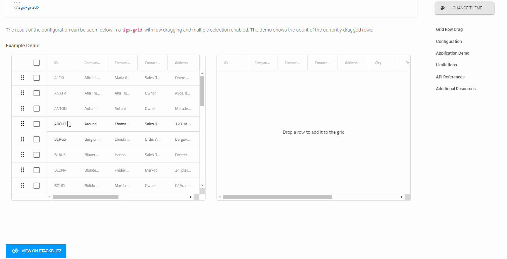
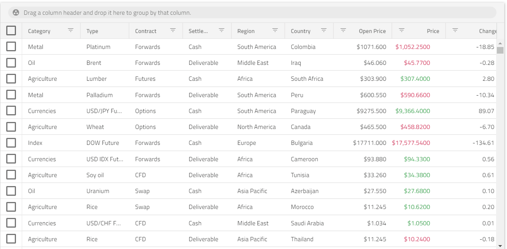

# Angular Grid と Angular アプリケーション開発の完全ガイド 
  
Angular Data Grid とその使用方法については、[このセクション](../grids-and-lists.md#Angular-Data-Grid-の概要) (グリッドの概要トピック) をご覧ください。

### Ignite UI - Angular アプリ開発のフレームワーク 

Ignite UI for Angular は Infragistics の高度なツールセットで、データ グリッドやチャート、データ可視化マップ、エディターなど機能豊富で高性能な UI コンポーネントを含みます。 

Ignite UI Angular データ グリッドは業界最速クラスであり、多くの主要な金融および保険会社で使用されています。 

Google の Angular フレームワーク上に構築された Ignite UI は、50 を超える UI コンポーネントとマテリアル ベースのコンポーネント、50 を超えるチャートタイプ (ファイナンシャル チャートを含む) を提供します。 

Ignite UI for Angular の多くの利点のうち、簡単な統合、迅速な開発と設計、レスポンシブなクロス ブラウザー互換性を提供します。 

### プロジェクトのインストールと作成 

Ignite UI for Angular は、Angular CLI または [Ignite UI CLI](https://jp.infragistics.com/products/ignite-ui-angular/angular/components/general/cli-overview.html "Ignite UI CLI 概要ページ") でインストールできます。Angular CLI をすばやく開始するには、以下のコマンドを実行します。 

`ng add igniteui-angular` 

Ignite UI for Angular を[既存の Angular アプリケーション](https://jp.infragistics.com/products/ignite-ui-angular/angular/components/general/getting-started.html#ignite-ui-for-angular-のインストール "Ignite UI for Angular のインストール")に追加する必要がある場合、このオプションお勧めします。 

新しいアプリケーションを最初から作成する場合、以下の方法をお勧めします。 

`npm install –g igniteui-cli` 

IgniteUI CLI をインストールすると、cli の[ガイド](https://jp.infragistics.com/products/ignite-ui-angular/angular/components/general/cli/step-by-step-guide.html "ステップバイステップ ガイド")を参照してアプリケーションを簡単にブートストラップでき、エンド ユーザーが単一のコマンドで実行できる構成済みのアプリを作成します。 

`ig` 

この cli コマンド セットを使用して Ignite UI プロジェクトの生成、新しいコンポーネントの追加、アプリケーション全体の構築と提供などを実行します。 

### 依存関係のインポート 

製品の依存関係のインポートには、Ignite UI CLI の使用をお勧めします。`ng add igniteui-angular` を使用すると、Ignite UI for Angular パッケージとその依存関係、フォントのインポート、スタイル設定などをプロジェクトにインストールできます。 

Ignite UI CLI せずに Ignite UI for Angular コンポーネントを使用するには、必要となるすべての依存関係を構成し、プロジェクトを適切に設定したことを確認してください。手順は、[はじめに](https://jp.infragistics.com/products/ignite-ui-angular/angular/components/general/getting-started.html "Ignite UI for Angular で作業を開始")のトピックをご確認ください。 

### コンポーネントをテンプレートに追加 

開発の環境設定が完了した後、他の Ignite UI コンポーネントの追加および構成を続行できます。以下には、[schematics](https://jp.infragistics.com/products/ignite-ui-angular/angular/components/general/cli-overview.html#テンプレートの追加 "Ignite UI CLI 概要ページ") を使用して基本構成のグリッドを追加し、一部の列にテンプレートを追加する方法です。 

```html
<igx-grid #grid1 [data]="localData" [paging]="true" [perPage]="10" height="600px" (onSelection)="cellSelection($event)">
    <igx-column header="Rank" headerClasses="myClass" width="115px" field="Id" sortable="true" [filterable]="false"></igx-column>
    <igx-column field="Name" header="Athlete" width="280"></igx-column>
    <igx-column field="Speed" header="Speed" [width]="'190px'" [filterable]="false"></igx-column>
    <igx-column field="TrackProgress" sortable="true" header="Track Progress" [filterable]="false">
        <ng-template igxCell let-val>
            <div class="linear-bar-container">
                <igx-linear-bar [textVisibility]="false" class="cell__inner_2" [value]="val"></igx-linear-bar>
            </div>
        </ng-template>
    </igx-column>
</igx-grid>
```
グリッド自体は、グリッドの列コレクションを定義し、ソートやページングなどの列ごとの機能を有効にするために使用される IgxColumnComponent などのさまざまなコンポーネントで構成されます。 

グリッドの各列は別のテンプレートを持つことができます。列にグリッド モジュール ディレクティブの 1 つでデコレートした ng-template タグが必要です。 

### コンポーネントの構成 

グリッドに列を定義したので、以下のように異なるセル、ヘッダー、およびフッター テンプレートを設定できます。 

 - IgxHeader ディレクティブは、列オブジェクト自体をコンテキストとして提供する列ヘッダーを対象にします。 

 ```html
 <igx-column field="Name">
    <ng-template igxHeader let-column>
        {{ column.field | uppercase }}
    </ng-template>
</igx-column>
 ```
 - igxCell は提供したテンプレートを列のすべてのセルに適用します。テンプレートで提供されるコンテキスト オブジェクトは暗示的に提供されたセル値およびセル オブジェクトです。 

 - 列は、セルが編集モードにある場合に使用されるテンプレートを使用します。他の列テンプレートと同様に、提供されたコンテキスト オブジェクトはセル値とセル オブジェクト自体です。 

```html
 <igx-column field="Price" [dataType]="'number'" editable="true">
    <ng-template igxCellEditor let-cell="cell">
        <label for="price">
            Enter the new price tag
        </label>
        <input name="price" type="number" [(ngModel)]="cell.editValue" />
    </ng-template>
</igx-column>
```
### テーブルとチャートにデータを追加 

一部の Angular アプリは静的データを使用しますが、現在のアプリ開発のほとんどはデータベースに保存されたデータを使用します。Angular データ バインディングは、アプリの UI と表示されるデータの間に接続を確立するプロセスで、動的なテーブルを簡単に実装できます。グリッドをリモート データ サービスにバインドするように設定できます。これは、大規模なアプリケーション レベルでは一般的なシナリオです。すべてのデータ取得に関連するロジックを別のデータ サービスに分割することをお勧めします。以下はサーバーからデータの取得を処理するサービスを作成する方法です。 

サービスは `Observable<NorthwindRecord[]>` を返す fetchData の単一のメソッドを含みます。 

```typescript

@Injectable()
export class NorthwindService {
    private url = 'http://services.odata.org/V4/Northwind/Northwind.svc/Alphabetical_list_of_products';

    constructor(private http: HttpClient) {}

    public fetchData(): Observable<NorthwindRecord[]> {
        return this.http
            .get(this.url)
            .pipe(
                map(response => response['value']),
                catchError(
                    this.errorHandler('Error loading northwind data', [])
                )
            );
    }

    private errorHandler<T>(message: string, result: T) {
        return (error: any): Observable<any> => {
            console.error(`${message}: ${error.message}`);
            return of(result as T);
        };
    }
}
```
サービスを実装した後、コンポーネントのコンストラクターにインジェクトしてデータを取得するために使用します。ngOnInit ライフサイクル フックに最初の要求を追加します。 

```typescript

@Component({
    ...
})
export class MyComponent implements OnInit {

    public records: NorthwindRecord[];

    constructor(private northwindService: NorthwindService) {}

    ngOnInit() {
        this.records = [];
        this.northwindService.fetchData().subscribe((records) => this.records = records);
    }
}
```

```html
<igx-grid [data]="records">
    <igx-column field="ProductId"></igx-column>
    <!-- rest of the column definitions -->
    ...
</igx-grid>
```
詳細については、[データ バインディングのトピック](https://jp.infragistics.com/products/ignite-ui-angular/angular/components/grid/grid.html#データ-バインディング "igxGrid バインディングのトピック")を参照してください。 

同じデータ バインディング方法は、igxDataChart などの他の Ignite UI コンポーネントにも適用できます。

```html
 <igx-data-chart [dataSource]="data"
                 width="700px"
                 height="500px">
    <igx-numeric-x-axis name="xAxis" isLogarithmic="true" ></igx-numeric-x-axis>
    <igx-numeric-y-axis name="yAxis" isLogarithmic="true" ></igx-numeric-y-axis>
    <igx-bubble-series
        name="series1"
        [xAxis]="xAxis"
        [yAxis]="yAxis"
        xMemberPath="population"
        yMemberPath="gdpTotal"
        radiusMemberPath="gdpPerCapita"
        [dataSource]="data"  ></igx-bubble-series>
 </igx-data-chart>
```
チャート コンポーネントにデータソースを設定すると、すべてのシリーズに適用されますが、データチャートに追加された各シリーズに異なるデータソースを設定することもできます。 

### ソート、フィルタリング、ページネーション 

Angular データ グリッドは、簡単なソート、フィルタリング、ページネーションをサポートします。豊富な API と直感的な機能のセットアップにより、Ignite UI for Angular コンポーネントを簡単に使用できます。 

```html
<igx-grid #grid1 (onSortingDone)="removeSorting($event)"
        [data]="data"
        [paging]="true"
        [perPage]="10"
        [allowFiltering]="true">   
    <igx-column field="OrderID" header="Order ID">
    </igx-column>
    <igx-column field="CategoryName" header="Category Name" [dataType]="'string'" sortable="true">
    </igx-column>
```

グリッドは、カスタム フィルタリング条件で 3 種類のフィルタリングを提供します。 

 - デフォルトの定義済みフィルタリングおよび標準のフィルタリング条件で列ごとに[行をフィルタリングします](https://jp.infragistics.com/products/ignite-ui-angular/angular/components/grid/filtering.html "Grid のフィルタリング概要")。  

 - ソート、移動、ピン固定、非表示などの機能を構成できるメニューの [Excel スタイル フィルタリング](https://jp.infragistics.com/products/ignite-ui-angular/angular/components/grid/excel-style-filtering.html "Grid Excel スタイル フィルタリングの概要") 。 

 - すべての列でフィルタリング条件を持つグループを作成できるダイアログを提供する[高度なフィルタリング](https://jp.infragistics.com/products/ignite-ui-angular/angular/components/grid/advanced-filtering.html "高度なフィルタリングの概要")。 

[Angular 9 リリース](https://www.infragistics.com/community/blogs/b/infragistics/posts/ignite-ui-for-angular-9-0-0-release "Ignite UI for Angular 9.0.0 リリース")には、データ解析、豊富な可視化、グリッド状態の永続化、テーマ ウィジェットなど、多数の新しい主要機能が含まれています。 

### コンポーネントのスタイル設定 

Ignite UI には、主要な Angular フレームワークの中で最も機能豊富なスタイル設定が含まれています。 

最小限のコードで、コンポーネントのテーマを簡単に変更できます。SASS で開発されている API は簡単で、単一のコンポーネント、複数のコンポーネント、またはすべてのコンポーネントでテーマをカスタマイズできます。 

```scss
// Import the IgniteUI themes library first
@import '~igniteui-angular/lib/core/styles/themes/index';

$primary-color: #2ab759; // Some green shade I like
$secondary-color: #f96a88; // Watermelon pink

$my-color-palette: igx-palette(
    $primary: $primary-color,
    $secondary: $secondary-color
);

// IMPORTANT: Make sure you always include igx-core first!
@include igx-core();
// Pass the color palette we generated to the igx-theme mixin
@include igx-theme($my-color-palette);
```

IgniteUI for Angular はコンポーネントのデザインを[マテリアル デザイン原則](https://material.io/guidelines/material-design/introduction.html "マテリアル デザインの概要")に基づき、Google によって作成されたコンポーネントの色、サイズ、タイポグラフィ、およびルックアンドフィールにできるだけ近づけるようデザインしています。例:

<div class="sample-container loading" style="height: 477px">
    <iframe id="list-sample-4-iframe" src='{environment:lobDemosBaseUrl}/grid-crm' width="100%" height="100%" seamless="" frameborder="0" onload="onSampleIframeContentLoaded(this);"></iframe>
</div>
<p style="margin: 0;padding-top: 0.5rem">このサンプルが気に入りましたか? 完全な Angular ツールキットにアクセスして、すばやく独自のアプリの作成を開始します。<a class="no-external-icon mchNoDecorate trackCTA" target="_blank" href="https://jp.infragistics.com/products/ignite-ui-angular/download" data-xd-ga-action="Download" data-xd-ga-label="Ignite UI for Angular">無料でダウンロードできます。</a></p>

サンプル ブラウザーのテーマ ウィジェットについても説明します。[Ignite UI サンプル ブラウザー](http://jp.infragistics.com/angularsite/components/grid/grid.html "Data Grid 概要と構成")でワンクリックでテーマをランタイムに変更できるようになりました。テーマ ウィジェットでは、スタイル、色、丸み、およびエレベーションを変更できます。テーマを簡単にカスタマイズできます。テーマの準備をした後、[SASS の ダウンロード] を押すと、設定済みの SCSS ファイルをアプリケーションで使用できます。 



### Ignite UI のデータ分析 

Ignite Angular UI ツールセットには[データ分析機能](https://jp.infragistics.com//angularsite/components/general/framework-and-features/data-analysis.html "igxGrid と igxDataChart のデータ分析")も含まれています。優れたエクスペリエンスを顧客に提供するために必要なすべてのビジネス機能を提供します。そのため、Excel に類似したエクスペリエンスを提供するディレクティブを提供します。たとえば、データの一部を選択することにより、ボタンをクリックし、データのサブセットですばやくデータ分析を実行できるようになりました。 

<div class="sample-container loading" style="height: 750px;">
    <iframe id="grid-dynamic-chart" frameborder="0" seamless="" width="100%" height="100%" data-src="{environment:lobDemosBaseUrl}/grid-dynamic-chart-data/data-analysis" class="lazyload no-theming"></iframe>
</div>

### コード生成とデザインのためのツール 

Ignite UI for Angular は [Indigo.Design システム](https://jp.infragistics.com/products/indigo-design/help/video-tutorials.html "Indigo Design システム") の一部で、[Indigo.Design UI Kit](https://jp.infragistics.com/products/indigo-design/help/creating-an-artboard.html "はじめてのアートボード作成") を使用して Sketch で作成したデザインから[ネイティブな Angular コード](https://jp.infragistics.com/products/indigo-design/help/codegen/vscode-plugin.html "Visual Studio プラグイン")を生成できます。さまざまな編集およびフィルタリングモードをサポートするモバイル対応またはデータ密度の高いグリッドを生成できます。また、ソート、ページング、集計、グループ化などの一般的なグリッド機能の多くを使用することもできます。さらに、各列で移動、サイズ変更、非表示、ピン固定などのさまざまな操作を指定して、デザイン時に高度なデータ操作シナリオを実現し、数分で実行できる完璧なピクセルのユーザー インターフェイスを実現できます。 

### パフォーマンスのベンチマーク 

Grid コンポーネントは一般に、大量の表データを可視化することを目的としています。パフォーマンスに関しては、Grid は、読み込み時、実行時およびソフト パフォーマンスに優れています。  

読み込み時間および実行時のパフォーマンスに関する Web アプリケーションの要件を満たすために、描画される Document Object Model (DOM) 要素を仮想化し、ユーザーがコンポーネントのコンテナで垂直方向および水平ス方向にクロールする際に DOM 要素をスワップまたは再利用することが重要です。igxGrid は、見た目を損なうことなく優れたランタイムのスクロール パフォーマンスと、ソフト パフォーマンス (ソフトウェアの一般的なユーザビリティによって定義される) を備えています。以下は、スクロール パフォーマンスを備えた Gif の例です。 



Grid で使用したい機能を簡単に見つけてナビゲートできます。また、アプリケーションをより魅力的にできます。 

詳細については、[Medium Software Performance (Web) の記事 (英語)](https://medium.com/ignite-ui/software-performance-web-61158c8583d "Web Software Performance") をご覧ください。