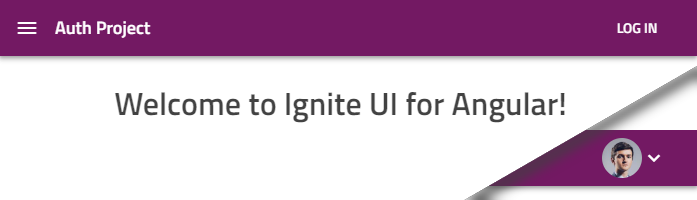

# 認証プロジェクト テンプレート

[`new` コマンド](../cli-overview.md#新しいプロジェクトの作成)または[ステップバイステップモード](step-by-step-guide.md)を使用する場合に選択するプロジェクト の複数のバージョン(プロジェクト テンプレート)があります。

Angular Schematics または Ignite UI CLI を使用して Angular プロジェクト作成する場合は、ユーザー管理でアプリを開始するために追加セットアップをできるだけ必要としないクライアント側認証モジュールの基本的な実装を含むテンプレートを選択できます。

## 認証プロジェクトの作成
'Ignite UI for Angular' プロジェクト タイプを選択した後、ステップバイステップの手順を実行する際に認証プロジェクトを選択できます。


または新しいコマンドを使用します。

```bash
ig new "Auth Project" --framework=angular --type=igx-ts --template=side-nav-auth
```
Schematics コレクションを使用する場合は、以下のコマンドを実行します。

```bash
ng new "Auth Project" --collection="@igniteui/angular-schematics" --template=side-nav-auth
```

## 説明
このテンプレートはサイドナビゲーションのデフォルトに基づいて作成され、ログイン ページまたはログインユーザーのアバターを表示するプロファイル ページとログイン セクションをアプリのナビゲーションバーに追加します。



ログインバーは、サインインまたはサインアップするためのダイアログも統合されます。


このプロジェクトは、さまざまな[外部認証プロバイダー](#add-a-third-party-social-provider)もサポートしています。 

## コード
ユーザー管理に関連するすべてのアイテムは、`src/app/authentication`フォルダー下にあります。以下は、注目すべきエクスポートです。

- `authentication.module.ts` の `AuthenticationModule` は、すべてのコンポーネントとサービスをメイン アプリモジュールにエクスポートします。
- `auth.guard.ts` は、ルートに適用できる `AuthGuard` をエクスポートします
- `authentication-routing.module.ts` は、ログイン関連のルートを設定します。
- `services/user.service.ts` の `UserService` は現在のユーザー状態を保持します。
- `services/authentication.service.ts` の `AuthenticationService` は、バックエンド API との通信に使用されます。
- `Services/external-auth.service.ts` の `ExternalAuthService` は、サードパーティ ログインのプロバイダーを処理します。

## 構成の要件

このプロジェクトは、REST API サービスを使用する単一ページアプリ用にセットアップされているため、`AuthenticationService` を使用してリクエストを次の URL に送信します。
- `/login` - ユーザー名とパスワードでログインします。
- `/register` - ユーザー情報で登録します。
- `/extlogin` - 外部ソースからユーザー情報を渡します。

すべてのエンドポイントは、JSON Wen Token (JWT) またはメッセージとともにエラー状態を返す必要があります。

> **注:**デモンストレーションの目的で、プロジェクトには要求をインターセプトする `services/fake-backend.service.ts` があります。`authentication.module.ts` の `BackendProvider` は、本番環境では使用しないでください。開発の開始時に、プロバイダーとファイルの両方を削除する必要があります。

他の認証モデル同様、JWT-s を使用する際にはセキュリティを考慮する必要があります。特に、REST API から受信したトークンはクライアントに保存されます。開発中にアプリをシームレスにリロードするために、ユーザー データはブラウザーのローカル ストレージに保存されますが、XSS 攻撃に対しては潜在的に脆弱になる可能性があります。

> **注:**実稼働前にローカル ストレージを無効にします。アプリの要件でトークンを保護するための代替ルートが許可されている場合、またはトークンを保護するための代替ルートをとる場合にのみ、トークンをメモリに保持することを検討してください。クッキーを使用する (CSRF 保護を検討する) ことも代替手段ですが、トークン署名または追加の「指紋」を強化されたクッキーに分割する方法もあります。

常にセキュリティ面を評価し、状況に応じて調整します。提供されるプロジェクト構造は単なる出発点です。


## サードパーティ (ソーシャル) プロバイダーを追加する

プロジェクトのメイン モジュール `src/app/app.module.ts` は、外部認証サービスを挿入して生成し、次のような初期化をコメントアウトします。

```ts
// in app.module.ts
export class AppModule {
  constructor(private externalAuthService: ExternalAuthService) {
    // this.externalAuthService.addGoogle('<CLIENT_ID>');
    // this.externalAuthService.addMicrosoft('<CLIENT_ID>');
    // this.externalAuthService.addFacebook('<CLIENT_ID>');
  }
}
```

特定のサードパーティ プロバイダーでユーザー ログインを有効にするには、特定の行のコメントを解除して、アプリのクライアント ID に置き換えます。
Google アカウントのサインインなどで取得する必要がある場合は、以下のプロバイダー固有のガイドに従ってください。

- [資格情報を取得する](https://developers.google.com/identity/protocols/OpenIDConnect#getcredentials)

- [詳細バージョン](https://support.google.com/cloud/answer/6158849?hl=en&ref_topic=6262490)

プロジェクトに一致するようにプロバイダーごとにリダイレクト URL と許可されたドメイン オリジンを設定する必要があることに注意してください。開発用の Google OAuth 2.0 クライアント ID を作成するとき、リダイレクト URI として `http://localhost:4200/redirect-google` を指定できます。詳細については、[リダイレクト URL](#プロバイダーの詳細) をご覧ください。

Id (`123456789.apps.googleusercontent.com`) を取得したら、以下のようにプロジェクトの Google プロバイダーを有効にできます。
```ts
// in app.module.ts
export class AppModule {
  constructor(private externalAuthService: ExternalAuthService) {
    this.externalAuthService.addGoogle('123456789.apps.googleusercontent.com');
    // this.externalAuthService.addMicrosoft('<CLIENT_ID>');
    // this.externalAuthService.addFacebook('<CLIENT_ID>');
  }
}
```
これにより、ログイン ダイアログの各ボタンが自動的に有効になります。


このガイドに従って [Microsoft](https://docs.microsoft.com/ja-jp/azure/active-directory/develop/v2-protocols-oidc) でも同じことができます。

https://docs.microsoft.com/ja-jp/azure/active-directory/develop/quickstart-register-app

Facebook:

https://developers.facebook.com/docs/apps/#register


プロバイダーを有効にすると、すべてのボタンがアクティブになります。


### プロバイダーの詳細

以下は、プロジェクト テンプレートに付属するデフォルト プロバイダーです。

| プロバイダー | 使用 | URL のリダイレクト |
|---|---|---|
| Google | OpenID Connect* | `<app root>/redirect-google` |
| Microsoft | OpenID Connect* | `<app root>/redirect-microsoft` |
| Facebook | Facebook Connect** | `<app root>/redirect-facebook` |

アプリがホストされる場所で URL を決定します。たとえば、デフォルトで最初のアプリ実行時は `http://localhost:4200` になります。

\* https://github.com/damienbod/angular-auth-oidc-client を使用して実装された OpenID Connect 機能

\** Facebook JS SDK を使用して実装された Facebook Connect 機能