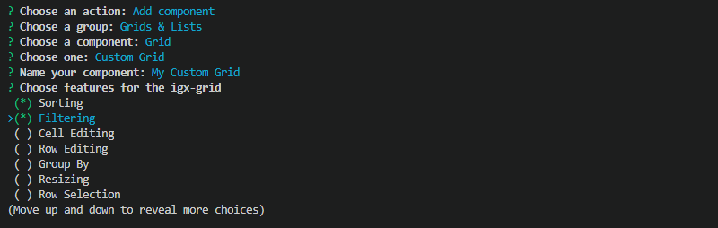

## ステップバイステップ ガイド
利用可能なオプションでガイドを取得する場合、ステップバイステップ モードを初期化して新しいアプリケーションの作成およびセットアップ、同様に [Ignite UI Angular Schematics または Ignite UI CLI](../cli-overview.md) で以前作成したプロジェクトを更新できます。

Schematics コレクションを使用してガイドをアクティブにするには、以下のコマンドを実行します。

```cmd
ng new --collection="@igniteui/angular-schematics"
```

Ignite UI CLI を使用してガイドを開始するには、 `ig` コマンドを実行します。

```bash
ig
```
または
```bash
ig new
```

これにより、ステップバイステップ モードがアクティブになり、新しいプロジェクトの作成に役立つ一連の質問が表示されます。

<div style="display:inline-block;">
    <a style="background: url(../../../images/general/buildCLIapp.gif); display:flex; justify-content:center; min-width:540px; min-height:315px;"
       href="https://youtu.be/QK_NsdtdA70" target="_blank">
        
    </a>
</div>

> **注** ステップバイステップ モードは `Inquirer.js` に依存しています。[サポートされている端末](https://github.com/SBoudrias/Inquirer.js#support-os-terminals) を参照してください。


## 新しいプロジェクトの作成

最初に、アプリケーションの名前を入力します。


次に、利用可能なプロジェクト テンプレートのいずれかを選択します。空のプロジェクト、サイド ナビゲーションのあるプロジェクト、または基本認証モジュールのある[認証プロジェクト](auth-template.md)を作成できます。矢印キーを使用して使用可能なオプションをナビゲートし、ENTER を押して選択を確認します。


次のステップでは、アプリケーションのテーマを選択します。デフォルトのオプションを選択すると、 Ignite UI for Angular のデフォルト テーマの Ignite UI がプリコンパイルされた CSS ファイル (`igniteui-angular.css`) がプロジェクトの `angular.json` に含まれます。カスタムオプションは、`app/styles.scss` の [Theming API](../../themes.md) を使用して、カラーパレットとテーマのコードを生成します。


上記の手順を完了すると、アプリケーション構造が生成され、git リポジトリが初期化され、プロジェクトがコミットされます。次に、プロセスを完了するか、アプリケーションに新しいビューを追加するかのプロンプトが表示されます。


## ビューの追加

Ignite UI CLI は、プロジェクトに追加できる複数のコンポーネント テンプレート、およびより詳細なシナリオ テンプレートをサポートしています。このモードは、プロジェクトの作成が完了した後、または以下のコマンドを使用して既存のプロジェクト内でアクティブにできます。

Schematics コレクションを使用してステップバイステップ モードをアクティブにするには、`component` (alias:`c`) スケマティックを実行します。
```bash
ng g @igniteui/angular-schematics:component
```

Ignite UI CLI を使用する場合、 `add` コマンドを実行します。
```bash	
ig add
```
新しいコントロールを追加することを選択した場合、カテゴリにグループ化された[使用可能なテンプレート](component-templates.md#コンポーネント-テンプレート)のリストが提供されます。


矢印キーを使用してオプションをナビゲートし、ENTER を使用して選択したオプションを選択します。

たとえば、`カスタムグリッド`などの一部のテンプレートでは、有効にできるオプションのリストが提供されます。オプションは、スペース キーで切り替えることができます。



アプリケーションにシナリオを追加することを選択した場合、使用可能な[シナリオ テンプレート](component-templates.md#シナリオ-テンプレート)のリストも取得できます。


アプリケーションにテンプレートを追加した後、プロセスを完了するかコントロールの追加を続行するかどうかを選択します。プロセスの完了を選択すると、必要なパッケージが (プロジェクト作成時に) インストールされ、アプリケーションがデフォルトのブラウザーで開かれます。

`add` コマンドを使用して、後からいつでも、Angular ビューの Ignite UI をアプリケーションに追加できます。
