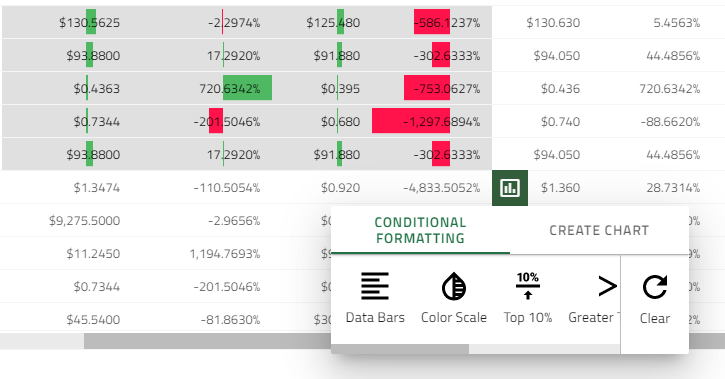

## データ分析  

データ分析とは、特定の方法でデータを検査、変換、および整理し、それに基づいて役立つ情報を生成するプロセスです。また、分析的および論理的な推論で特定の結果と結論に達することもできます。

>[!NOTE]
>この機能は、設定を簡単にし、コードを最小限に制限するために、**Ignite UI for Angular** の外部パッケージとして提供されます。

### データ分析ボタン
データ分析ボタンは、選択したデータをさまざまな方法で可視化するアウトレットです。

グリッドで実行されるすべての範囲選択をシングル クリックで簡単に分析できます。

ボタンは、選択範囲の**右下**にあるすべての範囲選択でレンダリングされ、選択範囲がインアクティブになると非表示になります。ボタンは、選択範囲の右下にあるすべての範囲選択でレンダリングされ、選択範囲がインアクティブになると非表示になります。

### チャートと統合
このセクションでは、エンドユーザーがグリッドの選択したデータに基づいてチャートを可視化し、必要に応じて異なるチャート タイプを選択できる、チャート作成機能とグリッドの統合を紹介します。

チャートは、セルの範囲を選択し、分析の表示ボタンをクリックすると表示されます。

>[!NOTE]
>チャート作成オプションは、選択したデータに数値がある場合にのみ使用できます。

    <iframe id="grid-dynamic-chart" frameborder="0" seamless="" width="100%" height="100%" data-src="{environment:demosBaseUrl}/grid/grid-dynamic-chart-data" class="lazyload"></iframe>

以下のチャート タイプをサポートします。
- [ColumnGrouped](../../data-chart-type-category-series.md), [AreaGrouped](../../data-chart-type-category-area-series.md), [LineGrouped](../../data-chart-type-category-line-series.md), [BarGrouped](../../data-chart-type-category-series.md)
- [ColumnStacked](../../data-chart-type-stacked-column-series.md), [AreaStacked](../../data-chart-type-category-spline-area-series.md), [LineStacked](../../data-chart-type-stacked-line-series.md), [BarStacked](../../data-chart-type-stacked-bar-series.md)
- Column100Stacked, [Area100Stacked](../../data-chart-type-stacked-100-area-series.md), [Line100Stacked](../../data-chart-type-stacked-100-line-series.md), [Bar100Stacked](../../data-chart-type-stacked-100-bar-series.md)
- ScatterPoint, ScatterBubble, ScatterLine. 意味のある散布バブル チャートを表示するために、データが有効な形式でない場合、プレビューを無効にします。
- [円チャート](../../pie-chart.md)

### セルの条件付き書式 
グリッドに数千行のデータがある場合、生の情報を検査するだけでパターンと傾向を分析することは容易ではありません。チャートやスパークラインと同様に、`条件付き書式`は、データを可視化し、理解しやすくする別の方法を提供します。 

条件付き書式は範囲選択の`値`に基づいて、色やデータ バーなどの書式設定をセルに適用できます。[以下のサンプル](#デモ) は、グリッドを構成して`条件付き書式`を適用する方法を示します。どの条件`ルール`が表示されるかは、`条件付き書式の選択タイプ`によって異なります。以下は定義済みスタイル (プリセット) があります。これを使用すると、条件付き書式をデータにすばやく適用できます。範囲の書式設定は、異なる範囲で書式設定を行った場合、またはクリア ボタンを使用してクリアにされます。クリア ボタンは、書式設定が適用されている場合にのみアクティブになります。

#### 数の範囲選択
- `Data Bars` - データバーは、売れ筋商品や売れ残り商品など、高値と低値を識別する場合などに役立ちます。このプリセットにより、選択したセルの範囲の値を簡単に可視化できます。長いバーはより高い値を表します。値が 0 のセルにはデータバーがありません。他のすべてのセルは比例的に塗りつぶされます。正の値は`緑色`で、負の値は`赤色`です。

- `Color Scale` - 色の影はセルの値を表します。`*最低のしきい値`未満の値を保持するセルは`赤色`で色付けされます。`*最高のしきい値`を超える値を保持するセルは`緑色`で色付けされます。`最低`と`最高のしきい値`の間にあるすべてのセルは`黄色`で表示されます。

> `最低のしきい値` - 範囲選択の最大セル値の 33％ 未満。

> `最高のしきい値` - 範囲選択の最大セル値の 66％ 以上。 

- `Top 10%` - このプリセットを使用して、選択したデータの上位 10％ に相当する値を強調表示します。

- `Greater than` - このプリセットは、`平均よりも大きい`値をすべてマークします。
- `Duplicate values` - 重複する値をすべてマークします。
- `Unique values` - 一意のすべてのセル値がマークされます(`青色`の背景色)。

- `Empty`- `未定義の値`のすべてのセルをマークします。

#### テキストの範囲選択
- `Text contains` - `左上に上位の選択されたセル`のセル値を含むすべてのセルをマークします。例:

- `Duplicate values` - 重複する値をすべてマークします。
- `Unique values` - 一意のすべてのセル値がマークされます(`青色`の背景色)。
- `Empty`- `未定義の値`のすべてのセルをマークします。

#### デモ

    <iframe id="grid-dynamic-chart" frameborder="0" seamless="" width="100%" height="100%" data-src="{environment:demosBaseUrl}/grid/grid-dynamic-chart-data" class="lazyload"></iframe>

### 便利なリソース

* [Angular Universal ガイド (英語)](https://angular.io/guide/universal)
* [Ignite UI スタート キット  (英語)](https://github.com/IgniteUI/ng-universal-example)
* [サーバー側レンダリング用語](https://developers.google.com/web/updates/2019/02/rendering-on-the-web)
* [Ignite UI で作業を開始](../getting_started.md)
* [Ignite UI CLI ガイド](../cli/step-by-step-guide.md)