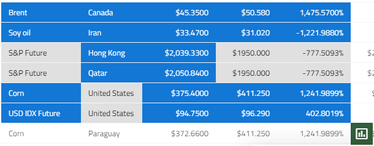
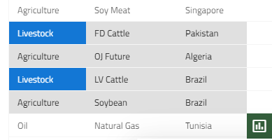

<style>
    .full-screen-btn {
        display: -webkit-inline-box;
        display: -ms-inline-flexbox;
        display: inline-flex;
        -webkit-box-align: center;
            -ms-flex-align: center;
                align-items: center;
        font-size: 13px;
        font-weight: 400;
        color: #fff;
        border: 0;
        text-transform: uppercase;
        padding: 8px 16px;
        margin: 24px 0;
        outline-style: none;
        -webkit-transition: all 0.25s ease-out;
        transition: all 0.25s ease-out;
        background: #0099ff; 
    }
    .full-screen-btn:hover, .full-screen-btn:focus {
        color: white;
        -webkit-box-shadow: 0 5px 5px -3px rgba(0, 0, 0, 0.26), 0 8px 10px 1px rgba(0, 0, 0, 0.12), 0 3px 14px 2px rgba(0, 0, 0, 0.08);
        box-shadow: 0 5px 5px -3px rgba(0, 0, 0, 0.26), 0 8px 10px 1px rgba(0, 0, 0, 0.12), 0 3px 14px 2px rgba(0, 0, 0, 0.08); 
    }
    .full-screen-btn::before {
        content: "";
        display: inline-block;
        width: 28px;
        height: 28px;
        margin-right: 8px;
        background-image: url("../../../images/general/fullscreen-white-18dp.svg");
        background-size: 100%;
        background-repeat: no-repeat; 
    }
    .full-screen-btn[disabled] {
        color: rgba(0, 0, 0, 0.28);
        background: #eee;
        -webkit-box-shadow: none;
        box-shadow: none; 
    }
    .full-screen-btn[disabled]::before {
        background-image: url("../../../images/general/fullscreen-white-18dp.svg"); 
    }

</style>

# データ分析  

データ分析とは、特定の方法でデータを検査、変換、および整理し、それに基づいて役立つ情報を生成するプロセスです。また、分析的および論理的な推論で特定の結果と結論に達することもできます。

>[!NOTE]
>この機能は、設定を簡単にし、コードを最小限に制限するために、**Ignite UI for Angular** の外部パッケージとして提供されます。

## Dock Manager のデータ分析
選択したデータに基づいて `Chart Types ビュー`を有効にするには、`セル範囲の選択`または`列の選択`を実行します。このビューは、[Dock Manager](../../dock-manager.md) の右ペインの一部です。以下のオプションを選択できます。
 - 特定のチャート タイプを選択し、別のペインで可視化します。
 - または、`Data Analysis` コンテキスト ボタンを使用して、さまざまなテキスト書式設定オプションを表示します。

<div class="sample-container loading" style="height: 580px;">
    <iframe id="data-analysis-dock-manager" frameborder="0" seamless width="100%" height="100%" src="{environment:lobDemosBaseUrl}/grid-dynamic-chart-data/data-analysis-dock-manager" onload="onSampleIframeContentLoaded(this);" class="no-theming"></iframe>
</div>

<button class="full-screen-btn" onclick='window.open("{environment:lobDemosBaseUrl}/grid-dynamic-chart-data/data-analysis-dock-manager")'>全画面表示</button>

> [!NOTE]
> [Dock Manager Web コンポーネント](../../dock-manager.md)は、ペインでアプリケーションのレイアウトを管理する方法を提供します。エンド ユーザーはペインをピン固定、サイズ変更、移動、非表示にすることでカスタマイズできます。データを選択した後、いくつかのチャートを作成し、利用可能な領域にドラッグしてピン固定します。

以下に注意してください。
- 新しいデータを選択すると、チャートのデータが更新されます。
- 複数セルの範囲選択が適用される場合、`テキスト書式設定`機能のみが利用可能になります。
- 選択したデータがいずれのチャートとも互換性がない場合、「互換性のないデータ」警告メッセージが表示されます。

## データ分析パッケージ

この機能を使用できるには、以下の手順を実行します。**Igniteui-angular-extras** パッケージは [プライベート npm フィード](https://packages.infragistics.com/npm/js-licensed/) でのみ利用できます。[有効な商用ライセンス](https://jp.infragistics.com/products/ignite-ui-angular/angular/components/general/ignite-ui-licensing.html#使用許諾契約)がある場合、プライベート フィードにアクセスできます。

始めましょう:

- パッケージをアプリケーションにインストールします。
```cmd
npm install @infragistics/igniteui-angular-extras
```

- パッケージのピア依存関係をインストールします。
```cmd
npm install @infragistics/igniteui-angular igniteui-angular-core igniteui-angular-charts
```

- パッケージのインストール後、以下を実行します。
  - `IgxExtrasModule` を app.module.ts に追加します。
  - `igxChartIntegration`、`igxConditionalFormatting`、`igxContextMenu` ディレクティブをグリッドに適用します。

```html
<igx-grid #grid1 igxChartIntegration igxConditionalFormatting igxContextMenu 
    [data]="localData" [autoGenerate]="true" [paging]="true" >
</igx-grid>
```
以上です! **セル範囲の選択**を実行し、データ分析フローを実行できます。

## データ分析ボタン
データ分析ボタンは、選択したデータをさまざまな方法で可視化するアウトレットです。


グリッドで実行されるすべての範囲選択をシングル クリックで簡単に分析できます。

ボタンは、選択範囲の**右下**にあるすべての範囲選択でレンダリングされ、選択範囲がインアクティブになると非表示になります。ボタンは、選択範囲の右下にあるすべての範囲選択でレンダリングされ、選択範囲がインアクティブになると非表示になります。

## チャートと統合
このセクションでは、エンドユーザーがグリッドの選択したデータに基づいてチャートを可視化し、必要に応じて異なるチャート タイプを選択できる、チャート作成機能とグリッドの統合を紹介します。

チャートは、セルの範囲を選択し、分析の表示ボタンをクリックすると表示されます。

>[!NOTE]
>チャート作成オプションは、選択したデータに数値がある場合にのみ使用できます。

<div class="sample-container loading" style="height: 750px;">
    <iframe id="grid-dynamic-chart" frameborder="0" seamless="" width="100%" height="100%" src="{environment:lobDemosBaseUrl}/grid-dynamic-chart-data/data-analysis" class="lazyload no-theming"></iframe>
</div>

<button class="full-screen-btn" onclick='window.open("{environment:lobDemosBaseUrl}/grid-dynamic-chart-data/data-analysis")'>全画面表示</button>

以下のチャート タイプをサポートします。
- [ColumnGrouped](../../data-chart-type-category-series.md)、[AreaGrouped](../../data-chart-type-category-area-series.md)、[LineGrouped](../../data-chart-type-category-line-series.md)、[BarGrouped](../../data-chart-type-category-series.md)
- [ColumnStacked](../../data-chart-type-stacked-column-series.md)、[AreaStacked](../../data-chart-type-category-spline-area-series.md)、[LineStacked](../../data-chart-type-stacked-line-series.md)、[BarStacked](../../data-chart-type-stacked-bar-series.md)
- Column100Stacked、[Area100Stacked](../../data-chart-type-stacked-100-area-series.md)、[Line100Stacked](../../data-chart-type-stacked-100-line-series.md)、[Bar100Stacked](../../data-chart-type-stacked-100-bar-series.md)
- ScatterPoint、ScatterBubble、ScatterLine. 意味のある散布バブル チャートを表示するために、データが有効な形式でない場合、プレビューを無効にします。
- [円チャート](../../pie-chart.md)

## セルの条件付き書式 
グリッドに数千行のデータがある場合、生の情報を検査するだけでパターンと傾向を分析することは容易ではありません。チャートやスパークラインと同様に、`条件付き書式`は、データを可視化し、理解しやすくする別の方法を提供します。 

条件付き書式は範囲選択の`値`に基づいて、色やデータ バーなどの書式設定をセルに適用できます。[以下のサンプル](#デモ)は、グリッドを構成して`条件付き書式`を適用する方法を示します。どの条件`ルール`が表示されるかは、`条件付き書式の選択タイプ`によって異なります。以下は定義済みスタイル (プリセット) があります。これを使用すると、条件付き書式をデータにすばやく適用できます。範囲の書式設定は、異なる範囲で書式設定を行った場合、またはクリア ボタンを使用してクリアにされます。クリア ボタンは、書式設定が適用されている場合にのみアクティブになります。

### 数の範囲選択
- `Data Bars` - データバーは、売れ筋商品や売れ残り商品など、高値と低値を識別する場合などに役立ちます。このプリセットにより、選択したセルの範囲の値を簡単に可視化できます。長いバーはより高い値を表します。値が 0 のセルにはデータバーがありません。他のすべてのセルは比例的に塗りつぶされます。正の値は`緑色`で、負の値は`赤色`です。


- `Color Scale` - 色の影はセルの値を表します。`*最低のしきい値`未満の値を保持するセルは`赤色`で色付けされます。`*最高のしきい値`を超える値を保持するセルは`緑色`で色付けされます。`最低`と`最高のしきい値`の間にあるすべてのセルは`黄色`で表示されます。

> `最低のしきい値` - 範囲選択の最大セル値の 33％ 未満。

> `最高のしきい値` - 範囲選択の最大セル値の 66％ 以上。 


- `Top 10%` - このプリセットを使用して、選択したデータの上位 10％ に相当する値を強調表示します。


- `Greater than` - このプリセットは、`平均よりも大きい`値をすべてマークします。
- `Duplicate values` - 重複する値をすべてマークします。
- `Unique values` - 一意のすべてのセル値がマークされます(`青色`の背景色)。



- `Empty`- `未定義の値`のすべてのセルをマークします。

### テキストの範囲選択
- `Text contains` - `左上に上位の選択されたセル`のセル値を含むすべてのセルをマークします。例:



- `Duplicate values` - 重複する値をすべてマークします。
- `Unique values` - 一意のすべてのセル値がマークされます(`青色`の背景色)。
- `Empty`- `未定義の値`のすべてのセルをマークします。

### デモ

<div class="sample-container loading" style="height: 750px;">
    <iframe id="grid-dynamic-chart" frameborder="0" seamless="" width="100%" height="100%" data-src="{environment:lobDemosBaseUrl}/grid-dynamic-chart-data/data-analysis" class="lazyload no-theming"></iframe>
</div>

<button class="full-screen-btn" onclick='window.open("{environment:lobDemosBaseUrl}/grid-dynamic-chart-data/data-analysis")'>全画面表示</button>

## データ分析パッケージ API
 
### IgxConditionalFormattingDirective
<div class="divider--half"></div>

| API | 説明 | 引数 |
|---------|:-------------:|:-----------:|
| `ConditionalFormattingType` | 条件付き書式タイプを表す**列挙体** |
| `IFormatColors` | 書式設定色を表す**インターフェース** |
| `formatter`: **string** | 現在の書式タイプを設定/取得する**入力**プロパティ |
| `formatColors` | 現在の書式色を設定/取得する**入力**プロパティ | `val`: *IFormatColors* |
| `onFormattersReady`| 選択されたデータに適用可能な`書式タイプ`が決定されたときにそれらを発生する**イベント**。 |
| `formatCells` | 選択したセルに条件付き書式を適用します。使用方法: <br/> **this.conditonalFormatting.formatCells(ConditionalFormattingType.dataBars)** | `formatterName`: **string**, `formatRange`?: [GridSelectionRange]({environment:angularApiUrl}/interfaces/gridselectionrange.html) [ ], <br /> `reset`: boolean (**true** by default) |
| `clearFormatting` | 選択されたセルの条件付き書式を削除します。使用方法: <br /> **this.conditonalFormatting.clearFormatting()** |

### IgxChartIntegrationDirective
<div class="divider--half"></div>

| API | 説明 | 引数 |
|---------|-------------|-----------|
| `CHART_TYPE` | サポートされているチャートの種類を表す**列挙型** |
| `OPTIONS_TYPE` | チャート コンポーネントに適用できる、サポートされているオプション タイプを表す**列挙型**| 
| `IOptions` | チャート プロパティ オプションの**インターフェイス** |
| `chartFactory`| 指定されたチャート タイプに基づいて、チャート コンポーネントを作成します。使用方法: <br /> **this.chartIntegration.chartFactory(CHART_TYPE.COLUMN_GROUPED, this.viewContainerRef)** | `type`: **any[ ]**, viewContainerRef: [`ViewContainerRef`](https://angular.io/api/core/ViewContainerRef) |
| `setChartComponentOptions` | プロパティ オプションをチャート コンポーネントに設定します。使用方法: <br /> **this.chartIntegration.setChartComponentOptions(CHART_TYPE.PIE, OPTIONS_TYPE.CHART, {allowSliceExplosion: true, sliceClick: (evt) => { evt.args.isExploded = !evt.args.isExploded; } })** | `chart`: *CHART_TYPE*, `optionsType`: *OPTIONS_TYPE*, `options`: *IOptions* |
| `getAvailableCharts` | 有効なチャート タイプを返します |
| `enableCharts` | 指定されたチャート タイプを有効にします。デフォルトでは、すべてのチャート タイプが有効です | `types`: *CHART_TYPE* [ ] |
| `disableCharts` | 指定されたチャート タイプを無効にします | `types`: *CHART_TYPE* [ ] |
| `onChartTypesDetermined` | `chartData` に適用可能なチャート タイプが決定されると発生する**イベント**。このイベントは、2 つのプロパティがある `IDeterminedChartTypesArgs` タイプのオブジェクトを発行します: <br /> `chartsAvailabilty`: *Map<CHART_TYPE, boolean>* - 有効/無効されたチャート タイプ、<br /> `chartsForCreation`: *CHART_TYPE[]* - `chartData` に適用可能なチャート タイプ。 |
| `onChartCreationDone` | チャートが作成されたときに発生するイベント。このイベントは、作成されたチャート コンポーネントを発行します|
| `chartData`: **any[ ]** | チャートのデータを設定/取得する**入力**プロパティ| `selectedData`: **any[ ]** |
| `useLegend`: **boolean** | すべてのチャート タイプの凡例の使用を有効/無効にする**入力**。デフォルトで **true** に設定されます|
| `defaultLabelMemberPath`: **string** | チャートのデフォルト ラベルのメンバー パスを設定/取得する**入力**プロパティ。デフォルトでは、ラベルのメンバー パスが指定されたデータに基づいて決定されます。<br />(**提供されたデータ レコードに文字列値を持つプロパティがある場合、`chartData` の最初のデータレコードの最初の文字列プロパティ名がチャートのラベルのメンバー パスとして選択されます。そうでない場合、ラベルのメンバー パスは値 *'Index'* になります**)。<br/> |
| `scatterChartYAxisValueMemberPath`: **string** | 散布バブル チャートのデフォルトの半径メンバー パスを設定/取得する**入力**プロパティ。**設定しない場合、デフォルトの Y 軸値のメンバー パスは、`chartData` の最初のデータ レコードの最初の数値プロパティ名になります** | `path`: **string** |
| `bubbleChartRadiusMemberPath`: **string** | 散布バブル チャートのデフォルトの半径メンバー パスを設定/取得する**入力**プロパティ。設定しない場合、デフォルトの Y 軸値のメンバー パスは、`chartData` の最初のデータ レコードの 2 番目の数値プロパティ名になります | `path`: **string** |


## 便利なリソース

<div class="divider--half"></div>

* [Angular Universal ガイド (英語)](https://angular.io/guide/universal)
* [Ignite UI スタート キット (英語)](https://github.com/IgniteUI/ng-universal-example)
* [サーバー側レンダリング用語](https://developers.google.com/web/updates/2019/02/rendering-on-the-web)
* [Ignite UI で作業を開始](../getting_started.md)
* [Ignite UI CLI ガイド](../cli/step-by-step-guide.md)
