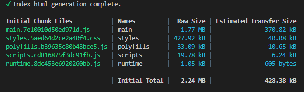

# Ignite UI for Angular テーマのカスタマイズ

この記事では、Ignite UI for Angular アプリケーション テーマのカスタマイズと、生成されたスタイルシートのサイズの最適化について詳しく説明します。Ignite UI for Angular テーマ エンジンがどのように機能するかの詳細を示し、その高度な使用法を示します。この記事は、コンポーネントのスタイルを完全にカスタマイズして、Angularアプリケーションを希望のルック＆フィールに合わせることと、アプリケーションで使用するものだけにスタイルサイズを縮小してアプリケーションをデプロイに最適化することの両方に非常に便利です。

>[!NOTE] 
> このドキュメントでは、バージョン 15 以降の Ignite UI for Angular のテーマ システムについて説明します。例には、テーマ エンジンによって提供される Sass API の使用と公開された CSS 変数の両方が含まれます。

## 作業の開始

[App Builder](https://jp.infragistics.com/products/appbuilder) を使用して Angular アプリケーションを作成し、生成されたリポジトリでそのスタイルを変更します。まず、App Builder で「Header + mini nav + content + side pane」テンプレートから新しいアプリを作成し、デザイン サーフェイスにいくつかのコンポーネントを追加します。


次に、Angular をターゲットとして使用してアプリを GitHub リポジトリに生成します。その上で、App Builder からの作業と、生成されたコード自体の変更の両方を行います。リポジトリのクローンを作成してプロジェクトをビルドすると、実行中の Angular アプリケーションが初期状態になります。


ご覧のとおり、アプリケーションはデフォルトのテーマ [Material Light バリアント](../../themes/sass/presets/material.md)を適用しています。生成された `styles.scss` ファイルは以下のようになります。

```scss
/* You can add global styles to this file, and also import other style files */

// Standard CSS normalize, comment out if not required or using a different module
@use "minireset.css/minireset";
@use "@infragistics/igniteui-angular/theming" as *;

@include core();
@include typography();
@include light-theme($light-material-palette);

body {
  background: hsla(var(--ig-surface-500));
  color: var(--ig-surface-500-contrast);
}

html, body {
  height: 100%;
}

.ig-typography {
  h1, h2, h3, h4, h5, h6, p, .ig-typography__body-1 {
    margin: 0;
  }
}

.outer-wrapper > *:not(router-outlet) {
  width: 100%;
}
```

## テーマのカスタマイズ

同じテーマのダーク バリエーションが必要で、独自の[カラー パレット](../../themes/palettes.md)をブランディングに合わせて追加し、フォントをデフォルトの `Titillium Web` ではなく `Poppins` に変更します。これらはすべて App Builder から直接変更でき、その変更を App Builder からプル リクエストとしてリポジトリにプッシュできます。


更新された `styles.scss` は以下のようになります。

```scss
@include core();
@include typography($font-family: "Poppins");

$custom-palette: palette(
  $primary: #1028c7,
  $secondary: #e0d94c,
  $surface: #000,
  $gray: #fff
);

@include theme(
    $palette: $custom-palette, 
    $schema: $dark-material-schema
);
```

ご覧のように、コード生成は特定の `@include light-theme($light-material-palette);` (これは[デフォルト テーマ](../../themes/sass/presets/material.md)と[カラー パレット](../../themes/palettes.md))から、一般的な [`theme()`]({environment:sassApiUrl}/index.html#mixin-theme) include に変わり、パラメーターとしてカスタム カラー パレットとテーマ構造のための [dark material schema](../../themes/sass/schemas.md) が提供されるようになりました。実行中の Angular アプリの結果は以下のようになります。


アプリケーションで特定の[コンポーネント テーマ](../../themes/sass/component-themes.md)をさらに掘り下げてカスタマイズしたいので、個々のコンポーネント テーマの CSS 変数を取り込んでこれを行います。この場合、グリッド ツールバーのテーマです。 

```scss
@include core();
@include typography($font-family: "Poppins");

$primary: #1028c7;

/* All of the components will use this custom color palette */
$custom-palette: palette(
  $primary: $primary,
  $secondary: #e0d94c,
  $surface: #000,
  $gray: #fff
);

@include theme(
    $palette: $custom-palette, 
    $schema: $dark-material-schema
);

/* Grid Toolbar */
/* All grid toolbars will have custom background and elevations */
$toolbar-theme: grid-toolbar-theme(
  $background-color: $primary
);

@include css-vars($toolbar-theme);
/* END Grid Toolbar */
```

アプリの結果は以下のようになります。


同じプロセスを適用して、任意のコンポーネント テーマを個別にオーバーライドおよびカスタマイズできます。

### 実行時にカスタム テーマを切り替える

さらに深く掘り下げて、実行時に切り替えることができる 2 つのカスタム バージョンのテーマを作成しましょう。これはユーザー コントロール/設定で行うことができ、いつでも切り替えることができます。ただし、この例では、現在の OS 設定に一致するテーマを適用するために、OS 定義のユーザー設定 (ライトまたはダーク) を使用します。これを行うには、2 つのカラー パレットが必要です。

```scss
@use "minireset.css/minireset";
@use "@infragistics/igniteui-angular/theming" as *;

@include core();
@include typography($font-family: "Poppins");

$primary-dark: #1028c7;
$primary-light: #3c55f1;
$secondary-dark: #e0d94c;
$secondary-light: #b4a904;

$custom-palette-dark: palette(
  $primary: $primary-dark,
  $secondary: $secondary-dark,
  $surface: #000,
  $gray: #ccc
);

$custom-palette-light: palette(
  $primary: $primary-light,
  $secondary: $secondary-light,
  $surface: #fff,
  $gray: #222
);
```

次に、テーマの定義を一般的なスコープに入れ、これをライト バリエーションに使用し、ダーク カラー スキーマの OS 設定が検出されたときに `@media` クエリでパレット オーバーライドを作成します。

```scss
@include theme(
  $palette: $custom-palette-light,
  $schema: $light-material-schema
);

@media (prefers-color-scheme: light) {
  /* Grid Toolbar override for light color scheme */
  igx-grid-toolbar {
    --background-color: #{$primary-light};
    --title-text-color: #{text-contrast($primary-light)};
  }
  /* END Grid Toolbar */
}

@media (prefers-color-scheme: dark) {
  // changes native element schema (scrollbars, select, etc.)
  :root {
    color-scheme: dark;
  }

  @include palette($custom-palette-dark);

  /* Grid Toolbar override for dark color scheme */
  igx-grid-toolbar {
    --background-color: #{$primary-dark};
    --title-text-color: #{text-contrast($primary-dark)};
  }
  /* END Grid Toolbar */
}
```

>[!NOTE]
> [`css-vars()`]({environment:sassApiUrl}/index.html#mixin-css-vars) を使用してすべてのテーマ変数を再度含める代わりに、`igx-grid-toolbar` テーマ オーバーライドを 2 つの変数のみをオーバーライドするように切り替えました。
> すべてのテーマ変数は[対応する sass api ドキュメント]({environment:sassApiUrl}/index.html#function-grid-toolbar-theme)で見つけることができ、sass 変数と同等ですが、`$` の代わりに `--` を前に付けます。

結果は、ライト OS テーマで次のようになります。


ダーク OS テーマは次のようになります。


>[!NOTE]
> 完全な実行時の切り替え (Ignite UI テーマ スキーマ プリセットの切り替えを含む) は、2 つの完全なテーマがビルドされている場合にのみ可能です。上記の例では、カラー パレットを切り替えていますが、テーマ スキーマは $light-material-schema のままであるため、ダーク カラー パレットに切り替えたときに、カラー パレットのすべての正しい色合いが使用されるわけではありません。

### カスタマイズできるもの

Ignite UI テーマは、複数の次元のテーマを抽象化し、非常に堅牢なテーマ変更機能を提供します。開発者とデザイナーは、テーマ エンジン API を利用して、アプリケーションに合わせたビジュアル デザインを作成できます。これにより、Ignite UI for Angular を使用する際に独自のルック アンド フィールが得られます。テーマ エンジンは、各ディメンションからの変数も公開します。これを使用して、Ignite UI for Angular コンポーネントで UI として直接構築されていない残りのアプリケーション構造にテーマを適用できます。変更のために公開されるディメンションは次のとおりです。

 * [色](../../themes/sass/palettes.md) (カラー パレット)
 * [形状](../../themes/sass/roundness.md) (境界線と半径)
 * [標高](../../themes/sass/elevations.md) (影)
 * [タイポグラフィ](../../themes/sass/typography.md) (フォントとフォント サイズ)
 * [サイズ (表示密度)](../../display-density.md) (画面に収まる情報のサイズ)

>[!NOTE]
> 完全にカスタマイズされたビジュアル デザインが必要な場合は、サポートされているすべてのテーマ ディメンションを変更する必要があり、Sass API を最大限に活用できます。  
> フォントやいくつかの色などを変更する必要がある場合は、パレットとタイポグラフィのセクションを参照してください。ほとんどの場合、必要な作業はいくつかの CSS 変数を変更することだけであり、完全な Sass API は必要ありません。  
> これを可能な限り細かくしたので、アプリケーションのビジュアル デザインに予期しない副次的な結果をもたらすことなく変更を適用できます。

## テーマの最適化

いくつかのカスタマイズを行った後、生成および変更したアプリケーションをビルドして、アプリケーション テーマのサイズがどのように見えるかを確認します。



ご覧のとおり、アプリケーションのテーマは 400kb をわずかに超えていますが、圧縮して転送すると、約 40kb になります。これは大きくありませんが、より最適化できますか? Ignite UI for Angular スイートのすべてのコンポーネントを使用しない限り、答えは「イエス」です。`@include theme()` を呼び出すと、すべてのコンポーネント テーマが取り込まれますが、何を除外するかを関数に伝えるメカニズムがあります。テーマ ミックスインには [`$exclude`]({environment:sassApiUrl}/index.html#mixin-theme) パラメーターがあり、コンポーネント名を配列として受け取り、ビルド時にテーマから除外します。パッケージで利用可能なすべてのコンポーネントを見つけて一覧表示するのは簡単ではないため、使用するすべてのコンポーネントを一覧表示できるようにすることをお勧めします。完全なコンポーネント リストを変数として公開します。これには、次の操作を行うとアクセスできます。

```scss
@use "@infragistics/igniteui-angular/theming" as *;
```

コンポーネント配列は `$components` にあり、この例のように、使用するコンポーネントで[このリスト]({environment:sassApiUrl}/index.html#variable-light-schema)を削減し、残りをすべて除外できます。

```scss
$include: (
  igx-navbar,
  igx-ripple,
  igx-icon,
  igx-button,
  igx-input-group,
  igx-combo,
  igx-nav-drawer,
  igx-grid,
  igx-grid-toolbar
);

@include theme(
  $palette: $custom-palette,
  $schema: $dark-material-schema,
  /* Removing all included components from the full list and excluding the rest  */
  $exclude: map.keys(map.remove($components, $include...))
);
```

>[!NOTE]
> 一部のコンポーネント テーマは、他のコンポーネント テーマに依存します。  
> 特定のテーマを除外しても、除外されたテーマに依存するコンポーネント テーマを使用すると、それらはビルドによって保持されます。

特定のテーマを除外した後、ビルドはどのようになるでしょうか?


ご覧のとおり、スタイルのサイズは元のサイズのほぼ半分に削減されています。現時点ではかなり良いように見えますが、これをさらに削減することはできますか? はい、削減できます。スタイル サイズのほとんどは、スイート内の最大のコンポーネント (この場合、ビューの 1 つにある `IgxTreeGridComponent`) によって占められます。ただし、このコンポーネントは他のビューでは使用しません。`igx-tree-grid` を使用してビューを遅延ロード ルートにすることができ、そのルートにのみグリッドのテーマを含めることができるため、最上位の css をさらに小さくすることができます。これはどのように行われますか？

まず、アプリの employees コンポーネントを含むフォルダに新しいモジュールと新しいルーティング モジュールを作成します。

```typescript
// employees.module.ts
import { NgModule } from '@angular/core';
import { CommonModule } from '@angular/common';

import { EmployeesRoutingModule } from './employees-routing.module';
import { EmployeesComponent } from './employees.component';
import { IgxButtonModule, IgxComboModule, IgxTreeGridModule } from '@infragistics/igniteui-angular';


@NgModule({
  declarations: [
    EmployeesComponent
  ],
  imports: [
    CommonModule,
    EmployeesRoutingModule,
    IgxComboModule,
    IgxTreeGridModule,
    IgxButtonModule
  ]
})
export class EmployeesModule { }
```

```typescript
// employees-routing.module.ts
import { NgModule } from '@angular/core';
import { RouterModule, Routes } from '@angular/router';
import { EmployeesComponent } from './employees.component';

const routes: Routes = [{ path: '', component: EmployeesComponent }];

@NgModule({
  imports: [RouterModule.forChild(routes)],
  exports: [RouterModule]
})
export class EmployeesRoutingModule { }
```

```typescript
// Updated top-level app-routing.module.ts
import { NgModule } from '@angular/core';
import { Routes, RouterModule } from '@angular/router';

import { PageNotFoundComponent } from './error-routing/not-found/not-found.component';
import { UncaughtErrorComponent } from './error-routing/error/uncaught-error.component';
import { ErrorRoutingModule } from './error-routing/error-routing.module';
import { StatisticsComponent } from './statistics/statistics.component';

export const routes: Routes = [
  { path: '', redirectTo: 'statistics', pathMatch: 'full' },
  { path: 'error', component: UncaughtErrorComponent },
  // { path: 'employees', component: EmployeesComponent, data: { text: 'Employees' } },
  // lazy-loading the employees route
  { path: 'employees', loadChildren: () => import('./employees/employees.module').then(m => m.EmployeesModule) },
  { path: 'statistics', component: StatisticsComponent, data: { text: 'Statistics' } },
  { path: '**', component: PageNotFoundComponent } // must always be last
];

@NgModule({
  imports: [RouterModule.forRoot(routes), ErrorRoutingModule],
  exports: [RouterModule, ErrorRoutingModule]
})
export class AppRoutingModule {
}
```

ここで、`app.module.ts` から `IgxTreeGridModule` と `IgxComboModule` のインポートと `EmployeesComponent` を削除します。他のビューではこれらのインポートは使用せず、すべてのモジュールでコンポーネント宣言は 1 つだけだからです。  

次に、`igx-grid`、`igx-grid-toolbar`、`igx-combo` をテーマ インクルードから削除し、`employees.component.scss` レベルに含めます。

```scss
/* employees.component.scss */
@use "@infragistics/igniteui-angular/theming" as *;

:host ::ng-deep {
  height: 100%;
  display: flex;
  justify-content: flex-start;
  align-items: stretch;
  align-content: flex-start;

  $primary: #1028c7;
  @include core();

  @include grid(grid-theme());

  @include combo(combo-theme());

  @include grid-toolbar(
    grid-toolbar-theme(
        $background-color: $primary, 
    );
}
```

```scss
/* Updated styles.scss */
@use "sass:map";
@use "minireset.css/minireset";
@use "@infragistics/igniteui-angular/theming" as *;

@include core();
@include typography($font-family: "Poppins");

$primary: #1028c7;

$custom-palette: palette(
  $primary: $primary,
  $secondary: #e0d94c,
  $surface: #000,
  $gray: #fff
);

$include: (
  igx-navbar,
  igx-ripple,
  igx-icon,
  igx-button,
  igx-nav-drawer
);

@include theme(
  $palette: $custom-palette,
  $schema: $dark-material-schema,
  $exclude: map.keys(map.remove($components, $include...),)
);
```

>[!NOTE]
> カラー パレットの値など、すべての変数を個別の `_variables.scss` ファイルに配置して、変数を再利用するために複数のコンポーネントから含めることができます。  

ビルドの結果は以下のとおりです。


最上位の `styles.css` は 70kb を少し超える程度になり、圧縮すると 6kb を少し下回ります。~428kb から始めて ~40kb 圧縮し、圧縮サイズで約 7 分の 1 に抑えることができました。残りは、`igx-tree-grid` および `igx-combo` コンポーネントを含むビューがロードされている場合にのみ配信されます。

## その他のリソース

関連トピック:

- [パレット](../../themes/sass/palettes.md)
- [エレベーション](../../themes/sass/elevations.md)
- [タイポグラフィ](../../themes/sass/typography.md)
- [Sass を使用したテーマ](../../themes/sass/index.md)

コミュニティに参加して新しいアイデアをご提案ください。

* [Ignite UI for Angular **フォーラム** (英語)](https://www.infragistics.com/community/forums/f/ignite-ui-for-angular)
* [Ignite UI for Angular **GitHub** (英語)](https://github.com/IgniteUI/igniteui-angular)
