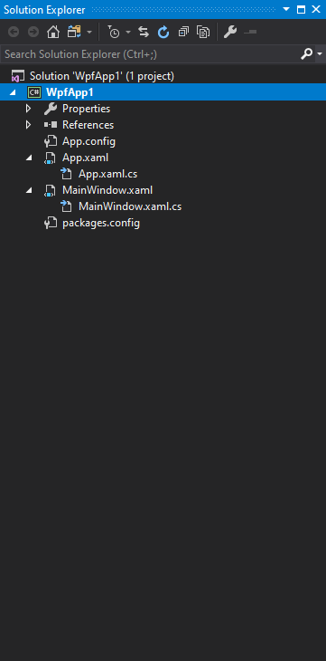

## Angular アプリケーションの作成

> [!Video https://www.youtube.com/embed/dhjrAPPad54]

WPF から Angular へ移行する際の Angular アプリケーションの作成方法を学びます。

### 前提条件

Angular アプリケーションの作成を開始するには、Node.js と npm パッケージ マネージャーをインストールする必要があります。Node.js は、ブラウザーの外部で JavaScript コードを実行する JavaScript ランタイム環境です。Node.js を取得するには、[nodejs.org](https://nodejs.org) にアクセスします。NPM は、.NET 用の NuGet パッケージマネージャーに似たパッケージ マネージャーです。デフォルトで Node.js とともにインストールされます。IDE も必要です。Angular アプリケーションの開発に最適な環境の 1 つは、Visual Studio Code です。無料のオープンソースであり、すべてのプラットフォームで実行できます。[code.visualstudio.com](https://code.visualstudio.com/) から取得できます。

### 新しいプロジェクトの作成

WPF 開発の経験がある場合は、Visual Studio 内で新しいプロジェクトを作成するのは簡単です。[ファイル] -> [新しいプロジェクト] をクリックし、プロジェクトの種類を選択して名前を付け、[OK] をクリックします。Angular で作業を開始するには、Visual Studio Code で新しいプロジェクトを作成します。ただし、ここには新しいプロジェクト オプションはありません。これは、Visual Studio Code がプロジェクトベースではなくファイル ベースであるためです。新しい Angular アプリケーションを作成するために、コマンド プロンプトを使用します。

最初に、[Angular CLI](https://cli.angular.io/) をインストールする必要があります。

```cmd
npm install -g @angular/cli
```

次に、コマンド プロンプトで、アプリケーションを作成するフォルダーに移動し、次のコマンドを実行します。

```cmd
ng new demo-app
```

「Angular ルーティングを追加しますか?」というプロンプトが表示されます。このデモでは、NO を選択します。次に、使用するスタイル シートの形式を決めます。ここでは、基本的な CSS を使用します。数分かかりますが、最終的にプロセスが完了し、新しいアプリケーションがディスク上に作成されます。 

次に、作成した demo-app フォルダーにディレクトリを変更し、Visual Studio Code を開くコマンドを実行する必要があります。

```cmd
cd demo-app
code .
```

これにより、Angular アプリケーションを含む Visual Studio Code の新しいインスタンスが起動します。これは、Angular を学んでいるデスクトップ開発者にとって最も複雑な部分、フォルダー構造です。

### プロジェクト構造

次にこれらの各ファイルを見て、それらが WPF アプリケーションとどのように関連しているかを見てみましょう。最良の方法は、各プロジェクトを並べて比較することです。左側は、WPF アプリです。右側は、 Angular アプリです。




Angular アプリケーションは単一ページアプリケーション (SPA) であり、アプリ全体に 1 ページしかないこと、つまり index.html であることを覚えておくことが重要です。`Index.html` ファイルは、WPFアプリケーションの `App.xaml` と比較できます。これらは両方ともグローバルであり、すべてアプリケーションのすべてのページに表示されます。`index.html` ファイルには、`App.xaml` ファイルの `StartupUri` に似たセクション `<app-root></app-root>` が含まれており、アプリの起動時に表示する最初のページを指定します。

`index.html` に移動すると、`main.ts` JavaScript ファイルが呼び出され、`AppModule` がロードされます。Angular アプリケーションは、モジュールとコンポーネントで構成されています。デフォルトでは、ルート モジュールとルート コンポーネントを取得し、それらはアプリ フォルダーの下に配置されます。 `main.ts` ファイルが呼び出されたら、`app` フォルダーの `app.module.ts` ファイルにある AppModule をブート ストラップします。

その後、アプリ モジュールは独自の `AppComponent` をブートストラップします。`AppComponent` は `app.component.ts` ファイルで定義され、そのセレクターは `app-root` に設定されます。`AppComponent` のhtmlテンプレートは `app.component.html` ファイルで定義されています。基本的に、`index.html` ページの `<app-root></app-root>` セクションは、`app.component.html` ファイルのコンテンツを視覚化します。

`main.ts` ファイルは、コードビハインドのようなものであるため、`App.xaml.cs` ファイルに似ています。`App.component.html` は、アプリケーションの実行時に表示されるデフォルトのコンポーネントであり、WPF の `MainWindow.xaml` に非常に似ています。

WPF には、nuget パッケージへのすべての依存関係を定義する `packages.config` ファイルがあり、Angular には、アプリケーションの実行に必要な依存関係を含む `package.json` ファイルがあります。`package.json` ファイルには、アプリケーションをテスト、起動、またはビルドする際にコンソールで実行できるスクリプトのセクションも含まれています。

次に `References` フォルダーを確認します。WPF では、このプロジェクトに追加されたすべての参照を表示する`参照`ノードがソリューションにあります。`nodes_module` フォルダーになる Angular アプリケーションの場合。WPF と比較すると Angular プロジェクトの依存関係がとても多いです。これらは、`npm` を使用して読み込まれます。

以上が 2 つのプラットフォームの類似点となります。生成された他のファイルとフォルダーのいくつかを見てみましょう。
- `e2e` - エンドツーエンド テストの略で、統合テストまたはログイン プロセスなどの実際のシナリオとのテストが含まれます。
- `src-` - アプリケーションのほとんどのコードはここにあります。
- `assets` - アセット-画像またはその他のアセットが含まれます。
- `environment` - ビルド環境に関する情報が含まれています。
- `favicon.ico` - サイトにいるときにブラウザに表示されるアイコン。
- `karma.conf.js` - 単体テストの構成が含まれています。
- `style.css` - アプリケーションのグローバルなスタイルを含むスタイルシート。WPF の `App.xaml` で定義されているリソース ディクショナリに似ています。

### アプリケーションの実行

れで、アプリケーションを実行する準備ができましたが、Visual Studio Code では、F5 キーを押すことはできません。ターミナル -> 新しいターミナルのメニューをクリック、または <kbd>Ctrl</kbd> + <kbd>Shift</kbd> + <kbd>`</kbd> 押して、Visual Studio Code ターミナルを開きます。アプリケーションを実行するには、次のコマンドを実行する必要があります。

```cmd
ng serve
```

アプリケーションが起動したら、ブラウザで URL http://localhost:4200/ を入力して開くことができます。アプリをブラウザーで自動的に開くようにするには、次のコマンドを使用する必要があります。

```cmd
ng serve -o
```

この場合、`-o` は open を表します。または npm コマンドを使用してアプリケーションを起動する方法もあります。

```cmd
npm start
```

`package.json` ファイルで定義されているスクリプトを見つけ、`-o` オプションを追加して `start` コマンドを変更できます。

```json
  "scripts": {
    "ng": "ng",
    "start": "ng serve -o",
```

作成した Angular アプリケーションは以下のようになります。


## その他のリソース
* [デスクトップから Web: はじめての Angular アプリを作成](https://www.youtube.com/watch?v=dhjrAPPad54&list=PLG8rj6Rr0BU-AqcJMuwggKy0GMIkjkt3j)
* [Angular アプリケーション シェル](https://angular.io/tutorial/toh-pt0)

<div class="divider--half"></div>
コミュニティに参加して新しいアイデアをご提案ください。

* [Ignite UI for Angular **フォーラム** (英語)](https://www.infragistics.com/community/forums/f/ignite-ui-for-angular)
* [Ignite UI for Angular **GitHub** (英語)](https://github.com/IgniteUI/igniteui-angular)